## Java虚拟机

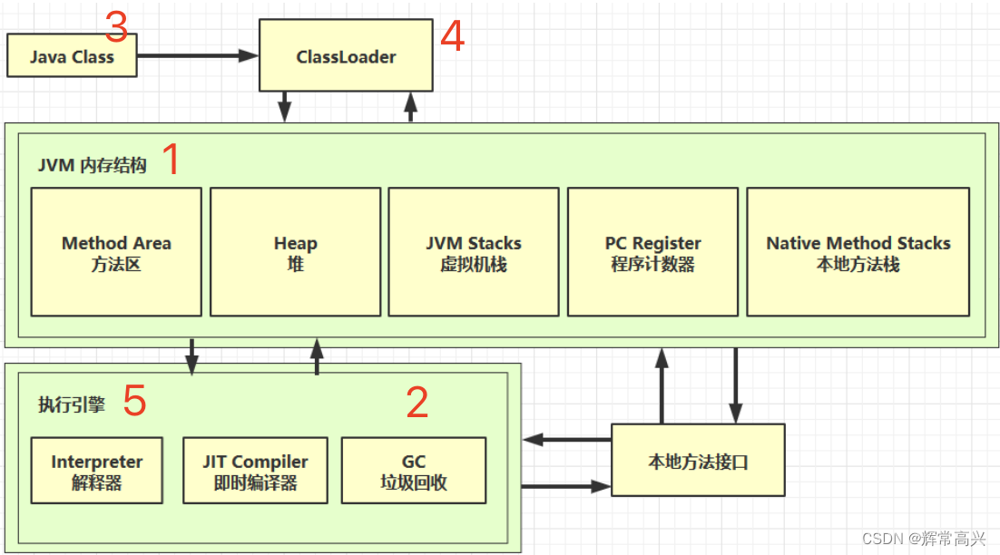
 
### 1.JVM内存结构
#### 1.1 程序计数器  
（1）作用：记住下一条jvm指令地址。  
（2）特点：线程私有，抢到资源后继续执行下一条指令  
#### 1.2 虚拟机栈  
（1）数据结构中的栈，就和弹夹一样，先进后出。  
（2）java中每个线程划分的内存空间就是虚拟机栈，每个组成元素叫栈帧，一个栈帧对应一次方法的调用，也就是每个方法运行时需要的内存就是一个栈帧  

**_问题辨析_**
1. 垃圾回收是否涉及栈内存？  答：不涉及，栈内存无非就是一次次的方法调用，方法执行完毕就弹栈了。
2. 栈内存分配越大越好吗？  答：不是，栈内存-Xss（默认1Mb），总内存不变，栈内存越大，线程数越少。
3. 方法内的局部变量是否线程安全？  答：如果线程私有就是安全的
4. cpu占用过多
- top（查看哪个进程id占用cpu高）
- ps H -eo pid,tid,%cpu |grep pid（定位是哪个线程引起的）
- pid转16进制获得nid
- jstack pid（找到nid对应的行号，进一步定位源代码）

#### 1.3 本地方法栈
java调用本地方法，由C或者C++语言编写的本地方法去操作系统，例如Object类clone方法（带有native关键字）

#### 1.4 堆(Heap)
通过new关键字，创建对象都会使用堆内存
- 它是线程共享的，需要考虑线程安全问题
- 有垃圾回收机制，不再被引用的对象，释放空闲内存

**_诊断工具_**
- jmap （jdk自带）jps展示进程id，jmap -heap pid
- jconsole（jdk自带）

#### 1.5 方法区
jvm启动创建方法区

#### 1.6直接内存
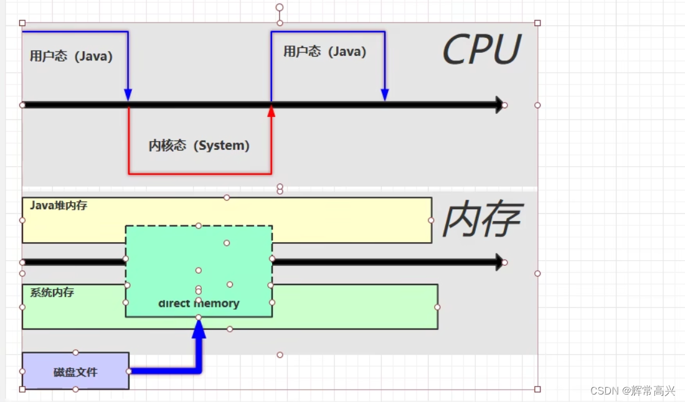

### 2.垃圾回收
#### 2.1 方法区如何判断对象可以回收
可达性分析算法
- 哪些对象可以作为GC root对象（相当于一串葡萄，掉落在盘子里的是可以回收的对象）

四种引用  
强引用：用得到并且不回收  
软引用：没用到不回收，内存满了才回收  
弱引用：被发现就回收  
虚引用：弱引用+引用队列  

#### 2.2 垃圾回收算法
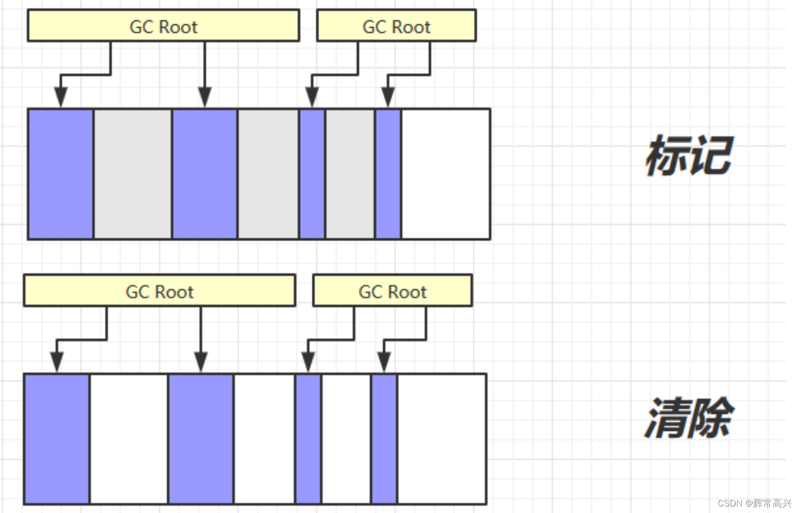
- 标记清除（没有GC root引用的标记清除，优点：速度快，缺点：空间有碎片，不连续）
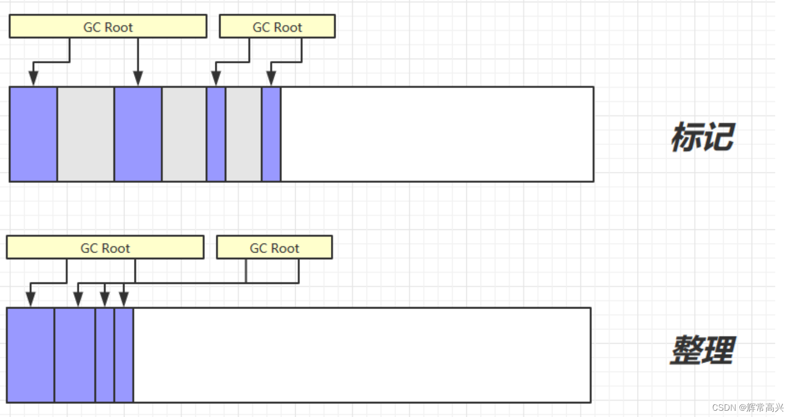
- 标记整理（优点：整理空间碎片，内存紧凑，空间连续，缺点：移动碎片，地址重排，效率低）
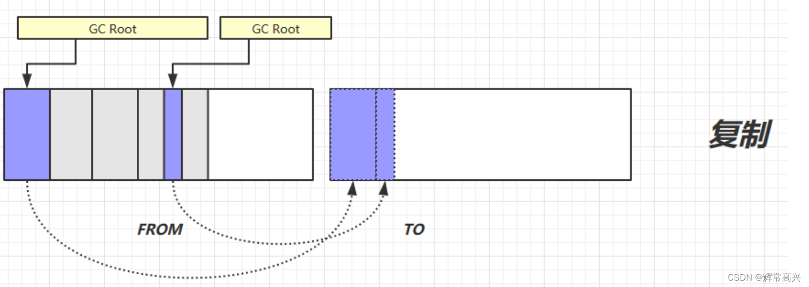
- 复制（创建一个新的空间，把标记的拷贝过来，空间换时间，占用内存双倍空间）

#### 2.3 分代垃圾回收
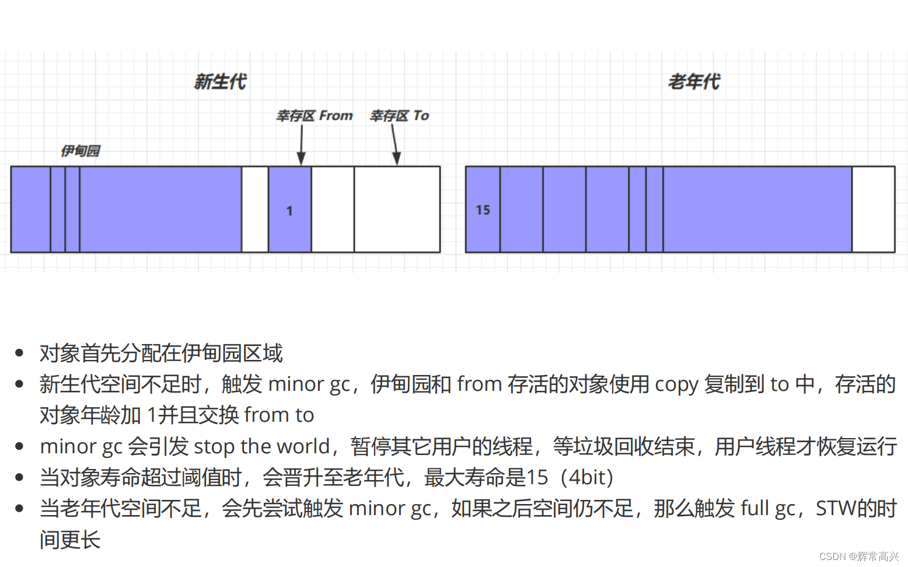

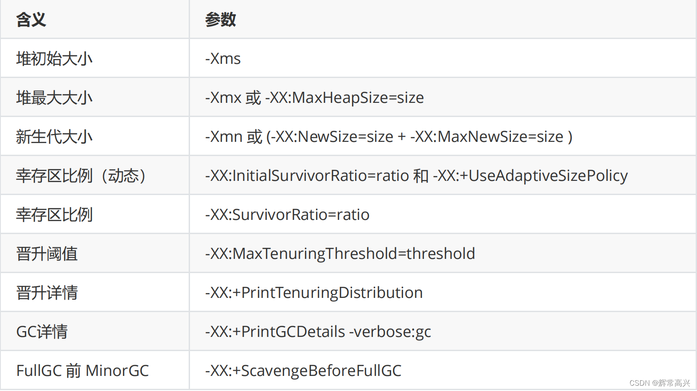

#### 2.4 垃圾回收器
1. 串行 
- 单线程
- 堆内存较小，适合个人电脑
2. 吞吐量优先（parallel，jdk8默认）
- 多线程
- 堆内存较大，多核cpu
- 让单位时间内，STW的时间最短0.2 0.2 = 0.4，垃圾回收时间占比最低，这样就称吞吐量高（多吃少餐）
3. 响应时间优先（cms）
- 多线程
- 堆内存较大，多核cpu
- 尽可能让单次 STW 的时间最短 0.1 0.1 0.1 0.1 0.1 = 0.5（少吃多餐）
4. Garbage First（g1，jdk9默认）
- 同时注重吞吐量（Throughput）和低延迟（Low latency），默认的暂停目标是200ms
- 超大堆内存，会将堆划分为多个大小相等的Region
- 整体上是标记+整理算法，两个区域之间是复制算法

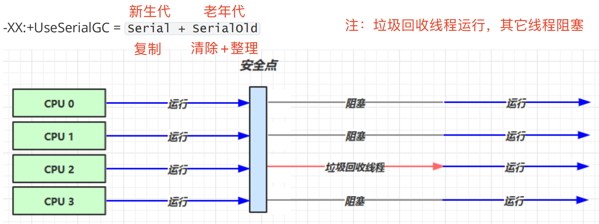
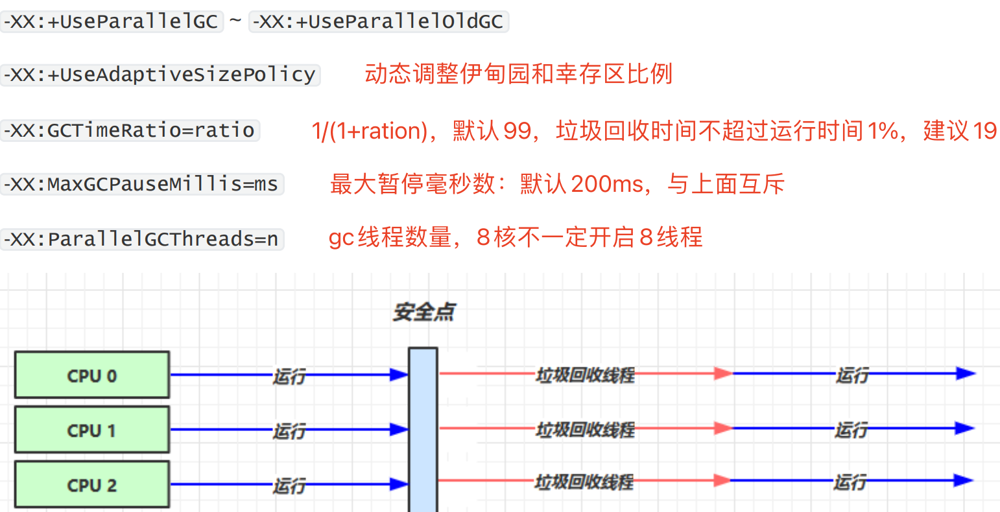
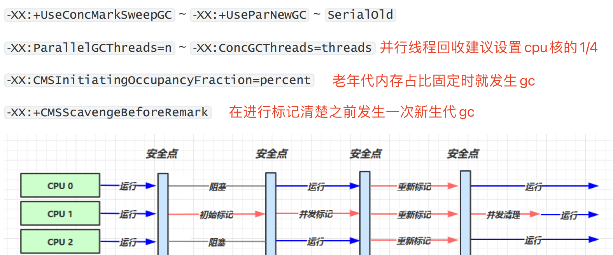
> 初始标记：仅仅标记GC ROOTS的直接关联对象，发生stop the world  
> 并发标记：使用GC ROOTS TRACING算法，进行跟踪标记，产生变动的对象放入一个队列中供重新标记过程时遍历，不暂停  
> 重新标记：因为之前的并发标记，其它用户线程不暂停，可能产生新的垃圾，所以stop the world

#### 2.5 垃圾回收调优
调优领域
- 内存
- 锁竞争
- cpu占用
- io

确定目标
- 【低延迟】还是【高吞吐量】，选择合适的垃圾回收器
- CMS，G1，ZGC
- ParallelGC

最快的GC是不发生GC
- 数据是不是太多？例如sql select * from table，新生代内存资源不够用，频繁GC，甚至outOfMemory
- 数据表示是否太臃肿？优化对象大小，比如int占用4字节，Integer占用24字节
- 是否存在内存泄露？避免内存泄露可以使用前面学到的软/弱引用、缓存实现

调优-新生代
- 所有的new操作的内存分配非常廉价
- 死亡对象的回收代价是0
- 大部分对象用过既死亡
- Minor GC的时间远远大于Full GC
- 新生代也不是越大越好，空间资源越大GC时间越长，一般建议总空间的25%-50%
- 理想情况是（并发量*请求）响应的数据
- 幸存区也需要考虑，空间资源大到能保留两类对象，一类生命周期较短还在用暂时还没回收（当前活跃对象），另外一类年龄不够还没被晋升（需要晋升对象）。
- 晋升阈值配置得当，让长时间存活对象尽快晋升。-XX:MaxTenuringThreshold=threshold（最大晋升阈值），-XX:+PrintTenuringDistribution（晋升详细信息）
>Desired survivor size 48286924 bytes, new threshold 10 (max 10)  
> -age 1: 28992024 bytes, 28992024 total  
> -age 2: 1366864 bytes, 30358888 total  
> ....

调优-老年代
- CMS的老年代内存越大越好
- 如果没有产生Full GC，先尝试新生代调优
- 观察发生Full GC的老年代内存占用，将老年代内存预设调整1/4-1/3
> -XX:CMSInitiatingOccupancyFraction=percent（值越低，GC频率越高）

调优-案例
- 案例1 FullGC和MinorGC频繁
> GC特别频繁尤其MinorGC，说明空间紧张，新生代塞满了，后果幸存区空间紧张，晋升阈值降低，老年代也空间紧张，导致FullGC也频繁  
> 尝试调整新生代内存空间，晋升阈值提高，尽可能留在新生代，MinorGC频率也降低，FullGC频率也降低
- 案例2（CMS垃圾回收期）请求高峰期发生FullGC，单次暂停时间特别长 
> 查看CMS日志，哪个阶段耗时（大概率重新标记），调整参数： -XX:+CMSScavengeBeforeRemark
- 案例3 [实战调优Parallel收集器](https://www.wangtianyi.top/blog/2018/07/27/jvmdiao-you-ru-men-er-shi-zhan-diao-you-parallelshou-ji-qi/)

### 3.类加载与字节码技术
#### 3.1 类文件结构
Oracle提供了javap工具来反编译class文件，javap -v HelloWorld.class
#### 3.2 字节码指令

#### 3.3 编译期处理

#### 3.4 类加载阶段
启动类加载器

扩展类加载器
#### 3.5 类加载器

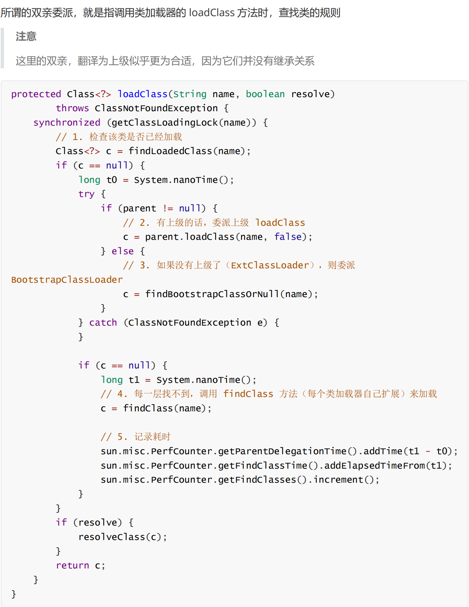

#### 3.6 运行期优化

### 4.内存模型
#### 4.1 java内存模型
- 很多人将【java内存结构】与【java内存模型】傻傻分不清，【java内存模型】是 Java Memory Model（JMM）的意思。  
- 简单的说，JMM 定义了一套在多线程读写共享数据时（成员变量、数组）时，对数据的可见性、有序性、和原子性的规则和保障

#### 4.2 可见性
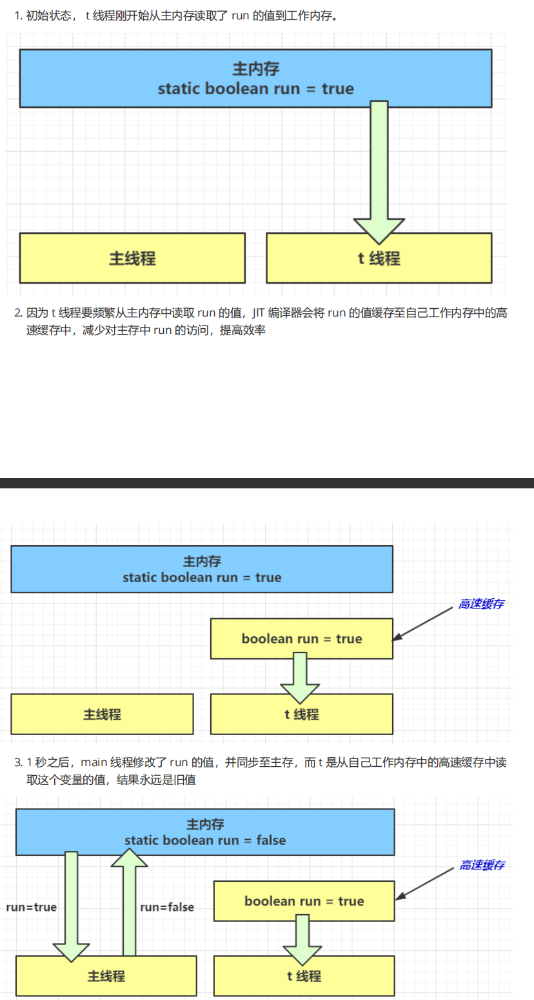
#### 4.3 有序性
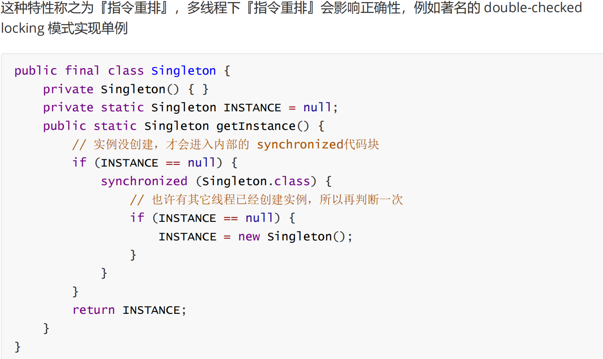
#### 4.4 CAS与原子类
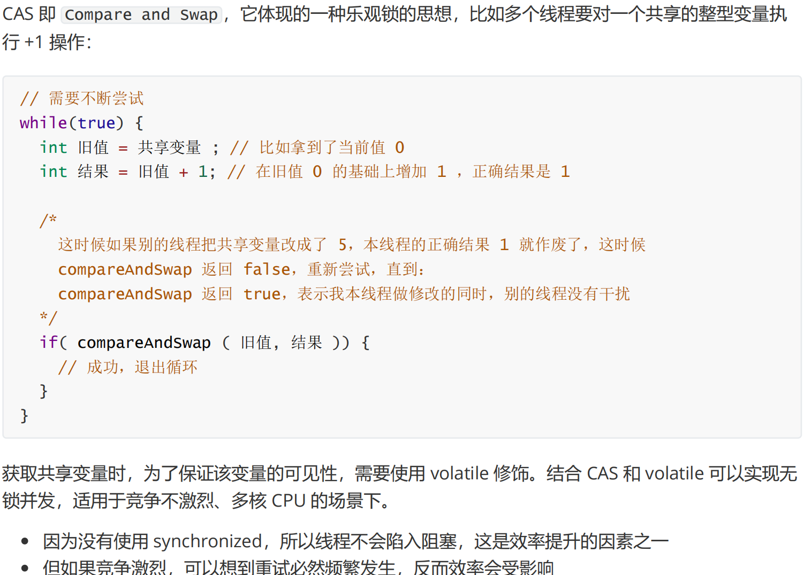
- CAS是基于乐观锁的思想：最乐观估计，不怕别的线程来修改共享变量，就算改了也没关系，我吃亏点再重试呗。
- synchronized是基于悲观锁的思想：最悲观估计，得防着其它线程来修改共享变量，我上了锁你们都别想改，我改完了解开锁，你们才有机会。
- juc（java.util.concurrent）中提供了原子操作类，可以提供线程安全的操作，例如：AtomicInteger、 AtomicBoolean等，它们底层就是采用CAS技术+volatile来实现。
#### 4.5 synchronized优化
- jdk1.6之后对synchronized进行优化，某些场景下比CAS性能更好
- 减少上锁时间synchronized修饰的代码块尽可能的少
- 减少锁的粒度，将一个所拆分为多个锁，例如ConcurrentHashMap对比HashTable，一个锁链表头，一个锁table对象
- 锁粗化，new StringBuffer().append("a").append("b")。多次循环进入同步块，不如同步块内多次循环