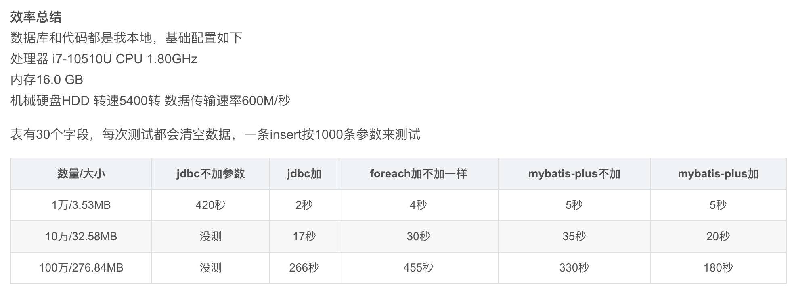

## nova-spring-mybatis
### 简介:
* (1) spring整合mybatis

### 三种for循环插入耗时对比（10000条），事例在shopping-mall项目测试类

~~~Java
    /**
     * 普通批量插入，耗时：900823 ms
     */
    @Test
    public void normalInsert() {
        List<MyOrder> list = getList();
        list.forEach(order -> myOrderDao.insert(order));
        System.out.println("插入" + list.size() + "条数据，耗时 ： " + TIMER.interval() + " ms");
    }

    /**
     * mybatis-plus可以添加jdbc-url添加（&rewriteBatchedStatements=true）
     * foreach批量插入，耗时：8479 ms
     */
    @Test
    public void testBatch() {
        int i = myOrderDao.insertBatch(getList());
        System.out.println("插入" + i + "条数据，耗时 ： " + TIMER.interval() + " ms");
    }

    /**
     * 开启SqlSession批量插入，耗时：7776 ms
     */
    @Test
    public void testInsert() {
        SqlSession sqlSession = sqlSessionTemplate.getSqlSessionFactory().openSession(ExecutorType.BATCH, false);
        MyOrderDao mapper = sqlSession.getMapper(MyOrderDao.class);
        List<MyOrder> list = getList();
        list.forEach(mapper::insert);
        System.out.println("插入" + list.size() + "条数据，耗时 ： " + TIMER.interval() + " ms");
    }
~~~