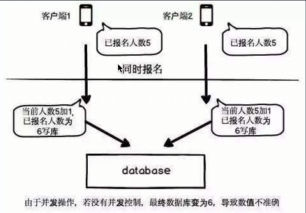

### Mybatis事务管理

我们前面已经讲解了如何让Mybatis与Spring更好地融合在一起，通过将对应的Bean类型注册到容器中，就能更加方便的去使用Mapper，那么现在，我们接着来看Spring的事务控制。

在开始之前，我们还是回顾一下事务机制。首先事务遵循一个ACID原则：

- 原子性（Atomicity）：事务是一个原子操作，由一系列动作组成。事务的原子性确保动作要么全部完成，要么完全不起作用。
- 一致性（Consistency）：一旦事务完成（不管成功还是失败），系统必须确保它所建模的业务处于一致的状态，而不会是部分完成部分失败。在现实中的数据不应该被破坏。
- 隔离性（Isolation）：可能有许多事务会同时处理相同的数据，因此每个事务都应该与其他事务隔离开来，防止数据损坏。
- 持久性（Durability）：一旦事务完成，无论发生什么系统错误，它的结果都不应该受到影响，这样就能从任何系统崩溃中恢复过来。通常情况下，事务的结果被写到持久化存储器中。

简单来说，事务就是要么完成，要么就啥都别做！并且不同的事务直接相互隔离，互不干扰。

那么我们接着来深入了解一下事务的隔离机制（在之前数据库入门阶段并没有提到）我们说了，事务之间是相互隔离互不干扰的，那么如果出现了下面的情况，会怎么样呢：

当两个事务同时在执行，并且同时在操作同一个数据，这样很容易出现并发相关的问题，比如一个事务先读取了某条数据，而另一个事务此时修改了此数据，当前一个事务紧接着再次读取时，会导致和前一次读取的数据不一致，这就是一种典型的数据虚读现象。

因此，为了解决这些问题，事务之间实际上是存在一些隔离级别的：

- ISOLATION_READ_UNCOMMITTED（读未提交）：其他事务会读取当前事务尚未更改的提交（相当于读取的是这个事务暂时缓存的内容，并不是数据库中的内容）
- ISOLATION_READ_COMMITTED（读已提交）：其他事务会读取当前事务已经提交的数据（也就是直接读取数据库中已经发生更改的内容）
- ISOLATION_REPEATABLE_READ（可重复读）：其他事务会读取当前事务已经提交的数据并且其他事务执行过程中不允许再进行数据修改（注意这里仅仅是不允许修改数据）
- ISOLATION_SERIALIZABLE（串行化）：它完全服从ACID原则，一个事务必须等待其他事务结束之后才能开始执行，相当于挨个执行，效率很低

我们依次来看看，不同的隔离级别会导致什么问题。首先是读未提交级别，此级别属于最低级别，相当于各个事务共享一个缓存区域，任何事务的操作都在这里进行。那么它会导致以下问题：

也就是说，事务A最后得到的实际上是一个毫无意义的数据（事务B已经回滚了）我们称此数据为"脏数据"，这种现象称为脏读

我们接着来看读已提交级别，事务只能读取其他事务已经提交的内容，相当于直接从数据中读取数据，这样就可以避免脏读问题了，但是它还是存在以下问题：

这正是我们前面例子中提到的问题，虽然它避免了脏读问题，但是如果事件B修改并提交了数据，那么实际上事务A之前读取到的数据依然不是最新的数据，直接导致两次读取的数据不一致，这种现象称为虚读也可以称为不可重复读

因此，下一个隔离级别可重复读就能够解决这样的问题（MySQL的默认隔离级别），它规定在其他事务执行时，不允许修改数据，这样，就可以有效地避免不可重复读的问题，但是这样就一定安全了吗？这里仅仅是禁止了事务执行过程中的UPDATE操作，但是它并没有禁止INSERT这类操作，因此，如果事务A执行过程中事务B插入了新的数据，那么A这时是毫不知情的，比如：

两个人同时报名一个活动，两个报名的事务同时在进行，但是他们一开始读取到的人数都是5，而这时，它们都会认为报名成功后人数应该变成6，而正常情况下应该是7，因此这个时候就发生了数据的幻读现象。

因此，要解决这种问题，只能使用最后一种隔离级别串行化来实现了，每个事务不能同时进行，直接避免所有并发问题，简单粗暴，但是效率爆减，并不推荐。

最后总结三种情况：

- 脏读：读取到了被回滚的数据，它毫无意义。
- 虚读（不可重复读）：由于其他事务更新数据，两次读取的数据不一致。
- 幻读：由于其他事务执行插入删除操作，而又无法感知到表中记录条数发生变化，当下次再读取时会莫名其妙多出或缺失数据，就像产生幻觉一样。

（对于虚读和幻读的区分：虚读是某个数据前后读取不一致，幻读是整个表的记录数量前后读取不一致）

最后这张图，请务必记在你的脑海，记在你的心中，记在你的全世界：

Mybatis对于数据库的事务管理，也有着相应的封装。一个事务无非就是创建、提交、回滚、关闭，因此这些操作被Mybatis抽象为一个接口：
~~~java
public interface Transaction {
    Connection getConnection() throws SQLException;

    void commit() throws SQLException;

    void rollback() throws SQLException;

    void close() throws SQLException;

    Integer getTimeout() throws SQLException;
}
~~~

对于此接口的实现，MyBatis的事务管理分为两种形式：

1. 使用JDBC的事务管理机制：即利用对应数据库的驱动生成的Connection对象完成对事务的提交（commit()）、回滚（rollback()）、关闭（close()）等，对应的实现类为JdbcTransaction
2. 使用MANAGED的事务管理机制：这种机制MyBatis自身不会去实现事务管理，而是让程序的容器（比如Spring）来实现对事务的管理，对应的实现类为ManagedTransaction

而我们之前一直使用的其实就是JDBC的事务，相当于直接使用Connection对象（之前JavaWeb阶段已经讲解过了）在进行事务操作，并没有额外的管理机制，对应的配置为：

~~~xml
<transactionManager type="JDBC"/>
~~~