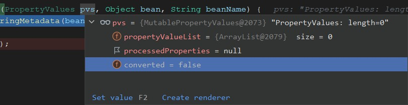

[TOC]

# Spring-ioc

# BeanPostProcessor与BeanFactoryPostProcessor

- BeanPostProcessor在Spring容器初始化bean之前和初始化bean之后，干预bean的初始化行为；
- BeanFactoryPostProcessor是spring容器注册BeanDefinition时，用来干预BeanDefinition的行为；

# FactoryBean 与BeanFactory

- FactoryBean是工厂bean，获取对象时候或调getObject（）方法返回对象；
- BeanFactory是spring容器；

# BeanDefinition是什么？

BeanDefinition 是定义 Bean 的配置元信息接口，包含：

- Bean 的类名
- 设置父 bean 名称、是否为 primary、
- Bean 行为配置信息，作用域、自动绑定模式、生命周期回调、延迟加载、初始方法、销毁方法等
- Bean 之间的依赖设置，dependencies
- 构造参数、属性设置
- BeanDefinition 表示bean的定义，spring根据BeanDefinition 来创建bean对象

来自@Bean @Component等  **mybean类===>java对象  ===> spring bean的描述（BeanDefinition）==>变为spring的Bean**

# IOC扩展口图示:


## main

```java

public class Test { 

    public static void main(String[] args) {
        ApplicationContext context = new AnnotationConfigApplicationContext(SpringConfig.class);


        MyBean myBean = context.getBean(MyBean.class);
        myBean.sayHellow("zs");
    }
}
```

## SpringConfig

```java
@Configuration
@ComponentScan("com.cs.config")
public class SpringConfig {

	@Bean
	public MyBean myBean(){
		return new MyBean();
	}

	@Bean
	public HeBean heBean(){
		return new HeBean();
	}

	@Bean
	public  MyInitializingBean myInitializingBean(){
		return new MyInitializingBean();
	}

	@PostConstruct
	public void init(){
		System.out.println("1111");
	}
}
```

## bean

```java

public class HeBean {

	private String heName;

	private int heAge;

	@Autowired
	private MyBean myBean;

	public MyBean getMyBean() {
		return myBean;
	}

	public void setMyBean(MyBean myBean) {
		this.myBean = myBean;
	}

	public String getHeName() {
		return heName;
	}

	public void setHeName(String heName) {
		this.heName = heName;
	}

	public int getHeAge() {
		return heAge;
	}

	public void setHeAge(int heAge) {
		this.heAge = heAge;
	}

	public void sayHello(String name) {
		System.out.println("HeBean-->sayHello......," + name);
	}
}
```

```java
public class MyBean {

	private String myName;

	private int myAge;

	@Autowired
	private HeBean heBean;

	public HeBean getHeBean() {
		return heBean;
	}

	public void setHeBean(HeBean heBean) {
		this.heBean = heBean;
	}

	public String getMyName() {
		return myName;
	}

	public void setMyName(String myName) {
		this.myName = myName;
	}

	public int getMyAge() {
		return myAge;
	}

	public void setMyAge(int myAge) {
		this.myAge = myAge;
	}

	/**
	 * 业务方法
	 */
	public void sayHello(String name) {
		System.out.println("MyBean-->sayHello......," + name);
	}

	public String sayHellow(String zs) {
		return "s";
	}
}
```

## beanFactoryPostProcessor

```java

@Component
public class MyBeanFactory implements BeanDefinitionRegistryPostProcessor {
    @Override
    public void postProcessBeanFactory(ConfigurableListableBeanFactory beanFactory) throws BeansException {
        String[] beanDefinitionNames = beanFactory.getBeanDefinitionNames();
        System.out.println(beanDefinitionNames.toString());
        System.out.println("===============");
    }

    @Override
    public void postProcessBeanDefinitionRegistry(BeanDefinitionRegistry registry) throws BeansException {
        System.out.println("===");
    }
}
```

# AnnotationConfigApplicationContext

注解配置应用程序上下文对象创建 : ApplicationContext context = new AnnotationConfigApplicationContext(SpringConfig.class);

继承结构图：


创建对象

```java
public AnnotationConfigApplicationContext(Class<?>... componentClasses) {
    this();
    register(componentClasses);
    refresh();
}
```

# 1、调用无参构造方法 this()

```java
public AnnotationConfigApplicationContext() {
    //AnnotatedBeanDefinitionReader  reader 带注释的 Bean 定义阅读器
    this.reader = new AnnotatedBeanDefinitionReader(this); //传入当前类AnnotationConfigApplicationContext
    //ClassPathBeanDefinitionScanner scanner 类路径 Bean 定义扫描器
    this.scanner = new ClassPathBeanDefinitionScanner(this);
}
```


## 1-1 调用父类创建BeanFactory

```java
//初始化一些参数
public GenericApplicationContext() {
	this.beanFactory = new DefaultListableBeanFactory();
}
```

## 1-2 创建用于读取和解析带有注解的 Bean 定义。

**this.reader = new AnnotatedBeanDefinitionReader(this);** 

- 会创建一个StandardEnvironment环境对象
- 创建一个ConditionEvaluator条件评估者（@Conditional），用于根据条件的结果进行相应的处理。
- 给beanFactory中默认加入5个默认的beanDefinition

```java
public AnnotatedBeanDefinitionReader(BeanDefinitionRegistry registry) {
    //getOrCreateEnvironment(registry)创建一个StandardEnvironment环境对象
    this(registry, getOrCreateEnvironment(registry)); 
}
```

```java
public AnnotatedBeanDefinitionReader(BeanDefinitionRegistry registry, Environment environment) {
    Assert.notNull(registry, "BeanDefinitionRegistry must not be null");
    Assert.notNull(environment, "Environment must not be null");
    //AnnotationConfigApplicationContext类
    this.registry = registry;   
    // ConditionEvaluator 主要是在 Spring 内部使用的工具类，对条件进行评估的
	// 具体逻辑是通过 Condition 接口的实现类来实现的。 用于根据条件的结果进行相应的处理。
	// 在自定义条件时，可以实现 Condition 接口，并在其中定义具体的条件逻辑。然后，通过 ConditionEvaluator 对该条件进行评估。 
    // 含有bean工厂 类加载器
    this.conditionEvaluator = new ConditionEvaluator(registry, environment, null); 
   //加载5个默认的beanDefinition
    AnnotationConfigUtils.registerAnnotationConfigProcessors(this.registry); 
}
```

默认的beanDefinition


```java
public static Set<BeanDefinitionHolder> registerAnnotationConfigProcessors(
    BeanDefinitionRegistry registry, @Nullable Object source) {
    //获取bean工厂
    DefaultListableBeanFactory beanFactory = unwrapDefaultListableBeanFactory(registry);
    if (beanFactory != null) {
        if (!(beanFactory.getDependencyComparator() instanceof AnnotationAwareOrderComparator)) {
            beanFactory.setDependencyComparator(AnnotationAwareOrderComparator.INSTANCE);
        }
        if (!(beanFactory.getAutowireCandidateResolver() instanceof ContextAnnotationAutowireCandidateResolver)) {
            beanFactory.setAutowireCandidateResolver(new ContextAnnotationAutowireCandidateResolver());
        }
    }

    Set<BeanDefinitionHolder> beanDefs = new LinkedHashSet<>(8);

    if (!registry.containsBeanDefinition(CONFIGURATION_ANNOTATION_PROCESSOR_BEAN_NAME)) {
        RootBeanDefinition def = new RootBeanDefinition(ConfigurationClassPostProcessor.class);
        def.setSource(source);
        beanDefs.add(registerPostProcessor(registry, def, CONFIGURATION_ANNOTATION_PROCESSOR_BEAN_NAME));
    }

    if (!registry.containsBeanDefinition(AUTOWIRED_ANNOTATION_PROCESSOR_BEAN_NAME)) {
        RootBeanDefinition def = new RootBeanDefinition(AutowiredAnnotationBeanPostProcessor.class);
        def.setSource(source);
        beanDefs.add(registerPostProcessor(registry, def, AUTOWIRED_ANNOTATION_PROCESSOR_BEAN_NAME));
    }

    // Check for JSR-250 support, and if present add the CommonAnnotationBeanPostProcessor.
    if (jsr250Present && !registry.containsBeanDefinition(COMMON_ANNOTATION_PROCESSOR_BEAN_NAME)) {
        RootBeanDefinition def = new RootBeanDefinition(CommonAnnotationBeanPostProcessor.class);
        def.setSource(source);
        beanDefs.add(registerPostProcessor(registry, def, COMMON_ANNOTATION_PROCESSOR_BEAN_NAME));
    }

    // Check for JPA support, and if present add the PersistenceAnnotationBeanPostProcessor.
    if (jpaPresent && !registry.containsBeanDefinition(PERSISTENCE_ANNOTATION_PROCESSOR_BEAN_NAME)) {
        RootBeanDefinition def = new RootBeanDefinition();
        try {
            def.setBeanClass(ClassUtils.forName(PERSISTENCE_ANNOTATION_PROCESSOR_CLASS_NAME,
                                                AnnotationConfigUtils.class.getClassLoader()));
        }
        catch (ClassNotFoundException ex) {
            throw new IllegalStateException(
                "Cannot load optional framework class: " + PERSISTENCE_ANNOTATION_PROCESSOR_CLASS_NAME, ex);
        }
        def.setSource(source);
        beanDefs.add(registerPostProcessor(registry, def, PERSISTENCE_ANNOTATION_PROCESSOR_BEAN_NAME));
    }

    if (!registry.containsBeanDefinition(EVENT_LISTENER_PROCESSOR_BEAN_NAME)) {
        RootBeanDefinition def = new RootBeanDefinition(EventListenerMethodProcessor.class);
        def.setSource(source);
        beanDefs.add(registerPostProcessor(registry, def, EVENT_LISTENER_PROCESSOR_BEAN_NAME));
    }

    if (!registry.containsBeanDefinition(EVENT_LISTENER_FACTORY_BEAN_NAME)) {
        RootBeanDefinition def = new RootBeanDefinition(DefaultEventListenerFactory.class);
        def.setSource(source);
        beanDefs.add(registerPostProcessor(registry, def, EVENT_LISTENER_FACTORY_BEAN_NAME));
    }

    return beanDefs;
}
```

## 1-3 创建ClassPathBeanDefinitionScanner

- `ClassPathBeanDefinitionScanner` 用于扫描类路径下的指定包或带有特定注解的类，并将它们解析为 Bean 定义。通过创建一个 `ClassPathBeanDefinitionScanner` 对象并将当前对象传递给它，可以让这个对象拥有扫描类路径的能力，并将扫描到的类解析为相应的 Bean 定义。
- 在构造函数中传递当前对象（通常是应用上下文或配置类）的主要目的是让扫描器能够访问当前对象的上下文信息，如环境变量、BeanFactory 等，以便在扫描和解析过程中进行必要的处理。
- 通过创建 `ClassPathBeanDefinitionScanner` 对象并设置相应的配置，可以实现自动扫描并注册 Bean 定义，减少手动定义 Bean 的工作量，并让应用程序更具灵活性和可扩展性。

​    **`this.scanner = new ClassPathBeanDefinitionScanner(this);`**

```java
public ClassPathBeanDefinitionScanner(BeanDefinitionRegistry registry) {
    this(registry, true);
}

public ClassPathBeanDefinitionScanner(BeanDefinitionRegistry registry, boolean useDefaultFilters) {
    this(registry, useDefaultFilters, getOrCreateEnvironment(registry)); //AnnotationConfigApplicationContext
}
public ClassPathBeanDefinitionScanner(BeanDefinitionRegistry registry, boolean useDefaultFilters,
                                      Environment environment) {

    this(registry, useDefaultFilters, environment,
         (registry instanceof ResourceLoader ? (ResourceLoader) registry : null));
}
```

```java
public ClassPathBeanDefinitionScanner(BeanDefinitionRegistry registry, boolean useDefaultFilters,
                                      Environment environment, @Nullable ResourceLoader resourceLoader) {
    //断言
    Assert.notNull(registry, "BeanDefinitionRegistry must not be null");
    //注释配置应用程序上下文AnnotationConfigApplicationContext
    this.registry = registry; 

    if (useDefaultFilters) {
        // 用于注册默认的扫描过滤器。 
		// 方法只注册了一个默认的过滤器，即 AnnotationTypeFilter，用于筛选带有 @Component 注解的类。
		// 这意味着在类路径扫描过程中，如果某个类被标注了 @Component 注解，那么该类将被识别为一个 Bean，并被解析为相应的 Bean 定义。
        registerDefaultFilters();
    }
    setEnvironment(environment);
    setResourceLoader(resourceLoader);
}
```

```java
protected void registerDefaultFilters() { 
    	//注册了一个过滤器用于筛选 带有@Compment注解的类来完成类路径下的包扫描
		this.includeFilters.add(new AnnotationTypeFilter(Component.class));
    	//获取类加载器
		ClassLoader cl = ClassPathScanningCandidateComponentProvider.class.getClassLoader();
		try {
            //根据给定的类名和类加载器加载指定的类，并返回对应的 Class 对象。如果找不到该类或加载失败，则会抛出相应的异常。
			this.includeFilters.add(new AnnotationTypeFilter(
					((Class<? extends Annotation>) ClassUtils.forName("javax.annotation.ManagedBean", cl)), false));
			logger.trace("JSR-250 'javax.annotation.ManagedBean' found and supported for component scanning");
		}
		catch (ClassNotFoundException ex) {
			// JSR-250 1.1 API (as included in Java EE 6) not available - simply skip.
		}
		try {
			this.includeFilters.add(new AnnotationTypeFilter(
					((Class<? extends Annotation>) ClassUtils.forName("javax.inject.Named", cl)), false));
			logger.trace("JSR-330 'javax.inject.Named' annotation found and supported for component scanning");
		}
		catch (ClassNotFoundException ex) {
			// JSR-330 API not available - simply skip.
		}
	}
```

## 1-4 总结

1. 默认初始化成员变量并**创建了IOC容器BeanFactory**
2. 创建用于读取和解析带有注解的 Bean 定义。**this.reader = new AnnotatedBeanDefinitionReader(this);** 
   - 会创建一个StandardEnvironment环境对象
   - 创建一个ConditionEvaluator条件评估者（@Conditional），用于根据条件的结果进行相应的处理。
   - 给beanFactory中默认加入5个默认的beanDefinition
3. 创建ClassPathBeanDefinitionScanner 用于扫描类路径下的指定包或带有特定注解的类，
   - 注册了一个过滤器用于筛选 带有@Compment注解的类来完成类路径下的包扫描
     - 用于筛选带有 @Component 注解的类。 这意味着在类路径扫描过程中，如果某个类被标注了 @Component 注解，那么该类将被识别为一个 Bean，并被解析为相应的 Bean 定义。

# 扩展知识：ClassUtils.forName

`ClassUtils.forName("javax.annotation.ManagedBean", cl)`

- 该方法的作用是根据给定的类名和类加载器加载指定的类，并返回对应的 `Class` 对象。如果找不到该类或加载失败，则会抛出相应的异常。
- 这个方法通常用于动态加载类，在运行时根据类名来获取对应的 `Class` 对象，以便进行后续的操作，如实例化对象、反射调用等。
- 需要注意的是，`ClassUtils.forName()` 方法在加载类时使用了类加载器，因此可以加载位于不同的类路径下的类。在这个例子中，使用的类加载器是 `cl`，它可以是应用程序的类加载器、线程上下文类加载器或其他自定义的类加载器。


# 2、扫描指定的配置类将其变为bean定义 

## register(componentClasses);

- 把componentClasses(SpringConfig)变成bean的描述：BeanDefinition;
- 然后把BeanDefinition包装成BeanDefinitionHolder;
- 然后取出BeanDefinitionHolder里面的BeanDefinition;
- 注册到Map<String, BeanDefinition> beanDefinitionMap中;
- 将我们自己定义的类的bean定义放入到beanDefinitionMap中

```java
// 注册一个或多个要处理的组件类
// reader 上一步this()创建了 切将当前类放入到reader（含有beanFactory）
public void register(Class<?>... componentClasses) {  
    Assert.notEmpty(componentClasses, "At least one component class must be specified");
    // componentClasses == SpringConfig.class
    this.reader.register(componentClasses);
}
//1-2 AnnotatedBeanDefinitionReader类 遍历循环看含有都多少配置类 注册一个或多个要处理的组件类。
public void register(Class<?>... componentClasses) {
    for (Class<?> componentClass : componentClasses) {
        registerBean(componentClass);
    }
}
//从给定的 bean 类注册一个 bean，从类声明的注释中派生其元数据。
public void registerBean(Class<?> beanClass) {
    doRegisterBean(beanClass, null, null, null, null);
}
```

```java
private <T> void doRegisterBean(Class<T> beanClass, @Nullable String name,
                                @Nullable Class<? extends Annotation>[] qualifiers, @Nullable Supplier<T> supplier,
                                @Nullable BeanDefinitionCustomizer[] customizers) {
    //SpringConfig = beanClass  将SpringConfig变为 -> 注释泛型Bean定义（BeanDefinition）
    AnnotatedGenericBeanDefinition abd = new AnnotatedGenericBeanDefinition(beanClass); //获取元数据
    //条件评估 首先会判断是否含有@Condition 
    //判断给定的元数据是否应该被跳过。如果条件评估器返回 true，表示应该跳过当前组件的注册；如果返回 false，则继续执行注册过程。
    if (this.conditionEvaluator.shouldSkip(abd.getMetadata())) { 
        return;
    }

    abd.setInstanceSupplier(supplier);
    //解析注解Bean定义的作用域，若@Scope("prototype")，则Bean为原型类型；
    //若@Scope("singleton")，则Bean为单态类型
    ScopeMetadata scopeMetadata = this.scopeMetadataResolver.resolveScopeMetadata(abd);
    abd.setScope(scopeMetadata.getScopeName());
    //获取bean名字
    String beanName = (name != null ? name : this.beanNameGenerator.generateBeanName(abd, this.registry));
    //通用定义注解如 @lazy
    AnnotationConfigUtils.processCommonDefinitionAnnotations(abd);
    if (qualifiers != null) {
        for (Class<? extends Annotation> qualifier : qualifiers) {
            if (Primary.class == qualifier) {
                abd.setPrimary(true);
            }
            else if (Lazy.class == qualifier) {
                abd.setLazyInit(true);
            }
            else {
                abd.addQualifier(new AutowireCandidateQualifier(qualifier));
            }
        }
    }
    if (customizers != null) {
        for (BeanDefinitionCustomizer customizer : customizers) {
            customizer.customize(abd);
        }
    }
    //然后把BeanDefinition包装成BeanDefinitionHolder  registry == AnnotationConfigApplicationContext
    BeanDefinitionHolder definitionHolder = new BeanDefinitionHolder(abd, beanName);
    definitionHolder = AnnotationConfigUtils.applyScopedProxyMode(scopeMetadata, definitionHolder, this.registry);
    //然后取出BeanDefinitionHolder里面的BeanDefinition;  注册到Map<String, BeanDefinition> beanDefinitionMap中;
    BeanDefinitionReaderUtils.registerBeanDefinition(definitionHolder, this.registry); 
}
```

```java
AnnotationConfigUtils.applyScopedProxyMode：
    是 Spring 框架中的一个方法调用，用于将指定的 BeanDefinition 设置为指定的作用域代理模式（Scoped Proxy Mode）。
    在 Spring 中，作用域代理模式用于控制 Bean 的作用域行为。当一个 Bean 被声明为某个特定的作用域（如 Singleton、Prototype、Request、Session 等）时，可以选择使用作用域代理来控制 Bean 的实例化和生命周期。
    具体而言，applyScopedProxyMode() 方法的作用是将指定的 BeanDefinition 对象（definitionHolder）根据指定的作用域元数据（scopeMetadata）和注册表（registry）进行处理，并将 BeanDefinition 设置为相应的作用域代理模式。
    通过这个方法调用，可以在 Spring 容器中配置和使用作用域代理模式，实现对 Bean 实例的控制和管理。
```


# 3、刷新容器refresh();

核心的两步：

- 第5步：扫描项目中的bean（@Service、@Compment….注解的bean）得到BeanDefinition，然后放入到BeanDefinitionMap
- 第11步：把BeanDefinitionMap取出依次创建所对应的对象

```java
public void refresh() throws BeansException, IllegalStateException {
    //线程同步
    synchronized (this.startupShutdownMonitor) {
        // 1、准备对上下文进行刷新
        prepareRefresh();

        // TODO Tell the subclass to refresh the internal bean factory.
        //2、告诉子类去刷新内部的bean factory,获得刷新的bean factory，最终得到的是DefaultListableBeanFactory,并且加载
        //如果是xml方式开发，此步骤重要，若是注解方式开发没什么操作    DefaultListableBeanFactory(注解开发获取beanFactory)
        ConfigurableListableBeanFactory beanFactory = obtainFreshBeanFactory();

        // Prepare the bean factory for use in this context.
        //3、预处理bean工厂，为在上下文中使用
        //注册systemEnvironment,Environment,systemProperties几个bean对象（spring自己的对象） 会放入BeanPostProcessor
        prepareBeanFactory(beanFactory);

        try {
            //4、 Allows post-processing of the bean factory in context subclasses.
            postProcessBeanFactory(beanFactory);

            //TODO 5、核心 注解开发的时候，对包扫描得到的bean定义在此步骤完成的，底层就是扫描注解得到bean定义，然后放入到map中
            //激活各种BeanFactory处理器，如果BeanFactory没有注册任何beanFactoryPostProcessor,此处相当于
            //Invoke factory processors registered as beans in the context.
            invokeBeanFactoryPostProcessors(beanFactory);
 
            //6、注册拦截Bean创建的Bean处理器，如果没有bean processors，此步骤什么也不做
            registerBeanPostProcessors(beanFactory);

            //7在上下文初始化注册messageSource的bean，不同语言环境信息，国际化处理
            initMessageSource();

            //8、事件的广播器初始化初始化注册applicationEventMulticaster的bean，应用消息广播
            initApplicationEventMulticaster();

            // 9、初始化其他的bean，默认情况下Spring框架什么也不做
            onRefresh();//springboot中的启动tomcat在此完成

            // 10、注册监听器 在所有bean中查找listener-bean并注册到消息广播中，没有的话就什么也不做；
            registerListeners();

            ///11、TODO 初始化所有剩下的非延迟初始化的单例bean对象
            finishBeanFactoryInitialization(beanFactory);

            // 12、完成刷新过程，通知生命周期处理器lifecycleProcessor刷新过程，同时发出ContextRefreshEvent通知相关事件
            finishRefresh();
        }

        catch (BeansException ex) {
            if (logger.isWarnEnabled()) {
                logger.warn("Exception encountered during context initialization - " +
                            "cancelling refresh attempt: " + ex);
            }

            // Destroy already created singletons to avoid dangling resources.
            destroyBeans();

            // Reset 'active' flag.
            cancelRefresh(ex);

            // Propagate exception to caller.
            throw ex;
        }

        finally {
            // Reset common introspection caches in Spring's core, since we
            // might not ever need metadata for singleton beans anymore...
            resetCommonCaches();
        }
    }
}
```

## 3-1 准备对上下文进行刷新

prepareRefresh();

```java
protected void prepareRefresh() {	
    // Switch to active. 设置其启动日期和活动标志
    this.startupDate = System.currentTimeMillis();
    //初始化容器的刷新标志和状态    
    this.closed.set(false);
    this.active.set(true);

    if (logger.isDebugEnabled()) {
        if (logger.isTraceEnabled()) {
            logger.trace("Refreshing " + this);
        }
        else {
            logger.debug("Refreshing " + getDisplayName());
        }
    }

    //初始化上下文环境中的任何占位符属性源。对属性源对象进行配置，可以添加、移除或修改其中的属性源。属性源可以是各种类型的，例如基于文件的属性源（如 Properties 文件）、
    initPropertySources();

    // 验证所有标记为必需的属性是否在配置中存在 
    // see ConfigurablePropertyResolver#setRequiredProperties
    getEnvironment().validateRequiredProperties();

    //存储预刷新的早期ApplicationListeners 
    //它允许在刷新之前设置和保留早期的监听器，以便在刷新之后再次使用。
    //这在某些场景下可能很有用，例如在容器刷新完成后，重新注册之前的监听器，以确保监听器能够接收到正确的事件通知。
    if (this.earlyApplicationListeners == null) {
        //这样做是为了在容器刷新之前保存当前的应用程序监听器列表，以便在容器刷新后重新使用。
        this.earlyApplicationListeners = new LinkedHashSet<>(this.applicationListeners);
    }
    else {
        //代表已经含有，清空
        this.applicationListeners.clear();
        //这样做是为了恢复到刷新之前的应用程序监听器状态。
        this.applicationListeners.addAll(this.earlyApplicationListeners);
    }

    // 用于在容器刷新过程中收集早期的应用程序事件
    // 可以确保在容器刷新过程中产生的事件不会立即丢失，而是暂时保存在集合中，
    this.earlyApplicationEvents = new LinkedHashSet<>();
}
```

## 3-2 刷新内部beanFactory

```java
// 如果是基于 XML 的配置方式（传统的 XML 配置文件），在该方法中会创建一个 DefaultListableBeanFactory 对象，该对象是 Spring 框架中默认的可列表化的 Bean 工厂实现。然后，根据 XML 配置文件的信息，加载和注册 Bean 定义，创建相应的 Bean 实例，并完成依赖注入等操作。

// 如果是基于注解的配置方式（使用注解驱动的开发模式），在该方法中会创建一个适用于注解开发的 Bean 工厂实现，例如 AnnotationConfigApplicationContext。然后，根据注解配置的信息，扫描并注册带有注解的组件类，创建相应的 Bean 实例，并完成依赖注入等操作
ConfigurableListableBeanFactory beanFactory = obtainFreshBeanFactory();
```

```java
protected ConfigurableListableBeanFactory obtainFreshBeanFactory() {
    //设置了一个序列化id
    refreshBeanFactory(); 
    //若没有创建beanFactory将会创建
    return getBeanFactory(); //继承当前类 模板方法模式
}
protected final void refreshBeanFactory() throws IllegalStateException {
    if (!this.refreshed.compareAndSet(false, true)) {
        throw new IllegalStateException(
            "GenericApplicationContext does not support multiple refresh attempts: just call 'refresh' once");
    }
    this.beanFactory.setSerializationId(getId());
}
// 不同的ApplicationContext实现不同
public final ConfigurableListableBeanFactory getBeanFactory() {
    return this.beanFactory;
}
```

## 3-3 准备和配置bean工厂

`prepareBeanFactory(beanFactory);`

- 设置类加载器、表达式解析器(表达式解析器用于解析配置文件中的表达式，如 SpEL 表达式)、 
- 添加beanFactory的属性编辑器注册器  属性编辑器注册器用于处理属性值的类型转换和格式化。
- 添加 Bean 后置处理器：ApplicationContextAwareProcessor
- 设置 Bean 工厂的忽略自动装配的接口：实现该接口的类不能被加载进来
- 注册可解析的自动装配。这些依赖关系可以在创建 Bean 时自动解析，并@Autowired注入到相应的属性中。
- 向向容器注册单例对象：systemEnvironment、  Environment、 systemProperties

```java
protected void prepareBeanFactory(ConfigurableListableBeanFactory beanFactory) {
    //设置类加载器、表达式解析器、Tell the internal bean factory to use the context's class loader etc.
    beanFactory.setBeanClassLoader(getClassLoader());
    //表达式解析器用于解析配置文件中的表达式，如 SpEL 表达式。
    beanFactory.setBeanExpressionResolver(new StandardBeanExpressionResolver(beanFactory.getBeanClassLoader()));
    //添加beanFactory的属性编辑器注册器  属性编辑器注册器用于处理属性值的类型转换和格式化。
    beanFactory.addPropertyEditorRegistrar(new ResourceEditorRegistrar(this, getEnvironment()));

    //添加 Bean 后置处理器  Configure the bean factory with context callbacks.
    beanFactory.addBeanPostProcessor(new ApplicationContextAwareProcessor(this));
    //设置 Bean 工厂的忽略自动装配的接口
    beanFactory.ignoreDependencyInterface(EnvironmentAware.class);
    beanFactory.ignoreDependencyInterface(EmbeddedValueResolverAware.class);
    beanFactory.ignoreDependencyInterface(ResourceLoaderAware.class);
    beanFactory.ignoreDependencyInterface(ApplicationEventPublisherAware.class);
    beanFactory.ignoreDependencyInterface(MessageSourceAware.class);
    beanFactory.ignoreDependencyInterface(ApplicationContextAware.class);

    // 注册可解析的自动装配。这些依赖关系可以在创建 Bean 时自动解析，并@Autowired注入到相应的属性中。
    // BeanFactory interface not registered as resolvable type in a plain factory.
    // MessageSource registered (and found for autowiring) as a bean.
    beanFactory.registerResolvableDependency(BeanFactory.class, beanFactory);
    beanFactory.registerResolvableDependency(ResourceLoader.class, this);
    beanFactory.registerResolvableDependency(ApplicationEventPublisher.class, this);
    beanFactory.registerResolvableDependency(ApplicationContext.class, this);

    // Register early post-processor for detecting inner beans as ApplicationListeners.
    beanFactory.addBeanPostProcessor(new ApplicationListenerDetector(this));

    // Detect a LoadTimeWeaver and prepare for weaving, if found.
    if (beanFactory.containsBean(LOAD_TIME_WEAVER_BEAN_NAME)) {
        beanFactory.addBeanPostProcessor(new LoadTimeWeaverAwareProcessor(beanFactory));
        // Set a temporary ClassLoader for type matching.
        beanFactory.setTempClassLoader(new ContextTypeMatchClassLoader(beanFactory.getBeanClassLoader()));
    }
    // 用于向容器注册单例对象。
    // Register default environment beans.
    if (!beanFactory.containsLocalBean(ENVIRONMENT_BEAN_NAME)) {
        beanFactory.registerSingleton(ENVIRONMENT_BEAN_NAME, getEnvironment());
    }
    if (!beanFactory.containsLocalBean(SYSTEM_PROPERTIES_BEAN_NAME)) {
        beanFactory.registerSingleton(SYSTEM_PROPERTIES_BEAN_NAME, getEnvironment().getSystemProperties());
    }
    if (!beanFactory.containsLocalBean(SYSTEM_ENVIRONMENT_BEAN_NAME)) {
        beanFactory.registerSingleton(SYSTEM_ENVIRONMENT_BEAN_NAME, getEnvironment().getSystemEnvironment());
    }
}
```

## 3-4  对beanFactory工厂进行后置处理(扩展点)

```java
//4、 Allows post-processing of the bean factory in context subclasses.
postProcessBeanFactory(beanFactory);
```

方法提供了一个扩展点，允许在上下文创建完成后，对 Bean 工厂进行进一步的自定义配置和处理。

默认什么都没做

## 3-5 核心：扫描得到beanDefinition

```java
//TODO 5、核心 注解开发的时候，对包扫描得到的bean定义在此步骤完成的，底层就是扫描注解得到bean定义，然后放入到map中
//激活各种BeanFactory处理器，如果BeanFactory没有注册任何beanFactoryPostProcessor,此处相当于
//Invoke factory processors registered as beans in the context.
invokeBeanFactoryPostProcessors(beanFactory);
```

```java
/** 
* 实例化并调用所有已注册的 BeanFactoryPostProcessor bean，
* 如果给定，则尊重显式顺序。注意：必须在单例实例化之前调用。
*/
protected void invokeBeanFactoryPostProcessors(ConfigurableListableBeanFactory beanFactory) {
    /**
	*  TODO 对所有的BeanDefinitionRegistryPostProcessor 手动注册BeanFactoryPostProcessor
	*   以及通过配置文件方式的BeanFactoryPostProcessor按照PriorityOrderd、Orderd、no orderd三种方式分开处理、调用
	*/
    PostProcessorRegistrationDelegate.invokeBeanFactoryPostProcessors(beanFactory, getBeanFactoryPostProcessors());

    // Detect a LoadTimeWeaver and prepare for weaving, if found in the meantime
    // (e.g. through an @Bean method registered by ConfigurationClassPostProcessor)
    if (beanFactory.getTempClassLoader() == null && beanFactory.containsBean(LOAD_TIME_WEAVER_BEAN_NAME)) {
        beanFactory.addBeanPostProcessor(new LoadTimeWeaverAwareProcessor(beanFactory));
        beanFactory.setTempClassLoader(new ContextTypeMatchClassLoader(beanFactory.getBeanClassLoader()));
    }
}
```

```java
public static void invokeBeanFactoryPostProcessors(
    ConfigurableListableBeanFactory beanFactory, List<BeanFactoryPostProcessor> beanFactoryPostProcessors) {

    // Invoke BeanDefinitionRegistryPostProcessors first, if any.
    // 将已经执行过的BeanFactoryPostProcessor存储在processedBeans，防止重复执行
    Set<String> processedBeans = new HashSet<>();

    // 此处条件成立，BeanFactory类型为DefaultListableBeanFactory，而DefaultListableBeanFactory实现了BeanDefinitionRegistry接口
    if (beanFactory instanceof BeanDefinitionRegistry) {
        BeanDefinitionRegistry registry = (BeanDefinitionRegistry) beanFactory;
        //用于存放普通的BeanFactoryPostProcessor
        List<BeanFactoryPostProcessor> regularPostProcessors = new ArrayList<>();
        // 用于存放BeanDefinitionRegistryPostProcessor
        List<BeanDefinitionRegistryPostProcessor> registryProcessors = new ArrayList<>();
        //1.对所有的beanFactoryPostProcessors处理
        for (BeanFactoryPostProcessor postProcessor : beanFactoryPostProcessors) {
            if (postProcessor instanceof BeanDefinitionRegistryPostProcessor) {
                BeanDefinitionRegistryPostProcessor registryProcessor =
                    (BeanDefinitionRegistryPostProcessor) postProcessor;
                // 2.1.2 添加到registryProcessors(用于最后执行postProcessBeanFactory方法)
                registryProcessor.postProcessBeanDefinitionRegistry(registry);
                // 2.1.2 添加到registryProcessors(用于最后执行postProcessBeanFactory方法)
                registryProcessors.add(registryProcessor);
            }
            else {
                // 2.2 否则，只是普通的BeanFactoryPostProcessor
                // 2.2.1 添加到regularPostProcessors(用于最后执行postProcessBeanFactory方法)
                regularPostProcessors.add(postProcessor);
            }
        }

        // Do not initialize FactoryBeans here: We need to leave all regular beans
        // uninitialized to let the bean factory post-processors apply to them!
        // Separate between BeanDefinitionRegistryPostProcessors that implement
        // PriorityOrdered, Ordered, and the rest.  
        // 此处的currentRegistryProcessors存放当前需要执行的BeanDefinitionRegistryPostProcessor
        List<BeanDefinitionRegistryPostProcessor> currentRegistryProcessors = new ArrayList<>();

        // First, invoke the BeanDefinitionRegistryPostProcessors that implement PriorityOrdered.  
        // postProcessor == 获取所有的Bean定义注册表后处理器（可以修改bean定义的一些数据）
        String[] postProcessorNames =
            beanFactory.getBeanNamesForType(BeanDefinitionRegistryPostProcessor.class, true, false);
        for (String ppName : postProcessorNames) {
            // 校验是否实现了PriorityOrdered接口
            if (beanFactory.isTypeMatch(ppName, PriorityOrdered.class)) {
                //将 PostProcessor添加到集合中
                currentRegistryProcessors.add(beanFactory.getBean(ppName, BeanDefinitionRegistryPostProcessor.class));
                processedBeans.add(ppName);
            }
        }
        //对postprocessor排序
        sortPostProcessors(currentRegistryProcessors, beanFactory); 
        registryProcessors.addAll(currentRegistryProcessors);
        //TODO 调用postProcessor 可以对bean进行更改(判断获取到配置类) （配置类中的bean变为Definition并放入beanFactory的map中）
        invokeBeanDefinitionRegistryPostProcessors(currentRegistryProcessors, registry); 
        currentRegistryProcessors.clear();

        // TODO 接下来，调用实现 Ordered 的 BeanDefinitionRegistryPostProcessors。
        // 这里为什么要再次获取BeanDefinitionRegistryPostProcessor
        // 是因为有可能在上面方法执行过程中添加了BeanDefinitionRegistryPostProcessor，所以这里再次获取
        // 而下面处理BeanFactoryPostProcessor的时候又不需要重复获取了是为什么呢？
        // 因为添加BeanFactoryPostProcessor与BeanDefinitionRegistryPostProcessor只能在BeanDefinitionRegistryPostProcessor
        // 中添加，在BeanFactoryPostProcessor是无法添加的
        // Next, invoke the BeanDefinitionRegistryPostProcessors that implement Ordered.
        postProcessorNames = beanFactory.getBeanNamesForType(BeanDefinitionRegistryPostProcessor.class, true, false);
        for (String ppName : postProcessorNames) {
            // 校验是否实现了Ordered接口，并且还未执行过
            if (!processedBeans.contains(ppName) && beanFactory.isTypeMatch(ppName, Ordered.class)) {
                currentRegistryProcessors.add(beanFactory.getBean(ppName, BeanDefinitionRegistryPostProcessor.class));
                processedBeans.add(ppName);
            }
        }
        sortPostProcessors(currentRegistryProcessors, beanFactory);
        registryProcessors.addAll(currentRegistryProcessors);
        invokeBeanDefinitionRegistryPostProcessors(currentRegistryProcessors, registry);
        currentRegistryProcessors.clear();

        //调用普通的 Finally, invoke all other BeanDefinitionRegistryPostProcessors until no further ones appear.
        boolean reiterate = true;
        while (reiterate) {
            reiterate = false;
            postProcessorNames = beanFactory.getBeanNamesForType(BeanDefinitionRegistryPostProcessor.class, true, false);
            for (String ppName : postProcessorNames) {
                if (!processedBeans.contains(ppName)) {
                    currentRegistryProcessors.add(beanFactory.getBean(ppName, BeanDefinitionRegistryPostProcessor.class));
                    processedBeans.add(ppName);
                    reiterate = true;
                }
            }
            sortPostProcessors(currentRegistryProcessors, beanFactory);
            registryProcessors.addAll(currentRegistryProcessors);
            invokeBeanDefinitionRegistryPostProcessors(currentRegistryProcessors, registry);
            currentRegistryProcessors.clear();
        }

        // Now, invoke the postProcessBeanFactory callback of all processors handled so far.
        //使用cjlib对beanFactory 做增强在判断是否是配置类时放入的full
        invokeBeanFactoryPostProcessors(registryProcessors, beanFactory); 
        invokeBeanFactoryPostProcessors(regularPostProcessors, beanFactory);
    }
    else {
        // Invoke factory processors registered with the context instance.
        invokeBeanFactoryPostProcessors(beanFactoryPostProcessors, beanFactory);
    }

    // Do not initialize FactoryBeans here: We need to leave all regular beans
    // uninitialized to let the bean factory post-processors apply to them! 得到所有BeanFactoryPostProcessor的实现类BeanName
    String[] postProcessorNames =
        beanFactory.getBeanNamesForType(BeanFactoryPostProcessor.class, true, false);

    // Separate between BeanFactoryPostProcessors that implement PriorityOrdered,
    // Ordered, and the rest.
    List<BeanFactoryPostProcessor> priorityOrderedPostProcessors = new ArrayList<>();
    List<String> orderedPostProcessorNames = new ArrayList<>();
    List<String> nonOrderedPostProcessorNames = new ArrayList<>();
    for (String ppName : postProcessorNames) {
        if (processedBeans.contains(ppName)) {
            // skip - already processed in first phase above
        }
        else if (beanFactory.isTypeMatch(ppName, PriorityOrdered.class)) {
            priorityOrderedPostProcessors.add(beanFactory.getBean(ppName, BeanFactoryPostProcessor.class));
        }
        else if (beanFactory.isTypeMatch(ppName, Ordered.class)) {
            orderedPostProcessorNames.add(ppName);
        }
        else {
            nonOrderedPostProcessorNames.add(ppName); //事件监听
        }
    }

    // First, invoke the BeanFactoryPostProcessors that implement PriorityOrdered.
    sortPostProcessors(priorityOrderedPostProcessors, beanFactory);
    invokeBeanFactoryPostProcessors(priorityOrderedPostProcessors, beanFactory);

    // Next, invoke the BeanFactoryPostProcessors that implement Ordered.
    List<BeanFactoryPostProcessor> orderedPostProcessors = new ArrayList<>(orderedPostProcessorNames.size());
    for (String postProcessorName : orderedPostProcessorNames) {
        orderedPostProcessors.add(beanFactory.getBean(postProcessorName, BeanFactoryPostProcessor.class));
    }
    sortPostProcessors(orderedPostProcessors, beanFactory);
    invokeBeanFactoryPostProcessors(orderedPostProcessors, beanFactory);

    // Finally, invoke all other BeanFactoryPostProcessors.
    List<BeanFactoryPostProcessor> nonOrderedPostProcessors = new ArrayList<>(nonOrderedPostProcessorNames.size());
    for (String postProcessorName : nonOrderedPostProcessorNames) {
        nonOrderedPostProcessors.add(beanFactory.getBean(postProcessorName, BeanFactoryPostProcessor.class));
    }
    invokeBeanFactoryPostProcessors(nonOrderedPostProcessors, beanFactory);

    // Clear cached merged bean definitions since the post-processors might have
    // modified the original metadata, e.g. replacing placeholders in values...
    beanFactory.clearMetadataCache();
}
```

### 3-5-1 对BeanFactoryPostProcessor进行分类

```java
 // BeanFactory类型为DefaultListableBeanFactory，而DefaultListableBeanFactory实现了BeanDefinitionRegistry接口
if (beanFactory instanceof BeanDefinitionRegistry) {
    BeanDefinitionRegistry registry = (BeanDefinitionRegistry) beanFactory;
    // 用于存放普通的BeanFactoryPostProcessor
    List<BeanFactoryPostProcessor> regularPostProcessors = new ArrayList<>();
    // 用于存放BeanDefinitionRegistryPostProcessor（可以注册beanDefinition）
    List<BeanDefinitionRegistryPostProcessor> registryProcessors = new ArrayList<>();
    // 对所有的beanFactoryPostProcessors处理
    for (BeanFactoryPostProcessor postProcessor : beanFactoryPostProcessors) {
        if (postProcessor instanceof BeanDefinitionRegistryPostProcessor) {
            BeanDefinitionRegistryPostProcessor registryProcessor =
                (BeanDefinitionRegistryPostProcessor) postProcessor;
            // beanFactory对象给该后置处理器，以执行对 BeanDefinition 的自定义处理逻辑。
            registryProcessor.postProcessBeanDefinitionRegistry(registry);
            //  添加到registryProcessors(用于最后执行postProcessBeanFactory方法)
            registryProcessors.add(registryProcessor);
        }
        else {
            // 否则，只是普通的BeanFactoryPostProcessor
            // 添加到regularPostProcessors(用于最后执行postProcessBeanFactory方法)
            regularPostProcessors.add(postProcessor);
        }
    }

```

### 3-5-2 找到所有实现了PriorityOrdered接口的BeanDefinitionRegistryPostProcessor

- 使用BeanDefinitionRegistryPostProcessor进行解析配置类
- 获取到类型为bean名字为 org.springframework.context.annotation.internalConfigurationAnnotationProcessor 的 ConfigurationClassPostProcessor
  - 在beanFactory创建的时候放入的

```java
// First, invoke the BeanDefinitionRegistryPostProcessors that implement PriorityOrdered.  
// postProcessor == 获取所有的Bean定义注册表后处理器（可以修改bean定义的一些数据） 
String[] postProcessorNames =
    beanFactory.getBeanNamesForType(BeanDefinitionRegistryPostProcessor.class, true, false);
for (String ppName : postProcessorNames) {
    // 3.3 校验是否实现了PriorityOrdered接口
    if (beanFactory.isTypeMatch(ppName, PriorityOrdered.class)) {
        //将 PostProcessor添加到集合中 并实例化beanPostProcessor
        currentRegistryProcessors.add(beanFactory.getBean(ppName, BeanDefinitionRegistryPostProcessor.class));
        processedBeans.add(ppName);
    }
}
sortPostProcessors(currentRegistryProcessors, beanFactory); //对postprocessor排序
registryProcessors.addAll(currentRegistryProcessors);
//TODO 调用postProcessor 可以对bean进行更改(判断获取到配置类) （配置类中的bean变为Definition并放入beanFactory的map中）
invokeBeanDefinitionRegistryPostProcessors(currentRegistryProcessors, registry); 
currentRegistryProcessors.clear();
```

#### - 1、从容器中获取指定类的bean名字

- String[] postProcessorNames = beanFactory.getBeanNamesForType(BeanDefinitionRegistryPostProcessor.class, true, false);
  从容器中获取BeanDefinitionRegistryPostProcessor.class的bean的名字

```java
// isConfigurationFrozen() 是一个方法，用于检查配置是否已被冻结。在某些情况下，当配置被冻结时，可能不允许获取 Bean 的名称。 
// includeNonSingletons== 表示非单例非懒加载的bean
// allowEagerInit == 表示允许提前初始化 Bean
//       值为flase 表示允许提前初始化bean 
//       会考虑所有的 Bean 定义，包括未被实例化的 Bean。某些 Bean 还没有被实例化，也会被包含在返回的结果中。
public String[] getBeanNamesForType(@Nullable Class<?> type, boolean includeNonSingletons, boolean allowEagerInit) {
    if (!isConfigurationFrozen() || type == null || !allowEagerInit) {
        // 包括未实例化的bean
        return doGetBeanNamesForType(ResolvableType.forRawClass(type), includeNonSingletons, allowEagerInit);
    }
    Map<Class<?>, String[]> cache =
        (includeNonSingletons ? this.allBeanNamesByType : this.singletonBeanNamesByType);
    String[] resolvedBeanNames = cache.get(type);
    if (resolvedBeanNames != null) {
        return resolvedBeanNames;
    }
    resolvedBeanNames = doGetBeanNamesForType(ResolvableType.forRawClass(type), includeNonSingletons, true);
    if (ClassUtils.isCacheSafe(type, getBeanClassLoader())) {
        cache.put(type, resolvedBeanNames);
    }
    return resolvedBeanNames;
}
```

#### - 2、 调用postProcessors解析配置类，根据配置类的信息注册beanDefinition

```java
private static void invokeBeanDefinitionRegistryPostProcessors(
    Collection<? extends BeanDefinitionRegistryPostProcessor> postProcessors, BeanDefinitionRegistry registry) {

    for (BeanDefinitionRegistryPostProcessor postProcessor : postProcessors) {
        postProcessor.postProcessBeanDefinitionRegistry(registry);
    }
}
```

```java
public void postProcessBeanDefinitionRegistry(BeanDefinitionRegistry registry) {
    int registryId = System.identityHashCode(registry);
    if (this.registriesPostProcessed.contains(registryId)) {
        throw new IllegalStateException(
            "postProcessBeanDefinitionRegistry already called on this post-processor against " + registry);
    }
    if (this.factoriesPostProcessed.contains(registryId)) {
        throw new IllegalStateException(
            "postProcessBeanFactory already called on this post-processor against " + registry);
    }
    this.registriesPostProcessed.add(registryId);
    //生成beanDefinitions
    processConfigBeanDefinitions(registry);
}
```

```java
public void processConfigBeanDefinitions(BeanDefinitionRegistry registry) {
    List<BeanDefinitionHolder> configCandidates = new ArrayList<>();
    //获取所有的beanDefinition名字
    String[] candidateNames = registry.getBeanDefinitionNames();

    for (String beanName : candidateNames) {
        BeanDefinition beanDef = registry.getBeanDefinition(beanName);
        if (beanDef.getAttribute(ConfigurationClassUtils.CONFIGURATION_CLASS_ATTRIBUTE) != null) {
            if (logger.isDebugEnabled()) {
                logger.debug("Bean definition has already been processed as a configuration class: " + beanDef);
            }
        } 
        //TODO 2-1 含有 @Configuration 注解的bean定义筛选出来 符合条件的候选者bean定义
        else if (ConfigurationClassUtils.checkConfigurationClassCandidate(beanDef, this.metadataReaderFactory)) {
            configCandidates.add(new BeanDefinitionHolder(beanDef, beanName));
        }
    }

    // Return immediately if no @Configuration classes were found
    if (configCandidates.isEmpty()) {
        return;
    }

    //首先，使用 ConfigurationClassUtils.getOrder() 方法获取每个 Bean 定义的配置类顺序，将其保存为 i1 和 i2。
    //然后，使用 Integer.compare() 方法将两个配置类的顺序进行比较，并返回比较结果。
    //最后，将配置类候选列表 configCandidates 根据配置类的顺序进行排序，较小顺序的配置类排在前面。 
    //Sort by previously determined @Order value, if applicable 排序
    configCandidates.sort((bd1, bd2) -> {
        int i1 = ConfigurationClassUtils.getOrder(bd1.getBeanDefinition());
        int i2 = ConfigurationClassUtils.getOrder(bd2.getBeanDefinition());
        return Integer.compare(i1, i2);
    });

    //判断是否支持单例Bean的注册和获取。 
    //Detect any custom bean name generation strategy supplied through the enclosing application context
    SingletonBeanRegistry sbr = null;
    if (registry instanceof SingletonBeanRegistry) {
        sbr = (SingletonBeanRegistry) registry;
        if (!this.localBeanNameGeneratorSet) {
            //检查是否存在自定义的 BeanNameGenerator，如果存在则使用自定义的生成器，
            //否则使用默认的生成器 这样可以为组件扫描和导入生成的 Bean 设置自定义的名称生成策略。
            BeanNameGenerator generator = (BeanNameGenerator) sbr.getSingleton(
                AnnotationConfigUtils.CONFIGURATION_BEAN_NAME_GENERATOR);
            if (generator != null) {
                this.componentScanBeanNameGenerator = generator;
                this.importBeanNameGenerator = generator;
            }
        }
    }

    if (this.environment == null) {
        this.environment = new StandardEnvironment();
    }

    // Parse each @Configuration class 创建配置类解析器 解析每一个带有@Configuration注解的类
    ConfigurationClassParser parser = new ConfigurationClassParser(
        this.metadataReaderFactory, this.problemReporter, this.environment,
        this.resourceLoader, this.componentScanBeanNameGenerator, registry);

    Set<BeanDefinitionHolder> candidates = new LinkedHashSet<>(configCandidates);
    Set<ConfigurationClass> alreadyParsed = new HashSet<>(configCandidates.size());
    do {
        //TODO 2-2 对配置类注解的处理（获取@Bean的元数据信息）
        parser.parse(candidates); 
        parser.validate();
		//将配置类中的bean的元数据放入
        Set<ConfigurationClass> configClasses = new LinkedHashSet<>(parser.getConfigurationClasses()); 
        configClasses.removeAll(alreadyParsed);

        // 配置类Bean定义阅读器 Read the model and create bean definitions based on its content
        if (this.reader == null) {
            this.reader = new ConfigurationClassBeanDefinitionReader(
                registry, this.sourceExtractor, this.resourceLoader, this.environment,
                this.importBeanNameGenerator, parser.getImportRegistry());
        }
        //TODO 2-3 将bean定义放入beanFactory的map（加载bean的定义，会处理@Bean方法上的所有注解）
        this.reader.loadBeanDefinitions(configClasses); 
        alreadyParsed.addAll(configClasses);

        candidates.clear();
        if (registry.getBeanDefinitionCount() > candidateNames.length) {
            String[] newCandidateNames = registry.getBeanDefinitionNames();
            Set<String> oldCandidateNames = new HashSet<>(Arrays.asList(candidateNames));
            Set<String> alreadyParsedClasses = new HashSet<>();
            for (ConfigurationClass configurationClass : alreadyParsed) {
                alreadyParsedClasses.add(configurationClass.getMetadata().getClassName());
            }
            for (String candidateName : newCandidateNames) {
                if (!oldCandidateNames.contains(candidateName)) {
                    BeanDefinition bd = registry.getBeanDefinition(candidateName);
                    if (ConfigurationClassUtils.checkConfigurationClassCandidate(bd, this.metadataReaderFactory) &&
                        !alreadyParsedClasses.contains(bd.getBeanClassName())) {
                        candidates.add(new BeanDefinitionHolder(bd, candidateName));
                    }
                }
            }
            candidateNames = newCandidateNames;
        }
    }
    while (!candidates.isEmpty());

    // Register the ImportRegistry as a bean in order to support ImportAware @Configuration classes
    if (sbr != null && !sbr.containsSingleton(IMPORT_REGISTRY_BEAN_NAME)) {
        sbr.registerSingleton(IMPORT_REGISTRY_BEAN_NAME, parser.getImportRegistry());
    }

    if (this.metadataReaderFactory instanceof CachingMetadataReaderFactory) {
        // Clear cache in externally provided MetadataReaderFactory; this is a no-op
        // for a shared cache since it'll be cleared by the ApplicationContext.
        ((CachingMetadataReaderFactory) this.metadataReaderFactory).clearCache();
    }
}
```

##### * 2-1、筛选出含有 @Configuration 注解的bean定义 符合条件的候选者bean定义

- 获取配置类，根据配置注解中的proxyBeanMethods属性值（默认是ture）会对其配置类定义中放入一个full属性值
- 会根据是否是配置类对对象进行反射代理

```java
public static boolean checkConfigurationClassCandidate(
			BeanDefinition beanDef, MetadataReaderFactory metadataReaderFactory) {

		String className = beanDef.getBeanClassName();
		if (className == null || beanDef.getFactoryMethodName() != null) {
			return false;
		}

		AnnotationMetadata metadata;
    	//是一个 AnnotatedBeanDefinition 实例，并且指定的类名与 beanDef 的类名相同，
		if (beanDef instanceof AnnotatedBeanDefinition &&
				className.equals(((AnnotatedBeanDefinition) beanDef).getMetadata().getClassName())) {
			// Can reuse the pre-parsed metadata from the given BeanDefinition...
			metadata = ((AnnotatedBeanDefinition) beanDef).getMetadata();
		}
        //是一个 AbstractBeanDefinition 的实例，并且已经加载了 Bean 类（beanClass 存在），那么通过判断 beanClass 的类型，可以直接确定是否是一些特殊类型的 Bean（如 BeanFactoryPostProcessor、BeanPostProcessor、AopInfrastructureBean、EventListenerFactory）。
    	//如果是这些特殊类型的 Bean，就不需要进一步获取注解元数据，直接返回 false。
		else if (beanDef instanceof AbstractBeanDefinition && ((AbstractBeanDefinition) beanDef).hasBeanClass()) {
			// Check already loaded Class if present...
			// since we possibly can't even load the class file for this Class.
			Class<?> beanClass = ((AbstractBeanDefinition) beanDef).getBeanClass();
			if (BeanFactoryPostProcessor.class.isAssignableFrom(beanClass) ||
					BeanPostProcessor.class.isAssignableFrom(beanClass) ||
					AopInfrastructureBean.class.isAssignableFrom(beanClass) ||
					EventListenerFactory.class.isAssignableFrom(beanClass)) {
				return false;
			}
			metadata = AnnotationMetadata.introspect(beanClass);
		}
		else {
			try { 
                // 获取类的元数据读取器（MetadataReader），然后从中获取注解元数据。
                // 这里会根据类名加载类文件，如果加载失败会捕获 IOException 异常并返回 false。
				MetadataReader metadataReader = metadataReaderFactory.getMetadataReader(className);
				metadata = metadataReader.getAnnotationMetadata();
			}
			catch (IOException ex) {
				if (logger.isDebugEnabled()) {
					logger.debug("Could not find class file for introspecting configuration annotations: " +
							className, ex);
				}
				return false;
			}
		}
		//配置类 上的@Configuration
		Map<String, Object> config = metadata.getAnnotationAttributes(Configuration.class.getName());
    	//TODO @Configuration 默认值是true
		if (config != null && !Boolean.FALSE.equals(config.get("proxyBeanMethods"))) { 
            // full在下面 配置类中对beanFactory做增强使用
			beanDef.setAttribute(CONFIGURATION_CLASS_ATTRIBUTE, CONFIGURATION_CLASS_FULL); 
		}
		else if (config != null || isConfigurationCandidate(metadata)) {
			beanDef.setAttribute(CONFIGURATION_CLASS_ATTRIBUTE, CONFIGURATION_CLASS_LITE);
		}
		else {
			return false;
		}

		// 排序 It's a full or lite configuration candidate... Let's determine the order value, if any. 类上的@Order 注解排序
		Integer order = getOrder(metadata);
		if (order != null) {
			beanDef.setAttribute(ORDER_ATTRIBUTE, order);
		}

		return true;
	}
```

##### * 2-2、使用配置类解析器解析配置类

```java
 // Parse each @Configuration class 创建配置类解析器 解析每一个带有@Configuration注解的类
    ConfigurationClassParser parser = new ConfigurationClassParser(
        this.metadataReaderFactory, this.problemReporter, this.environment,
        this.resourceLoader, this.componentScanBeanNameGenerator, registry);

    Set<BeanDefinitionHolder> candidates = new LinkedHashSet<>(configCandidates);
    Set<ConfigurationClass> alreadyParsed = new HashSet<>(configCandidates.size());
    do {
        // TODO 2-2 对配置类注解的处理（获取@Bean等  的元数据信息）
        parser.parse(candidates);
        // 调用用于验证解析过程中的规则和条件，确保解析结果的正确性和合法性。
        parser.validate();
```

```java
public void parse(Set<BeanDefinitionHolder> configCandidates) {
    for (BeanDefinitionHolder holder : configCandidates) {
        BeanDefinition bd = holder.getBeanDefinition();
        try {
            if (bd instanceof AnnotatedBeanDefinition) {  
                //如果是 AnnotatedBeanDefinition 类型，则解析其元数据信息。将配置类中的@bean等元数据信息解析出来
                parse(((AnnotatedBeanDefinition) bd).getMetadata(), holder.getBeanName());
            }
            else if (bd instanceof AbstractBeanDefinition && ((AbstractBeanDefinition) bd).hasBeanClass()) {
                parse(((AbstractBeanDefinition) bd).getBeanClass(), holder.getBeanName());
            }
            else {
                parse(bd.getBeanClassName(), holder.getBeanName());
            }
        }
        catch (BeanDefinitionStoreException ex) {
            throw ex;
        }
        catch (Throwable ex) {
            throw new BeanDefinitionStoreException(
                "Failed to parse configuration class [" + bd.getBeanClassName() + "]", ex);
        }
    }
    // 处理延迟加载的导入选择器（DeferredImportSelector），这涉及到Spring Boot自动配置中的 @Import 注解。 
    // 在上面的解析过程中放入到一个集合，然后遍历调用实现类的process方法
    this.deferredImportSelectorHandler.process();
}
protected final void parse(AnnotationMetadata metadata, String beanName) throws IOException {
    //parse 方法将传入的 metadata 和 beanName 创建为一个 ConfigurationClass 实例，
    //并指定默认的排除过滤器 DEFAULT_EXCLUSION_FILTER。然后，它调用 processConfigurationClass 方法来处理这个配置类。
    //(className.startsWith("java.lang.annotation.") || className.startsWith("org.springframework.stereotype."));
    processConfigurationClass(new ConfigurationClass(metadata, beanName), DEFAULT_EXCLUSION_FILTER);
}
```

```java
protected void processConfigurationClass(ConfigurationClass configClass, Predicate<String> filter) throws IOException {
    // 通过条件计算器判断是否跳过解析*
    // 通过@Conditional({})来进行*
    // 如果没有被@Conditional修饰，或者条件符合@Conditional的话，就跳过。反之，就跳出
    if (this.conditionEvaluator.shouldSkip(configClass.getMetadata(), ConfigurationPhase.PARSE_CONFIGURATION)) {
        return;
    }
	//使用configClass获取一个ConfigurationClass
    ConfigurationClass existingClass = this.configurationClasses.get(configClass);
    if (existingClass != null) {
        //若这两都是导入的配置类，进行合并
        if (configClass.isImported()) {
            if (existingClass.isImported()) {
                existingClass.mergeImportedBy(configClass);
            }
            //否则忽略新导入的配置类;现有的非导入类将覆盖它。
            return;
        }
        else {
         	//如果 configClass 不是导入的配置类，表示有显式的 bean 定义，并且发现了一个替换的情况。此时，移除旧的配置类记录，并删除 knownSuperclasses 中与 configClass 相关的记录。
            this.configurationClasses.remove(configClass);
            this.knownSuperclasses.values().removeIf(configClass::equals);
        }
    }

    // Recursively process the configuration class and its superclass hierarchy. configClass ==> ConfigurationClass
    // 处理配置类，由于配置类可能存在父类(若父类的全类名是以java开头的，则除外)，所有需要将configClass变成sourceClass去解析，然后返回sourceClass的父类。
    // 如果此时父类为空，则不会进行while循环去解析，如果父类不为空，则会循环的去解析父类
    // SourceClass的意义：简单的包装类，目的是为了以统一的方式去处理带有注解的类，不管这些类是如何加载的
// 提供对配置类的注解元数据的访问：通过 getSourceClassMetadata() 方法可以获取配置类的注解元数据，如注解类型、注解属性等。这些元数据可以用于判断配置类的特性、条件判断、注解处理等。
// 提供对配置类的类名和包名的访问：通过 getClassName() 和 getPackageName() 方法可以获取配置类的类名和包名，这些信息在配置类处理过程中可能会被使用。
// 提供对配置类的父类信息的访问：通过 getSuperClass() 方法可以获取配置类的父类信息，用于判断继承关系、查找父类的注解信息等。
// 提供对配置类的接口信息的访问：通过 getInterfaces() 方法可以获取配置类实现的接口信息，用于判断接口的特定注解、实现多态等。
    SourceClass sourceClass = asSourceClass(configClass, filter);
    do { 
        //处理配置类
        sourceClass = doProcessConfigurationClass(configClass, sourceClass, filter);
    }
    while (sourceClass != null);

    this.configurationClasses.put(configClass, configClass); //放入map集合
	}
```

```java
protected final SourceClass doProcessConfigurationClass(
    ConfigurationClass configClass, SourceClass sourceClass, Predicate<String> filter)
    throws IOException {
    //是否是 @Component 注解
    if (configClass.getMetadata().isAnnotated(Component.class.getName())) {
        // 递归于解析和处理配置类中的成员类，因为内部类也是一个配置类，配置类上有@configuration注解，该注解继承@Component，
        // if判断为true，调用processMemberClasses方法，递归解析配置类中的内部类
        //filter == 表示用于过滤成员类的条件
        processMemberClasses(configClass, sourceClass, filter); //什么也没干
    }

    // Process any @PropertySource annotations
    // 【@PropertySource】  如果配置类上加了@PropertySource注解，那么就解析加载properties文件，并将属性添加到spring上下文中
    for (AnnotationAttributes propertySource : AnnotationConfigUtils.attributesForRepeatable(
        sourceClass.getMetadata(), PropertySources.class,
        org.springframework.context.annotation.PropertySource.class)) {
        if (this.environment instanceof ConfigurableEnvironment) {
            // 进去查看添加配置文件到上下文中
            processPropertySource(propertySource);
        }
        else {
            logger.info("Ignoring @PropertySource annotation on [" + sourceClass.getMetadata().getClassName() +
                        "]. Reason: Environment must implement ConfigurableEnvironment");
        }
    }

    // Process any @ComponentScan annotations
    // 【@ComponentScan】处理@ComponentScan或者@ComponentScans注解，并将扫描包下的所有bean转换成填充后的ConfigurationClass
    // 此处就是将自定义的bean加载到IOC容器，因为扫描到的类可能也添加了@ComponentScan和@ComponentScans注解，因此需要进行递归解析
    Set<AnnotationAttributes> componentScans = AnnotationConfigUtils.attributesForRepeatable(
        sourceClass.getMetadata(), ComponentScans.class, ComponentScan.class);
    if (!componentScans.isEmpty() &&
        !this.conditionEvaluator.shouldSkip(sourceClass.getMetadata(), ConfigurationPhase.REGISTER_BEAN)) {
        // The config class is annotated with @ComponentScan -> perform the scan immediately
        // 解析@ComponentScan和@ComponentScans配置的扫描的包所包含的类
        // 比如 basePackages = com.qwesd, 那么在这一步会扫描出这个包及子包下的class，然后将其解析成BeanDefinition
        // (BeanDefinition可以理解为等价于BeanDefinitionHolder)
        for (AnnotationAttributes componentScan : componentScans) {
            // The config class is annotated with @ComponentScan -> perform the scan immediately
            Set<BeanDefinitionHolder> scannedBeanDefinitions =
                this.componentScanParser.parse(componentScan, sourceClass.getMetadata().getClassName());
            // Check the set of scanned definitions for any further config classes and parse recursively if needed
            // 通过上一步扫描包com.qwesd，有可能扫描出来的bean中可能也添加了ComponentScan或者ComponentScans注解.
            //所以这里需要循环遍历一次，进行递归(parse)，继续解析，直到解析出的类上没有ComponentScan和ComponentScans
            for (BeanDefinitionHolder holder : scannedBeanDefinitions) {
                BeanDefinition bdCand = holder.getBeanDefinition().getOriginatingBeanDefinition();
                if (bdCand == null) {
                    bdCand = holder.getBeanDefinition();
                }
                // 判断是否是一个配置类，并设置full或lite属性
                if (ConfigurationClassUtils.checkConfigurationClassCandidate(bdCand, this.metadataReaderFactory)) {
                    // 通过递归方法进行解析
                    parse(bdCand.getBeanClassName(), holder.getBeanName());
                }
            }
        }
    }

    // Process any @Import annotations TODO springboot 处理Improt注解
    processImports(configClass, sourceClass, getImports(sourceClass), filter, true);

    //@ImportResource 注解用于导入Spring 的配置文件.xml。 Process any @ImportResource annotations 
    AnnotationAttributes importResource =
        AnnotationConfigUtils.attributesFor(sourceClass.getMetadata(), ImportResource.class);
    if (importResource != null) {
        String[] resources = importResource.getStringArray("locations");
        Class<? extends BeanDefinitionReader> readerClass = importResource.getClass("reader");
        for (String resource : resources) {
            String resolvedResource = this.environment.resolveRequiredPlaceholders(resource);
            configClass.addImportedResource(resolvedResource, readerClass);
        }
    }

    // Process individual @Bean methods TODO 处理@Bean注解
    Set<MethodMetadata> beanMethods = retrieveBeanMethodMetadata(sourceClass);
    for (MethodMetadata methodMetadata : beanMethods) {
        configClass.addBeanMethod(new BeanMethod(methodMetadata, configClass)); //将bean方法的元数据放入configClass(有类的元数据)
    }

    // Process default methods on interfaces 默认方法
    processInterfaces(configClass, sourceClass);

    // Process superclass, if any 继承
    if (sourceClass.getMetadata().hasSuperClass()) {
        String superclass = sourceClass.getMetadata().getSuperClassName();
        if (superclass != null && !superclass.startsWith("java") &&
            !this.knownSuperclasses.containsKey(superclass)) {
            this.knownSuperclasses.put(superclass, configClass);
            // Superclass found, return its annotation metadata and recurse
            return sourceClass.getSuperClass();
        }
    }

    // No superclass -> processing is complete
    return null;
}
```

###### 2-2-1、 @ComponentScan 

- 首先使用`AnnotationConfigUtils.attributesForRepeatable()`方法解析配置类上的`@ComponentScans`和`@ComponentScan`注解，获取扫描的包信息。
- 如果解析得到的扫描包信息不为空，并且满足条件不跳过（使用`conditionEvaluator.shouldSkip()`方法判断），则会执行扫描操作。
- 在扫描操作中，使用`componentScanParser.parse()`方法对扫描包进行解析，将其包含的类解析成相应的`BeanDefinitionHolder`对象。这些`BeanDefinitionHolder`对象可以理解为包含了类的元数据信息（对包中的类进行2次过滤）。
- 接着，对扫描得到的`BeanDefinitionHolder`集合进行遍历，判断是否为配置类，并进行递归解析。
- 如果遍历过程中发现扫描得到的类上仍然存在`@ComponentScan`或`@ComponentScans`注解，那么会继续进行递归解析，直到解析出的类上不再存在这两个注解为止。
- 这样，通过解析`@ComponentScan`和`@ComponentScans`注解，可以实现自动扫描指定包及其子包下的类，并将其解析为相应的`BeanDefinition`对象，以便后续进行注册和管理。这样的机制可以帮助自动化地配置和装配 Spring Bean。

```java

   // 【@ComponentScan】处理@ComponentScan或者@ComponentScans注解，并将扫描包下的所有bean转换成填充后放入beanDefinitionMap
    // 此处就是将自定义的bean加载到IOC容器，因为扫描到的类可能也添加了@ComponentScan和@ComponentScans注解，因此需要进行递归解析
    Set<AnnotationAttributes> componentScans = AnnotationConfigUtils.attributesForRepeatable(
        sourceClass.getMetadata(), ComponentScans.class, ComponentScan.class);
    if (!componentScans.isEmpty() &&
        !this.conditionEvaluator.shouldSkip(sourceClass.getMetadata(), ConfigurationPhase.REGISTER_BEAN)) {
        // 解析@ComponentScan和@ComponentScans配置的扫描的包所包含的类
        // 比如 basePackages = com.qwesd, 那么在这一步会扫描出这个包及子包下的class，然后将其解析成BeanDefinition
        // (BeanDefinition可以理解为等价于BeanDefinitionHolder)
        for (AnnotationAttributes componentScan : componentScans) {
            // The config class is annotated with @ComponentScan -> perform the scan immediately
            Set<BeanDefinitionHolder> scannedBeanDefinitions =
                this.componentScanParser.parse(componentScan, sourceClass.getMetadata().getClassName());
            // 通过上一步扫描包com.qwesd，有可能扫描出来的bean中可能也添加了ComponentScan或者ComponentScans注解.
            //所以这里需要循环遍历一次，进行递归(parse)，继续解析，直到解析出的类上没有ComponentScan和ComponentScans
            for (BeanDefinitionHolder holder : scannedBeanDefinitions) {
                BeanDefinition bdCand = holder.getBeanDefinition().getOriginatingBeanDefinition();
                if (bdCand == null) {
                    bdCand = holder.getBeanDefinition();
                }
                // 判断是否是一个配置类，并设置full或lite属性
                if (ConfigurationClassUtils.checkConfigurationClassCandidate(bdCand, this.metadataReaderFactory)) {
                    // 通过递归方法进行解析
                    parse(bdCand.getBeanClassName(), holder.getBeanName());
                }
            }
        }
    }
```

1. 创建类路径Bean定义扫描器`ClassPathBeanDefinitionScanner`实例，传入`beanFactory`、`useDefaultFilters`等参数。
2. 设置bean名称生成器`BeanNameGenerator`，根据`nameGenerator`属性的值进行判断，如果为默认值，则使用继承的`beanNameGenerator`，否则根据属性值实例化一个新的`BeanNameGenerator`。
3. 设置作用域代理模式`scopedProxyMode`，根据`scopedProxy`属性的值进行判断，如果不为默认值`DEFAULT`，则设置为相应的模式。 否则，根据`scopeResolver`属性的值实例化一个作用域元数据解析器`ScopeMetadataResolver`并设置给`ClassPathBeanDefinitionScanner`。
4. 设置资源模式匹配规则，根据`resourcePattern`属性的值设置扫描的资源模式。
5. 遍历`includeFilters`属性，将其中的`TypeFilter`添加到`ClassPathBeanDefinitionScanner`的包含过滤器中。
6. 遍历`excludeFilters`属性，将其中的`TypeFilter`添加到`ClassPathBeanDefinitionScanner`的排除过滤器中。
7. 根据`lazyInit`属性的值，设置是否延迟初始化扫描到的Bean。
8. 解析`basePackages`属性和`basePackageClasses`属性，将解析后的包名添加到`basePackages`集合中。如果没有配置`basePackages`，则使用声明类的包名作为默认值。
9. 添加一个排除过滤器，用于排除与声明类相同的类。
10. 调用`ClassPathBeanDefinitionScanner`的`doScan()`方法，传入解析后的包名数组，进行包扫描并返回解析出的`BeanDefinitionHolder`集合。
    - 使用bean定义扫描器 会进行2次过滤 
      - 是否含有@Component
      - 判断不是接口和抽象类

```java
//Set<BeanDefinitionHolder> scannedBeanDefinitions =
//    this.componentScanParser.parse(componentScan, sourceClass.getMetadata().getClassName());
public Set<BeanDefinitionHolder> parse(AnnotationAttributes componentScan, String declaringClass) {
    // 创建一个类路径Bean定义扫描器
    ClassPathBeanDefinitionScanner scanner = new ClassPathBeanDefinitionScanner(this.registry,
                                componentScan.getBoolean("useDefaultFilters"), this.environment, this.resourceLoader);
	// 设置bean名称生成器
    Class<? extends BeanNameGenerator> generatorClass = componentScan.getClass("nameGenerator");
    boolean useInheritedGenerator = (BeanNameGenerator.class == generatorClass);
    scanner.setBeanNameGenerator(useInheritedGenerator ? this.beanNameGenerator :
                                 BeanUtils.instantiateClass(generatorClass));
	// 作用域代理模式
    ScopedProxyMode scopedProxyMode = componentScan.getEnum("scopedProxy");
    if (scopedProxyMode != ScopedProxyMode.DEFAULT) {
        scanner.setScopedProxyMode(scopedProxyMode);
    }
    else {
        // 作用域元数据解析器
        Class<? extends ScopeMetadataResolver> resolverClass = componentScan.getClass("scopeResolver");
        scanner.setScopeMetadataResolver(BeanUtils.instantiateClass(resolverClass));
    }
	// 设置资源模式
    scanner.setResourcePattern(componentScan.getString("resourcePattern"));
	//包含过滤器
    for (AnnotationAttributes filter : componentScan.getAnnotationArray("includeFilters")) {
        for (TypeFilter typeFilter : typeFiltersFor(filter)) {
            scanner.addIncludeFilter(typeFilter);
        }
    }
    // 排除过滤器
    for (AnnotationAttributes filter : componentScan.getAnnotationArray("excludeFilters")) {
        for (TypeFilter typeFilter : typeFiltersFor(filter)) {
            scanner.addExcludeFilter(typeFilter);
        }
    }
	// 是否延迟初始化扫描到的Bean
    boolean lazyInit = componentScan.getBoolean("lazyInit");
    if (lazyInit) {
        scanner.getBeanDefinitionDefaults().setLazyInit(true);
    }
	// 解析`basePackages`属性和`basePackageClasses`属性，
    // 将解析后的包名添加到`basePackages`集合中。
    // 如果没有配置`basePackages`，则使用声明类的包名作为默认值。
    Set<String> basePackages = new LinkedHashSet<>();
    String[] basePackagesArray = componentScan.getStringArray("basePackages");
    for (String pkg : basePackagesArray) {
        String[] tokenized = StringUtils.tokenizeToStringArray(this.environment.resolvePlaceholders(pkg),
                                                               ConfigurableApplicationContext.CONFIG_LOCATION_DELIMITERS);
        Collections.addAll(basePackages, tokenized);
    }
    for (Class<?> clazz : componentScan.getClassArray("basePackageClasses")) {
        basePackages.add(ClassUtils.getPackageName(clazz));
    }
    if (basePackages.isEmpty()) {
        basePackages.add(ClassUtils.getPackageName(declaringClass));
    }
	// 添加一个排除过滤器，用于排除与声明类相同的类。
    scanner.addExcludeFilter(new AbstractTypeHierarchyTraversingFilter(false, false) {
        @Override
        protected boolean matchClassName(String className) {
            return declaringClass.equals(className);
        }
    }); 
    //查找com. 下所有的类 筛选变为BeanDefinitionHolder
    return scanner.doScan(StringUtils.toStringArray(basePackages));
}

```

```java
protected Set<BeanDefinitionHolder> doScan(String... basePackages) {
    Assert.notEmpty(basePackages, "At least one base package must be specified");
    Set<BeanDefinitionHolder> beanDefinitions = new LinkedHashSet<>();
    for (String basePackage : basePackages) {
        // 找到这个basePackage下的所有的候选组件
        Set<BeanDefinition> candidates = findCandidateComponents(basePackage);
        for (BeanDefinition candidate : candidates) {
            //解析其作用域元数据，并将作用域设置到BeanDefinition中。
            ScopeMetadata scopeMetadata = this.scopeMetadataResolver.resolveScopeMetadata(candidate);
            candidate.setScope(scopeMetadata.getScopeName());
            //使用bean名称生成器生成bean名称
            String beanName = this.beanNameGenerator.generateBeanName(candidate, this.registry);
            if (candidate instanceof AbstractBeanDefinition) {
                //抽象的bean定义 对扫描到的BeanDefinition进行后处理操作。
                postProcessBeanDefinition((AbstractBeanDefinition) candidate, beanName);
            }
            if (candidate instanceof AnnotatedBeanDefinition) {
                //带注释的bean定义 该方法处理常见的注解。
                AnnotationConfigUtils.processCommonDefinitionAnnotations((AnnotatedBeanDefinition) candidate);
            }
            //检查候选组件是否符合进一步处理的条件。
            if (checkCandidate(beanName, candidate)) {
                //创建一个bean定义
                BeanDefinitionHolder definitionHolder = new BeanDefinitionHolder(candidate, beanName);
                //根据作用域元数据，进行作用域代理的处理。
                definitionHolder =
                    AnnotationConfigUtils.applyScopedProxyMode(scopeMetadata, definitionHolder, this.registry);
                beanDefinitions.add(definitionHolder);
                //将bean定义放入到beanFactory的beanDefinitionMap中，完成Bean定义的注册
                registerBeanDefinition(definitionHolder, this.registry);
            }
        }
    }
    return beanDefinitions;
}

```

```java
// 找到这个basePackage下的所有的候选组件
//        Set<BeanDefinition> candidates = findCandidateComponents(basePackage);
public Set<BeanDefinition> findCandidateComponents(String basePackage) {
    if (this.componentsIndex != null && indexSupportsIncludeFilters()) {
        return addCandidateComponentsFromIndex(this.componentsIndex, basePackage);
    }
    else {
        //找到所有的候选组件
        return scanCandidateComponents(basePackage);
    }
}

private Set<BeanDefinition> scanCandidateComponents(String basePackage) {
    Set<BeanDefinition> candidates = new LinkedHashSet<>();
    try {
        //根据包路径，扫描所有.class文件
        //"classpath*:com/bjpowernode/**/*.class"
        String packageSearchPath = ResourcePatternResolver.CLASSPATH_ALL_URL_PREFIX +
            resolveBasePackage(basePackage) + '/' + this.resourcePattern;
       //根据包路径，生成.class对应的Resource对象
        Resource[] resources = getResourcePatternResolver().getResources(packageSearchPath);
        boolean traceEnabled = logger.isTraceEnabled();
        boolean debugEnabled = logger.isDebugEnabled();
        for (Resource resource : resources) {
            if (traceEnabled) {
                logger.trace("Scanning " + resource);
            }
            try {
                //通过ASM获取class元数据，并封装在MetadataReader元数据读取器中
                MetadataReader metadataReader = getMetadataReaderFactory().getMetadataReader(resource);
                //判断该类是否符合过滤规则第一次过滤（是否有@Component）   isCandidateComponent(metadataReader)
                if (isCandidateComponent(metadataReader)) {
                    ScannedGenericBeanDefinition sbd = new ScannedGenericBeanDefinition(metadataReader);
                    sbd.setSource(resource);
                    //第2次调用 判断是否是顶级类(不是接口和抽象类)
                   if (isCandidateComponent(sbd)) {
							if (debugEnabled) {
								logger.debug("Identified candidate component class: " + resource);
							}
							candidates.add(sbd);
						}
						else {
							if (debugEnabled) {
								logger.debug("Ignored because not a concrete top-level class: " + resource);
							}
						}
					}
					else {
						if (traceEnabled) {
							logger.trace("Ignored because not matching any filter: " + resource);
						}
					}
                }
            }   
    return candidates;
}
//第一次调用 ： 进行过滤    
protected boolean isCandidateComponent(MetadataReader metadataReader) throws IOException {
    //如果读取的类的注解在排除注解过滤规则中，返回false
    for (TypeFilter tf : this.excludeFilters) {
         if (tf.match(metadataReader, getMetadataReaderFactory())) {
                    return false;
           }
     }
     //如果读取的类的注解在包含的注解的过滤规则中，则返回ture
     for (TypeFilter tf : this.includeFilters) {
          //判断当前类的注解是否match规则
           if (tf.match(metadataReader, getMetadataReaderFactory())) {
               //是否有@Conditional注解，进行相关处理
               return isConditionMatch(metadataReader);
           }
      }
      //如果读取的类的注解既不在排除规则，也不在包含规则中，则返回false
      return false;
}
```

```java
//过滤器的过滤规则 match
public boolean match(MetadataReader metadataReader, MetadataReaderFactory metadataReaderFactory)
    throws IOException {

    // This method optimizes avoiding unnecessary creation of ClassReaders
    // as well as visiting over those readers.
    // 检查当前类的注解是否符合规律规则(是否含有@Component)
    if (matchSelf(metadataReader)) {
        return true;
    }
    //check 类名是否符合规则
    ClassMetadata metadata = metadataReader.getClassMetadata();
    if (matchClassName(metadata.getClassName())) {
        return true;
    }

    //如果有继承父类
    if (this.considerInherited) {
        String superClassName = metadata.getSuperClassName();
        if (superClassName != null) {
            // Optimization to avoid creating ClassReader for super class.
            Boolean superClassMatch = matchSuperClass(superClassName);
            if (superClassMatch != null) {
                if (superClassMatch.booleanValue()) {
                    return true;
                }
            }
            else {
                // Need to read super class to determine a match...
                try {
                    if (match(metadata.getSuperClassName(), metadataReaderFactory)) {
                        return true;
                    }
                }
                catch (IOException ex) {
                    logger.debug("Could not read super class [" + metadata.getSuperClassName() +
                                 "] of type-filtered class [" + metadata.getClassName() + "]");
                }
            }
        }
    }
    //如果有实现接口
    if (this.considerInterfaces) {
        for (String ifc : metadata.getInterfaceNames()) {
            // Optimization to avoid creating ClassReader for super class
            Boolean interfaceMatch = matchInterface(ifc);
            if (interfaceMatch != null) {
                if (interfaceMatch.booleanValue()) {
                    return true;
                }
            }
            else {
                // Need to read interface to determine a match...
                try {
                    if (match(ifc, metadataReaderFactory)) {
                        return true;
                    }
                }
                catch (IOException ex) {
                    logger.debug("Could not read interface [" + ifc + "] for type-filtered class [" +
                                 metadata.getClassName() + "]");
                }
            }
        }
    }

    return false;
}

//检查当前类的注解是否符合规律规则
//而spring通过metadata.hasMetaAnnotation()方法获取到这些注解包含@Component，所以都可以扫描到
protected boolean matchSelf(MetadataReader metadataReader) {
    //获取注解元数据
    AnnotationMetadata metadata = metadataReader.getAnnotationMetadata();
    //check 注解及其派生注解中是否包含@Component
    //获取当前类的注解 metadata.hasAnnotation    @Controller
    //获取当前类的注解及其派生注解 metadata.hasAnnotation   @Controller包含的@Component\@Documented等等
    return metadata.hasAnnotation(this.annotationType.getName()) ||
        (this.considerMetaAnnotations && metadata.hasMetaAnnotation(this.annotationType.getName()));
}
```

```java
//第2调用
//这个方法的作用是，判断该类是否为顶层的类（没有父类或静态内部类）    具体的类（不是抽象类或接口）
protected boolean isCandidateComponent(AnnotatedBeanDefinition beanDefinition) {
    AnnotationMetadata metadata = beanDefinition.getMetadata();
    return (metadata.isIndependent() && (metadata.isConcrete() ||
                                         (metadata.isAbstract() && metadata.hasAnnotatedMethods(Lookup.class.getName()))));
}
```

总结：

- 获取类上的@ComponentScans()的信息
- 创建一个类路径Bean定义扫描器进行类的扫描（会加入许多的初始化参数如 包含、排除过滤器）
- 根据类路径找到所有得候选组件，然后使用过滤器match()的过滤规则进行过滤（是否含有@Component），是否是顶级类
- 创建bean定义 然后将bean定义放入到beanFactory的beanDefinitionMap中
- 然后判断找到的是否还是配置类，进行递归调用解析

###### 2-2-2、@Improt

```java
/**
* configClass: 当前配置类的ConfigurationClass对象。
* sourceClass: 当前配置类的SourceClass对象。
* getImports(sourceClass): 获取当前配置类中通过@Import导入的类的元数据信息。
* filter: 过滤器，用于限制导入的类的条件。
* true: 表示处理导入时要递归解析导入的类。
*/
processImports(configClass, sourceClass, getImports(sourceClass), filter, true);
// 1、解析导入类的元数据信息。
// 2、根据元数据信息创建相应的BeanDefinition。
// 3、注册创建的BeanDefinition到BeanDefinitionRegistry中。
// 4、如果导入的类本身也使用了@Configuration注解，则将其作为新的配置类进行进一步解析和处理。
```

```java
private void processImports(ConfigurationClass configClass, SourceClass currentSourceClass,
                            Collection<SourceClass> importCandidates, Predicate<String> exclusionFilter,
                            boolean checkForCircularImports) {
	//导入的候选组件没有 直接返回
    if (importCandidates.isEmpty()) {
        return;
    }
    //checkForCircularImports 是否检查循环依赖
	//isChainedImportOnStack  检查是否存在与当前配置类相同的配置类对象，如果存在则表示存在循环导入。
    if (checkForCircularImports && isChainedImportOnStack(configClass)) {
        this.problemReporter.error(new CircularImportProblem(configClass, this.importStack));
    }
    else {
        //将当前配置类压入导入堆栈。
        this.importStack.push(configClass);
        try {
            for (SourceClass candidate : importCandidates) {
               //遍历导入候选类集合，处理每个候选类：
				//如果候选类是ImportSelector的实现类，则通过实例化该类并调用其方法确定导入的类。
                if (candidate.isAssignable(ImportSelector.class)) {
                    // Candidate class is an ImportSelector -> delegate to it to determine imports
                    //加载候选类的class对象
                    Class<?> candidateClass = candidate.loadClass();
                    //实例化候选类
                    ImportSelector selector = ParserStrategyUtils.instantiateClass(candidateClass, ImportSelector.class,
                                                                                   this.environment, this.resourceLoader, this.registry);
                    //获取导入排除过滤器
                    Predicate<String> selectorFilter = selector.getExclusionFilter();
                    if (selectorFilter != null) {
                        //将当前的排除过滤器(exclusionFilter)与导入排除过滤器(selectorFilter)
                        //进行逻辑或(or)操作，以扩展排除过滤器的功能。
                        exclusionFilter = exclusionFilter.or(selectorFilter);
                    }
                    if (selector instanceof DeferredImportSelector) {
						//所有实现了延迟加载 DeferredImportSelector的接口被称作为延时加载
                        this.deferredImportSelectorHandler.handle(configClass, (DeferredImportSelector) selector);
                    }
                    else {
                        //获取导入的类名数组。
                        String[] importClassNames = selector.selectImports(currentSourceClass.getMetadata());
                        //获取类的元数据信息封装为SourceClass 放到集合中
                        Collection<SourceClass> importSourceClasses = asSourceClasses(importClassNames, exclusionFilter);
                        //继续处理导入的SourceClass集合，将checkForCircularImports参数设置为false，以避免在这个层级继续检查循环导入。
                        //递归调用是否还是继承ImportSelector或者是ImportBeanDefinitionRegistrar
                      	//如果是没有实现任何接口，将类作为配置类进行递归解析。
                        processImports(configClass, currentSourceClass, importSourceClasses, exclusionFilter, false);
                    }
                }
                // 如果候选类是ImportBeanDefinitionRegistrar的实现类，则通过实例化该类并调用其方法注册额外的Bean定义。
                else if (candidate.isAssignable(ImportBeanDefinitionRegistrar.class)) {
                    // Candidate class is an ImportBeanDefinitionRegistrar ->
                    // delegate to it to register additional bean definitions
                    //获取候选类
                    Class<?> candidateClass = candidate.loadClass();
                    //实例化
                    ImportBeanDefinitionRegistrar registrar =
                        ParserStrategyUtils.instantiateClass(candidateClass, ImportBeanDefinitionRegistrar.class,
                                                             this.environment, this.resourceLoader, this.registry);
                    //将ImportBeanDefinitionRegistrar注册到configClass（配置类）中
                    configClass.addImportBeanDefinitionRegistrar(registrar, currentSourceClass.getMetadata());
                }
                // 否则，将候选类视为一个新的配置类，进行进一步的配置类解析和处理。
                else {
                    // Candidate class not an ImportSelector or ImportBeanDefinitionRegistrar ->
                    // process it as an @Configuration class
                    //导入处理过程中，记录配置类与其导入的候选类之间的关系，以便在检测循环导入时进行判断和报错。
                    this.importStack.registerImport(
                        currentSourceClass.getMetadata(), candidate.getMetadata().getClassName());
                    //递归调用解析@Configuration类（没有实现ImportSelector、ImportBeanDefinitionRegistrar）
                    processConfigurationClass(candidate.asConfigClass(configClass), exclusionFilter);
                }
            }
        }
        catch (BeanDefinitionStoreException ex) {
            throw ex;
        }
        catch (Throwable ex) {
            throw new BeanDefinitionStoreException(
                "Failed to process import candidates for configuration class [" +
                configClass.getMetadata().getClassName() + "]", ex);
        }
        finally {
            // 从导入堆栈中弹出当前配置类。
            this.importStack.pop();
        }
    }
}

```

```java
//实现延迟加载 DeferredImportSelector 在解析完所有的之后调用他的processor
public void handle(ConfigurationClass configClass, DeferredImportSelector importSelector) {
    DeferredImportSelectorHolder holder = new DeferredImportSelectorHolder(configClass, importSelector);
    if (this.deferredImportSelectors == null) {
        DeferredImportSelectorGroupingHandler handler = new DeferredImportSelectorGroupingHandler();
        handler.register(holder);
        handler.processGroupImports();
    }
    else {
        //将所有实现DeferredImportSelector的发并放入到集合中（然后在）
        this.deferredImportSelectors.add(holder);
    }
}
```

```java
 //this.deferredImportSelectorHandler.process();
public void process() {
    List<DeferredImportSelectorHolder> deferredImports = this.deferredImportSelectors;
    this.deferredImportSelectors = null;
    try {
        if (deferredImports != null) {
            DeferredImportSelectorGroupingHandler handler = new DeferredImportSelectorGroupingHandler();
            deferredImports.sort(DEFERRED_IMPORT_COMPARATOR);
            // 调用他的processor
            deferredImports.forEach(handler::register);
            handler.processGroupImports();
        }
    }
    finally {
        this.deferredImportSelectors = new ArrayList<>();
    }
}
```

```java
//ImportBeanDefinitionRegistrar
public void addImportBeanDefinitionRegistrar(ImportBeanDefinitionRegistrar registrar, AnnotationMetadata importingClassMetadata) {
    this.importBeanDefinitionRegistrars.put(registrar, importingClassMetadata);
}
```


总结：

- 判断是不是实现ImportSelector 与 ImportBeanDefinitionRegistrar

- 实现ImportSelector 还会判断是否是延迟加载的导入选择器（DeferredImportSelector）

  - 是 会将所有实现延迟加载的类放入到一个集合中，然后在解析完配置类后会调用他的process方法
  - 不是 会调用他的selectImports得到 类名数组 ，从classPath下得到他的类，获取类的元数据信息封装为SourceClass 放到集合中，递归调用看是否还是@Import

- 是ImportBeanDefinitionRegistrar注解 会进行实例化，注册到当前的类（configClass）中，在放入到beanDefinition中前调用他的registerBeanDefinitions()方法

- 若都不是，则认为是@Configuration类 ，递归调用进行解析

  

###### 2-2-3、@Bean

```java
// Process individual @Bean methods TODO 处理@Bean注解
//获取所有含有@Bean的 方法的元数据信息例如方法名、返回类型、参数等
Set<MethodMetadata> beanMethods = retrieveBeanMethodMetadata(sourceClass);
for (MethodMetadata methodMetadata : beanMethods) {
     //将配置类中声明的@Bean方法的元数据保存在configClass中
	configClass.addBeanMethod(new BeanMethod(methodMetadata, configClass));
}
```

##### * 2-3 、将ConfigClass中的信息放入到beanDefinitionMap

```java
if (this.reader == null) {
    this.reader = new ConfigurationClassBeanDefinitionReader(
        registry, this.sourceExtractor, this.resourceLoader, this.environment,
        this.importBeanNameGenerator, parser.getImportRegistry());
}
//TODO 将bean定义放入beanFactory的map（加载bean的定义，会处理@Bean方法上的所有注解）
this.reader.loadBeanDefinitions(configClasses); 
alreadyParsed.addAll(configClasses);
```

```java
public void loadBeanDefinitions(Set<ConfigurationClass> configurationModel) {
    //跟踪状态评估器
    TrackedConditionEvaluator trackedConditionEvaluator = new TrackedConditionEvaluator();
    for (ConfigurationClass configClass : configurationModel) {
        //加载配置类的Bean定义
        loadBeanDefinitionsForConfigurationClass(configClass, trackedConditionEvaluator);
    }
}
```

```java
private void loadBeanDefinitionsForConfigurationClass(
    ConfigurationClass configClass, TrackedConditionEvaluator trackedConditionEvaluator) {
	
    if (trackedConditionEvaluator.shouldSkip(configClass)) {
        String beanName = configClass.getBeanName();
        if (StringUtils.hasLength(beanName) && this.registry.containsBeanDefinition(beanName)) {
            this.registry.removeBeanDefinition(beanName);
        }
        this.importRegistry.removeImportingClass(configClass.getMetadata().getClassName());
        return;
    }
	//是否是通过@Improt导入的
    if (configClass.isImported()) {
        //注册
        registerBeanDefinitionForImportedConfigurationClass(configClass);
    }
    //TODO 加载@Bean注解方法的所定义的beanDefinition
    for (BeanMethod beanMethod : configClass.getBeanMethods()) {
        // 注册进beanDefinition
        loadBeanDefinitionsForBeanMethod(beanMethod);
    }
    // @ImportResource 注解
    loadBeanDefinitionsFromImportedResources(configClass.getImportedResources()); 
    // 调用ImportBeanDefinitionRegistrars的registerBeanDefinitions方法
    loadBeanDefinitionsFromRegistrars(configClass.getImportBeanDefinitionRegistrars());
}
```

###### 2-3-1、@Import 导入的类注册为bean定义

```java
// registerBeanDefinitionForImportedConfigurationClass(configClass);
private void registerBeanDefinitionForImportedConfigurationClass(ConfigurationClass configClass) {
    //获取到元数据
    AnnotationMetadata metadata = configClass.getMetadata();
    // 对象表示被导入的配置类的 Bean 定义。
    AnnotatedGenericBeanDefinition configBeanDef = new AnnotatedGenericBeanDefinition(metadata);
    // 解析配置类的作用域元数据
    ScopeMetadata scopeMetadata = scopeMetadataResolver.resolveScopeMetadata(configBeanDef);
    configBeanDef.setScope(scopeMetadata.getScopeName());
    String configBeanName = this.importBeanNameGenerator.generateBeanName(configBeanDef, this.registry);
    //处理配置类的常见注解，例@Lazy、@Primary、@DependsOn 等
    AnnotationConfigUtils.processCommonDefinitionAnnotations(configBeanDef, metadata);

    BeanDefinitionHolder definitionHolder = new BeanDefinitionHolder(configBeanDef, configBeanName);
    definitionHolder = AnnotationConfigUtils.applyScopedProxyMode(scopeMetadata, definitionHolder, this.registry);
    //注册 definitionHolder 的 Bean 定义，将被导入的配置类作为一个 Bean 注册到 Bean 工厂中。
    this.registry.registerBeanDefinition(definitionHolder.getBeanName(), definitionHolder.getBeanDefinition());
    configClass.setBeanName(configBeanName);

    if (logger.isTraceEnabled()) {
        logger.trace("Registered bean definition for imported class '" + configBeanName + "'");
    }
}
```

###### 2-3-2、@Bean注解类的导入注册为bean定义

```java
// 使用方法注册的beanDefinition loadBeanDefinitionsForBeanMethod(beanMethod);
private void loadBeanDefinitionsForBeanMethod(BeanMethod beanMethod) {
    // 获取所在的配置类的class
    ConfigurationClass configClass = beanMethod.getConfigurationClass();
    // 获取方法的元数据
    MethodMetadata metadata = beanMethod.getMetadata();
    // 方法名称
    String methodName = metadata.getMethodName();

    // Do we need to mark the bean as skipped by its condition?
    // 使用条件评估器进行条件评估检查该 Bean 方法的条件是否满足。
    if (this.conditionEvaluator.shouldSkip(metadata, ConfigurationPhase.REGISTER_BEAN)) {
        // 不满足加入到他配置类的跳过的Bean方法
        configClass.skippedBeanMethods.add(methodName);
        return;
    }
    // 判断是否在需要被跳过的方法集合中 
    if (configClass.skippedBeanMethods.contains(methodName)) {
        return;
    }
    //获取@Bean注解属性
    AnnotationAttributes bean = AnnotationConfigUtils.attributesFor(metadata, Bean.class);
    Assert.state(bean != null, "No @Bean annotation attributes");

    // 从 bean 属性中获取 name 属性值
    List<String> names = new ArrayList<>(Arrays.asList(bean.getStringArray("name")));
    //没有就是methodName
    String beanName = (!names.isEmpty() ? names.remove(0) : methodName);

    // Register aliases even when overridden
    for (String alias : names) {
        //将其他名称作为别名添加到注册表中
        this.registry.registerAlias(beanName, alias);
    }

    // Has this effectively been overridden before (e.g. via XML)?
    // 判断该方法是否已经被其他定义覆盖。如果已经被覆盖，则根据不同情况进行处理：
    if (isOverriddenByExistingDefinition(beanMethod, beanName)) {
        //如果 beanName 与包含该方法的配置类的 bean 名称相同，则抛出 
        if (beanName.equals(beanMethod.getConfigurationClass().getBeanName())) {
            throw new BeanDefinitionStoreException(beanMethod.getConfigurationClass().getResource().getDescription(),
                                                   beanName, "Bean name derived from @Bean method '" + beanMethod.getMetadata().getMethodName() +
                                                   "' clashes with bean name for containing configuration class; please make those names unique!");
        }
        //如果 beanName 与包含该方法的配置类的 bean 名称相同，则抛出 
        return;
    }
    //创建一个beandefinition
    ConfigurationClassBeanDefinition beanDef = new ConfigurationClassBeanDefinition(configClass, metadata, beanName);
    beanDef.setSource(this.sourceExtractor.extractSource(metadata, configClass.getResource()));
	//是否是静态方法
    if (metadata.isStatic()) {
        // static @Bean method
        // 如果方法是静态方法，将 beanDef 的 beanClass 或 beanClassName 设置为配置类的类对象或类名，
        if (configClass.getMetadata() instanceof StandardAnnotationMetadata) {
            //是不是标准注释元数据
            beanDef.setBeanClass(((StandardAnnotationMetadata) configClass.getMetadata()).getIntrospectedClass());
        }
        else {
            beanDef.setBeanClassName(configClass.getMetadata().getClassName());
        }
        //并设置 uniqueFactoryMethodName 为方法名。
        beanDef.setUniqueFactoryMethodName(methodName);
    }
    else {
        // 将 beanDef 的 factoryBeanName 设置为配置类的 bean 名称，instance @Bean method
        beanDef.setFactoryBeanName(configClass.getBeanName());
        beanDef.setUniqueFactoryMethodName(methodName);
    }
	// 是标准方法元数据
    if (metadata instanceof StandardMethodMetadata) {
        // 设置解决工厂方法 为 自检方法
        beanDef.setResolvedFactoryMethod(((StandardMethodMetadata) metadata).getIntrospectedMethod());
    }
	
    beanDef.setAutowireMode(AbstractBeanDefinition.AUTOWIRE_CONSTRUCTOR);
    // 属性为 true，以跳过 @Required 注解的检查。
    beanDef.setAttribute(org.springframework.beans.factory.annotation.RequiredAnnotationBeanPostProcessor.
                         SKIP_REQUIRED_CHECK_ATTRIBUTE, Boolean.TRUE);
    // 通用注解
    AnnotationConfigUtils.processCommonDefinitionAnnotations(beanDef, metadata);
    // 属性为 true，自动装配模式
    Autowire autowire = bean.getEnum("autowire");
    if (autowire.isAutowire()) {
        // 设置为对应的自动装配模式值，即 autowire.value()
        beanDef.setAutowireMode(autowire.value());
    }
	//获取的 @Bean 注解中的 autowireCandidate 属性值。
    //false 则表示该 bean 不作为自动装配的候选者，即不参与自动装配过程。
    boolean autowireCandidate = bean.getBoolean("autowireCandidate");
    if (!autowireCandidate) {
        beanDef.setAutowireCandidate(false);
    }
	// 如果 initMethod 的值非空，则表示在创建该 bean 实例后需要调用的初始化方法。 
    String initMethodName = bean.getString("initMethod");
    if (StringUtils.hasText(initMethodName)) {
        beanDef.setInitMethodName(initMethodName);
    }
	// 如果 destroyMethod 的值非空，则表示在销毁该 bean 实例前需要调用的销毁方法。
    String destroyMethodName = bean.getString("destroyMethod");
    beanDef.setDestroyMethodName(destroyMethodName);

    // 默认不使用代理模式 Consider scoping @Scope 注解的属性值来确定 bean 的作用域，并可选择是否使用代理模式来创建该 bean。
    ScopedProxyMode proxyMode = ScopedProxyMode.NO;
    //方法获取 @Scope 注解的属性 使用了就不为空
    AnnotationAttributes attributes = AnnotationConfigUtils.attributesFor(metadata, Scope.class);
    if (attributes != null) {
        // 指定该 bean 的作用域，例如 singleton、prototype 等。
        beanDef.setScope(attributes.getString("value"));
        // proxyMode 表示是否使用代理模式来创建 bean。
        proxyMode = attributes.getEnum("proxyMode");
        if (proxyMode == ScopedProxyMode.DEFAULT) {
            proxyMode = ScopedProxyMode.NO;
        }
    }

    // Replace the original bean definition with the target one, if necessary
    BeanDefinition beanDefToRegister = beanDef;
    // 判断 proxyMode 是否不等于 ScopedProxyMode.NO，如果不等于，则表示需要使用代理模式
    if (proxyMode != ScopedProxyMode.NO) {
        // 方法创建代理对象
        BeanDefinitionHolder proxyDef = ScopedProxyCreator.createScopedProxy(
            new BeanDefinitionHolder(beanDef, beanName), this.registry,
            // 指示代理对象是否应该是基于目标类的代理。
            proxyMode == ScopedProxyMode.TARGET_CLASS);
        // 将创建的代理对象的 BeanDefinition 替换原始的 beanDef，并创建一个新的 ConfigurationClassBeanDefinition 对象，将其赋值给 beanDefToRegister。
        beanDefToRegister = new ConfigurationClassBeanDefinition(
            (RootBeanDefinition) proxyDef.getBeanDefinition(), configClass, metadata, beanName);
    }

    if (logger.isTraceEnabled()) {
        logger.trace(String.format("Registering bean definition for @Bean method %s.%s()",
                                   configClass.getMetadata().getClassName(), beanName));
    } 
    //TODO 将bean放入beanFactory 的 map
    this.registry.registerBeanDefinition(beanName, beanDefToRegister);
}
```

###### 2-3-3、beanDefintion放入map

```java
public void registerBeanDefinition(String beanName, BeanDefinition beanDefinition)
    throws BeanDefinitionStoreException {

    Assert.hasText(beanName, "Bean name must not be empty");
    Assert.notNull(beanDefinition, "BeanDefinition must not be null");

    if (beanDefinition instanceof AbstractBeanDefinition) {
        try {
            //是否合法的
            ((AbstractBeanDefinition) beanDefinition).validate();
        }
        catch (BeanDefinitionValidationException ex) {
            throw new BeanDefinitionStoreException(beanDefinition.getResourceDescription(), beanName,
                                                   "Validation of bean definition failed", ex);
        }
    }
    //查看是否已有此beanDefinition
    BeanDefinition existingDefinition = this.beanDefinitionMap.get(beanName);
    if (existingDefinition != null) {
        if (!isAllowBeanDefinitionOverriding()) {
            throw new BeanDefinitionOverrideException(beanName, beanDefinition, existingDefinition);
        }
        else if (existingDefinition.getRole() < beanDefinition.getRole()) {
            // e.g. was ROLE_APPLICATION, now overriding with ROLE_SUPPORT or ROLE_INFRASTRUCTURE
            if (logger.isInfoEnabled()) {
                logger.info("Overriding user-defined bean definition for bean '" + beanName +
                            "' with a framework-generated bean definition: replacing [" +
                            existingDefinition + "] with [" + beanDefinition + "]");
            }
        }
        else if (!beanDefinition.equals(existingDefinition)) {
            if (logger.isDebugEnabled()) {
                logger.debug("Overriding bean definition for bean '" + beanName +
                             "' with a different definition: replacing [" + existingDefinition +
                             "] with [" + beanDefinition + "]");
            }
        }
        else {
            if (logger.isTraceEnabled()) {
                logger.trace("Overriding bean definition for bean '" + beanName +
                             "' with an equivalent definition: replacing [" + existingDefinition +
                             "] with [" + beanDefinition + "]");
            }
        }
        //将bean描述存放到map中
        this.beanDefinitionMap.put(beanName, beanDefinition);
    }
    else {
        if (hasBeanCreationStarted()) {
            //将bean描述存放到map中
            // Cannot modify startup-time collection elements anymore (for stable iteration)
            synchronized (this.beanDefinitionMap) {
                this.beanDefinitionMap.put(beanName, beanDefinition);
                List<String> updatedDefinitions = new ArrayList<>(this.beanDefinitionNames.size() + 1);
                updatedDefinitions.addAll(this.beanDefinitionNames);
                updatedDefinitions.add(beanName);
                this.beanDefinitionNames = updatedDefinitions;
                removeManualSingletonName(beanName);
            }
        }
        else {
            // Still in startup registration phase
            this.beanDefinitionMap.put(beanName, beanDefinition);
            this.beanDefinitionNames.add(beanName);
            removeManualSingletonName(beanName);
        }
        this.frozenBeanDefinitionNames = null;
    }

    if (existingDefinition != null || containsSingleton(beanName)) {
        resetBeanDefinition(beanName);
    }
    else if (isConfigurationFrozen()) {
        clearByTypeCache();
    }
}
```

### 3-5-3 处理其他BeanDefinitionPostProcessor

- 对beanPostProcessor实现排序的优先处理
- 筛选已经处理过的接口，处理没有使用的接口

### 总结

- 先对beanPostProcessor进行分类，先筛选找到 **BeanDefinitionRegistryPostProcessor** 
- 使用 internalConfigurationAnnotationProcessor 进行后置处理
- 从容器中找到所有含有 @Configuration 的配置类，给其中放入一个full标志初始化容器时创建代理对象
- 解析配置类，解析他的各种注解@Bean、@Import等，将其放入到配置类的属性中
- 将解析好的配置类中的数据根据他的注解属性信息创建bean定义放入到容器中

## 3-6 注册实例化所有的beanPostProcessor

注册会进行实例化beanPostProcessor

```java
registerBeanPostProcessors(beanFactory);

protected void registerBeanPostProcessors(ConfigurableListableBeanFactory beanFactory) {
    PostProcessorRegistrationDelegate.registerBeanPostProcessors(beanFactory, this);
}
```

```java
public static void registerBeanPostProcessors(
    ConfigurableListableBeanFactory beanFactory, AbstractApplicationContext applicationContext) {
    //1、找出所有的实现beanPostProcessor接口的类
    String[] postProcessorNames = beanFactory.getBeanNamesForType(BeanPostProcessor.class, true, false);

    // Register BeanPostProcessorChecker that logs an info message when
    // a bean is created during BeanPostProcessor instantiation, i.e. when
    // a bean is not eligible for getting processed by all BeanPostProcessors.
    //beanPostProcessor的目标计数
    int beanProcessorTargetCount = beanFactory.getBeanPostProcessorCount() + 1 + postProcessorNames.length;
    //2、添加beanPostProcessorCher(主要用于记录信息)到beanFactory中
    beanFactory.addBeanPostProcessor(new BeanPostProcessorChecker(beanFactory, beanProcessorTargetCount));

    // Separate between BeanPostProcessors that implement PriorityOrdered,
    // Ordered, and the rest.
    //3、定义不同额变量用于区分：实现PriorityOrdered接口的beanPostProcessor、实现Ordered接口的BeanPostprocessor、普通的BeanPostprocessor
    List<BeanPostProcessor> priorityOrderedPostProcessors = new ArrayList<>();
    List<BeanPostProcessor> internalPostProcessors = new ArrayList<>();
    List<String> orderedPostProcessorNames = new ArrayList<>();
    List<String> nonOrderedPostProcessorNames = new ArrayList<>();
    for (String ppName : postProcessorNames) {
        if (beanFactory.isTypeMatch(ppName, PriorityOrdered.class)) {
            BeanPostProcessor pp = beanFactory.getBean(ppName, BeanPostProcessor.class);
            priorityOrderedPostProcessors.add(pp);
            if (pp instanceof MergedBeanDefinitionPostProcessor) {
                //将ppName对应的BeanPostProcessors添加到internalPostProcessors
                internalPostProcessors.add(pp);
            }
        }
        else if (beanFactory.isTypeMatch(ppName, Ordered.class)) {
            orderedPostProcessorNames.add(ppName);
        }
        else {
            nonOrderedPostProcessorNames.add(ppName);
        }
    }

    // First, register the BeanPostProcessors that implement PriorityOrdered.
    sortPostProcessors(priorityOrderedPostProcessors, beanFactory); //对beanPostProcessors进行排序
    //注册priorityOrderedPostProcessors
    registerBeanPostProcessors(beanFactory, priorityOrderedPostProcessors);

    //Ordered Next, register the BeanPostProcessors that implement Ordered.
    List<BeanPostProcessor> orderedPostProcessors = new ArrayList<>(orderedPostProcessorNames.size());
    for (String ppName : orderedPostProcessorNames) {
        BeanPostProcessor pp = beanFactory.getBean(ppName, BeanPostProcessor.class);
        orderedPostProcessors.add(pp);
        // 判断是否是合并bean定义后置处理器（合并 -> 可能会存在多个地方对同一个Bean进行定义，）
        if (pp instanceof MergedBeanDefinitionPostProcessor) {
            internalPostProcessors.add(pp);
        }
    }
    sortPostProcessors(orderedPostProcessors, beanFactory);
    // 注册
    registerBeanPostProcessors(beanFactory, orderedPostProcessors);

    // Now, register all regular BeanPostProcessors.
    //普通的·BeanPostProcessor
    List<BeanPostProcessor> nonOrderedPostProcessors = new ArrayList<>(nonOrderedPostProcessorNames.size());
    for (String ppName : nonOrderedPostProcessorNames) {
        BeanPostProcessor pp = beanFactory.getBean(ppName, BeanPostProcessor.class);
        nonOrderedPostProcessors.add(pp);
        if (pp instanceof MergedBeanDefinitionPostProcessor) {
            internalPostProcessors.add(pp);
        }
    }
    // 注册
    registerBeanPostProcessors(beanFactory, nonOrderedPostProcessors);

    // Finally, re-register all internal BeanPostProcessors. 
    sortPostProcessors(internalPostProcessors, beanFactory);
    registerBeanPostProcessors(beanFactory, internalPostProcessors);

    // Re-register post-processor for detecting inner beans as ApplicationListeners,
    // moving it to the end of the processor chain (for picking up proxies etc).
    //重新注册ApplicationListenerDetector
    beanFactory.addBeanPostProcessor(new ApplicationListenerDetector(applicationContext));
}
```

## 3-7 国际化处理

```java
initMessageSource();
```

1. 配置消息源的类型和属性：通过配置，指定要使用的消息源类型，例如`ResourceBundleMessageSource`或`ReloadableResourceBundleMessageSource`。还可以设置消息源的属性，如基础名称、编码方式、缓存设置等。
2. 加载消息资源：消息资源是包含应用程序文本消息的文件，通常是属性文件（.properties）或XML文件。在初始化消息源时，可以指定要加载的消息资源文件的位置和名称。
3. 注册消息源：将初始化后的消息源注册到Spring应用程序上下文中，以便在需要时可以通过依赖注入或其他方式获取到消息源的实例。

通过初始化消息源，应用程序可以在不同的语言和区域设置下获取相应的本地化文本消息。在国际化和本地化的环境下，开发人员可以使用消息源来获取显示在用户界面、日志、错误消息等各种位置的文本消息，以提供更好的用户体验和多语言支持。

```java
protected void initMessageSource() {
    // 获取 BeanFactory
    ConfigurableListableBeanFactory beanFactory = getBeanFactory();
    // 如果容器中没有 BeanName 为 messageSource 的 Bean 实例
    if (beanFactory.containsLocalBean(MESSAGE_SOURCE_BEAN_NAME)) {
        // 从容器中获取 BeanName 为 messageSource 类型为 MessageSource 的 Bean 实例, 并将其赋值给当前容器内部的 MessageSource
        this.messageSource = beanFactory.getBean(MESSAGE_SOURCE_BEAN_NAME, MessageSource.class);
        // Make MessageSource aware of parent MessageSource.
        // 判断父类是否不为空 && 当前对象的 messageSource 是 HierarchicalMessageSource 的实例
        if (this.parent != null && this.messageSource instanceof HierarchicalMessageSource) {
            // 将 messageSource 强制类型转换为 HierarchicalMessageSource 类型
            HierarchicalMessageSource hms = (HierarchicalMessageSource) this.messageSource;
            // 判断父 MessageSource 是否为空
            if (hms.getParentMessageSource() == null) {
                // Only set parent context as parent MessageSource if no parent MessageSource
                // registered already.
                // 将 HierarchicalMessageSource 的父 MessageSource 赋值为 getInternalParentMessageSource()
                hms.setParentMessageSource(getInternalParentMessageSource());
            }
        }
        if (logger.isTraceEnabled()) {
            logger.trace("Using MessageSource [" + this.messageSource + "]");
        }
    }
    else {
        // Use empty MessageSource to be able to accept getMessage calls.
        // 容器中不存在 BeanName 为 messageSource 的 Bean 实例
        // 手动创建一个 DelegatingMessageSource 实例, 用于接受 getMessage 方法调用。
        DelegatingMessageSource dms = new DelegatingMessageSource();
        // 添加父类 MessageSource
        dms.setParentMessageSource(getInternalParentMessageSource());
        this.messageSource = dms;
        // 以 messageSource 为 BeanNme 将 DelegatingMessageSource 类的实例注册到一级缓存 singletonObjects 中
        beanFactory.registerSingleton(MESSAGE_SOURCE_BEAN_NAME, this.messageSource);
        if (logger.isTraceEnabled()) {
            logger.trace("No '" + MESSAGE_SOURCE_BEAN_NAME + "' bean, using [" + this.messageSource + "]");
        }
    }
}

```

## 3-8 事件的广播器初始化

**容器初始化第8步： initApplicationEventMulticaster();**

- 在容器中获取id为 applicationEventMulticaster 的bean组件
- 如果没有就创建一个事件多播器（派发器）并让**AnnotationConfigApplicationContext**持有
- this.applicationEventMulticaster = new SimpleApplicationEventMulticaster(beanFactory

```java
///8、事件的广播器初始化 Initialize event multicaster for this context.在上下文初始化注册applicationEventMulticaster的bean，应用消息广播
initApplicationEventMulticaster();
```

```java
protected void initApplicationEventMulticaster() {
    ConfigurableListableBeanFactory beanFactory = getBeanFactory();
    //获取id为 applicationEventMulticaster 的组件
    if (beanFactory.containsLocalBean(APPLICATION_EVENT_MULTICASTER_BEAN_NAME)) {
        this.applicationEventMulticaster =
            beanFactory.getBean(APPLICATION_EVENT_MULTICASTER_BEAN_NAME, ApplicationEventMulticaster.class);
        if (logger.isTraceEnabled()) {
            logger.trace("Using ApplicationEventMulticaster [" + this.applicationEventMulticaster + "]");
        }
    }
    else {
        this.applicationEventMulticaster = new SimpleApplicationEventMulticaster(beanFactory);
        beanFactory.registerSingleton(APPLICATION_EVENT_MULTICASTER_BEAN_NAME, this.applicationEventMulticaster);
        if (logger.isTraceEnabled()) {
            logger.trace("No '" + APPLICATION_EVENT_MULTICASTER_BEAN_NAME + "' bean, using " +
                         "[" + this.applicationEventMulticaster.getClass().getSimpleName() + "]");
        }
    }
}
```

## 3-9 初始化其他bean ： onRefresh();

- spring默认什么也没做
- 创建并启动WebServer。SpringBoot内置的Tomcat或者UndertowWebServer就是在这里实例化的。

## 3-10 注册监听器 

从容器中拿到所有的监听器把他注册到容器中

```java
// 10、注册监听器 Check for listener beans and register them. 在所有bean中查找listener bean并注册到消息广播中，没有的话就什么也不做；
registerListeners();
```

```java
protected void registerListeners() {
    //首先注册静态指定的侦听器。 Register statically specified listeners first.
    for (ApplicationListener<?> listener : getApplicationListeners()) {
        getApplicationEventMulticaster().addApplicationListener(listener);
    }

    // Do not initialize FactoryBeans here: We need to leave all regular beans
    // uninitialized to let post-processors apply to them!
    //获取到所有的ApplicationListener的监听器名字 将其存放到LinkedHashSet
    String[] listenerBeanNames = getBeanNamesForType(ApplicationListener.class, true, false);
    for (String listenerBeanName : listenerBeanNames) {
        getApplicationEventMulticaster().addApplicationListenerBean(listenerBeanName);
    }

    // Publish early application events now that we finally have a multicaster...
    Set<ApplicationEvent> earlyEventsToProcess = this.earlyApplicationEvents;
    this.earlyApplicationEvents = null;
    if (!CollectionUtils.isEmpty(earlyEventsToProcess)) {
        for (ApplicationEvent earlyEvent : earlyEventsToProcess) {
            getApplicationEventMulticaster().multicastEvent(earlyEvent);
        }
    }
}
//获取ApplicationEventMulticaster事件多波器
ApplicationEventMulticaster getApplicationEventMulticaster() throws IllegalStateException {
    if (this.applicationEventMulticaster == null) {
        throw new IllegalStateException("ApplicationEventMulticaster not initialized - " +
                                        "call 'refresh' before multicasting events via the context: " + this);
    }
    return this.applicationEventMulticaster;
}
//注册进广播器
public void addApplicationListener(ApplicationListener<?> listener) {
    synchronized (this.defaultRetriever) {
        // Explicitly remove target for a proxy, if registered already,
        // in order to avoid double invocations of the same listener.
        // 检查监听器是否已经注册：
        Object singletonTarget = AopProxyUtils.getSingletonTarget(listener);
        if (singletonTarget instanceof ApplicationListener) {
            this.defaultRetriever.applicationListeners.remove(singletonTarget);
        }
        // 默认侦听器检索器
        // 注册监听器：将传入的监听器添加到应用程序上下文的监听器列表中。<set>集合
        this.defaultRetriever.applicationListeners.add(listener);
        //清除缓存
        this.retrieverCache.clear();
    }
}
```

## 3-11 初始化所有剩下的非延迟初始化的单例bean

（@Bean注解修饰的bean定义含有beanFactory 也就是他的配置类）

```java
//11、TODO Instantiate all remaining (non-lazy-init) singletons. 初始化所有剩下的非延迟初始化的单例bean对象
finishBeanFactoryInitialization(beanFactory);
```

```java
protected void finishBeanFactoryInitialization(ConfigurableListableBeanFactory beanFactory) {
    // 初始化类型转换器 Initialize conversion service for this context.
    if (beanFactory.containsBean(CONVERSION_SERVICE_BEAN_NAME) &&
        beanFactory.isTypeMatch(CONVERSION_SERVICE_BEAN_NAME, ConversionService.class)) {
        //设置conversionService的bean，与类型转换相关的bean 接受用户输入参数等
        //类型转换操作可以将字符串、原始类型、日期等数据转换为目标类型，以便进行数据绑定。
        //属性注入：在依赖注入或属性赋值的过程中，类型转换操作用于将配置文件或注解中的属性值转换为目标属性的类型。
        beanFactory.setConversionService(
            beanFactory.getBean(CONVERSION_SERVICE_BEAN_NAME, ConversionService.class));
    }

    // Register a default embedded value resolver if no BeanFactoryPostProcessor
    // (such as a PropertySourcesPlaceholderConfigurer bean) registered any before:
    // at this point, primarily for resolution in annotation attribute values.
    if (!beanFactory.hasEmbeddedValueResolver()) { 
        // 给beanFactory添加一个值解析器
        // 注册默认的嵌入值解析器：如果Bean工厂尚未注册任何BeanFactoryPostProcessor
        //（例如PropertySourcesPlaceholderConfigurer）
        // 该解析器用于解析注解属性值中的占位符，将占位符替换为实际的属性值。
        beanFactory.addEmbeddedValueResolver(strVal -> getEnvironment().resolvePlaceholders(strVal));
    }

    //在Bean工厂中查找所有实现了LoadTimeWeaverAware接口的Bean，并对它们进行早期初始化。
    //这是为了在早期阶段注册它们的转换器，用于进行加载时代码织入（如AspectJ的支持）。
    String[] weaverAwareNames = beanFactory.getBeanNamesForType(LoadTimeWeaverAware.class, false, false);
    for (String weaverAwareName : weaverAwareNames) {
        getBean(weaverAwareName);
    }

    // 停止使用临时的ClassLoader 
    beanFactory.setTempClassLoader(null);

    //缓存所有的bean definition元信息，不希望未来发生变化 
    beanFactory.freezeConfiguration();

    //TODO 实例化所有剩下的非延迟加载的单例
    beanFactory.preInstantiateSingletons();
}
```

```java
public void preInstantiateSingletons() throws BeansException {
		if (logger.isTraceEnabled()) {
			logger.trace("Pre-instantiating singletons in " + this);
		}

		// Iterate over a copy to allow for init methods which in turn register new bean definitions.
		// While this may not be part of the regular factory bootstrap, it does otherwise work fine.
		List<String> beanNames = new ArrayList<>(this.beanDefinitionNames);

		// 循环迭代所有的beanDefinition Trigger initialization of all non-lazy singleton beans... 
		for (String beanName : beanNames) {
            //根据bean名字拿到BeanDefinition
			RootBeanDefinition bd = getMergedLocalBeanDefinition(beanName);
			if (!bd.isAbstract() && bd.isSingleton() && !bd.isLazyInit()) {
				if (isFactoryBean(beanName)) {
					//是否为Factorybean(整合mybatis 偷天换日)
					Object bean = getBean(FACTORY_BEAN_PREFIX + beanName);
					if (bean instanceof FactoryBean) {
						FactoryBean<?> factory = (FactoryBean<?>) bean;
						boolean isEagerInit;
						if (System.getSecurityManager() != null && factory instanceof SmartFactoryBean) {
							isEagerInit = AccessController.doPrivileged(
									(PrivilegedAction<Boolean>) ((SmartFactoryBean<?>) factory)::isEagerInit,
									getAccessControlContext());
						}
						else {
							isEagerInit = (factory instanceof SmartFactoryBean &&
									((SmartFactoryBean<?>) factory).isEagerInit());
						}
						if (isEagerInit) {
							getBean(beanName);
						}
					}
				}
				else {
					//TODO 不是工厂bean，用户配置的普通的bean将调这里，底层实现初始化bean对象，并对bean对象赋值和依赖注入
					getBean(beanName);
				}
			}
		}
		
		// 调用实现SmartInitializingSingleton的beanPostProcessor（）
    	// Trigger post-initialization callback for all applicable beans...
		for (String beanName : beanNames) {
			Object singletonInstance = getSingleton(beanName);
			if (singletonInstance instanceof SmartInitializingSingleton) {
				SmartInitializingSingleton smartSingleton = (SmartInitializingSingleton) singletonInstance;
				if (System.getSecurityManager() != null) {
					AccessController.doPrivileged((PrivilegedAction<Object>) () -> {
						smartSingleton.afterSingletonsInstantiated();
						return null;
					}, getAccessControlContext());
				}
				else {
					smartSingleton.afterSingletonsInstantiated();
				}
			}
		}
	}
```

### 3-11-1 判断是否是FactoryBean 不是实例化(getBean(beanName))

- 整合mybatis 使用的就是FactoryBean 偷天换日 具体：
- 不是FactoryBean 调用getBean(beanName)实例化

```java
public Object getBean(String name) throws BeansException {
    return doGetBean(name, null, null, false);
}
protected <T> T doGetBean(
    String name, @Nullable Class<T> requiredType, @Nullable Object[] args, boolean typeCheckOnly)
    throws BeansException {
    //对bean名字进行转换 (含有&符号的bean) (org.springframework.context.annotation.internalConfigurationAnnotationProcessor)
    String beanName = transformedBeanName(name);
    Object bean;

    //TODO 从缓存获取单例bean对象 (isSingletonCurrentlyInCreatio判断是否是正在创建中)
    Object sharedInstance = getSingleton(beanName);
    if (sharedInstance != null && args == null) {
        if (logger.isTraceEnabled()) {
            if (isSingletonCurrentlyInCreation(beanName)) {
                logger.trace("Returning eagerly cached instance of singleton bean '" + beanName +
                             "' that is not fully initialized yet - a consequence of a circular reference");
            }
            else {
                logger.trace("Returning cached instance of singleton bean '" + beanName + "'");
            }
        }
        bean = getObjectForBeanInstance(sharedInstance, name, beanName, null);
    }

    else {
        // Fail if we're already creating this bean instance:
        // We're assumably within a circular reference.
        if (isPrototypeCurrentlyInCreation(beanName)) {
            throw new BeanCurrentlyInCreationException(beanName);
        }

        //检查父工厂 Check if bean definition exists in this factory.
        BeanFactory parentBeanFactory = getParentBeanFactory();
        if (parentBeanFactory != null && !containsBeanDefinition(beanName)) {
            // Not found -> check parent.
            String nameToLookup = originalBeanName(name);
            if (parentBeanFactory instanceof AbstractBeanFactory) {
                return ((AbstractBeanFactory) parentBeanFactory).doGetBean(
                    nameToLookup, requiredType, args, typeCheckOnly);
            }
            else if (args != null) {
                // Delegation to parent with explicit args.
                return (T) parentBeanFactory.getBean(nameToLookup, args);
            }
            else if (requiredType != null) {
                // No args -> delegate to standard getBean method.
                return parentBeanFactory.getBean(nameToLookup, requiredType);
            }
            else {
                return (T) parentBeanFactory.getBean(nameToLookup);
            }
        }
        // 标记该bean为已经创建状态，该状态改一下，因为现在要开始创建了
        if (!typeCheckOnly) {
            markBeanAsCreated(beanName);
        }

        try {

            RootBeanDefinition mbd = getMergedLocalBeanDefinition(beanName);
            //检查是否为抽象的，抽象的不能创建bean实例
            checkMergedBeanDefinition(mbd, beanName, args);

            //创建当前bean必须先依赖于那个bean的创建 Guarantee initialization of beans that the current bean depends on.
            String[] dependsOn = mbd.getDependsOn();
            if (dependsOn != null) {
                for (String dep : dependsOn) {
                    if (isDependent(beanName, dep)) {
                        throw new BeanCreationException(mbd.getResourceDescription(), beanName,
                                                        "Circular depends-on relationship between '" + beanName + "' and '" + dep + "'");
                    }
                    registerDependentBean(dep, beanName);
                    try {
                        getBean(dep);
                    }
                    catch (NoSuchBeanDefinitionException ex) {
                        throw new BeanCreationException(mbd.getResourceDescription(), beanName,
                                                        "'" + beanName + "' depends on missing bean '" + dep + "'", ex);
                    }
                }
            }

            //如果是单例的 Create bean instance.
            if (mbd.isSingleton()) { //获取实例化的 bean 对象
                sharedInstance = getSingleton(beanName, () -> {
                    try {
                        //TODO 创建单例的bean实例
                        return createBean(beanName, mbd, args);
                    }
                    catch (BeansException ex) {
                        // Explicitly remove instance from singleton cache: It might have been put there
                        // eagerly by the creation process, to allow for circular reference resolution.
                        // Also remove any beans that received a temporary reference to the bean.
                        destroySingleton(beanName);
                        throw ex;
                    }
                }); //TODO 检查bean实例，如果是bean返回本身，如果是工厂bean返回工厂bean
                bean = getObjectForBeanInstance(sharedInstance, name, beanName, mbd);
            }
            // 如果是多例的bean（每次新建）
            else if (mbd.isPrototype()) {
                // It's a prototype -> create a new instance.
                Object prototypeInstance = null;
                try {
                    beforePrototypeCreation(beanName);
                    prototypeInstance = createBean(beanName, mbd, args);
                }
                finally {
                    afterPrototypeCreation(beanName);
                }
                bean = getObjectForBeanInstance(prototypeInstance, name, beanName, mbd);
            }

            else {
                String scopeName = mbd.getScope();
                if (!StringUtils.hasLength(scopeName)) {
                    throw new IllegalStateException("No scope name defined for bean '" + beanName + "'");
                }
                Scope scope = this.scopes.get(scopeName);
                if (scope == null) {
                    throw new IllegalStateException("No Scope registered for scope name '" + scopeName + "'");
                }
                try {
                    Object scopedInstance = scope.get(beanName, () -> {
                        beforePrototypeCreation(beanName);
                        try {
                            return createBean(beanName, mbd, args);
                        }
                        finally {
                            afterPrototypeCreation(beanName);
                        }
                    });
                    bean = getObjectForBeanInstance(scopedInstance, name, beanName, mbd);
                }
                catch (IllegalStateException ex) {
                    throw new BeanCreationException(beanName,
                                                    "Scope '" + scopeName + "' is not active for the current thread; consider " +
                                                    "defining a scoped proxy for this bean if you intend to refer to it from a singleton",
                                                    ex);
                }
            }
        }
        catch (BeansException ex) {
            cleanupAfterBeanCreationFailure(beanName);
            throw ex;
        }
    }
```

#### -- 1、 从缓存中获取bean

```java
//在此处解决循环依赖
protected Object getSingleton(String beanName, boolean allowEarlyReference) {
    //从singletonObjects(一级缓存)这个Map中获取bean对象，如果存在，则不需要创建 
    Object singletonObject = this.singletonObjects.get(beanName);
    if (singletonObject == null && isSingletonCurrentlyInCreation(beanName)) {      
        // （循环依赖）如果缓存中不存在目标对象，则判断当前对象是否已经处于创建过程中，在第一次尝试获取该对象、
        // 的实例时候，还没有创建，因此他不是正在创建中 为false 跳出 在下面代码中会变为创建状态
        // 若为true 就会调用，在实例化完成后会将bean放入到三级缓存(singletonFactories) 
        // 从二级缓存中获取
        singletonObject = this.earlySingletonObjects.get(beanName); 
        if (singletonObject == null && allowEarlyReference) {
            synchronized (this.singletonObjects) {
                // Consistent creation of early reference within full singleton lock
                singletonObject = this.singletonObjects.get(beanName);
                if (singletonObject == null) {
                    singletonObject = this.earlySingletonObjects.get(beanName);
                    if (singletonObject == null) {
                        ObjectFactory<?> singletonFactory = this.singletonFactories.get(beanName);
                        if (singletonFactory != null) {
                            singletonObject = singletonFactory.getObject();
                            this.earlySingletonObjects.put(beanName, singletonObject);
                            this.singletonFactories.remove(beanName);
                        }
                    }
                }
            }
        }
    }
    return singletonObject;
}
```

```java
//bean名字，beanDedinition,参数
return createBean(beanName, mbd, args);
```

```java
protected Object createBean(String beanName, RootBeanDefinition mbd, @Nullable Object[] args)
    throws BeanCreationException {

    if (logger.isTraceEnabled()) {
        logger.trace("Creating instance of bean '" + beanName + "'");
    }
    RootBeanDefinition mbdToUse = mbd;

    // Make sure bean class is actually resolved at this point, and
    // clone the bean definition in case of a dynamically resolved Class
    // which cannot be stored in the shared merged bean definition.
    Class<?> resolvedClass = resolveBeanClass(mbd, beanName);
    if (resolvedClass != null && !mbd.hasBeanClass() && mbd.getBeanClassName() != null) {
        mbdToUse = new RootBeanDefinition(mbd);
        mbdToUse.setBeanClass(resolvedClass);
    }

    // Prepare method overrides.
    try {
        mbdToUse.prepareMethodOverrides();
    }
    catch (BeanDefinitionValidationException ex) {
        throw new BeanDefinitionStoreException(mbdToUse.getResourceDescription(),
                                               beanName, "Validation of method overrides failed", ex);
    }

    try {
        //如果Bean配置了初始化前和初始化后的处理器，则试图返回一个需要创建Bean的代理对象 给 BeanPostProcessors 一个返回代理而不是目标 Bean 实例的机会【重要】 但此时还没有创建代理对象，此时没有对象，只有 BeanDefinition
        //TODO 第一次调用bean的后置处理器 主要判断bean需要被代理  bean一般都为空
        Object bean = resolveBeforeInstantiation(beanName, mbdToUse);
        if (bean != null) {
            return bean;
        }
    }
    catch (Throwable ex) {
        throw new BeanCreationException(mbdToUse.getResourceDescription(), beanName,
                                        "BeanPostProcessor before instantiation of bean failed", ex);
    }

    try {
        //TODO 创建bean
        Object beanInstance = doCreateBean(beanName, mbdToUse, args);
        if (logger.isTraceEnabled()) {
            logger.trace("Finished creating instance of bean '" + beanName + "'");
        }
        return beanInstance;
    }
    catch (BeanCreationException | ImplicitlyAppearedSingletonException ex) {
        // A previously detected exception with proper bean creation context already,
        // or illegal singleton state to be communicated up to DefaultSingletonBeanRegistry.
        throw ex;
    }
    catch (Throwable ex) {
        throw new BeanCreationException(
            mbdToUse.getResourceDescription(), beanName, "Unexpected exception during bean creation", ex);
    }
}
```

#### -- 2、 调用InstantiationAwareBeanPostProcessors 后置处理器

```java
try {
    //如果Bean配置了初始化前和初始化后的处理器，则试图返回一个需要创建Bean的代理对象 给 BeanPostProcessors 一个返回代理而不是目标 Bean 实例的机会【重要】 但此时还没有创建代理对象，此时没有对象，只有 BeanDefinition
    //TODO 第一次调用bean的后置处理器 主要判断bean需要被代理  bean一般都为空
    Object bean = resolveBeforeInstantiation(beanName, mbdToUse);
    if (bean != null) {
        return bean;
    }
}
protected Object resolveBeforeInstantiation(String beanName, RootBeanDefinition mbd) {
    Object bean = null;
    if (!Boolean.FALSE.equals(mbd.beforeInstantiationResolved)) {
        // Make sure bean class is actually resolved at this point.
        // TODO mbd.isSynthetic() 表示是否合成类 
        // hasInstantiationAwareBeanPostProcessors() 判断系统是否有 InstantiationAwareBeanPostProcessors
        if (!mbd.isSynthetic() && hasInstantiationAwareBeanPostProcessors()) {
            Class<?> targetType = determineTargetType(beanName, mbd);
            if (targetType != null) { 
                // 调用InstantiationAwareBeanPostProcessors前置处理器
                bean = applyBeanPostProcessorsBeforeInstantiation(targetType, beanName);
                if (bean != null) {
                    bean = applyBeanPostProcessorsAfterInitialization(bean, beanName);
                }
            }
        }
        mbd.beforeInstantiationResolved = (bean != null);
    }
    return bean;
}
```

#### -- 3 、TODO ：创建bean

```java
//TODO 创建bean
Object beanInstance = doCreateBean(beanName, mbdToUse, args);
```

```java
protected Object doCreateBean(String beanName, RootBeanDefinition mbd, @Nullable Object[] args)
    throws BeanCreationException {

    // Instantiate the bean.
    BeanWrapper instanceWrapper = null;
    if (mbd.isSingleton()) {
        instanceWrapper = this.factoryBeanInstanceCache.remove(beanName);
    }
    if (instanceWrapper == null) {
        //创建bean实例
        instanceWrapper = createBeanInstance(beanName, mbd, args);
    }
    Object bean = instanceWrapper.getWrappedInstance();
    Class<?> beanType = instanceWrapper.getWrappedClass();
    if (beanType != NullBean.class) {
        mbd.resolvedTargetType = beanType;
    }
    // 应用BeanPostProcessors处理器 允许post-processors修改bean definition
    // Allow post-processors to modify the merged bean definition.
    synchronized (mbd.postProcessingLock) {
        if (!mbd.postProcessed) {
            try { 
                //应用实现MergedBean定义后处理器
                applyMergedBeanDefinitionPostProcessors(mbd, beanType, beanName);
            }
            catch (Throwable ex) {
                throw new BeanCreationException(mbd.getResourceDescription(), beanName,
                                                "Post-processing of merged bean definition failed", ex);
            }
            mbd.postProcessed = true;
        }
    }
    // 判断Spring是否配置了支持提前暴露目标bean，也就是是否支持提前暴露半成品的bean
    // Eagerly cache singletons to be able to resolve circular references
    // even when triggered by lifecycle interfaces like BeanFactoryAware.
    boolean earlySingletonExposure = (mbd.isSingleton() && this.allowCircularReferences &&
                                      isSingletonCurrentlyInCreation(beanName));
    if (earlySingletonExposure) {
        if (logger.isTraceEnabled()) {
            logger.trace("Eagerly caching bean '" + beanName +
                         "' to allow for resolving potential circular references");
        }
        // 如果支持提前暴露目标bean，将当前生成的半成品的bean放到singletonFactories(三级缓存)中
        addSingletonFactory(beanName, () -> getEarlyBeanReference(beanName, mbd, bean));
    }

    // Initialize the bean instance.
    Object exposedObject = bean;
    try {
        //TODO 填充bean的属性值，给bean赋值和注入依赖 如果当前bean依赖了其他的bean，则会递归的调用beanFactory.getBean()方法尝试获取目标bean
        populateBean(beanName, mbd, instanceWrapper);
        //TODO 初始化bean 各种Aware 以及aop使用beanPostProcessors后置处理器对原始bean对象进行增强，产生代理对象
        exposedObject = initializeBean(beanName, exposedObject, mbd);
    }
    catch (Throwable ex) {
        if (ex instanceof BeanCreationException && beanName.equals(((BeanCreationException) ex).getBeanName())) {
            throw (BeanCreationException) ex;
        }
        else {
            throw new BeanCreationException(
                mbd.getResourceDescription(), beanName, "Initialization of bean failed", ex);
        }
    }

    if (earlySingletonExposure) {
        Object earlySingletonReference = getSingleton(beanName, false);
        if (earlySingletonReference != null) {
            if (exposedObject == bean) {
                exposedObject = earlySingletonReference;
            }
            else if (!this.allowRawInjectionDespiteWrapping && hasDependentBean(beanName)) {
                String[] dependentBeans = getDependentBeans(beanName);
                Set<String> actualDependentBeans = new LinkedHashSet<>(dependentBeans.length);
                for (String dependentBean : dependentBeans) {
                    if (!removeSingletonIfCreatedForTypeCheckOnly(dependentBean)) {
                        actualDependentBeans.add(dependentBean);
                    }
                }
                if (!actualDependentBeans.isEmpty()) {
                    throw new BeanCurrentlyInCreationException(beanName,
                                                               "Bean with name '" + beanName + "' has been injected into other beans [" +
                                                               StringUtils.collectionToCommaDelimitedString(actualDependentBeans) +
                                                               "] in its raw version as part of a circular reference, but has eventually been " +
                                                               "wrapped. This means that said other beans do not use the final version of the " +
                                                               "bean. This is often the result of over-eager type matching - consider using " +
                                                               "'getBeanNamesForType' with the 'allowEagerInit' flag turned off, for example.");
                }
            }
        }
    }

```

```java
//创建bean实例
instanceWrapper = createBeanInstance(beanName, mbd, args);
```

```java
protected BeanWrapper createBeanInstance(String beanName, RootBeanDefinition mbd, @Nullable Object[] args) {
    // 方法解析Bean的类信息，
    Class<?> beanClass = resolveBeanClass(mbd, beanName);

    if (beanClass != null && !Modifier.isPublic(beanClass.getModifiers()) && !mbd.isNonPublicAccessAllowed()) {
        throw new BeanCreationException(mbd.getResourceDescription(), beanName,
                                        "Bean class isn't public, and non-public access not allowed: " + beanClass.getName());
    }
    // 如果存在 Supplier 回调，则调用 obtainFromSupplier() 进行初始化
    //       obtainFromSupplier() 调用Supplier对象的get()方
    // 实现 Supplier接口，可以在Bean创建过程中灵活地指定对象的实例化逻辑。
    // 可以自定义实现Supplier接口，并在RootBeanDefinition中设置instanceSupplier来实现定制化的实例化过程。
    Supplier<?> instanceSupplier = mbd.getInstanceSupplier();
    if (instanceSupplier != null) {
        return obtainFromSupplier(instanceSupplier, beanName);
    }
    // 如果工厂方法不为空，则使用工厂方法初始化策略(默认创建beanDefinition时候放入)
    if (mbd.getFactoryMethodName() != null) {
        return instantiateUsingFactoryMethod(beanName, mbd, args);
    }

    // Shortcut when re-creating the same bean...
    // 为了避免重复解析构造函数或工厂方法。第一次会在下面创建时候赋值
    // 解析好了指的是 容器已经确定了要使用的构造函数或工厂方法，并可以直接进行注入或实例化操作，而不需要再进行额外的解析或选择过程。Spring容器已经确定了要使用的构造函数或工厂方法，并可以直接进行注入或实例化操作，而不需要再进行额外的解析或选择过程。
    boolean resolved = false;
    boolean autowireNecessary = false;
    if (args == null) {
        synchronized (mbd.constructorArgumentLock) {
            //如果不为null，说明已经解析过构造函数或工厂方法，
            //将resolved设置为true，并将autowireNecessary设置为mbd.constructorArgumentsResolved的值。
            if (mbd.resolvedConstructorOrFactoryMethod != null) {
                resolved = true;
                autowireNecessary = mbd.constructorArgumentsResolved;
            }
        }
    } 
    // 如果resolved为true，进一步判断autowireNecessary的值。
    // 如果为true，表示构造函数参数已经解析完毕，可以进行自动注入，调用autowireConstructor()方法进行自动注入并返回结果。
    // 如果autowireNecessary为false，则使用默认构造函数进行实例化，调用instantiateBean()方法并返回结果。
	//如果resolved为false，则说明还未解析构造函数或工厂方法，后续的代码将根据不同的情况进行构造函数的选择和实例化过程。
    if (resolved) {
        if (autowireNecessary) { 
            // 自动注入，调用构造函数自动注入
            return autowireConstructor(beanName, mbd, null, null);
        }
        else { 
            // 使用默认构造函数构造
            return instantiateBean(beanName, mbd);
        }
    }
    //
    // 第二次调用后置处理器推断构造方法 下面是单例对象的  使用Bean的构造方法进行实例化	自动注入 --通过构造方法自动注入
    // 通过实现SmartInstantiationAwareBeanPostProcessor接口的类型 确定是否存在可用的构造方法。
    // 这些后置处理器可能会对构造方法进行修改或选择合适的构造方法。
    //		2.1、如果有多个构造方法  找出最优的构造器 参数最多的 为最优的
    //		TODO spring 通过构造方法实例化 bean的原理
    //		实例化这个对象---首先要推断构造方法
    //		这个分两种类型
    //		1、手动注入
    //		会在后置处理器中 找到实现 SmartInstantiationAwareBeanPostProcessor接口的类型
    //		AutowiredAnnotationBeanPostProcessor类中的determineCandidateConstructors 方法来推断出
    //		合适的构造方法创建对象
    //		1.1、只有一个无参构造方法 ctors为 null 使用默认无参构造方法
    //		1.2 如果有多个构造方法 ctors为 null 使用默认无参构造方法
    //		1.3  如果只有一个有参构造方法 ctors不为null 因为只有一个有参数的 只能用这个了
    //		1.4、多个构造方法 且只有一个构造方法加了@Autowired(required = true) 用这个构造方法来创建对象
    //		1.5、多个构造方法 且多个构造方法加了@Autowired(required = true)  spring ioc容器报错
    //		1.6、多个构造方法 且多个构造方法加了@Autowired(required = false)  就把构造方法都加到集合中 第二次推断
    //		2、自动注入 --通过构造方法自动注入
    //		2.1、如果有多个构造方法  找出最优的构造器 参数最多的 为最优的
    // Candidate constructors for autowiring?
    // 
    Constructor<?>[] ctors = determineConstructorsFromBeanPostProcessors(beanClass, beanName);
    if (ctors != null || mbd.getResolvedAutowireMode() == AUTOWIRE_CONSTRUCTOR ||
        mbd.hasConstructorArgumentValues() || !ObjectUtils.isEmpty(args)) {
        //使用容器的自动装配特性，调用匹配的构造方法实例化
        //使用推断出来的构造方法找到一个可以用的 实例化bean
        return autowireConstructor(beanName, mbd, ctors, args);
    }

    // 获得首选构造函数 Preferred constructors for default construction?
    ctors = mbd.getPreferredConstructors();
    if (ctors != null) {
        return autowireConstructor(beanName, mbd, ctors, null);
    }

    // 使用默认构造函数构造 无需特殊处理:只需使用无参数构造函数
    return instantiateBean(beanName, mbd);
}

```

##### @Bean 修饰的类的创建方法

```java
public BeanWrapper instantiateUsingFactoryMethod(
    String beanName, RootBeanDefinition mbd, @Nullable Object[] explicitArgs) {

    BeanWrapperImpl bw = new BeanWrapperImpl();
    this.beanFactory.initBeanWrapper(bw);

    Object factoryBean;
    Class<?> factoryClass;
    boolean isStatic;
    //获取当前beanDefinition的工厂对象名字 （@Bean所在的配置类）
    String factoryBeanName = mbd.getFactoryBeanName();
    if (factoryBeanName != null) {
        if (factoryBeanName.equals(beanName)) {
            throw new BeanDefinitionStoreException(mbd.getResourceDescription(), beanName,
                                                   "factory-bean reference points back to the same bean definition");
        } 
        // 获取工厂bean对象
        factoryBean = this.beanFactory.getBean(factoryBeanName);
        if (mbd.isSingleton() && this.beanFactory.containsSingleton(beanName)) {
            throw new ImplicitlyAppearedSingletonException();
        }
        // 方法用于注册依赖关系。在 Spring 容器中，当一个 Bean 依赖于另一个 Bean 时，可以使用 registerDependentBean 方法来建立它们之间的依赖关系。
        this.beanFactory.registerDependentBean(factoryBeanName, beanName);
        factoryClass = factoryBean.getClass();
        isStatic = false;
    }
    else {
        // 静态方法 置为null It's a static factory method on the bean class.
        if (!mbd.hasBeanClass()) {
            throw new BeanDefinitionStoreException(mbd.getResourceDescription(), beanName,
                                                   "bean definition declares neither a bean class nor a factory-bean reference");
        }
        factoryBean = null;
        factoryClass = mbd.getBeanClass();
        isStatic = true;
    }

    Method factoryMethodToUse = null;
    ArgumentsHolder argsHolderToUse = null;
    Object[] argsToUse = null;
	// 判断是否有显式指定的参数
    if (explicitArgs != null) {
        // 有显示指定的参数，则将其作为参数使用
        argsToUse = explicitArgs;
    }
    else {
        // 没有，根据beanDefinition中的信息来解析参数
        Object[] argsToResolve = null;
        synchronized (mbd.constructorArgumentLock) {
            factoryMethodToUse = (Method) mbd.resolvedConstructorOrFactoryMethod;
            if (factoryMethodToUse != null && mbd.constructorArgumentsResolved) {
                // Found a cached factory method...
                argsToUse = mbd.resolvedConstructorArguments;
                if (argsToUse == null) {
                    argsToResolve = mbd.preparedConstructorArguments;
                }
            }
        }
        if (argsToResolve != null) {
            argsToUse = resolvePreparedArguments(beanName, mbd, bw, factoryMethodToUse, argsToResolve);
        }
    }
	//根据工厂方法的信息和参数，选择合适的工厂方法。
    if (factoryMethodToUse == null || argsToUse == null) {
        // Need to determine the factory method...
        // Try all methods with this name to see if they match the given arguments.
        // 如果只有一个工厂方法且无需参数，则直接使用该工厂方法进行实例化。
        // 如果有多个工厂方法，则根据参数匹配程度选择最匹配的工厂方法。它会对候选方法进行排序，然后根据参数类型的差异权重选择最匹配的工厂方法。
        // 如果找不到匹配的工厂方法，它会抛出一个异常。异常消息将指示找不到匹配的工厂方法，并提供相关的信息，如工厂类名、工厂方法名和参数描述。
        // 如果找到匹配的工厂方法，它会继续检查工厂方法的返回类型。如果返回类型为void，则会抛出一个异常。
        // 最后，它将使用确定的工厂方法和参数来实例化对象，并将对象设置到BeanWrapper中。
        factoryClass = ClassUtils.getUserClass(factoryClass);

        List<Method> candidates = null;
        if (mbd.isFactoryMethodUnique) {
            // 一个工厂方法
            if (factoryMethodToUse == null) {
                //解析工厂方法  myBean 方法 method
                factoryMethodToUse = mbd.getResolvedFactoryMethod(); 
            }
            if (factoryMethodToUse != null) {
                //将myBean方法加入集合
                candidates = Collections.singletonList(factoryMethodToUse);  
            }
        }
        if (candidates == null) {
            candidates = new ArrayList<>();
            Method[] rawCandidates = getCandidateMethods(factoryClass, mbd);
            for (Method candidate : rawCandidates) {
                if (Modifier.isStatic(candidate.getModifiers()) == isStatic && mbd.isFactoryMethod(candidate)) {
                    candidates.add(candidate);
                }
            }
        }

        if (candidates.size() == 1 && explicitArgs == null && !mbd.hasConstructorArgumentValues()) {
            // 调用的方法
            Method uniqueCandidate = candidates.get(0);
            if (uniqueCandidate.getParameterCount() == 0) {
                mbd.factoryMethodToIntrospect = uniqueCandidate;
                synchronized (mbd.constructorArgumentLock) {
                    mbd.resolvedConstructorOrFactoryMethod = uniqueCandidate;
                    mbd.constructorArgumentsResolved = true;
                    mbd.resolvedConstructorArguments = EMPTY_ARGS;
                }
                //TODO 设置Bean实例  创建对象
                bw.setBeanInstance(instantiate(beanName, mbd, factoryBean, uniqueCandidate, EMPTY_ARGS));
                return bw;
            }
        }
        ``````
```java
private Object instantiate(String beanName, RootBeanDefinition mbd,
                           @Nullable Object factoryBean, Method factoryMethod, Object[] args) {

    try {
        if (System.getSecurityManager() != null) {
            return AccessController.doPrivileged((PrivilegedAction<Object>) () ->
                                                 this.beanFactory.getInstantiationStrategy().instantiate(
                                                     mbd, beanName, this.beanFactory, factoryBean, factoryMethod, args),
                                                 this.beanFactory.getAccessControlContext());
        }
        else {
            //TODO @Bean实例化
            // getInstantiationStrategy()方法获取实例化策略对象。
            // mbd：要实例化的Bean的RootBeanDefinition对象。
			// beanName：要实例化的Bean的名称。
			// this.beanFactory：当前的BeanFactory实例。
			// factoryBean：如果存在工厂Bean，则传入工厂Bean的实例；否则为null。
			// factoryMethod：要使用的工厂方法。
			// args：传递给工厂方法的参数数组。
            return this.beanFactory.getInstantiationStrategy().instantiate(
                mbd, beanName, this.beanFactory, factoryBean, factoryMethod, args);
        }
    }
    catch (Throwable ex) {
        throw new BeanCreationException(mbd.getResourceDescription(), beanName,
                                        "Bean instantiation via factory method failed", ex);
    }
}

public Object instantiate(RootBeanDefinition bd, @Nullable String beanName, BeanFactory owner,
                          @Nullable Object factoryBean, final Method factoryMethod, Object... args) {

    try {
        if (System.getSecurityManager() != null) {
            AccessController.doPrivileged((PrivilegedAction<Object>) () -> {
                ReflectionUtils.makeAccessible(factoryMethod);
                return null;
            });
        }
        else { //开启私有调用
            ReflectionUtils.makeAccessible(factoryMethod);
        }
        // 保存先前的工厂方法。
        Method priorInvokedFactoryMethod = currentlyInvokedFactoryMethod.get();
        try {
            currentlyInvokedFactoryMethod.set(factoryMethod);
            // factoryMethod == method 方法 @Bean注解的方法的method
            // factoryBean：工厂Bean的实例。 args：传递给工厂方法的参数数组。
            Object result = factoryMethod.invoke(factoryBean, args); 
            if (result == null) {
                result = new NullBean();
            }
            return result;
        }
        finally {
            if (priorInvokedFactoryMethod != null) {
                currentlyInvokedFactoryMethod.set(priorInvokedFactoryMethod);
            }
            else {
                currentlyInvokedFactoryMethod.remove();
            }
        }
    }
```

##### 使用默认构造方法创建对象

```java
// 使用默认构造函数构造 No special handling: simply use no-arg constructor.
return instantiateBean(beanName, mbd);
```

```java
protected BeanWrapper instantiateBean(String beanName, RootBeanDefinition mbd) {
    try {
        Object beanInstance;
        if (System.getSecurityManager() != null) {
            beanInstance = AccessController.doPrivileged(
                (PrivilegedAction<Object>) () -> getInstantiationStrategy().instantiate(mbd, beanName, this),
                getAccessControlContext());
        }
        else { 
            //TODO 此处真正地创建了 bean 的实例对象，底层依然是反射
            beanInstance = getInstantiationStrategy().instantiate(mbd, beanName, this);
        }
        BeanWrapper bw = new BeanWrapperImpl(beanInstance);
        // 用于对 BeanWrapper 进行初始化操作。它主要包括设置类型转换器和其他属性编辑器等。
        // 类型转化器 对不同Class类型进行相应的转换。比如String转成Boolean. Boolean转成string类.
        initBeanWrapper(bw); 
        return bw;
    }
    catch (Throwable ex) {
        throw new BeanCreationException(
            mbd.getResourceDescription(), beanName, "Instantiation of bean failed", ex);
    }
}
```

```java
public Object instantiate(RootBeanDefinition bd, @Nullable String beanName, BeanFactory owner) {
    // Don't override the class with CGLIB if no overrides.
    // 判断是否有方法覆盖
    if (!bd.hasMethodOverrides()) {
        Constructor<?> constructorToUse;
        synchronized (bd.constructorArgumentLock) {
            // 获取已解析的构造函数
            constructorToUse = (Constructor<?>) bd.resolvedConstructorOrFactoryMethod;
            if (constructorToUse == null) { 
                // 得到bean的class类
                final Class<?> clazz = bd.getBeanClass();
                if (clazz.isInterface()) {
                    // 是接口
                    throw new BeanInstantiationException(clazz, "Specified class is an interface");
                }
                try {
                    if (System.getSecurityManager() != null) {
                        constructorToUse = AccessController.doPrivileged(
                            (PrivilegedExceptionAction<Constructor<?>>) clazz::getDeclaredConstructor);
                    }
                    else { 
                        // 使用获取声明的构造函数
                        constructorToUse = clazz.getDeclaredConstructor();
                    }
                    // 设置为已解析的构造函数
                    bd.resolvedConstructorOrFactoryMethod = constructorToUse;
                }
                catch (Throwable ex) {
                    throw new BeanInstantiationException(clazz, "No default constructor found", ex);
                }
            }
        } 
        //TODO 通过构造方法反射获取创建类
        return BeanUtils.instantiateClass(constructorToUse);
    }
    else {
        //  Must generate CGLIB subclass.
        return instantiateWithMethodInjection(bd, beanName, owner);
    }
}
```

```java
public static <T> T instantiateClass(Constructor<T> ctor, Object... args) throws BeanInstantiationException {
		Assert.notNull(ctor, "Constructor must not be null");
		try {
            // 解除私有限定 允许访问私有的构造方法
			ReflectionUtils.makeAccessible(ctor);
            // 检查是否使用了 Kotlin 反射库，并且构造函数所在的类是 Kotlin 类型。如果是，则使用 KotlinDelegate 类来实例化对象。
			if (KotlinDetector.isKotlinReflectPresent() && KotlinDetector.isKotlinType(ctor.getDeclaringClass())) {
				return KotlinDelegate.instantiateClass(ctor, args);
			}
			else { 
                 // 构造函数的参数类型数组 parameterTypes，并检查传递的参数数量是否不超过构造函数参数的数量
				Class<?>[] parameterTypes = ctor.getParameterTypes();
				Assert.isTrue(args.length <= parameterTypes.length, "Can't specify more arguments than constructor parameters");
				Object[] argsWithDefaultValues = new Object[args.length];
				for (int i = 0 ; i < args.length; i++) {
                    // 根据传入的参数 args，为每个参数创建一个数组 argsWithDefaultValues。如果参数为null，则根据参数类型判断是否为原始类型，如果是，则使用默认值（通过 DEFAULT_TYPE_VALUES 获取），否则将其设置为null
					if (args[i] == null) {
						Class<?> parameterType = parameterTypes[i];
						argsWithDefaultValues[i] = (parameterType.isPrimitive() ? DEFAULT_TYPE_VALUES.get(parameterType) : null);
					}
					else {
						argsWithDefaultValues[i] = args[i];
					}
				} 
                // 使用构造方法创建对象
				return ctor.newInstance(argsWithDefaultValues);
			}
		}
		catch (InstantiationException ex) {
			throw new BeanInstantiationException(ctor, "Is it an abstract class?", ex);
		}
		catch (IllegalAccessException ex) {
			throw new BeanInstantiationException(ctor, "Is the constructor accessible?", ex);
		}
		catch (IllegalArgumentException ex) {
			throw new BeanInstantiationException(ctor, "Illegal arguments for constructor", ex);
		}
		catch (InvocationTargetException ex) {
			throw new BeanInstantiationException(ctor, "Constructor threw exception", ex.getTargetException());
		}
	}
```

#### -- 4、应用合并bean后置处理器

```java
synchronized (mbd.postProcessingLock) {
    if (!mbd.postProcessed) {
        try { //应用实现MergedBean定义后处理器(合并)
            applyMergedBeanDefinitionPostProcessors(mbd, beanType, beanName);
        }
        catch (Throwable ex) {
            throw new BeanCreationException(mbd.getResourceDescription(), beanName,
                                            "Post-processing of merged bean definition failed", ex);
        }
        mbd.postProcessed = true;
    }
}

protected void applyMergedBeanDefinitionPostProcessors(RootBeanDefinition mbd, Class<?> beanType, String beanName) {
    for (BeanPostProcessor bp : getBeanPostProcessors()) {
        if (bp instanceof MergedBeanDefinitionPostProcessor) {
            MergedBeanDefinitionPostProcessor bdp = (MergedBeanDefinitionPostProcessor) bp;
            bdp.postProcessMergedBeanDefinition(mbd, beanType, beanName);
        }
    }
}
```

#### -- 5、提前暴露bean(实例化的bean放入三级缓存)

```java
// 判断Spring是否配置了支持提前暴露目标bean，也就是是否支持提前暴露半成品的bean
// Eagerly cache singletons to be able to resolve circular references
// even when triggered by lifecycle interfaces like BeanFactoryAware.
boolean earlySingletonExposure = (mbd.isSingleton() && this.allowCircularReferences &&
                                  isSingletonCurrentlyInCreation(beanName));
if (earlySingletonExposure) {
    if (logger.isTraceEnabled()) {
        logger.trace("Eagerly caching bean '" + beanName +
                     "' to allow for resolving potential circular references");
    }
    // 如果支持提前暴露目标bean，将当前生成的半成品的bean放到singletonFactories(三级缓存)中
    addSingletonFactory(beanName, () -> getEarlyBeanReference(beanName, mbd, bean));
}

protected void addSingletonFactory(String beanName, ObjectFactory<?> singletonFactory) {
    Assert.notNull(singletonFactory, "Singleton factory must not be null");
    synchronized (this.singletonObjects) {
        if (!this.singletonObjects.containsKey(beanName)) {
            this.singletonFactories.put(beanName, singletonFactory); //存放到三级缓存
            this.earlySingletonObjects.remove(beanName);
            this.registeredSingletons.add(beanName);
        }
    }
}
```

#### -- 6、TODO ： 赋值

```java
//TODO 填充bean的属性值，给bean赋值和注入依赖 如果当前bean依赖了其他的bean，则会递归的调用beanFactory.getBean()方法尝试获取目标bean
populateBean(beanName, mbd, instanceWrapper);
```

###### 成员变量依赖注入赋值

```java
protected void populateBean(String beanName, RootBeanDefinition mbd, @Nullable BeanWrapper bw) 
    // 判断是否是null
    if (bw == null) {
        if (mbd.hasPropertyValues()) {
            throw new BeanCreationException(
                mbd.getResourceDescription(), beanName, "Cannot apply property values to null instance");
        }
        else {
            // Skip property population phase for null instance.
            return;
        }
    }

    // Give any InstantiationAwareBeanPostProcessors the opportunity to modify the
    // state of the bean before properties are set. This can be used, for example,
    // to support styles of field injection. 实现InstantiationAwareBeanPostProcessors 
    // 是否合成 是否存在该接口实现类 在设置属性之前修改bean状态的机会。例如，这可以用于支持字段注入的样式。
    if (!mbd.isSynthetic() && hasInstantiationAwareBeanPostProcessors()) {
        for (BeanPostProcessor bp : getBeanPostProcessors()) {
            if (bp instanceof InstantiationAwareBeanPostProcessor) {
                InstantiationAwareBeanPostProcessor ibp = (InstantiationAwareBeanPostProcessor) bp;
               	// 通过该方法，后置处理器有机会在属性设置和初始化之前对 bean 进行一些特殊处理，
                // 例如修改其状态或执行额外的逻辑。如果后置处理器返回 false，则直接返回，不进行后续的属性设置和初始化操作。
                if (!ibp.postProcessAfterInstantiation(bw.getWrappedInstance(), beanName)) {
                    return;
                }
            }
        }
    }

    PropertyValues pvs = (mbd.hasPropertyValues() ? mbd.getPropertyValues() : null);
	// 根据mbd中的resolvedAutowireMode属性，确定采用何种自动装配方式进行属性注入。
	// 如果是按名称自动装配（AUTOWIRE_BY_NAME），则调用autowireByName()方法进行属性注入；
	// 如果是按类型自动装配（AUTOWIRE_BY_TYPE），则调用autowireByType()方法进行属性注入。
    int resolvedAutowireMode = mbd.getResolvedAutowireMode();
    if (resolvedAutowireMode == AUTOWIRE_BY_NAME || resolvedAutowireMode == AUTOWIRE_BY_TYPE) {
        MutablePropertyValues newPvs = new MutablePropertyValues(pvs);
        // Add property values based on autowire by name if applicable.
        if (resolvedAutowireMode == AUTOWIRE_BY_NAME) {
            autowireByName(beanName, mbd, bw, newPvs);
        }
        // Add property values based on autowire by type if applicable.
        if (resolvedAutowireMode == AUTOWIRE_BY_TYPE) {
            autowireByType(beanName, mbd, bw, newPvs);
        }
        pvs = newPvs;
    }

    boolean hasInstAwareBpps = hasInstantiationAwareBeanPostProcessors();
	// 这行代码用于检查是否需要进行依赖检查
    boolean needsDepCheck = (mbd.getDependencyCheck() != AbstractBeanDefinition.DEPENDENCY_CHECK_NONE);

    PropertyDescriptor[] filteredPds = null;
    if (hasInstAwareBpps) {
        if (pvs == null) {
            pvs = mbd.getPropertyValues();
        }
        //TODO BeanPostProcessor的处理（@Autowired注解的postprocessor）
        for (BeanPostProcessor bp : getBeanPostProcessors()) {
            if (bp instanceof InstantiationAwareBeanPostProcessor) {
                InstantiationAwareBeanPostProcessor ibp = (InstantiationAwareBeanPostProcessor) bp;
                // 处理标有 @Autowired 注解的属性。
                PropertyValues pvsToUse = ibp.postProcessProperties(pvs, bw.getWrappedInstance(), beanName);
                if (pvsToUse == null) {
                    if (filteredPds == null) {
                // 遍历所有的属性值，检查是否标记了 @Value 注解。 如果发现有标记了 @Value 注解的属性，
				// 就会使用 ValueAnnotationBeanPostProcessor 来处理注解。
				// ValueAnnotationBeanPostProcessor 会解析注解中的表达式，并将解析结果赋值给对应的属性。
				// @Value 注解的字段注入是通过 AutowiredAnnotationBeanPostProcessor
				// 和 ValueAnnotationBeanPostProcessor 两个后置处理器来实现的。
                        filteredPds = filterPropertyDescriptorsForDependencyCheck(bw, mbd.allowCaching);
                    }
                    pvsToUse = ibp.postProcessPropertyValues(pvs, filteredPds, bw.getWrappedInstance(), beanName);
                    if (pvsToUse == null) {
                        return;
                    }
                }
                pvs = pvsToUse;
            }
        }
    }
    if (needsDepCheck) {
        if (filteredPds == null) {
            filteredPds = filterPropertyDescriptorsForDependencyCheck(bw, mbd.allowCaching);
        }
        checkDependencies(beanName, mbd, filteredPds, pvs);
    }
    //TODO 填充值
    if (pvs != null) {
        applyPropertyValues(beanName, mbd, bw, pvs);
    }
}
```

```java
// AutowiredAnnotationBeanPostProcessor.java
// 用于在设置属性之前进行属性注入的处理。
// pvs：原始的属性值集合，即待注入的属性值。
// bean：要进行属性注入的目标 bean 实例。
// beanName：目标 bean 的名称。
public PropertyValues postProcessProperties(PropertyValues pvs, Object bean, String beanName) {
    // 根据我们的myBean寻找到需要注入的HeBean
    // 查找目标 bean 类中需要进行自动注入的属性的元数据。元数据包含了要注入的属性信息。
    InjectionMetadata metadata = findAutowiringMetadata(beanName, bean.getClass(), pvs);
    try {
        // 执行属性注入操作。这里将找到的自动注入的属性元数据应用到目标 bean 实例上，将相关的属性值注入到目标 bean 中。
        // 再次创建bean对象
        metadata.inject(bean, beanName, pvs);
    }
    catch (BeanCreationException ex) {
        throw ex;
    }
    catch (Throwable ex) {
        throw new BeanCreationException(beanName, "Injection of autowired dependencies failed", ex);
    }
    return pvs;
}

```

带注入的属性值

```java
// target：要进行属性注入的目标对象。
// beanName：目标对象所对应的 bean 的名称。
// pvs：原始的属性值集合，即待注入的属性值
public void inject(Object target, @Nullable String beanName, @Nullable PropertyValues pvs) throws Throwable {
    //获取需要注入的元素集合。
    Collection<InjectedElement> checkedElements = this.checkedElements;
    Collection<InjectedElement> elementsToIterate =
        (checkedElements != null ? checkedElements : this.injectedElements);
    if (!elementsToIterate.isEmpty()) {
        for (InjectedElement element : elementsToIterate) {
            //@Autowried依赖注入 （注入元素对象会根据注入的方式和策略，将相应的属性值注入到目标对象中。）
            element.inject(target, beanName, pvs);
        }
    }
}
```

```java
protected void inject(Object bean, @Nullable String beanName, @Nullable PropertyValues pvs) throws Throwable {
    // 获取到了要注入的字段对象
    Field field = (Field) this.member;
    Object value;
    // 是否启用缓存 
    if (this.cached) {
        try {
            // 从缓存中获取已解析的属性值，
            value = resolvedCachedArgument(beanName, this.cachedFieldValue);
        }
        catch (NoSuchBeanDefinitionException ex) {
            // 如果缓存中不存在属性值，说明目标 bean 已意外删除，需要重新解析属性值。
            value = resolveFieldValue(field, bean, beanName);
        }
    }
    else {
        // 处理要依赖的对象
        value = resolveFieldValue(field, bean, beanName);
    }
    if (value != null) {
        // 将字段设置为可访问，并通过 field.set(bean, value) 将属性值注入到字段中。
        ReflectionUtils.makeAccessible(field);
        field.set(bean, value);
    }
}
```

```java
private Object resolveFieldValue(Field field, Object bean, @Nullable String beanName) {
    // 字段的封装 用于描述依赖关系，传入字段和是否必需的标志。
    DependencyDescriptor desc = new DependencyDescriptor(field, this.required);
    // 对象的所属类为当前 bean 的类。
    desc.setContainingClass(bean.getClass());
    // 用于存储自动装配(注入)的 bean 的名称。
    Set<String> autowiredBeanNames = new LinkedHashSet<>(1);
    Assert.state(beanFactory != null, "No BeanFactory available");
    // 获取 BeanFactory 的类型转换器 TypeConverter。
    // 主要用于处理属性值的类型转换。当进行属性注入或者解析依赖关系时，Spring 可能需要将属性值从字符串等形式转换为目标类型，以便正确地设置属性或满足依赖的类型要求
    TypeConverter typeConverter = beanFactory.getTypeConverter();
    Object value;
    try {
        // 解析依赖关系，并将结果赋值给 
        value = beanFactory.resolveDependency(desc, beanName, autowiredBeanNames, typeConverter);
    }
    catch (BeansException ex) {
        throw new UnsatisfiedDependencyException(null, beanName, new InjectionPoint(field), ex);
    }
    synchronized (this) {
        // 如果字段值未缓存
        if (!this.cached) {
            Object cachedFieldValue = null;
            // 如果值不为 null 或字段为必需的，则将 desc 缓存为字段的值，并注册依赖的 bean。
            if (value != null || this.required) {
                cachedFieldValue = desc;
                registerDependentBeans(beanName, autowiredBeanNames);
                // 如果 autowiredBeanNames 集合中只有一个元素，
                //并且该元素在 BeanFactory 中存在且类型匹配字段的类型，则将 ShortcutDependencyDescriptor 缓存为字段的值。
                if (autowiredBeanNames.size() == 1) {
                    String autowiredBeanName = autowiredBeanNames.iterator().next();
                    if (beanFactory.containsBean(autowiredBeanName) &&
                        beanFactory.isTypeMatch(autowiredBeanName, field.getType())) {
                        cachedFieldValue = new ShortcutDependencyDescriptor(
                            desc, autowiredBeanName, field.getType());
                    }
                }
            }
            this.cachedFieldValue = cachedFieldValue;
            // 将 cached 标志设置为 true。
            this.cached = true;
        }
    }
    return value;
  }
}
```

```java
public Object resolveDependency(DependencyDescriptor descriptor, @Nullable String requestingBeanName,
                                @Nullable Set<String> autowiredBeanNames, @Nullable TypeConverter typeConverter) throws BeansException {

    //进行一些初始化操作，例如设置参数名称发现器 用于支持方法参数的命名解析。
    descriptor.initParameterNameDiscovery(getParameterNameDiscoverer());
    // 它检查依赖的类型。如果是可选类型，则创建并返回一个 Optional 的依赖
    if (Optional.class == descriptor.getDependencyType()) {
        return createOptionalDependency(descriptor, requestingBeanName);
    }
    //对象工厂 对象提供 创建并返回一个对应的依赖对象。
    else if (ObjectFactory.class == descriptor.getDependencyType() ||
             ObjectProvider.class == descriptor.getDependencyType()) {
        return new DependencyObjectProvider(descriptor, requestingBeanName);
    }
    //注入提供程序类 使用 Jsr330Factory 创建并返回一个对应的依赖提供者对象。
    else if (javaxInjectProviderClass == descriptor.getDependencyType()) {
        return new Jsr330Factory().createDependencyProvider(descriptor, requestingBeanName);
    }
    else {
        // 获取自动候选解析器 从缓存中获取延迟解析的代理对象。如果获取不到，则调用 doResolveDependency() 方法进行依赖解析。
        Object result = getAutowireCandidateResolver().getLazyResolutionProxyIfNecessary(
            descriptor, requestingBeanName);
        if (result == null) {
            //解析需要依赖注入的对象
            result = doResolveDependency(descriptor, requestingBeanName, autowiredBeanNames, typeConverter);
        }
        return result;
    }
}
```

```java
public Object doResolveDependency(DependencyDescriptor descriptor, @Nullable String beanName,
			@Nullable Set<String> autowiredBeanNames, @Nullable TypeConverter typeConverter) throws BeansException {

		InjectionPoint previousInjectionPoint = ConstructorResolver.setCurrentInjectionPoint(descriptor);
		try {
            // 方法来解析可能存在的依赖快捷方式。如果找到了快捷方式，则返回对应的依赖对象。
			Object shortcut = descriptor.resolveShortcut(this);
			if (shortcut != null) {
				return shortcut;
			}
			// 获取建议的依赖值
			Class<?> type = descriptor.getDependencyType();
			Object value = getAutowireCandidateResolver().getSuggestedValue(descriptor);
			if (value != null) {
                // 如果有建议的值，则根据需要进行字符串解析、类型转换，并返回解析后的值作为依赖对象。
				if (value instanceof String) {
					String strVal = resolveEmbeddedValue((String) value);
					BeanDefinition bd = (beanName != null && containsBean(beanName) ?
							getMergedBeanDefinition(beanName) : null);
					value = evaluateBeanDefinitionString(strVal, bd);
				}
				TypeConverter converter = (typeConverter != null ? typeConverter : getTypeConverter());
				try {
					return converter.convertIfNecessary(value, type, descriptor.getTypeDescriptor());
				}
				catch (UnsupportedOperationException ex) {
					// A custom TypeConverter which does not support TypeDescriptor resolution...
					return (descriptor.getField() != null ?
							converter.convertIfNecessary(value, type, descriptor.getField()) :
							converter.convertIfNecessary(value, type, descriptor.getMethodParameter()));
				}
			}
			// 则调用 resolveMultipleBeans() 方法来解析可能存在的多个候选依赖对象。
			Object multipleBeans = resolveMultipleBeans(descriptor, beanName, autowiredBeanNames, typeConverter);
            
			if (multipleBeans != null) {
				return multipleBeans;
			}
			// 候选依赖对象。
			Map<String, Object> matchingBeans = findAutowireCandidates(beanName, type, descriptor);
			if (matchingBeans.isEmpty()) {
				if (isRequired(descriptor)) {
					raiseNoMatchingBeanFound(type, descriptor.getResolvableType(), descriptor);
				}
				return null;
			}

			String autowiredBeanName;
			Object instanceCandidate;
			// 则根据一定的规则选择最合适的候选者，并调用 resolveCandidate() 方法来解析候选者并获取依赖对象。
			if (matchingBeans.size() > 1) {
				autowiredBeanName = determineAutowireCandidate(matchingBeans, descriptor);
				if (autowiredBeanName == null) {
					if (isRequired(descriptor) || !indicatesMultipleBeans(type)) {
						return descriptor.resolveNotUnique(descriptor.getResolvableType(), matchingBeans);
					}
					else {
						// In case of an optional Collection/Map, silently ignore a non-unique case:
						// possibly it was meant to be an empty collection of multiple regular beans
						// (before 4.3 in particular when we didn't even look for collection beans).
						return null;
					}
				}
				instanceCandidate = matchingBeans.get(autowiredBeanName);
			}
			else {
				// 找到了一个唯一的候选依赖对象，则直接使用该候选者，解析候选者并获取依赖对象。We have exactly one match.
				Map.Entry<String, Object> entry = matchingBeans.entrySet().iterator().next();
				autowiredBeanName = entry.getKey();
				instanceCandidate = entry.getValue();
			}

			if (autowiredBeanNames != null) {
				autowiredBeanNames.add(autowiredBeanName);
			}
			if (instanceCandidate instanceof Class) {
				// TODO 解析候选者bean，会调用beanFactory.getBean()方法获取bean，该方法内部会进行初始化
				instanceCandidate = descriptor.resolveCandidate(autowiredBeanName, type, this);
			}
            // 进行必要的类型检查和验证
			Object result = instanceCandidate;
			if (result instanceof NullBean) {
				if (isRequired(descriptor)) {
					raiseNoMatchingBeanFound(type, descriptor.getResolvableType(), descriptor);
				}
				result = null;
			}
			if (!ClassUtils.isAssignableValue(type, result)) {
				throw new BeanNotOfRequiredTypeException(autowiredBeanName, type, instanceCandidate.getClass());
			}
			return result;
		}
		finally {
			ConstructorResolver.setCurrentInjectionPoint(previousInjectionPoint);
		}
	}
```

```JAVA
public Object resolveCandidate(String beanName, Class<?> requiredType, BeanFactory beanFactory)
    throws BeansException {

    return beanFactory.getBean(beanName);
}
//递归回去创建bean
@Override
public Object getBean(String name) throws BeansException {
    return doGetBean(name, null, null, false);
}
```

###### 使用自定义的PropertyValues对象 MutablePropertyValues 的赋值（反射set方法赋值）（没搞懂）

PropertyValues不为空

```java
protected void applyPropertyValues(String beanName, BeanDefinition mbd, BeanWrapper bw, PropertyValues pvs) {
    // 若没有要注入的属性，直接返回
    if (pvs == null || pvs.isEmpty()) {
        return;
    }

    MutablePropertyValues mpvs = null;
    // 需要转换的属性
    List<PropertyValue> original;

    if (System.getSecurityManager() != null) {
        if (bw instanceof BeanWrapperImpl) {
            ((BeanWrapperImpl) bw).setSecurityContext(getAccessControlContext());
        }
    }


    if (pvs instanceof MutablePropertyValues) {
        mpvs = (MutablePropertyValues) pvs;
        if (mpvs.isConverted()) {
            // 若该mpvs中的所有属性值都已经转换为对应的类型，则把mpvs设置到BeanWrapper中，返回
            bw.setPropertyValues(mpvs);
            return;
        }
        original = mpvs.getPropertyValueList();
    } else {
        original = Arrays.asList(pvs.getPropertyValues());
    }

    // 获取用户自定义类型转换器
    TypeConverter converter = getCustomTypeConverter();
    if (converter == null) {
        converter = bw;
    }
    //获取BeanDefinitionValueResolver，该Bean用于将bean定义对象中包含的值解析为应用于目标bean实例的实际值。
    BeanDefinitionValueResolver valueResolver = new BeanDefinitionValueResolver(this, beanName, mbd, converter);
    // 用于存放实际解析后的属性集合
    List<PropertyValue> deepCopy = new ArrayList<PropertyValue>(original.size());
    boolean resolveNecessary = false;
    // 遍历未解析的属性
    for (PropertyValue pv : original) {
        if (pv.isConverted()) {
            // 若该属性已经解析过
            deepCopy.add(pv);
        } else {
            // 若该属性没有被解析过
            String propertyName = pv.getName(); // 属性名称
            Object originalValue = pv.getValue(); // 属性未经类型转换的值
            // 解析值
            Object resolvedValue = valueResolver.resolveValueIfNecessary(pv, originalValue);
            Object convertedValue = resolvedValue;
            // 属性可写 && 不是嵌套（如foo.bar，java中用getFoo().getBar()表示）或者索引（如person.addresses[0]）属性
            boolean convertible = bw.isWritableProperty(propertyName) &&
                        !PropertyAccessorUtils.isNestedOrIndexedProperty(propertyName);
            if (convertible) {
                // 用类型转换器进行转换
                convertedValue = convertForProperty(resolvedValue, propertyName, bw, converter);
            }

           // 可能将转换后的值存储在merged bean definition中，避免对每个创建的bean实例进行重新转换。
            if (resolvedValue == originalValue) {
                if (convertible) {
                    pv.setConvertedValue(convertedValue);
                }
                deepCopy.add(pv);
            } else if (convertible && originalValue instanceof TypedStringValue && !((TypedStringValue) originalValue).isDynamic() && !(convertedValue instanceof Collection || ObjectUtils.isArray(convertedValue))) {
                pv.setConvertedValue(convertedValue);
                deepCopy.add(pv);
            } else {
                resolveNecessary = true;
                deepCopy.add(new PropertyValue(pv, convertedValue));
            }
        }
    } // for

    if (mpvs != null && !resolveNecessary) {
        // 标记mpvs已经转换
        mpvs.setConverted();
    }
    // 构造MutablePropertyValues并填充到BeanWrapper中
    bw.setPropertyValues(new MutablePropertyValues(deepCopy));
}
```

#### --7、TODO ：初始化

```java
//TODO 初始化bean 各种Aware 以及aop使用beanPostProcessors后置处理器对原始bean对象进行增强，产生代理对象
exposedObject = initializeBean(beanName, exposedObject, mbd);
```

```java
protected Object initializeBean(String beanName, Object bean, @Nullable RootBeanDefinition mbd) {
    if (System.getSecurityManager() != null) {
        AccessController.doPrivileged((PrivilegedAction<Object>) () -> {
            invokeAwareMethods(beanName, bean);
            return null;
        }, getAccessControlContext());
    }
    else {
        invokeAwareMethods(beanName, bean);
    }

    Object wrappedBean = bean;
    if (mbd == null || !mbd.isSynthetic()) {
        //在初始化前应用Bean后处理器
        wrappedBean = applyBeanPostProcessorsBeforeInitialization(wrappedBean, beanName);
    }

    try {
        //初始化init
        invokeInitMethods(beanName, wrappedBean, mbd);
    }
    catch (Throwable ex) {
        throw new BeanCreationException(
            (mbd != null ? mbd.getResourceDescription() : null),
            beanName, "Invocation of init method failed", ex);
    }
    if (mbd == null || !mbd.isSynthetic()) {
        //初始化后应用Bean后处理器 （产生 AOP 代理，事务的代理等）
        wrappedBean = applyBeanPostProcessorsAfterInitialization(wrappedBean, beanName);
    }

    return wrappedBean;
}
```


### 3-11-2 智能单例初始化器

- `SmartInitializingSingleton`是Spring框架中的一个接口，用于在所有单例Bean初始化完成后执行自定义的初始化逻辑。
- 当Spring容器中的所有单例Bean都完成了实例化和属性设置后，会触发`SmartInitializingSingleton`接口的回调方法`afterSingletonsInstantiated()`。这个回调方法可以用于执行一些在所有单例Bean初始化完成后需要进行的额外逻辑操作，例如数据加载、缓存初始化、启动定时任务等。
- 使用`SmartInitializingSingleton`接口可以确保在所有单例Bean都已经初始化完成之后再执行相关的初始化逻辑，以避免出现依赖未就绪的情况。
- 接口的回调方法只会在单例Bean上触发，对于非单例Bean则不会调用该回调方法。
- @EventListener 事件监听注解此处调用

```java
for (String beanName : beanNames) {
    Object singletonInstance = getSingleton(beanName);
    if (singletonInstance instanceof SmartInitializingSingleton) {
        SmartInitializingSingleton smartSingleton = (SmartInitializingSingleton) singletonInstance;
        if (System.getSecurityManager() != null) {
            AccessController.doPrivileged((PrivilegedAction<Object>) () -> {
                smartSingleton.afterSingletonsInstantiated();
                return null;
            }, getAccessControlContext());
        }
        else {
            smartSingleton.afterSingletonsInstantiated();
        }
    }
}
```


### 3-11-3 循环依赖解决

```java
假设容器首先创建HeBean：

1、创建HeBean对象：反射 （此时MyBean还没有创建）

2、把“heBean”放入 singletonFactories的Map中；
this.singletonFactories.put(beanName, singletonFactory);
this.earlySingletonObjects.remove(beanName);

3、给heBean设置属性值（也就是给heBean的成员变量赋值）

4、当HeBean依赖了MyBean，而MyBean还没有创建，此时HeBean无法完成属性赋值，HeBean还是一个半成品，然后就跳到了：beanFactory.getBean(“myBean”); （递归到了获取bean的入口处）

5、开始创建MyBean对象

   1、创建MyBean对象：反射 （此时HeBean是个半成品）

   2、把“myBean”放入 ingletonFactories的Map
   this.singletonFactories.put(beanName, singletonFactory);
   this.earlySingletonObjects.remove(beanName);

   3、给myBean设置属性值（也就是给MyBean的成员变量赋值）

   4、MyBean此时是一个半成品，此时代码：
      
      //解析候选者bean，会调beanFactory.getBean()方法获取bean，该方法内部会进行初始化
      instanceCandidate = descriptor.resolveCandidate(autowiredBeanName, type, this);

      此时并没有完成heBean属性设置然后就跳到了：beanFactory.getBean(“heBean”);（递归到了获取bean的入口处）
      
      去入口处：
      public Object resolveCandidate(String beanName, Class<?> requiredType, BeanFactory beanFactory) throws BeansException {
          //根据bean名称获取bean对象
          return beanFactory.getBean(beanName);
      }

   5、从这里获取heBean： 
```


### 3-11-4 总结

- 提前进行初始化一些组件 ： 类型转换服务（参数转换）、值解析器（注解中的占位符解析）、LoadTimeWeaverAware接口的Bean的早期初始化（早期阶段注册它们的转换器，用于进行加载时代码织入（如AspectJ的支持））
- 获取所有需要实例化的bean名字，判断他们是否是FactoryBean，否进行实力化，是（查看spring整合mybatis）
- 实力化前先从缓存中获取(解决循环依赖)，然后调用实现InstantiationAwareBeanPostProcessors 的后置处理器进行更改（aop例子）
- 创建bean对象
  - 实现Supplier接口 调用他的get方法自定义实例化过程
  - 被@Bean修饰：获取他的工厂方法 也就是他的配置类的方法，反射调用配置类的方法创建
  - 若是已经解析好了的，直接进行实例化操作
  - 当构造方法含有参数时候，从容器中获取SmartInstantiationAwareBeanPostProcessor接口 的实现 推断确定是否存在可用的构造方法。进行赋值创建
  - 无需特殊处理: 只需使用无参数构造函数。获取需要创建的bean的构造函数进行创建
  
- 是否需要合并bean 调用MergedBeanDefinitionPostProcessors 后置处理器

- 赋值 调用InstantiationAwareBeanPostProcessor 的 当含有@Autowired注解的时候，会递归获取需要注入的bean （循环依赖）

- 然后初始化：

  - 实现Aware接口的类进行回调赋值
  - 调用BeanPostProcessor的postProcessBeforeInitialization的初始化前的后期处理
  - 初始化 invokeInitMethods(beanName, wrappedBean, mbd);
  - 初始化后应用Bean后处理器 （产生 AOP 代理，事务的代理等）调用PostProcessorsAfterInitialization方法
        

  ​					

## 3-12 完成刷新过程

**通知生命周期处理器lifecycleProcessor刷新过程，同时发出ContextRefreshEvent通知相关事件**

```java
protected void finishRefresh() {
    // Clear context-level resource caches (such as ASM metadata from scanning).
    clearResourceCaches();

    //初始化生命周期有关的后置处理器先从容器中获取lifecycleProcessor
    //若，没有创建默认的生命周期后置处理器lifecycleProcessor
    //Initialize lifecycle processor for this context.
    initLifecycleProcessor();

    //回调生命周期后置处理器的onRefresh() Propagate refresh to lifecycle processor first.
    getLifecycleProcessor().onRefresh();

    //容器刷新完成通知  Publish the final event.
    publishEvent(new ContextRefreshedEvent(this));

    // Participate in LiveBeansView MBean, if active.
    LiveBeansView.registerApplicationContext(this);
}
```


# 4、事件监听

**监听容器中发布的时间，事件驱动模型开发**

`public interface ApplicationListener<E extends ApplicationEvent> extends EventListener` 

## - 观察者模式：

一种类似发布---订阅机制，当一个对象的状态发生改变时，它的所有依赖对象（观察者）都会得到通知并自动更新。

- 事件监听器：ApplicationListener -- >相当于观察者
- 事件：ApplicationEvent
- 事件多播器：ApplicationEventMulticaster –- >在观察者模式中，被观察者充当了事件广播器的角色。被观察者维护了一组观察者并负责通知它们状态的变化
- 事件发布者：ApplicationEventPublisher -- >被观察者

## - 使用：

监听**ApplicationEvent**及其下面的子事件

1. 写一个监听器来监听某个事件（ApplicationEvent及其子类）
2. 把监听器加入到容器中
3. 只要容器中有相关事件的发布，我们就能监听到这个事件

```java
@Component
public class MyApplicationListen implements ApplicationListener<ApplicationEvent> {
	@Override
	public void onApplicationEvent(ApplicationEvent event) {
		System.out.println("事件监听"+event);
	}
}
```

发布一个事件

```java
applicationContext.publishRvent();
```

## - 原理

1. **AnnotationConfigApplicationContext** 继承ApplicationContext 实现 ApplicationEventPublisher 事件发布者

2. 在注册完所有的beanPostProcessor并处理完消息国际化，会在上下文初始化注册applicationEventMulticaster的bean，应用消息广播

   **容器初始化第8步： initApplicationEventMulticaster();**

   - 在容器中获取id为 applicationEventMulticaster 的bean组件
   - 如果没有就创建一个事件多播器（派发器）并让**AnnotationConfigApplicationContext**持有
   - this.**applicationEventMulticaster** = new SimpleApplicationEventMulticaster(beanFactory

3. 然后在第10步： 注册监听器 **registerListeners();**

   - 从容器中拿到所有的监听器，把他们注册到**applicationEventMulticaster**

4. 在bean创建完成并初始化完成之后，第12步骤调用了容器刷新完成事件

    * 调用事件广播器进行发布事件
    * 获取所有的事件监听器进行事件派发
      - 若有异步Executor，进行异步发布

```java
public void publishEvent(ApplicationEvent event) {
    publishEvent(event, null);
}
protected void publishEvent(Object event, @Nullable ResolvableType eventType) {
    Assert.notNull(event, "Event must not be null");

    // Decorate event as an ApplicationEvent if necessary
    ApplicationEvent applicationEvent;
    if (event instanceof ApplicationEvent) {
        applicationEvent = (ApplicationEvent) event;
    }
    else {
        applicationEvent = new PayloadApplicationEvent<>(this, event);
        if (eventType == null) {
            eventType = ((PayloadApplicationEvent<?>) applicationEvent).getResolvableType();
        }
    }

    // Multicast right now if possible - or lazily once the multicaster is initialized
    if (this.earlyApplicationEvents != null) {
        this.earlyApplicationEvents.add(applicationEvent);
    }
    else {
        //this = 被观察者-发布事件 使用事件广播器对派发事件（广播器含有所有的事件监听器[观察者]）
        getApplicationEventMulticaster().multicastEvent(applicationEvent, eventType);
    }

    // Publish event via parent context as well...
    if (this.parent != null) {
        if (this.parent instanceof AbstractApplicationContext) {
            ((AbstractApplicationContext) this.parent).publishEvent(event, eventType);
        }
        else {
            this.parent.publishEvent(event);
        }
    }
}
```

 ```java
 //事件发布
 public void multicastEvent(final ApplicationEvent event, @Nullable ResolvableType eventType) {
     ResolvableType type = (eventType != null ? eventType : resolveDefaultEventType(event));
     Executor executor = getTaskExecutor();
     //获取所有的事件监听器发布事件
     for (ApplicationListener<?> listener : getApplicationListeners(event, type)) {
         //异步
         if (executor != null) {
             executor.execute(() -> invokeListener(listener, event));
         }
         else {
             invokeListener(listener, event);
         }
     }
 }
 //回调事件监听器的onApplicationEvent()方法
 protected void invokeListener(ApplicationListener<?> listener, ApplicationEvent event) {
     ErrorHandler errorHandler = getErrorHandler();
     if (errorHandler != null) {
         try {
             doInvokeListener(listener, event);
         }
         catch (Throwable err) {
             errorHandler.handleError(err);
         }
     }
     else {
         doInvokeListener(listener, event);
     }
 }
 
 @SuppressWarnings({"rawtypes", "unchecked"})
 private void doInvokeListener(ApplicationListener listener, ApplicationEvent event) {
     try {
         listener.onApplicationEvent(event);
     }
     catch (ClassCastException ex) {
         String msg = ex.getMessage();
         if (msg == null || matchesClassCastMessage(msg, event.getClass())) {
             // Possibly a lambda-defined listener which we could not resolve the generic event type for
             // -> let's suppress the exception and just log a debug message.
             Log logger = LogFactory.getLog(getClass());
             if (logger.isTraceEnabled()) {
                 logger.trace("Non-matching event type for listener: " + listener, ex);
             }
         }
         else {
             throw ex;
         }
     }
 }
 ```


