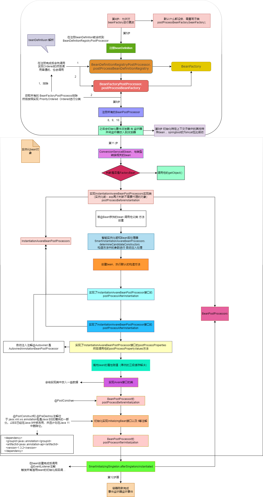
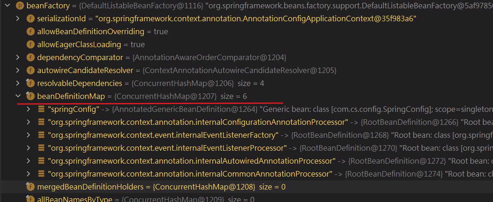
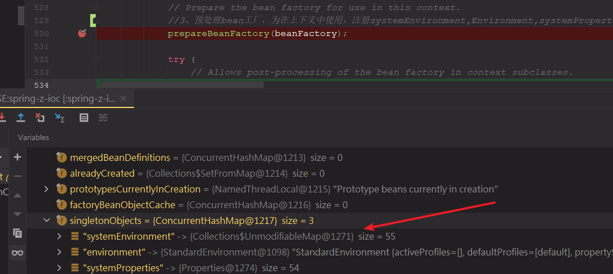

[TOC]


# SpringIOC 源码

# BeanPostProcessor与BeanFactoryPostProcessor

- BeanPostProcessor在Spring容器初始化bean之前和初始化bean之后，干预bean的初始化行为；
- BeanFactoryPostProcessor是spring容器注册BeanDefinition时，用来干预BeanDefinition的行为；

# FactoryBean 与BeanFactory

- FactoryBean是工厂bean，获取对象时候或调getObject（）方法返回对象；
- BeanFactory是spring容器；

# IOC:




## 1、创建AnnotationconfigApplicationContext

```java
ApplicationContext context = new AnnotationConfigApplicationContext(SpringConfig.class);
```

- ApplicationContext接口：


- 继承关系： `AnnotationConfigApplicationContext` extends `GenericApplicationContext`  继承 `AbstractApplicationContext`（静态代码块解决了一个问题）也继承了

- 创建对象共有3步

  ```java
  public AnnotationConfigApplicationContext(Class<?>... componentClasses) {
      //注释配置应用程序上下文
  		this();
  		register(componentClasses);
  		refresh();
  	}
  ```

- 

### 1.1、this（） 

- 第一点：主要是spring内部加载了5个BeanDefinition对象（就是对bean的描述）

- BeanDefinition 是定义 Bean 的配置元信息接口，包含：

  Bean 的类名
  设置父 bean 名称、是否为 primary、
  Bean 行为配置信息，作用域、自动绑定模式、生命周期回调、延迟加载、初始方法、销毁方法等
  Bean 之间的依赖设置，dependencies
  构造参数、属性设置
  BeanDefinition 表示bean的定义，spring根据BeanDefinition 来创建bean对象

  来自@Bean @Component等  **mybean类===>java对象  ===> spring bean的描述（BeanDefinition）==>变为spring的Bean**

  
  
  - **1、父类中创建了`GenericApplicationContext`   beanFactory**
  
  ```
  1、创建 beanFactory 2、spring内部加载了5个BeanDefinition：就是对bean的描述; 3、放置了@Compment注解
  ```

```java
//AnnotationConfigApplicationContext类
public AnnotationConfigApplicationContext() {
    //AnnotatedBeanDefinitionReader  reader 带注释的 Bean 定义阅读器
    this.reader = new AnnotatedBeanDefinitionReader(this); //传入当前类AnnotationConfigApplicationContext
    //ClassPathBeanDefinitionScanner scanner 类路径 Bean 定义扫描器
    this.scanner = new ClassPathBeanDefinitionScanner(this);
}
```

- **this.reader = new AnnotatedBeanDefinitionReader(this);**

```java
public AnnotatedBeanDefinitionReader(BeanDefinitionRegistry registry) {
   this(registry, getOrCreateEnvironment(registry));
}

getOrCreateEnvironment(registry) //创建一个新的标准环境 拿到系统的一些环境信息

//首先对AnnotatedBeanDefinitionReader成员变量初始化 ：BeanNameGenerator，ScopeMetadataResolver对象
public AnnotatedBeanDefinitionReader(BeanDefinitionRegistry registry, Environment environment) {
    //断言（作用不合法抛出异常）
    Assert.notNull(registry, "BeanDefinitionRegistry must not be null");
    Assert.notNull(environment, "Environment must not be null");
   	//将AnnotationConfigApplicationContext赋值给成员变量
    this.registry = registry;
    //根据registr与环境变量创建一个 *条件评估器*  判断是否含有@Conditional条件注解
    this.conditionEvaluator = new ConditionEvaluator(registry, environment, null);
    //注册注解配置处理器  含有5个BeanDefinition()
    AnnotationConfigUtils.registerAnnotationConfigProcessors(this.registry);
}
```


-  **this.scanner = new ClassPathBeanDefinitionScanner(this);**

  放入一个@Component对这个注解进行扫描

```java
public ClassPathBeanDefinitionScanner(BeanDefinitionRegistry registry) {
   this(registry, true);
}
public ClassPathBeanDefinitionScanner(BeanDefinitionRegistry registry, boolean useDefaultFilters) {
    this(registry, useDefaultFilters, getOrCreateEnvironment(registry)); //获取系统环境变量
}
public ClassPathBeanDefinitionScanner(BeanDefinitionRegistry registry, boolean useDefaultFilters,
                                      Environment environment) {

    this(registry, useDefaultFilters, environment,
         (registry instanceof ResourceLoader ? (ResourceLoader) registry : null));
}

public ClassPathBeanDefinitionScanner(BeanDefinitionRegistry registry, boolean useDefaultFilters,
                                      Environment environment, @Nullable ResourceLoader resourceLoader) {
    //断言
    Assert.notNull(registry, "BeanDefinitionRegistry must not be null");
    this.registry = registry; //注释配置应用程序上下文AnnotationConfigApplicationContext

    if (useDefaultFilters) {
        registerDefaultFilters();/* 默认filter会将@Component注解类放入 若类含有@Component会扫描到注解
        						 类路径扫描候选组件提供者
        						*/
    }
    setEnvironment(environment);
    setResourceLoader(resourceLoader);
}
```


### 1.2、register(componentClasses);

- 把componentClasses变成bean的描述：beanDefinition
- 使用BeanDefinitionHolder对beanDefinition与beanName包装
- 将BeanDefinitionHolder中刚放入的BeanDefinition注册到beanDefinitionMap中
- **核心就是将我们自己写的配置类放入到beanDefinitionMap中**

```java
//注册一个或多个要处理的组件类。 <p>请注意，必须调用 {@link refresh()} 才能使上下文完全处理新类。
//AnnotationConfigApplicationContext类
public void register(Class<?>... componentClasses) {  //
    Assert.notEmpty(componentClasses, "At least one component class must be specified");
    this.reader.register(componentClasses);  //componentClasses  配置类.class 
    //reader是AnnotatedBeanDefinitionReader在this()中创建
}
//AnnotatedBeanDefinitionReader类 遍历循环看含有都多少配置类 注册一个或多个要处理的组件类。
public void register(Class<?>... componentClasses) {
    for (Class<?> componentClass : componentClasses) {
        registerBean(componentClass);
    }
}
//从给定的 bean 类注册一个 bean，从类声明的注释中派生其元数据
public void registerBean(Class<?> beanClass) {
    doRegisterBean(beanClass, null, null, null, null);
}

private <T> void doRegisterBean(Class<T> beanClass, @Nullable String name,
                                @Nullable Class<? extends Annotation>[] qualifiers, @Nullable Supplier<T> supplier,
                                @Nullable BeanDefinitionCustomizer[] customizers) {
    //把componentClasses变成bean的描述：beanDefinition 含有bean的class以及他的元注解
    AnnotatedGenericBeanDefinition abd = new AnnotatedGenericBeanDefinition(beanClass);
    if (this.conditionEvaluator.shouldSkip(abd.getMetadata())) {//判断  其是否有条件注解
        return;
    }
    //设置其数据 scopedProxyMode 决定使用
    abd.setInstanceSupplier(supplier);
    //解析注解Bean定义的作用域，若@Scope("prototype")，则Bean为原型类型；
    //若@Scope("singleton")，则Bean为单态类型
    ScopeMetadata scopeMetadata = this.scopeMetadataResolver.resolveScopeMetadata(abd);
    abd.setScope(scopeMetadata.getScopeName());
    //根据信息创建bean的名字  registry = AnnotationConfigApplicationContext
    //beanName=‘springConfig’
    String beanName = (name != null ? name : this.beanNameGenerator.generateBeanName(abd, this.registry));
    //是否有@Lazy @Primary等注解
    AnnotationConfigUtils.processCommonDefinitionAnnotations(abd);
    if (qualifiers != null) {
        for (Class<? extends Annotation> qualifier : qualifiers) {
            if (Primary.class == qualifier) {
                abd.setPrimary(true);
            }
            else if (Lazy.class == qualifier) {
                abd.setLazyInit(true);
            }
            else {
                abd.addQualifier(new AutowireCandidateQualifier(qualifier));
            }
        }
    }
    if (customizers != null) {
        for (BeanDefinitionCustomizer customizer : customizers) {
            customizer.customize(abd);
        }
    }
    //使用BeanDefinitionHolder对beanDefinition与beanName包装
    BeanDefinitionHolder definitionHolder = new BeanDefinitionHolder(abd, beanName);
    definitionHolder = AnnotationConfigUtils.applyScopedProxyMode(scopeMetadata, definitionHolder, this.registry);
    //注册（BeanDefinitionHolder中刚放入的BeanDefinition注册到beanDefinitionMap中）
    BeanDefinitionReaderUtils.registerBeanDefinition(definitionHolder, this.registry);
}

//注册 [registerBeanDefinition]方法：
	String beanName = definitionHolder.getBeanName();
	registry.registerBeanDefinition(beanName, definitionHolder.getBeanDefinition());
//核心：
//registerBeanDefinition方法中出现的beanDefinitionMap就是spring的5个bean
BeanDefinition existingDefinition = this.beanDefinitionMap.get(beanName);
//先进行判断是否含有若无将其放入到beanDefinitionMap
this.beanDefinitionMap.put(beanName, beanDefinition);
//名字
this.beanDefinitionNames.add(beanName);
removeManualSingletonName(beanName);
```

abd：

beanDefinitionMap:


### 1.3、refresh(); 核心

刷新spring容器的12个步骤

- 扫描项目中 的bean（@Service、@Compment….注解的bean）得到BeanDefinition，然后放入到BeanDefinitionMap
- 把BeanDefinitionMap取出依次创建所对应的对象

#### 1-4：前4步

```java
//线程同步
synchronized (this.startupShutdownMonitor) {
   // 1、Prepare this context for refreshing. 准备对上下文进行刷新
   prepareRefresh();

   // TODO Tell the subclass to refresh the internal bean factory.
   //2、告诉子类去刷新内部的bean factory,获得刷新的bean factory，最终得到的是DefaultListableBeanFactory,并且加载
   //如果是xml方式开发，此步骤重要，若是注解方式开发没什么操作  
   ConfigurableListableBeanFactory beanFactory = obtainFreshBeanFactory();
    {	//会获取beanFactory,	
        return getBeanFactory(); //继承当前类 模板方法模式
    }
    
```

  

```java
 // Prepare the bean factory for use in this context.
   //3、预处理bean工厂，为在上下文中使用，注册systemEnvironment,Environment,systemProperties几个bean对象（spring自己的对象）
   prepareBeanFactory(beanFactory);
```



```java
//4、什么都没有做 Allows post-processing of the bean factory in context subclasses.
postProcessBeanFactory(beanFactory);
```

#### **5.核心 ：扫描得到bean定义**

**注解开发的时候，对包扫描得到的bean定义在此步骤完成的，底层就是扫描注解得到bean定义，然后放入到**beanFactory

激活各种BeanFactory处理器，如果BeanFactory没有注册任何beanFactoryPostProcessor,此处相当于此处相当于不做操作

```java
invokeBeanFactoryPostProcessors(beanFactory);
```

**ApplicationContext--->BeanFactory (BeanFactoryPostProcessor)**

```java
/**
*  TODO 对所有的BeanDefinitionRegistryPostProcessor 手动注册BeanFactoryPostProcessor
*       以及通过配置文件方式的BeanFactoryPostProcessor按照PriorityOrderd、Orderd、no orderd三种方式分开处理、调用
*/
invokeBeanFactoryPostProcessors{
    PostProcessorRegistrationDelegate.invokeBeanFactoryPostProcessors(beanFactory, getBeanFactoryPostProcessors());
}

```

##### 5.1、对所有的beanFactoryPostProcessors做处理

BeanFactoryPostProcessors有三种情况：

1、我们手动注册

2、Spring扫描出来的

3、Spring自定义的

什么是手动注册的？

就是我们手动调用AnnotationConfigApplicationContext.addBeanFactoryPostProcessor();这个方法添加的。

什么是Spring扫描出来的？

我们自己实现了BeanFactoryPostProcessor接口的类可以加@Companent，也可以不加，如果加了那么就属于是Spring扫描出来的。

什么是Spring自定义的？

在Spring内容也有其实现类BeanFactoryPostProcessor接口的类，它会自己去获取出来，我们不用管。

```java
//1.对所有的beanFactoryPostProcessors处理
for (BeanFactoryPostProcessor postProcessor : beanFactoryPostProcessors) {
    if (postProcessor instanceof BeanDefinitionRegistryPostProcessor) {
        BeanDefinitionRegistryPostProcessor registryProcessor =
            (BeanDefinitionRegistryPostProcessor) postProcessor;
        // 2.1.2 添加到registryProcessors(用于最后执行postProcessBeanFactory方法)
        registryProcessor.postProcessBeanDefinitionRegistry(registry);
        // 2.1.2 添加到registryProcessors(用于最后执行postProcessBeanFactory方法)
        registryProcessors.add(registryProcessor);
    }
    else {
        // 2.2 否则，只是普通的BeanFactoryPostProcessor
        // 2.2.1 添加到regularPostProcessors(用于最后执行postProcessBeanFactory方法)
        regularPostProcessors.add(postProcessor);
    }
}
```

##### 5.2、扫描配置类获取beanDefintion

| regularPostProcessors     | 用于存放普通的BeanFactoryPostProcessor                       |
| ------------------------- | ------------------------------------------------------------ |
| registryProcessors        | BeanDefinitionRegistryPostProcessor                          |
| beanFactoryPostProcessors | 当前容器的所有Processors<                                    |
| processedBeans            | 存放BeanName                                                 |
| currentRegistryProcessors | 存放含有PriorityOrdered注解的BeanDefinitionRegistryPostProcessor |

###### 5.2.1、 获取所有的BeanDefinitionRegistryPostProcessor

（Bean定义注册表后处理器 , 可以修改bean定义的一些数据）

```java
String[] postProcessorNames =
			beanFactory.getBeanNamesForType(BeanDefinitionRegistryPostProcessor.class, true, false);
for (String ppName : postProcessorNames) {
	if (beanFactory.isTypeMatch(ppName, PriorityOrdered.class)) {
		currentRegistryProcessors.add(beanFactory.getBean(ppName, 	    BeanDefinitionRegistryPostProcessor.class));//将 PostProcessor添加到集合中
		processedBeans.add(ppName);
	}
}
//优先级要求		PriorityOrdered	
//postProcessorNames =  内部配置注释处理器
//		org.springframework.context.annotation.internalConfigurationAnnotationProcessor
```

###### 5.2.2、*****注册bean定义*****  (根据获取的currentRegistryProcessors中的内部配置注释处理器)

```java
sortPostProcessors(currentRegistryProcessors, beanFactory); //对postprocessor排序
registryProcessors.addAll(currentRegistryProcessors);
//TODO 调用postProcessor 可以对bean进行更改(判断获取到配置类) （配置类中的bean变为Definition并放入beanFactory的map中）
invokeBeanDefinitionRegistryPostProcessors(currentRegistryProcessors, registry); 
currentRegistryProcessors.clear();
```

- invokeBeanDefinitionRegistryPostProcessors 中循环遍历所有的PostProcessor

- 注册beanDefinitions： **processConfigBeanDefinitions(registry);** registry==beanFactory

- 1、获取beanFactory中的所有的bean定义,判断是否有含有 @Configuration 注解的bean定义筛选出来 符合条件的候选者bean定义

  获取配置类，根据配置注解中的proxyBeanMethods属性值（默认是ture）会对其配置类定义中放入一个full属性值

  ```java
  for (String beanName : candidateNames) {
  	BeanDefinition beanDef = registry.getBeanDefinition(beanName);
  	if (beanDef.getAttribute(ConfigurationClassUtils.CONFIGURATION_CLASS_ATTRIBUTE) != null) {
  		if (logger.isDebugEnabled()) {
  		 logger.debug("Bean definition has already been processed as a configuration class: " + beanDef);
  		}
  	} 
      //含有 @Configuration 注解的bean定义筛选出来 符合条件的候选者bean定义
  	else if (ConfigurationClassUtils.checkConfigurationClassCandidate(beanDef, this.metadataReaderFactory)) {
  		configCandidates.add(new BeanDefinitionHolder(beanDef, beanName));
  	}
  }
  ```

  ```java
  public static boolean checkConfigurationClassCandidate(
      BeanDefinition beanDef, MetadataReaderFactory metadataReaderFactory) {
  
      String className = beanDef.getBeanClassName();
      if (className == null || beanDef.getFactoryMethodName() != null) {
          return false;
      }
  
      AnnotationMetadata metadata;
      if (beanDef instanceof AnnotatedBeanDefinition &&
          className.equals(((AnnotatedBeanDefinition) beanDef).getMetadata().getClassName())) {
          // Can reuse the pre-parsed metadata from the given BeanDefinition...
          metadata = ((AnnotatedBeanDefinition) beanDef).getMetadata();
      }
      else if (beanDef instanceof AbstractBeanDefinition && ((AbstractBeanDefinition) beanDef).hasBeanClass()) {
          // Check already loaded Class if present...
          // since we possibly can't even load the class file for this Class.
          Class<?> beanClass = ((AbstractBeanDefinition) beanDef).getBeanClass();
          if (BeanFactoryPostProcessor.class.isAssignableFrom(beanClass) ||
              BeanPostProcessor.class.isAssignableFrom(beanClass) ||
              AopInfrastructureBean.class.isAssignableFrom(beanClass) ||
              EventListenerFactory.class.isAssignableFrom(beanClass)) {
              return false;
          }
          metadata = AnnotationMetadata.introspect(beanClass);
      }
      else {
          try {
              MetadataReader metadataReader = metadataReaderFactory.getMetadataReader(className);
              metadata = metadataReader.getAnnotationMetadata();
          }
          catch (IOException ex) {
              if (logger.isDebugEnabled()) {
                  logger.debug("Could not find class file for introspecting configuration annotations: " +
                               className, ex);
              }
              return false;
          }
      }
      //配置类 上的@Configuration
      Map<String, Object> config = metadata.getAnnotationAttributes(Configuration.class.getName());
      //todo @Configuration 默认值是true
      if (config != null && !Boolean.FALSE.equals(config.get("proxyBeanMethods"))) { 
          //full在下面 配置类中对beanFactory做增强使用
          beanDef.setAttribute(CONFIGURATION_CLASS_ATTRIBUTE, CONFIGURATION_CLASS_FULL); 
      }
      else if (config != null || isConfigurationCandidate(metadata)) {
          beanDef.setAttribute(CONFIGURATION_CLASS_ATTRIBUTE, CONFIGURATION_CLASS_LITE);
      }
      else {
          return false;
      }
  
      // It's a full or lite configuration candidate... Let's determine the order value, if any. 类上的@Order 注解排序
      Integer order = getOrder(metadata);
      if (order != null) {
          beanDef.setAttribute(ORDER_ATTRIBUTE, order);
      }
  
      return true;
  }
  ```

- 创建配置类解析器 解析每一个带有@Configuration注解的类（beanFactory传入）

  ```java
  ConfigurationClassParser parser = new ConfigurationClassParser(
        this.metadataReaderFactory, this.problemReporter, this.environment,
        this.resourceLoader, this.componentScanBeanNameGenerator, registry);
  ```

- 1、对配置类进行处理

  ```java
  parser.parse(candidates); 
  parser.validate();
  ```

  - ```java
    public void parse(Set<BeanDefinitionHolder> configCandidates) {
        for (BeanDefinitionHolder holder : configCandidates) {
            BeanDefinition bd = holder.getBeanDefinition();
            try {
                if (bd instanceof AnnotatedBeanDefinition) {  
                    //将配置类中的bean元数据信息放入到map集合
                    parse(((AnnotatedBeanDefinition) bd).getMetadata(), holder.getBeanName());
                }
                else if (bd instanceof AbstractBeanDefinition && ((AbstractBeanDefinition) bd).hasBeanClass()) {
                    parse(((AbstractBeanDefinition) bd).getBeanClass(), holder.getBeanName());
                }
                else {
                    parse(bd.getBeanClassName(), holder.getBeanName());
                }
            }
          
        }
        //内部类 TODO springboot自动配置 调用process加载xxxAutoConfiguration（@Import）
        this.deferredImportSelectorHandler.process();
    }
    ```
    
  - 处理配置类
  
    ```java
    protected final void parse(AnnotationMetadata metadata, String beanName) throws IOException {
       processConfigurationClass(new ConfigurationClass(metadata, beanName), DEFAULT_EXCLUSION_FILTER);
    }
    ```
  
  - 首先判断是否有条件处理
  
    ```java
    protected void processConfigurationClass(ConfigurationClass configClass, Predicate<String> filter) throws IOException {
        // 通过条件计算器判断是否跳过解析*
        // 通过@Conditional({})来进行*
        // 如果没有被@Conditional修饰，或者条件符合@Conditional的话，就跳过。反之，就跳过	
        if (this.conditionEvaluator.shouldSkip(configClass.getMetadata(), ConfigurationPhase.PARSE_CONFIGURATION)) {
            return;
        }
    
        ConfigurationClass existingClass = this.configurationClasses.get(configClass);
        if (existingClass != null) {
            if (configClass.isImported()) {
                if (existingClass.isImported()) {
                    existingClass.mergeImportedBy(configClass);
                }
                // Otherwise ignore new imported config class; existing non-imported class overrides it.
                return;
            }
            else {
                // Explicit bean definition found, probably replacing an import.
                // Let's remove the old one and go with the new one.
                this.configurationClasses.remove(configClass);
                this.knownSuperclasses.values().removeIf(configClass::equals);
            }
        }
    
        // 处理配置类，由于配置类可能存在父类(若父类的全类名是以java开头的，则除外)，所有需要将configClass变成sourceClass去解析，然后返回sourceClass的父类。
        // 如果此时父类为空，则不会进行while循环去解析，如果父类不为空，则会循环的去解析父类
        // SourceClass的意义：简单的包装类，目的是为了以统一的方式去处理带有注解的类，不管这些类是如何加载的
        // 如果无法理解，可以把它当做一个黑盒，不会影响看spring源码的主流程 configClass ==> ConfigurationClass
        SourceClass sourceClass = asSourceClass(configClass, filter);
        do { //处理配置类
            sourceClass = doProcessConfigurationClass(configClass, sourceClass, filter);
        }
        while (sourceClass != null);
    
        this.configurationClasses.put(configClass, configClass); //放入map集合
    }
    ```
  
  - 1、处理配置类 sourceClass。如果添加了@ComponentScan注解进行包扫描，会将BeanDefinition直接放入BeanFactory的map中。
  
    ```java
    protected final SourceClass doProcessConfigurationClass(
        ConfigurationClass configClass, SourceClass sourceClass, Predicate<String> filter)
        throws IOException {
        //是否是 @Component 注解
        if (configClass.getMetadata().isAnnotated(Component.class.getName())) {
            // 递归处理内部类，因为内部类也是一个配置类，配置类上有@configuration注解，该注解继承@Component，if判断为true，调用processMemberClasses方法，递归解析配置类中的内部类
            processMemberClasses(configClass, sourceClass, filter); //什么也没干
        }
    
        // Process any @PropertySource annotations
        // 【@PropertySource】  如果配置类上加了@PropertySource注解，那么就解析加载properties文件，并将属性添加到spring上下文中
        for (AnnotationAttributes propertySource : AnnotationConfigUtils.attributesForRepeatable(
            sourceClass.getMetadata(), PropertySources.class,
            org.springframework.context.annotation.PropertySource.class)) {
            if (this.environment instanceof ConfigurableEnvironment) {
                // 进去查看添加配置文件到上下文中
                processPropertySource(propertySource);
            }
            else {
                logger.info("Ignoring @PropertySource annotation on [" + sourceClass.getMetadata().getClassName() +
                            "]. Reason: Environment must implement ConfigurableEnvironment");
            }
        }
    
        // Process any @ComponentScan annotations
        // 【@ComponentScan】处理@ComponentScan或者@ComponentScans注解，并将扫描包下的所有bean转换成填充后的ConfigurationClass
        // 此处就是将自定义的bean加载到IOC容器，因为扫描到的类可能也添加了@ComponentScan和@ComponentScans注解，因此需要进行递归解析
        Set<AnnotationAttributes> componentScans = AnnotationConfigUtils.attributesForRepeatable(
            sourceClass.getMetadata(), ComponentScans.class, ComponentScan.class);
        if (!componentScans.isEmpty() &&
            !this.conditionEvaluator.shouldSkip(sourceClass.getMetadata(), ConfigurationPhase.REGISTER_BEAN)) {
            // The config class is annotated with @ComponentScan -> perform the scan immediately
            // 解析@ComponentScan和@ComponentScans配置的扫描的包所包含的类
            // 比如 basePackages = com.mashibing, 那么在这一步会扫描出这个包及子包下的class，然后将其解析成BeanDefinition
            // (BeanDefinition可以理解为等价于BeanDefinitionHolder)
            for (AnnotationAttributes componentScan : componentScans) {
                // The config class is annotated with @ComponentScan -> perform the scan immediately
                Set<BeanDefinitionHolder> scannedBeanDefinitions =
                    this.componentScanParser.parse(componentScan, sourceClass.getMetadata().getClassName());
                // Check the set of scanned definitions for any further config classes and parse recursively if needed
                // 通过上一步扫描包com.mashibing，有可能扫描出来的bean中可能也添加了ComponentScan或者ComponentScans注解.
                //所以这里需要循环遍历一次，进行递归(parse)，继续解析，直到解析出的类上没有ComponentScan和ComponentScans
                for (BeanDefinitionHolder holder : scannedBeanDefinitions) {
                    BeanDefinition bdCand = holder.getBeanDefinition().getOriginatingBeanDefinition();
                    if (bdCand == null) {
                        bdCand = holder.getBeanDefinition();
                    }
                    // 判断是否是一个配置类，并设置full或lite属性
                    if (ConfigurationClassUtils.checkConfigurationClassCandidate(bdCand, this.metadataReaderFactory)) {
                        // 通过递归方法进行解析
                        parse(bdCand.getBeanClassName(), holder.getBeanName());
                    }
                }
            }
        }
    
        //处理Improt注解
        processImports(configClass, sourceClass, getImports(sourceClass), filter, true);
    
        // Process any @ImportResource annotations
        AnnotationAttributes importResource =
            AnnotationConfigUtils.attributesFor(sourceClass.getMetadata(), ImportResource.class);
        if (importResource != null) {
            String[] resources = importResource.getStringArray("locations");
            Class<? extends BeanDefinitionReader> readerClass = importResource.getClass("reader");
            for (String resource : resources) {
                String resolvedResource = this.environment.resolveRequiredPlaceholders(resource);
                configClass.addImportedResource(resolvedResource, readerClass);
            }
        }
    
        //TODO 处理@Bean注解  configClass == springConfig
        Set<MethodMetadata> beanMethods = retrieveBeanMethodMetadata(sourceClass);
        for (MethodMetadata methodMetadata : beanMethods) {
            configClass.addBeanMethod(new BeanMethod(methodMetadata, configClass)); //将bean方法的元数据放入configClass(有类的元数据)
        }
    
        // 默认方法
        processInterfaces(configClass, sourceClass);
    
        // Process superclass, if any 继承
        if (sourceClass.getMetadata().hasSuperClass()) {
            String superclass = sourceClass.getMetadata().getSuperClassName();
            if (superclass != null && !superclass.startsWith("java") &&
                !this.knownSuperclasses.containsKey(superclass)) {
                this.knownSuperclasses.put(superclass, configClass);
                // Superclass found, return its annotation metadata and recurse
                return sourceClass.getSuperClass();
            }
        }
    
        // No superclass -> processing is complete
        return null;
    }
    ```
    
  - 处理@Bean注解
  
    从配置类中获取添加@Bean注解的方法放入configClass
  
  - 2、放入map集合 （在使用aop中会放入一个beanDefinition处理代理）
  
    ```java
    // 配置类Bean定义阅读器 Read the model and create bean definitions based on its content
    if (this.reader == null) {
        this.reader = new ConfigurationClassBeanDefinitionReader(
            registry, this.sourceExtractor, this.resourceLoader, this.environment,
            this.importBeanNameGenerator, parser.getImportRegistry());
    }
    //TODO 将bean定义放入beanFactory的map（加载bean的定义，会处理@Bean方法上的所有注解）
    this.reader.loadBeanDefinitions(configClasses); 
    alreadyParsed.addAll(configClasses);
    ```
    
    - ```java
      public void loadBeanDefinitions(Set<ConfigurationClass> configurationModel) {
          TrackedConditionEvaluator trackedConditionEvaluator = new TrackedConditionEvaluator();
          for (ConfigurationClass configClass : configurationModel) {
              loadBeanDefinitionsForConfigurationClass(configClass, trackedConditionEvaluator);
          }
      }
      ```
    
    - ```java
      private void loadBeanDefinitionsForConfigurationClass(
          ConfigurationClass configClass, TrackedConditionEvaluator trackedConditionEvaluator) {
      
          if (trackedConditionEvaluator.shouldSkip(configClass)) {
              String beanName = configClass.getBeanName();
              if (StringUtils.hasLength(beanName) && this.registry.containsBeanDefinition(beanName)) {
                  this.registry.removeBeanDefinition(beanName);
              }
              this.importRegistry.removeImportingClass(configClass.getMetadata().getClassName());
              return;
          }
      
          if (configClass.isImported()) {
              registerBeanDefinitionForImportedConfigurationClass(configClass);
          } 
          //TODO 加载@Bean注解方法的所定义的beanDefinition
          for (BeanMethod beanMethod : configClass.getBeanMethods()) {
              loadBeanDefinitionsForBeanMethod(beanMethod);
          }
          //@ImportResource 注解
          loadBeanDefinitionsFromImportedResources(configClass.getImportedResources());
          //获取导入Bean定义注册器（springBoot自动配置使用此接口将main方法下的类进行注册   @Import(AutoConfigurationPackages.Registrar.class) ）
          loadBeanDefinitionsFromRegistrars(configClass.getImportBeanDefinitionRegistrars());
      }
      //TODO: ImportBeanDefinitionRegistrar接口是也是spring的扩展点之一,它可以支持我们自己写的代码封装成 bean定义
      ```
      
    - ```java
      //对当前@Bean修饰的方法上的注解的
      private void loadBeanDefinitionsForBeanMethod(BeanMethod beanMethod) {
          ConfigurationClass configClass = beanMethod.getConfigurationClass();
          MethodMetadata metadata = beanMethod.getMetadata();
          String methodName = metadata.getMethodName();
      
          // Do we need to mark the bean as skipped by its condition?
          if (this.conditionEvaluator.shouldSkip(metadata, ConfigurationPhase.REGISTER_BEAN)) {
              configClass.skippedBeanMethods.add(methodName);
              return;
          }
          if (configClass.skippedBeanMethods.contains(methodName)) {
              return;
          }
          //获取@Bean注解属性
          AnnotationAttributes bean = AnnotationConfigUtils.attributesFor(metadata, Bean.class);
          Assert.state(bean != null, "No @Bean annotation attributes");
      
          // Consider name and any aliases 注解名字
          List<String> names = new ArrayList<>(Arrays.asList(bean.getStringArray("name")));
          String beanName = (!names.isEmpty() ? names.remove(0) : methodName);
      
          // Register aliases even when overridden
          for (String alias : names) {
              this.registry.registerAlias(beanName, alias);
          }
      
          // Has this effectively been overridden before (e.g. via XML)?
          if (isOverriddenByExistingDefinition(beanMethod, beanName)) {
              if (beanName.equals(beanMethod.getConfigurationClass().getBeanName())) {
                  throw new BeanDefinitionStoreException(beanMethod.getConfigurationClass().getResource().getDescription(),
                                                         beanName, "Bean name derived from @Bean method '" + beanMethod.getMetadata().getMethodName() +
                                                         "' clashes with bean name for containing configuration class; please make those names unique!");
              }
              return;
          }
          //创建一个beandefinition
          ConfigurationClassBeanDefinition beanDef = new ConfigurationClassBeanDefinition(configClass, metadata, beanName);
          beanDef.setSource(this.sourceExtractor.extractSource(metadata, configClass.getResource()));
      
          if (metadata.isStatic()) {
              // static @Bean method
              if (configClass.getMetadata() instanceof StandardAnnotationMetadata) {
                  beanDef.setBeanClass(((StandardAnnotationMetadata) configClass.getMetadata()).getIntrospectedClass());
              }
              else {
                  beanDef.setBeanClassName(configClass.getMetadata().getClassName());
              }
              beanDef.setUniqueFactoryMethodName(methodName);
          }
          else {
              // instance @Bean method
              beanDef.setFactoryBeanName(configClass.getBeanName());
              beanDef.setUniqueFactoryMethodName(methodName);
          }
      
          if (metadata instanceof StandardMethodMetadata) {
              beanDef.setResolvedFactoryMethod(((StandardMethodMetadata) metadata).getIntrospectedMethod());
          }
      
          beanDef.setAutowireMode(AbstractBeanDefinition.AUTOWIRE_CONSTRUCTOR);
          beanDef.setAttribute(org.springframework.beans.factory.annotation.RequiredAnnotationBeanPostProcessor.
                               SKIP_REQUIRED_CHECK_ATTRIBUTE, Boolean.TRUE);
          //通用注解
          AnnotationConfigUtils.processCommonDefinitionAnnotations(beanDef, metadata);
          //bean中的属性
          Autowire autowire = bean.getEnum("autowire");
          if (autowire.isAutowire()) {
              beanDef.setAutowireMode(autowire.value());
          }
      
          boolean autowireCandidate = bean.getBoolean("autowireCandidate");
          if (!autowireCandidate) {
              beanDef.setAutowireCandidate(false);
          }
      
          String initMethodName = bean.getString("initMethod");
          if (StringUtils.hasText(initMethodName)) {
              beanDef.setInitMethodName(initMethodName);
          }
      
          String destroyMethodName = bean.getString("destroyMethod");
          beanDef.setDestroyMethodName(destroyMethodName);
      
          // Consider scoping @Scope 注解
          ScopedProxyMode proxyMode = ScopedProxyMode.NO;
          AnnotationAttributes attributes = AnnotationConfigUtils.attributesFor(metadata, Scope.class);
          if (attributes != null) {
              beanDef.setScope(attributes.getString("value"));
              proxyMode = attributes.getEnum("proxyMode");
              if (proxyMode == ScopedProxyMode.DEFAULT) {
                  proxyMode = ScopedProxyMode.NO;
              }
          }
      
          // Replace the original bean definition with the target one, if necessary
          BeanDefinition beanDefToRegister = beanDef;
          if (proxyMode != ScopedProxyMode.NO) {
              BeanDefinitionHolder proxyDef = ScopedProxyCreator.createScopedProxy(
                  new BeanDefinitionHolder(beanDef, beanName), this.registry,
                  proxyMode == ScopedProxyMode.TARGET_CLASS);
              beanDefToRegister = new ConfigurationClassBeanDefinition(
                  (RootBeanDefinition) proxyDef.getBeanDefinition(), configClass, metadata, beanName);
          }
      
         
          //TODO 将bean放入beanFactory 的 map
          this.registry.registerBeanDefinition(beanName, beanDefToRegister);
      }
      ```
      
    - 放入beanDefinitionMap中
    
      ```java
      @Override
      public void registerBeanDefinition(String beanName, BeanDefinition beanDefinition)
          throws BeanDefinitionStoreException {
      
       
      
          if (beanDefinition instanceof AbstractBeanDefinition) {
              try {
                  //是否合法的
                  ((AbstractBeanDefinition) beanDefinition).validate();
              }
             
          }
          //查看是否已有此beanDefinition
          BeanDefinition existingDefinition = this.beanDefinitionMap.get(beanName);
          if (existingDefinition != null) {
              ······
              //将bean描述存放到map中
              this.beanDefinitionMap.put(beanName, beanDefinition);
          }
          else {
              if (hasBeanCreationStarted()) { 
                  //将bean描述存放到map中
                  // Cannot modify startup-time collection elements anymore (for stable iteration)
                  synchronized (this.beanDefinitionMap) {
                      this.beanDefinitionMap.put(beanName, beanDefinition);
                      List<String> updatedDefinitions = new ArrayList<>(this.beanDefinitionNames.size() + 1);
                      updatedDefinitions.addAll(this.beanDefinitionNames);
                      updatedDefinitions.add(beanName);
                      this.beanDefinitionNames = updatedDefinitions;
                      removeManualSingletonName(beanName);
                  }
              }
             ····
      }
      ```


###### 5.2.3、处理其他BeanDefinitionRegistryPostProcessor

1、接着是实现了Ordered

2、其他实现了BeanDefinitionRegistryPostProcessor接口的调用

###### 5.2.4、使用cjlib对beanFactory 做增强在判断是否是配置类时放入的full

```java
invokeBeanFactoryPostProcessors(registryProcessors, beanFactory); //使用cjlib对beanFactory 做增强在判断是否是配置类时放入的full
invokeBeanFactoryPostProcessors(regularPostProcessors, beanFactory);
```

###### 5.2.5、处理实现BeanFactoryPostProcessor接口的类

会从已经处理完的中筛选出还没有处理的接口

#### 6、注册拦截Bean创建的Bean处理器，如果没有bean processors，此步骤什么也不做

> 注册所有的 BeanPostProcessor，将所有实现了 BeanPostProcessor 接口的类加载到 BeanFactory 中。
>
> BeanPostProcessor 接口是 Spring 初始化 bean 时对外暴露的扩展点，Spring IoC 容器允许 BeanPostProcessor 在容器初始化 bean 的前后，添加自己的逻辑处理。在 registerBeanPostProcessors 方法只是注册到 BeanFactory 中，具体调用是在 bean 初始化的时候。
>
> 具体的：在所有 bean 实例化时，执行初始化方法前会调用所有 BeanPostProcessor 的 postProcessBeforeInitialization 方法，在执行初始化方法后会调用所有 BeanPostProcessor 的 postProcessAfterInitialization 方法。

#### 7、国际化处理     注册了一个bean(messageSource)

```java
//Initialize message source for this context.在上下文初始化注册messageSource的bean，不同语言环境信息，国际化处理
initMessageSource();
```

#### 8、在上下文初始化注册applicationEventMulticaster的bean，应用消息广播

给singletonObjects注册了一个applicationEventMulticaster对象

#### 9、onRefresh()

然后创建并启动WebServer。SpringBoot内置的Tomcat或者UndertowWebServer就是在这里实例化的。

#### 10、在所有bean中查找listener bean并注册到消息广播中，没有的话就什么也不做；

#### 11、核心：初始化所有剩下的非延迟初始化的单例bean对象

（默认@Bean注解修饰的含有beanFactory）

#### 11.1、ConversionService ： 类型转换器  还有一个格式转换：PropertyEditorRegistrar

```java
// Initialize conversion service for this context.
if (beanFactory.containsBean(CONVERSION_SERVICE_BEAN_NAME) &&
    beanFactory.isTypeMatch(CONVERSION_SERVICE_BEAN_NAME, ConversionService.class)) {
    //设置conversionService的bean，与类型转换相关的bean
    beanFactory.setConversionService(
        beanFactory.getBean(CONVERSION_SERVICE_BEAN_NAME, ConversionService.class));
}

//如果之前没有注册过任何 BeanFactoryPostProcessor（例如 PropertySourcesPlaceholderConfigurer bean），
// 则注册一个默认的嵌入值解析器：此时，主要用于解析注释属性值。
if (!beanFactory.hasEmbeddedValueResolver()) {  //给beanfactory添加一个值解析器
    beanFactory.addEmbeddedValueResolver(strVal -> getEnvironment().resolvePlaceholders(strVal));
}

// 初始化运行时的代码织入，为AspectJ的支持（aop）
String[] weaverAwareNames = beanFactory.getBeanNamesForType(LoadTimeWeaverAware.class, false, false);
for (String weaverAwareName : weaverAwareNames) {
    getBean(weaverAwareName);
}

// 停止使用临时的ClassLoader
beanFactory.setTempClassLoader(null);

//缓存所有的bean definition元信息，不希望未来发生变化 
beanFactory.freezeConfiguration();

//TODO 实例化所有剩下的非延迟加载的单例bean Instantiate all remaining (non-lazy-init) singletons.
beanFactory.preInstantiateSingletons();
```

#### 11.2、创建bean并赋值

被@Bean修饰的类是一个工厂bean

```java
//实例化所有剩下的非延迟加载的单例bean
	@Override
	public void preInstantiateSingletons() throws BeansException {
		if (logger.isTraceEnabled()) {
			logger.trace("Pre-instantiating singletons in " + this);
		}

		// Iterate over a copy to allow for init methods which in turn register new bean definitions.
		// While this may not be part of the regular factory bootstrap, it does otherwise work fine.
		List<String> beanNames = new ArrayList<>(this.beanDefinitionNames);

		// Trigger initialization of all non-lazy singleton beans... 循环迭代所有的beanDefinition
		for (String beanName : beanNames) {
			RootBeanDefinition bd = getMergedLocalBeanDefinition(beanName);//根据bean名字拿到BeanDefinition
			if (!bd.isAbstract() && bd.isSingleton() && !bd.isLazyInit()) {
				if (isFactoryBean(beanName)) {  //是否为工厂bean
					Object bean = getBean(FACTORY_BEAN_PREFIX + beanName);
					if (bean instanceof FactoryBean) {
						FactoryBean<?> factory = (FactoryBean<?>) bean;
						boolean isEagerInit;
						if (System.getSecurityManager() != null && factory instanceof SmartFactoryBean) {
							isEagerInit = AccessController.doPrivileged(
									(PrivilegedAction<Boolean>) ((SmartFactoryBean<?>) factory)::isEagerInit,
									getAccessControlContext());
						}
						else {
							isEagerInit = (factory instanceof SmartFactoryBean &&
									((SmartFactoryBean<?>) factory).isEagerInit());
						}
						if (isEagerInit) {
							getBean(beanName);
						}
					}
				}
				else { //TODO 不是工厂bean，用户配置的普通的bean将调这里，底层实现初始化bean对象，并对bean对象赋值和依赖注入
					getBean(beanName);
				}
			}
		}

		///对bean初始化完成之后的回调
		for (String beanName : beanNames) {
			Object singletonInstance = getSingleton(beanName);
			if (singletonInstance instanceof SmartInitializingSingleton) {
				SmartInitializingSingleton smartSingleton = (SmartInitializingSingleton) singletonInstance;
				if (System.getSecurityManager() != null) {
					AccessController.doPrivileged((PrivilegedAction<Object>) () -> {
						smartSingleton.afterSingletonsInstantiated();
						return null;
					}, getAccessControlContext());
				}
				else {
					smartSingleton.afterSingletonsInstantiated();
				}
			}
		}
	}
```

##### 1、普通bean创建

- ```java
  public Object getBean(String name) throws BeansException {
  	return doGetBean(name, null, null, false);
  }
  ```

- ```java
  protected <T> T doGetBean(
      String name, @Nullable Class<T> requiredType, @Nullable Object[] args, boolean typeCheckOnly)
      throws BeansException {
      //对bean名字进行转换 (含有&符号的bean) (org.springframework.context.annotation.internalConfigurationAnnotationProcessor)
      String beanName = transformedBeanName(name);
      Object bean;
  
      //TODO 获取单例bean对象 (isSingletonCurrentlyInCreatio判断是否是正在创建中)
      Object sharedInstance = getSingleton(beanName);
      if (sharedInstance != null && args == null) {
          if (logger.isTraceEnabled()) {
              if (isSingletonCurrentlyInCreation(beanName)) {
                  logger.trace("Returning eagerly cached instance of singleton bean '" + beanName +
                               "' that is not fully initialized yet - a consequence of a circular reference");
              }
              else {
                  logger.trace("Returning cached instance of singleton bean '" + beanName + "'");
              }
          }
          bean = getObjectForBeanInstance(sharedInstance, name, beanName, null);
      }
  
      else {
          // Fail if we're already creating this bean instance:
          // We're assumably within a circular reference.
          if (isPrototypeCurrentlyInCreation(beanName)) {
              throw new BeanCurrentlyInCreationException(beanName);
          }
  
          //检查父工厂 Check if bean definition exists in this factory.
          BeanFactory parentBeanFactory = getParentBeanFactory();
          if (parentBeanFactory != null && !containsBeanDefinition(beanName)) {
              // Not found -> check parent.
              String nameToLookup = originalBeanName(name);
              if (parentBeanFactory instanceof AbstractBeanFactory) {
                  return ((AbstractBeanFactory) parentBeanFactory).doGetBean(
                      nameToLookup, requiredType, args, typeCheckOnly);
              }
              else if (args != null) {
                  // Delegation to parent with explicit args.
                  return (T) parentBeanFactory.getBean(nameToLookup, args);
              }
              else if (requiredType != null) {
                  // No args -> delegate to standard getBean method.
                  return parentBeanFactory.getBean(nameToLookup, requiredType);
              }
              else {
                  return (T) parentBeanFactory.getBean(nameToLookup);
              }
          }
  
          if (!typeCheckOnly) {
              markBeanAsCreated(beanName); // 标记该bean为已经创建状态，该状态改一下，因为现在要开始创建了
          }
  
          try {
  
              RootBeanDefinition mbd = getMergedLocalBeanDefinition(beanName);
              checkMergedBeanDefinition(mbd, beanName, args); //检查是否为抽象的，抽象的不能创建bean实例
  
              // Guarantee initialization of beans that the current bean depends on.
              String[] dependsOn = mbd.getDependsOn();
              if (dependsOn != null) {
                  for (String dep : dependsOn) {
                      if (isDependent(beanName, dep)) {
                          throw new BeanCreationException(mbd.getResourceDescription(), beanName,
                                                          "Circular depends-on relationship between '" + beanName + "' and '" + dep + "'");
                      }
                      registerDependentBean(dep, beanName);
                      try {
                          getBean(dep);
                      }
                      catch (NoSuchBeanDefinitionException ex) {
                          throw new BeanCreationException(mbd.getResourceDescription(), beanName,
                                                          "'" + beanName + "' depends on missing bean '" + dep + "'", ex);
                      }
                  }
              }
  
              //  如果是单例的 Create bean instance.
              if (mbd.isSingleton()) { //获取实例化的 bean 对象
                  sharedInstance = getSingleton(beanName, () -> {
                      try { //TODO 创建单例的bean实例
                          return createBean(beanName, mbd, args);
                      }
                      catch (BeansException ex) {
                          // Explicitly remove instance from singleton cache: It might have been put there
                          // eagerly by the creation process, to allow for circular reference resolution.
                          // Also remove any beans that received a temporary reference to the bean.
                          destroySingleton(beanName);
                          throw ex;
                      }
                  }); //TODO 检查bean实例，如果是bean返回本身，如果是工厂bean返回工厂bean
                  bean = getObjectForBeanInstance(sharedInstance, name, beanName, mbd);
              }
              // 如果是多例的bean（每次新建）
              else if (mbd.isPrototype()) {
                  // It's a prototype -> create a new instance.
                  Object prototypeInstance = null;
                  try {
                      beforePrototypeCreation(beanName);
                      prototypeInstance = createBean(beanName, mbd, args);
                  }
                  finally {
                      afterPrototypeCreation(beanName);
                  }
                  bean = getObjectForBeanInstance(prototypeInstance, name, beanName, mbd);
              }
  
              else {
                  String scopeName = mbd.getScope();
                  if (!StringUtils.hasLength(scopeName)) {
                      throw new IllegalStateException("No scope name defined for bean '" + beanName + "'");
                  }
                  Scope scope = this.scopes.get(scopeName);
                  if (scope == null) {
                      throw new IllegalStateException("No Scope registered for scope name '" + scopeName + "'");
                  }
                  try {
                      Object scopedInstance = scope.get(beanName, () -> {
                          beforePrototypeCreation(beanName);
                          try {
                              return createBean(beanName, mbd, args);
                          }
                          finally {
                              afterPrototypeCreation(beanName);
                          }
                      });
                      bean = getObjectForBeanInstance(scopedInstance, name, beanName, mbd);
                  }
                  catch (IllegalStateException ex) {
                      throw new BeanCreationException(beanName,
                                                      "Scope '" + scopeName + "' is not active for the current thread; consider " +
                                                      "defining a scoped proxy for this bean if you intend to refer to it from a singleton",
                                                      ex);
                  }
              }
          }
          catch (BeansException ex) {
              cleanupAfterBeanCreationFailure(beanName);
              throw ex;
          }
      }
  ```

###### 1）判断是否正在创建中（解决循环依赖）

singletonObject：一级缓存，存放的是创建成功切赋值后的bean。递归调用，当前方法为

earlySingletonObjects： 二级缓存，在创建成功bean对象后放入

singletonFactories：三级缓存，创建单例BEAN的工厂

如果允许提前暴露bean，将初始化的bean放入三级缓存singletonFactories，bean在赋值时会若有注入，会递归调用程序

先从一级缓存singletonObjects中去获取。（如果获取到就直接return）
如果获取不到或者对象正在创建中（isSingletonCurrentlyInCreation()），那就再从二级缓存earlySingletonObjects中获取。（如果获取到就直接return)
如果还是获取不到，且允许singletonFactories（allowEarlyReference=true）通过getObject()获取。就从三级缓存singletonFactory.getObject()获取。（如果获取到了就从singletonFactories中移除，并且放进earlySingletonObjects。其实也就是从三级缓存移动（是剪切、不是复制哦~）到了二级缓存）此处的移动保证了，之后在init时候仍然是同一个对象

```java
@Nullable
protected Object getSingleton(String beanName, boolean allowEarlyReference) {
    //从singletonObjects这个Map中获取bean对象，如果存在，则不需要创建 Quick check for existing instance without full singleton lock
    Object singletonObject = this.singletonObjects.get(beanName);
    if (singletonObject == null && isSingletonCurrentlyInCreation(beanName)) {      // （循环依赖）如果缓存中不存在目标对象，则判断当前对象是否已经处于创建过程中，在前面的第一次尝试获取该对象、// 的实例之后，就会将该对象标记为正在创建中，因而此处尝试获取该对象的时候，if判断就会为true
        singletonObject = this.earlySingletonObjects.get(beanName); //早期单例对象
        if (singletonObject == null && allowEarlyReference) {
            synchronized (this.singletonObjects) {
                // Consistent creation of early reference within full singleton lock
                singletonObject = this.singletonObjects.get(beanName);
                if (singletonObject == null) {
                    singletonObject = this.earlySingletonObjects.get(beanName);
                    if (singletonObject == null) {
                        ObjectFactory<?> singletonFactory = this.singletonFactories.get(beanName);
                        if (singletonFactory != null) {
                            singletonObject = singletonFactory.getObject();
                            this.earlySingletonObjects.put(beanName, singletonObject);
                            this.singletonFactories.remove(beanName);
                        }
                    }
                }
            }
        }
    }
    return singletonObject;
}

//判断是否是在创建中isSingletonCurrentlyInCreation(beanName)在上面代码中标记
public boolean isSingletonCurrentlyInCreation(String beanName) {
    return this.singletonsCurrentlyInCreation.contains(beanName);
}
```

###### 2）应用BeanPostProcessors处理器以及单例bean创建 

```
InstantiationAwareBeanPostProcessor.class
```

```java
public Object getSingleton(String beanName, ObjectFactory<?> singletonFactory) {
		Assert.notNull(beanName, "Bean name must not be null");
		synchronized (this.singletonObjects) {
			Object singletonObject = this.singletonObjects.get(beanName);
			if (singletonObject == null) {
				````
                //创建之前检查是否创建过  2、this.singletonsCurrentlyInCreation.add(beanName)  给目前正在创建的singletons Beand对象放入
    			beforeSingletonCreation(beanName);
    			boolean newSingleton = false;
    			boolean recordSuppressedExceptions = (this.suppressedExceptions == null);
    			if (recordSuppressedExceptions) {
    				this.suppressedExceptions = new LinkedHashSet<>();
    			}
    			try {
                    //TODO 得到单例的bean实例
    				singletonObject = singletonFactory.getObject();
    				newSingleton = true;
    			}
    			````
    			if (newSingleton) { //TODO 如果是一个新的bean对象，把bean放入Map中 (此map就是spring ioc容器)
    				addSingleton(beanName, singletonObject);
    			}
    		}//返回单例对象
    		return singletonObject;
    	}
    }
```

- 得到单例的bean实例：singletonObject = singletonFactory.getObject();

  beanName：springConfig

  mbd：bean定义

  args：null

```java
try { //TODO 创建单例的bean实例
    return createBean(beanName, mbd, args);
}
catch (BeansException ex) {
    // Explicitly remove instance from singleton cache: It might have been put there
    // eagerly by the creation process, to allow for circular reference resolution.
    // Also remove any beans that received a temporary reference to the bean.
    destroySingleton(beanName);
    throw ex;
}
}); //TODO 检查bean实例，如果是bean返回本身，如果是工厂bean返回工厂bean
bean = getObjectForBeanInstance(sharedInstance, name, beanName, mbd);
}
```

- ```java
  //createBean:
  //mbdToUse:bean定义
  
  try {
      /*如果Bean配置了初始化前和初始化后的处理器，则试图返回一个需要创建Bean的代理对象*/
  	//TODO 第一次调用bean的后置处理器 主要判断bean需要被代理  bean一般都为空 ：InstantiationAwareBeanPostProcessor
      Object bean = resolveBeforeInstantiation(beanName, mbdToUse);
      if (bean != null) {
          return bean;
      }
  }
  try { 
      //TODO 创建bean
      Object beanInstance = doCreateBean(beanName, mbdToUse, args);
      if (logger.isTraceEnabled()) {
          logger.trace("Finished creating instance of bean '" + beanName + "'");
      }
      return beanInstance;
  }
  ```
  
- ```java
  //doCreateBean:
  BeanWrapper instanceWrapper = null;
  if (mbd.isSingleton()) {
      instanceWrapper = this.factoryBeanInstanceCache.remove(beanName);
  }
  if (instanceWrapper == null) { 
      //创建bean实例
      instanceWrapper = createBeanInstance(beanName, mbd, args);
  }
  
  Object bean = instanceWrapper.getWrappedInstance();
  Class<?> beanType = instanceWrapper.getWrappedClass();
  if (beanType != NullBean.class) {
      mbd.resolvedTargetType = beanType;
  }
  // 应用BeanPostProcessors处理器 允许post-processors修改bean definition
  synchronized (mbd.postProcessingLock) {
      if (!mbd.postProcessed) {
          try { 
              //应用Bean定义后处理器
              applyMergedBeanDefinitionPostProcessors(mbd, beanType, beanName);
          }
          catch (Throwable ex) {
              throw new BeanCreationException(mbd.getResourceDescription(), beanName,
                                              "Post-processing of merged bean definition failed", ex);
          }
          mbd.postProcessed = true;
      }
  }
  // 判断Spring是否配置了支持提前暴露目标bean，也就是是否支持提前暴露半成品的bean
  boolean earlySingletonExposure = (mbd.isSingleton() && this.allowCircularReferences &&
                                    isSingletonCurrentlyInCreation(beanName));
  if (earlySingletonExposure) {
      // 如果支持提前暴露目标bean，将当前生成的半成品的bean放到singletonFactories(三级缓存)中
      addSingletonFactory(beanName, () -> getEarlyBeanReference(beanName, mbd, bean));
  }
  
  // Initialize the bean instance.
  Object exposedObject = bean;
  try { //TODO 填充bean的属性值，给bean赋值和注入依赖 如果当前bean依赖了其他的bean，则会递归的调用beanFactory.getBean()方法尝试获取目标bean
      populateBean(beanName, mbd, instanceWrapper);
      exposedObject = initializeBean(beanName, exposedObject, mbd); //TODO 对原始bean对象进行增强，产生代理对象
  }
  ```

- ```java
  //createBeanInstance:
  protected BeanWrapper createBeanInstance(String beanName, RootBeanDefinition mbd, @Nullable Object[] args) {
      // Make sure bean class is actually resolved at this point.
      Class<?> beanClass = resolveBeanClass(mbd, beanName);
  
      if (beanClass != null && !Modifier.isPublic(beanClass.getModifiers()) && !mbd.isNonPublicAccessAllowed()) {
          throw new BeanCreationException(mbd.getResourceDescription(), beanName,
                                          "Bean class isn't public, and non-public access not allowed: " + 			beanClass.getName());
      }
      //如果存在 Supplier 回调，则调用 obtainFromSupplier() 进行初始化
      Supplier<?> instanceSupplier = mbd.getInstanceSupplier();
      if (instanceSupplier != null) {
          return obtainFromSupplier(instanceSupplier, beanName);
      }
      //如果工厂方法不为空，则使用工厂方法初始化策略(@Bean默认创建方式为beanFactory)
      if (mbd.getFactoryMethodName() != null) {
          return instantiateUsingFactoryMethod(beanName, mbd, args);
      }
  
      // Shortcut when re-creating the same bean...
      boolean resolved = false;
      boolean autowireNecessary = false;
      if (args == null) {
          synchronized (mbd.constructorArgumentLock) {
              if (mbd.resolvedConstructorOrFactoryMethod != null) {
                  resolved = true;
                  autowireNecessary = mbd.constructorArgumentsResolved;
              }
          }
      } // 已经解析好了，直接注入即可
      if (resolved) {
          if (autowireNecessary) { // 自动注入，调用构造函数自动注入
              return autowireConstructor(beanName, mbd, null, null);
          }
          else { // 使用默认构造函数构造
              return instantiateBean(beanName, mbd);
          }
      }
  //		TODO 第二次调用后置处理器推断构造方法 下面是单例对象的  使用Bean的构造方法进行实例化	自动注入 --通过构造方法自动注入
  //		2.1、如果有多个构造方法  找出最优的构造器 参数最多的 为最优的
  //		TODO spring 通过构造方法实例化 bean的原理
  //		实例化这个对象---首先要推断构造方法
  //		这个分两种类型
  //		1、手动注入
  //		会在后置处理器中 找到实现 SmartInstantiationAwareBeanPostProcessor接口的类型
  //		AutowiredAnnotationBeanPostProcessor类中的determineCandidateConstructors 方法来推断出
  //		合适的构造方法创建对象
  //		1.1、只有一个无参构造方法 ctors为 null 使用默认无参构造方法
  //		1.2 如果有多个构造方法 ctors为 null 使用默认无参构造方法
  //		1.3  如果只有一个有参构造方法 ctors不为null 因为只有一个有参数的 只能用这个了
  //		1.4、多个构造方法 且只有一个构造方法加了@Autowired(required = true) 用这个构造方法来创建对象
  //		1.5、多个构造方法 且多个构造方法加了@Autowired(required = true)  spring ioc容器报错
  //		1.6、多个构造方法 且多个构造方法加了@Autowired(required = false)  就把构造方法都加到集合中 第二次推断
  //		2、自动注入 --通过构造方法自动注入
  //		2.1、如果有多个构造方法  找出最优的构造器 参数最多的 为最优的
      // Candidate constructors for autowiring?
      Constructor<?>[] ctors = determineConstructorsFromBeanPostProcessors(beanClass, beanName);
      if (ctors != null || mbd.getResolvedAutowireMode() == AUTOWIRE_CONSTRUCTOR ||
          mbd.hasConstructorArgumentValues() || !ObjectUtils.isEmpty(args)) {
          return autowireConstructor(beanName, mbd, ctors, args);
      }
  
      // Preferred constructors for default construction?
      ctors = mbd.getPreferredConstructors();
      if (ctors != null) {
          return autowireConstructor(beanName, mbd, ctors, null);
      }
  
      // 使用默认构造函数构造 No special handling: simply use no-arg constructor.
      return instantiateBean(beanName, mbd);
  	}
  
  ```

###### 2.1使用默认构造函数构造

```java
//instantiateBean:
try {
    Object beanInstance;
    if (System.getSecurityManager() != null) {
        beanInstance = AccessController.doPrivileged(
            (PrivilegedAction<Object>) () -> getInstantiationStrategy().instantiate(mbd, beanName, this),
            getAccessControlContext());
    }
    else { 
        //TODO 此处真正地创建了 bean 的实例对象，底层依然是反射  getInstantiationStrategy：实例化策略
        beanInstance = getInstantiationStrategy().instantiate(mbd, beanName, this);
    }
    BeanWrapper bw = new BeanWrapperImpl(beanInstance);
    initBeanWrapper(bw); //类型转化器 对不同Class类型进行相应的转换。比如String转成Boolean. Boolean转成string类.以下是个简单的例子
    return bw;
}
```

```java
public Object instantiate(RootBeanDefinition bd, @Nullable String beanName, BeanFactory owner) {
    // Don't override the class with CGLIB if no overrides.
    if (!bd.hasMethodOverrides()) {
        Constructor<?> constructorToUse;
        synchronized (bd.constructorArgumentLock) {
            constructorToUse = (Constructor<?>) bd.resolvedConstructorOrFactoryMethod;
            if (constructorToUse == null) { //得到bean的class类
                final Class<?> clazz = bd.getBeanClass();
                if (clazz.isInterface()) {
                    throw new BeanInstantiationException(clazz, "Specified class is an interface");
                }
                try {
                    if (System.getSecurityManager() != null) {
                        constructorToUse = AccessController.doPrivileged(
                            (PrivilegedExceptionAction<Constructor<?>>) clazz::getDeclaredConstructor);
                    }
                    else { //获取声明的构造函数
                        constructorToUse = clazz.getDeclaredConstructor();
                    }
                    bd.resolvedConstructorOrFactoryMethod = constructorToUse;
                }
                catch (Throwable ex) {
                    throw new BeanInstantiationException(clazz, "No default constructor found", ex);
                }
            }
        } //TODO 得到类的构造器 (构造方法)
        return BeanUtils.instantiateClass(constructorToUse);
    }
```

```java
public static <T> T instantiateClass(Constructor<T> ctor, Object... args) throws BeanInstantiationException {
    Assert.notNull(ctor, "Constructor must not be null");
    try {
        ReflectionUtils.makeAccessible(ctor); //解除私有限定
        if (KotlinDetector.isKotlinReflectPresent() && KotlinDetector.isKotlinType(ctor.getDeclaringClass())) {
            return KotlinDelegate.instantiateClass(ctor, args);
        }
        else { 
            // 构造函数的参数类型数组 parameterTypes，并检查传递的参数数量是否不超过构造函数参数的数量\
            Class<?>[] parameterTypes = ctor.getParameterTypes();
            Assert.isTrue(args.length <= parameterTypes.length, "Can't specify more arguments than constructor parameters");
            Object[] argsWithDefaultValues = new Object[args.length];
            for (int i = 0 ; i < args.length; i++) {
                // 根据传入的参数 args，为每个参数创建一个数组 argsWithDefaultValues。如果参数为null，则根据参数类型判断是否为原始类型，如果是，则使用默认值（通过 DEFAULT_TYPE_VALUES 获取），否则将其设置为null
                if (args[i] == null) {
                    Class<?> parameterType = parameterTypes[i];
                    argsWithDefaultValues[i] = (parameterType.isPrimitive() ? DEFAULT_TYPE_VALUES.get(parameterType) : null);
                }
                else {
                    argsWithDefaultValues[i] = args[i];
                }
            }
            return ctor.newInstance(argsWithDefaultValues);
        }
    }
```

###### 2.2类型转换器：PropertyEditorRegistrar

在实例化完成使用，转换格式：

```java
public class CustomDateEditorRegistrar implements PropertyEditorRegistrar {

	@Override
	public void registerCustomEditors(PropertyEditorRegistry registry) {
		registry.registerCustomEditor(Date.class, new CustomDateEditor(new SimpleDateFormat("yyyy/MM/dd"), true));
	}
}
```

###### 3）允许后处理程序修改合并的bean定义。

```java
// 应用BeanPostProcessors处理器 允许post-processors修改bean definition  MergedBeanDefinitionPostProcessor
// Allow post-processors to modify the merged bean definition.
synchronized (mbd.postProcessingLock) {
    if (!mbd.postProcessed) {
        try { //应用Bean定义后处理器
            applyMergedBeanDefinitionPostProcessors(mbd, beanType, beanName);
        }
        catch (Throwable ex) {
            throw new BeanCreationException(mbd.getResourceDescription(), beanName,
                                            "Post-processing of merged bean definition failed", ex);
        }
        mbd.postProcessed = true;
    }
}
```


###### 4) 判断Spring是否配置了支持提前暴露目标bean，也就是是否支持提前暴露半成品的bean

```java
boolean earlySingletonExposure = (mbd.isSingleton() && this.allowCircularReferences &&
                                  isSingletonCurrentlyInCreation(beanName));
if (earlySingletonExposure) {
    if (logger.isTraceEnabled()) {
        logger.trace("Eagerly caching bean '" + beanName +
                     "' to allow for resolving potential circular references");
    } // 如果支持提前暴露目标bean，将当前生成的半成品的bean放到singletonFactories(三级缓存)中
    addSingletonFactory(beanName, () -> getEarlyBeanReference(beanName, mbd, bean));
}

protected void addSingletonFactory(String beanName, ObjectFactory<?> singletonFactory) {
    Assert.notNull(singletonFactory, "Singleton factory must not be null");
    synchronized (this.singletonObjects) {
        if (!this.singletonObjects.containsKey(beanName)) {
            this.singletonFactories.put(beanName, singletonFactory); //存放到
            this.earlySingletonObjects.remove(beanName);
            this.registeredSingletons.add(beanName);
        }
    }
}

//会存放到三级缓存中singletonFactories
```

###### 5）填充bean的属性值，给bean赋值和注入依赖 如果当前bean依赖了其他的bean，则会递归的调用beanFactory.getBean()方法尝试获取目标bean

```java
populateBean(beanName, mbd, instanceWrapper);//给bean赋值和注入依赖 如果当前bean依赖了其他的bean，则会递归的调用beanFactory.getBean()方法尝试获取目标bean
exposedObject = initializeBean(beanName, exposedObject, mbd); //TODO 对原始bean对象进行增强，产生代理对象(AOP会将对象转为代理类)
```

###### 5.1、填充bean的属性值

```java
protected void populateBean(String beanName, RootBeanDefinition mbd, @Nullable BeanWrapper bw) {

    // 实现InstantiationAwareBeanPostProcessors 在设置属性之前修改bean状态的机会。例如，这可以用于支持字段注入的样式。
    if (!mbd.isSynthetic() && hasInstantiationAwareBeanPostProcessors()) {
        for (BeanPostProcessor bp : getBeanPostProcessors()) {
            if (bp instanceof InstantiationAwareBeanPostProcessor) {
                InstantiationAwareBeanPostProcessor ibp = (InstantiationAwareBeanPostProcessor) bp;
                if (!ibp.postProcessAfterInstantiation(bw.getWrappedInstance(), beanName)) {
                    return;
                }
            }
        }
    }

    PropertyValues pvs = (mbd.hasPropertyValues() ? mbd.getPropertyValues() : null);

    int resolvedAutowireMode = mbd.getResolvedAutowireMode();
    if (resolvedAutowireMode == AUTOWIRE_BY_NAME || resolvedAutowireMode == AUTOWIRE_BY_TYPE) {
        MutablePropertyValues newPvs = new MutablePropertyValues(pvs);
        // Add property values based on autowire by name if applicable.
        if (resolvedAutowireMode == AUTOWIRE_BY_NAME) {
            autowireByName(beanName, mbd, bw, newPvs);
        }
        // Add property values based on autowire by type if applicable.
        if (resolvedAutowireMode == AUTOWIRE_BY_TYPE) {
            autowireByType(beanName, mbd, bw, newPvs);
        }
        pvs = newPvs;
    }

    boolean hasInstAwareBpps = hasInstantiationAwareBeanPostProcessors();
    boolean needsDepCheck = (mbd.getDependencyCheck() != AbstractBeanDefinition.DEPENDENCY_CHECK_NONE);

    PropertyDescriptor[] filteredPds = null;
    if (hasInstAwareBpps) {
        if (pvs == null) {
            pvs = mbd.getPropertyValues();
        }
        //TODO BeanPostProcessor的处理（@Autowired注解的postprocessor）
        for (BeanPostProcessor bp : getBeanPostProcessors()) {
            if (bp instanceof InstantiationAwareBeanPostProcessor) {
                InstantiationAwareBeanPostProcessor ibp = (InstantiationAwareBeanPostProcessor) bp;
                PropertyValues pvsToUse = ibp.postProcessProperties(pvs, bw.getWrappedInstance(), beanName);
                if (pvsToUse == null) {
                    if (filteredPds == null) {
                        filteredPds = filterPropertyDescriptorsForDependencyCheck(bw, mbd.allowCaching);
                    }
                    pvsToUse = ibp.postProcessPropertyValues(pvs, filteredPds, bw.getWrappedInstance(), beanName);
                    if (pvsToUse == null) {
                        return;
                    }
                }
                pvs = pvsToUse;
            }
        }
    }
    if (needsDepCheck) {
        if (filteredPds == null) {
            filteredPds = filterPropertyDescriptorsForDependencyCheck(bw, mbd.allowCaching);
        }
        checkDependencies(beanName, mbd, filteredPds, pvs);
    }
    //TODO 填充值
    if (pvs != null) {
        applyPropertyValues(beanName, mbd, bw, pvs);
    }
}
```

###### 5.1.1、@Autowried依赖注入(循环依赖)

```java
 //TODO BeanPostProcessor的处理（@Autowired注解的postprocessor）ibp.postProcessProperties
public PropertyValues postProcessProperties(PropertyValues pvs, Object bean, String beanName) {
    //根据我们的myBean寻找到需要注入的HeBean
    InjectionMetadata metadata = findAutowiringMetadata(beanName, bean.getClass(), pvs);
    try {
        metadata.inject(bean, beanName, pvs);
    }
    catch (BeanCreationException ex) {
        throw ex;
    }
    catch (Throwable ex) {
        throw new BeanCreationException(beanName, "Injection of autowired dependencies failed", ex);
    }
    return pvs;
}

//inject:
//target：myBean、beanName：myBean、 pvs：参数
public void inject(Object target, @Nullable String beanName, @Nullable PropertyValues pvs) throws Throwable {
    Collection<InjectedElement> checkedElements = this.checkedElements;
    Collection<InjectedElement> elementsToIterate =
        (checkedElements != null ? checkedElements : this.injectedElements);
    if (!elementsToIterate.isEmpty()) {
        for (InjectedElement element : elementsToIterate) {
            //@Autowried依赖注入
            element.inject(target, beanName, pvs);
        }
    }
}
//
protected void inject(Object bean, @Nullable String beanName, @Nullable PropertyValues pvs) throws Throwable {
   //heBean 成员变量的信息 private com.cs.bean.HeBean com.cs.bean.MyBean.heBean
    Field field = (Field) this.member;
    Object value;
    if (this.cached) {
        try {
            value = resolvedCachedArgument(beanName, this.cachedFieldValue);
        }
        catch (NoSuchBeanDefinitionException ex) {
            // Unexpected removal of target bean for cached argument -> re-resolve
            value = resolveFieldValue(field, bean, beanName);
        }
    }
    else {
        //处理要依赖的对象
        value = resolveFieldValue(field, bean, beanName);
    }
    if (value != null) {
        ReflectionUtils.makeAccessible(field);
        field.set(bean, value);
    }
}

private Object resolveFieldValue(Field field, Object bean, @Nullable String beanName) {
    //field的封装
    DependencyDescriptor desc = new DependencyDescriptor(field, this.required);
    desc.setContainingClass(bean.getClass());
    //注入的对象的名字
    Set<String> autowiredBeanNames = new LinkedHashSet<>(1);
    Assert.state(beanFactory != null, "No BeanFactory available");
    //类型转化
    TypeConverter typeConverter = beanFactory.getTypeConverter();
    Object value;
    try {
        //去处理要依赖的对象
        value = beanFactory.resolveDependency(desc, beanName, autowiredBeanNames, typeConverter);
    }
    catch (BeansException ex) {
        throw new UnsatisfiedDependencyException(null, beanName, new InjectionPoint(field), ex);
    }
    synchronized (this) {
        if (!this.cached) {
            Object cachedFieldValue = null;
            if (value != null || this.required) {
                cachedFieldValue = desc;
                registerDependentBeans(beanName, autowiredBeanNames);
                if (autowiredBeanNames.size() == 1) {
                    String autowiredBeanName = autowiredBeanNames.iterator().next();
                    if (beanFactory.containsBean(autowiredBeanName) &&
                        beanFactory.isTypeMatch(autowiredBeanName, field.getType())) {
                        cachedFieldValue = new ShortcutDependencyDescriptor(
                            desc, autowiredBeanName, field.getType());
                    }
                }
            }
            this.cachedFieldValue = cachedFieldValue;
            this.cached = true;
        }
    }
    return value;
}

public Object resolveDependency(DependencyDescriptor descriptor, @Nullable String requestingBeanName,
			@Nullable Set<String> autowiredBeanNames, @Nullable TypeConverter typeConverter) throws BeansException {

    descriptor.initParameterNameDiscovery(getParameterNameDiscoverer());
    if (Optional.class == descriptor.getDependencyType()) {
        return createOptionalDependency(descriptor, requestingBeanName);
    }
    else if (ObjectFactory.class == descriptor.getDependencyType() ||
             ObjectProvider.class == descriptor.getDependencyType()) {
        return new DependencyObjectProvider(descriptor, requestingBeanName);
    }
    else if (javaxInjectProviderClass == descriptor.getDependencyType()) {
        return new Jsr330Factory().createDependencyProvider(descriptor, requestingBeanName);
    }
    else {
        Object result = getAutowireCandidateResolver().getLazyResolutionProxyIfNecessary(
            descriptor, requestingBeanName);
        if (result == null) {
            //解析需要依赖注入的对象
            result = doResolveDependency(descriptor, requestingBeanName, autowiredBeanNames, typeConverter);
        }
        return result;
    }
}

public Object doResolveDependency {
    //解析候选者bean，会调用beanFactory.getBean()方法获取bean，该方法内部会进行初始化
    instanceCandidate = descriptor.resolveCandidate(autowiredBeanName, type, this);
}
public Object resolveCandidate(String beanName, Class<?> requiredType, BeanFactory beanFactory)
    throws BeansException {

    return beanFactory.getBean(beanName);
}
//递归回去创建bean
@Override
public Object getBean(String name) throws BeansException {
    return doGetBean(name, null, null, false);
}

```

```scala
假设容器首先创建HeBean：

1、创建HeBean对象：反射 （此时MyBean还没有创建）

2、把“heBean”放入 singletonFactories的Map中；
this.singletonFactories.put(beanName, singletonFactory);
this.earlySingletonObjects.remove(beanName);

3、给heBean设置属性值（也就是给heBean的成员变量赋值）

4、当HeBean依赖了MyBean，而MyBean还没有创建，此时HeBean无法完成属性赋值，HeBean还是一个半成品，然后就跳到了：beanFactory.getBean(“myBean”); （递归到了获取bean的入口处）

5、开始创建MyBean对象

   1、创建MyBean对象：反射 （此时HeBean是个半成品）

   2、把“myBean”放入 ingletonFactories的Map
   this.singletonFactories.put(beanName, singletonFactory);
   this.earlySingletonObjects.remove(beanName);

   3、给myBean设置属性值（也就是给MyBean的成员变量赋值）

   4、MyBean此时是一个半成品，此时代码：
      
      //解析候选者bean，会调beanFactory.getBean()方法获取bean，该方法内部会进行初始化
      instanceCandidate = descriptor.resolveCandidate(autowiredBeanName, type, this);

      此时并没有完成heBean属性设置然后就跳到了：beanFactory.getBean(“heBean”);（递归到了获取bean的入口处）
      
      去入口处：
      public Object resolveCandidate(String beanName, Class<?> requiredType, BeanFactory beanFactory) throws BeansException {
          //根据bean名称获取bean对象
          return beanFactory.getBean(beanName);
      }

   5、从这里获取heBean： 
```

###### 5.1.2、填充值

```java
protected void applyPropertyValues(String beanName, BeanDefinition mbd, BeanWrapper bw, PropertyValues pvs) {
    // 若没有要注入的属性，直接返回
    if (pvs == null || pvs.isEmpty()) {
        return;
    }

    MutablePropertyValues mpvs = null;
    // 需要转换的属性
    List<PropertyValue> original;

    if (System.getSecurityManager() != null) {
        if (bw instanceof BeanWrapperImpl) {
            ((BeanWrapperImpl) bw).setSecurityContext(getAccessControlContext());
        }
    }


    if (pvs instanceof MutablePropertyValues) {
        mpvs = (MutablePropertyValues) pvs;
        if (mpvs.isConverted()) {
            // 若该mpvs中的所有属性值都已经转换为对应的类型，则把mpvs设置到BeanWrapper中，返回
            bw.setPropertyValues(mpvs);
            return;
        }
        original = mpvs.getPropertyValueList();
    } else {
        original = Arrays.asList(pvs.getPropertyValues());
    }

    // 获取用户自定义类型转换器
    TypeConverter converter = getCustomTypeConverter();
    if (converter == null) {
        converter = bw;
    }
    //获取BeanDefinitionValueResolver，该Bean用于将bean定义对象中包含的值解析为应用于目标bean实例的实际值。
    BeanDefinitionValueResolver valueResolver = new BeanDefinitionValueResolver(this, beanName, mbd, converter);
    // 用于存放实际解析后的属性集合
    List<PropertyValue> deepCopy = new ArrayList<PropertyValue>(original.size());
    boolean resolveNecessary = false;
    // 遍历未解析的属性
    for (PropertyValue pv : original) {
        if (pv.isConverted()) {
            // 若该属性已经解析过
            deepCopy.add(pv);
        } else {
            // 若该属性没有被解析过
            String propertyName = pv.getName(); // 属性名称
            Object originalValue = pv.getValue(); // 属性未经类型转换的值
            // 解析值
            Object resolvedValue = valueResolver.resolveValueIfNecessary(pv, originalValue);
            Object convertedValue = resolvedValue;
            // 属性可写 && 不是嵌套（如foo.bar，java中用getFoo().getBar()表示）或者索引（如person.addresses[0]）属性
            boolean convertible = bw.isWritableProperty(propertyName) &&
                        !PropertyAccessorUtils.isNestedOrIndexedProperty(propertyName);
            if (convertible) {
                // 用类型转换器进行转换
                convertedValue = convertForProperty(resolvedValue, propertyName, bw, converter);
            }

           // 可能将转换后的值存储在merged bean definition中，避免对每个创建的bean实例进行重新转换。
            if (resolvedValue == originalValue) {
                if (convertible) {
                    pv.setConvertedValue(convertedValue);
                }
                deepCopy.add(pv);
            } else if (convertible && originalValue instanceof TypedStringValue && !((TypedStringValue) originalValue).isDynamic() && !(convertedValue instanceof Collection || ObjectUtils.isArray(convertedValue))) {
                pv.setConvertedValue(convertedValue);
                deepCopy.add(pv);
            } else {
                resolveNecessary = true;
                deepCopy.add(new PropertyValue(pv, convertedValue));
            }
        }
    } // for

    if (mpvs != null && !resolveNecessary) {
        // 标记mpvs已经转换
        mpvs.setConverted();
    }
    // 构造MutablePropertyValues并填充到BeanWrapper中
    bw.setPropertyValues(new MutablePropertyValues(deepCopy));
}
```

###### 6）初始化（aop在此步骤将bean变为代理对象）

各种Aware调用

> ```
> BeanPostProcessor.postProcessBeforeInitialization
> 初始化
> BeanPostProcessor.postProcessAfterInitialization
> ```

```java
exposedObject = initializeBean(beanName, exposedObject, mbd); //TODO 对原始bean对象进行增强，产生代理对象(AOP会将对象转为代理类)
```

```java
protected Object initializeBean(String beanName, Object bean, @Nullable RootBeanDefinition mbd) {
    if (System.getSecurityManager() != null) {
        AccessController.doPrivileged((PrivilegedAction<Object>) () -> {
            invokeAwareMethods(beanName, bean);
            return null;
        }, getAccessControlContext());
    }
    else {
        invokeAwareMethods(beanName, bean);
    }

    Object wrappedBean = bean;
    if (mbd == null || !mbd.isSynthetic()) {
        //在初始化前应用Bean后处理器
        wrappedBean = applyBeanPostProcessorsBeforeInitialization(wrappedBean, beanName);
    }

    try {
        //初始化init
        invokeInitMethods(beanName, wrappedBean, mbd);
    }
    catch (Throwable ex) {
        throw new BeanCreationException(
            (mbd != null ? mbd.getResourceDescription() : null),
            beanName, "Invocation of init method failed", ex);
    }
    if (mbd == null || !mbd.isSynthetic()) {
        //初始化后应用Bean后处理器
        wrappedBean = applyBeanPostProcessorsAfterInitialization(wrappedBean, beanName);
    }

    return wrappedBean;
}

//初始化
protected void invokeInitMethods(String beanName, Object bean, @Nullable RootBeanDefinition mbd)
			throws Throwable {

    boolean isInitializingBean = (bean instanceof InitializingBean);
    if (isInitializingBean && (mbd == null || !mbd.isExternallyManagedInitMethod("afterPropertiesSet"))) {
        if (logger.isTraceEnabled()) {
            logger.trace("Invoking afterPropertiesSet() on bean with name '" + beanName + "'");
        }
        if (System.getSecurityManager() != null) {
            try {
                AccessController.doPrivileged((PrivilegedExceptionAction<Object>) () -> {
                    ((InitializingBean) bean).afterPropertiesSet();
                    return null;
                }, getAccessControlContext());
            }
            catch (PrivilegedActionException pae) {
                throw pae.getException();
            }
        }
        else {
            //初始化（实现InitializingBean接口）
            ((InitializingBean) bean).afterPropertiesSet();
        }
    }

    if (mbd != null && bean.getClass() != NullBean.class) {
        String initMethodName = mbd.getInitMethodName();
        if (StringUtils.hasLength(initMethodName) &&
            !(isInitializingBean && "afterPropertiesSet".equals(initMethodName)) &&
            !mbd.isExternallyManagedInitMethod(initMethodName)) {
            invokeCustomInitMethod(beanName, bean, mbd);
        }
    }
}
```

#### 12、完成刷新过程

```
/ 12、Last step: publish corresponding event.，通知生命周期处理器lifecycleProcessor刷新过程，同时发出ContextRefreshEvent通知相关事件
finishRefresh();
```


## 2、获取bean

```java
MyBean myBean = context.getBean(MyBean.class);

return getBeanFactory().getBean(requiredType);
会调用到创建bean中
```


# 事件监听

**监听容器中发布的时间，事件驱动模型开发**

`public interface ApplicationListener<E extends ApplicationEvent> extends EventListener` 

## - 观察者模式：

一种类似发布---订阅机制，当一个对象的状态发生改变时，它的所有依赖对象（观察者）都会得到通知并自动更新。

- 事件监听器：ApplicationListener -- >相当于观察者
- 事件：ApplicationEvent
- 事件多播器：ApplicationEventMulticaster –- >在观察者模式中，被观察者充当了事件广播器的角色。被观察者维护了一组观察者并负责通知它们状态的变化
- 事件发布者：ApplicationEventPublisher -- >被观察者

## - 使用：

监听**ApplicationEvent**及其下面的子事件

1. 写一个监听器来监听某个事件（ApplicationEvent及其子类）
2. 把监听器加入到容器中
3. 只要容器中有相关事件的发布，我们就能监听到这个事件

```java
@Component
public class MyApplicationListen implements ApplicationListener<ApplicationEvent> {
	@Override
	public void onApplicationEvent(ApplicationEvent event) {
		System.out.println("事件监听"+event);
	}
}
```

发布一个事件

```java
applicationContext.publishRvent();
```

## - 原理

1. **AnnotationConfigApplicationContext** 继承ApplicationContext 实现 ApplicationEventPublisher 事件发布者

2. 在注册完所有的beanPostProcessor并处理完消息国际化，会在上下文初始化注册applicationEventMulticaster的bean，应用消息广播

   **容器初始化第8步： initApplicationEventMulticaster();**

   - 在容器中获取id为 applicationEventMulticaster 的bean组件
   -  如果没有就创建一个事件多播器（派发器）并让**AnnotationConfigApplicationContext**持有
   - this.applicationEventMulticaster = new SimpleApplicationEventMulticaster(beanFactory

   ```java
   protected void initApplicationEventMulticaster() {
   		ConfigurableListableBeanFactory beanFactory = getBeanFactory();
   		//在容器中获取id为 applicationEventMulticaster 的bean组件
   		if (beanFactory.containsLocalBean(APPLICATION_EVENT_MULTICASTER_BEAN_NAME)) {
   			this.applicationEventMulticaster =
   					beanFactory.getBean(APPLICATION_EVENT_MULTICASTER_BEAN_NAME, ApplicationEventMulticaster.class);
   			if (logger.isTraceEnabled()) {
   				logger.trace("Using ApplicationEventMulticaster [" + this.applicationEventMulticaster + "]");
   			}
   		}
   		else {
               //如果没有就创建一个事件多播器（派发器）
   			this.applicationEventMulticaster = new SimpleApplicationEventMulticaster(beanFactory);
   			beanFactory.registerSingleton(APPLICATION_EVENT_MULTICASTER_BEAN_NAME, this.applicationEventMulticaster);
   			if (logger.isTraceEnabled()) {
   				logger.trace("No '" + APPLICATION_EVENT_MULTICASTER_BEAN_NAME + "' bean, using " +
   						"[" + this.applicationEventMulticaster.getClass().getSimpleName() + "]");
   			}
   		}
   	}
   ```

3. 然后在第10步： 注册监听器 **registerListeners();**

   - 从容器中拿到所有的监听器，把他们注册到**applicationEventMulticaster**

   ```java
   protected void registerListeners() {
       //首先注册静态指定的侦听器。 Register statically specified listeners first.
       for (ApplicationListener<?> listener : getApplicationListeners()) {
           getApplicationEventMulticaster().addApplicationListener(listener);
       }
   
       // Do not initialize FactoryBeans here: We need to leave all regular beans
       // uninitialized to let post-processors apply to them!
       //获取到所有的ApplicationListener的监听器名字 将其存放到LinkedHashSet
       String[] listenerBeanNames = getBeanNamesForType(ApplicationListener.class, true, false);
       for (String listenerBeanName : listenerBeanNames) {
           getApplicationEventMulticaster().addApplicationListenerBean(listenerBeanName);
       }
   
       // Publish early application events now that we finally have a multicaster...
       Set<ApplicationEvent> earlyEventsToProcess = this.earlyApplicationEvents;
       this.earlyApplicationEvents = null;
       if (!CollectionUtils.isEmpty(earlyEventsToProcess)) {
           for (ApplicationEvent earlyEvent : earlyEventsToProcess) {
               getApplicationEventMulticaster().multicastEvent(earlyEvent);
           }
       }
   }
   //获取ApplicationEventMulticaster事件多波器
   ApplicationEventMulticaster getApplicationEventMulticaster() throws IllegalStateException {
       if (this.applicationEventMulticaster == null) {
           throw new IllegalStateException("ApplicationEventMulticaster not initialized - " +
                                           "call 'refresh' before multicasting events via the context: " + this);
       }
       return this.applicationEventMulticaster;
   }
   ```

4. 在bean创建完成并初始化完成之后，第12步骤调用了容器刷新完成事件

   ```java
   protected void finishRefresh() {
       // Clear context-level resource caches (such as ASM metadata from scanning).
       clearResourceCaches();
   
       //初始化生命周期有关的后置处理器先从容器中获取lifecycleProcessor
       //若，没有创建默认的生命周期后置处理器lifecycleProcessor
       //Initialize lifecycle processor for this context.
       initLifecycleProcessor();
   
       //回调生命周期后置处理器的onRefresh() Propagate refresh to lifecycle processor first.
       getLifecycleProcessor().onRefresh();
   
       //容器刷新完成通知  Publish the final event.
       publishEvent(new ContextRefreshedEvent(this));
   
       // Participate in LiveBeansView MBean, if active.
       LiveBeansView.registerApplicationContext(this);
   }
   
   /**
    * 调用事件广播器进行发布事件
    * 获取所有的事件监听器进行事件派发
    *		若有异步Executor，进行异步发布
    */
   ```

   ```java
   public void publishEvent(ApplicationEvent event) {
       publishEvent(event, null);
   }
   protected void publishEvent(Object event, @Nullable ResolvableType eventType) {
       Assert.notNull(event, "Event must not be null");
   
       // Decorate event as an ApplicationEvent if necessary
       ApplicationEvent applicationEvent;
       if (event instanceof ApplicationEvent) {
           applicationEvent = (ApplicationEvent) event;
       }
       else {
           applicationEvent = new PayloadApplicationEvent<>(this, event);
           if (eventType == null) {
               eventType = ((PayloadApplicationEvent<?>) applicationEvent).getResolvableType();
           }
       }
   
       // Multicast right now if possible - or lazily once the multicaster is initialized
       if (this.earlyApplicationEvents != null) {
           this.earlyApplicationEvents.add(applicationEvent);
       }
       else {
           //this = 被观察者-发布事件 使用事件广播器对派发事件（广播器含有所有的事件监听器[观察者]）
           getApplicationEventMulticaster().multicastEvent(applicationEvent, eventType);
       }
   
       // Publish event via parent context as well...
       if (this.parent != null) {
           if (this.parent instanceof AbstractApplicationContext) {
               ((AbstractApplicationContext) this.parent).publishEvent(event, eventType);
           }
           else {
               this.parent.publishEvent(event);
           }
       }
   }
   ```

   ```java
   //事件发布
   public void multicastEvent(final ApplicationEvent event, @Nullable ResolvableType eventType) {
       ResolvableType type = (eventType != null ? eventType : resolveDefaultEventType(event));
       Executor executor = getTaskExecutor();
       //获取所有的事件监听器发布事件
       for (ApplicationListener<?> listener : getApplicationListeners(event, type)) {
           //异步
           if (executor != null) {
               executor.execute(() -> invokeListener(listener, event));
           }
           else {
               invokeListener(listener, event);
           }
       }
   }
   //回调事件监听器的onApplicationEvent()方法
   protected void invokeListener(ApplicationListener<?> listener, ApplicationEvent event) {
       ErrorHandler errorHandler = getErrorHandler();
       if (errorHandler != null) {
           try {
               doInvokeListener(listener, event);
           }
           catch (Throwable err) {
               errorHandler.handleError(err);
           }
       }
       else {
           doInvokeListener(listener, event);
       }
   }
   
   @SuppressWarnings({"rawtypes", "unchecked"})
   private void doInvokeListener(ApplicationListener listener, ApplicationEvent event) {
       try {
           listener.onApplicationEvent(event);
       }
       catch (ClassCastException ex) {
           String msg = ex.getMessage();
           if (msg == null || matchesClassCastMessage(msg, event.getClass())) {
               // Possibly a lambda-defined listener which we could not resolve the generic event type for
               // -> let's suppress the exception and just log a debug message.
               Log logger = LogFactory.getLog(getClass());
               if (logger.isTraceEnabled()) {
                   logger.trace("Non-matching event type for listener: " + listener, ex);
               }
           }
           else {
               throw ex;
           }
       }
   }
   
   ```

   

   


