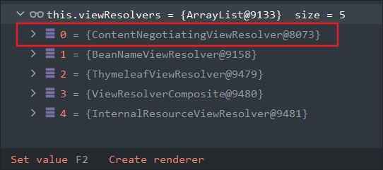

[TOC]

# 一、ServletContainerInitialize与WebApplicationInitializer

spring提供WebApplicationInitializer接口为了支持可以不使用web.xml。Java提供了ServletContainerInitialize接口，它可以通过SPI机制，当启动web容器的时候，会自动到添加的相应jar包下找到META-INF/services下以ServletContainerInitializer的全路径名称命名的文件，它的内容为ServletContainerInitializer实现类的全路径：（`org.springframework.web.SpringServletContainerInitializer`），将它们实例化。

> 

```java
@HandlesTypes(WebApplicationInitializer.class)
public class SpringServletContainerInitializer implements ServletContainerInitializer {
	@Override
	public void onStartup(@Nullable Set<Class<?>> webAppInitializerClasses, ServletContext servletContext)
			throws ServletException {

		List<WebApplicationInitializer> initializers = new LinkedList<>();

		if (webAppInitializerClasses != null) {
			for (Class<?> waiClass : webAppInitializerClasses) {
				// Be defensive: Some servlet containers provide us with invalid classes,
				// no matter what @HandlesTypes says...
				if (!waiClass.isInterface() && !Modifier.isAbstract(waiClass.getModifiers()) &&
						WebApplicationInitializer.class.isAssignableFrom(waiClass)) {
					try {
						initializers.add((WebApplicationInitializer)
								ReflectionUtils.accessibleConstructor(waiClass).newInstance());
					}
					catch (Throwable ex) {
						throw new ServletException("Failed to instantiate WebApplicationInitializer class", ex);
					}
				}
			}
		}

		if (initializers.isEmpty()) {
			servletContext.log("No Spring WebApplicationInitializer types detected on classpath");
			return;
		}

		servletContext.log(initializers.size() + " Spring WebApplicationInitializers detected on classpath");
		AnnotationAwareOrderComparator.sort(initializers);
		for (WebApplicationInitializer initializer : initializers) {
			initializer.onStartup(servletContext);
		}
	}

} 
```

流程：

- Tomcat启动会使用spi机制调用所有实现ServletContainerInitializer接口的实现类。
- ServletContainerInitializer的实现类通过@HandlesTypes注解进行扩展；
- Tomcat启动时会通过加载被@HandlesTypes注解的类，并读取@HandlesTypes注解的value值，将读取出来的值作为参数传给ServletContainerInitializer实现类的onStartup ()方法；
- Tomcat内部启动时调用 javax.servlet.ServletContainerInitializer的onStartup()方法，这个onStartup()方法的第一个参数就是@HandlesTypes注解的value 值指定的类的集合；
- 然后我们只需要在项目中写一个类实现org.springframework.web.WebApplicationInitializer接口，然后通过覆盖该接口里面的方法将我们的配置类告诉SpringMVC，即可完成对SpringMVC在Tomcat启动初始化过程中进行扩展，后续SpringMVC启动时就知道我们配置了什么信息，这就相当于把原来在web.xml里面做的工作移到了我们的配置类里面来完成，所以就可以废除web.xml文件；
  - SpringServletContainerInitializer会处理类型为WebApplicationInitializer的实现类。
  - 会将所有的实现了WebApplicationInitializer接口的类的class处理放入进。
  - 筛选出  `不是接口的以及抽象类` 的类创建对象。
  - 调用它的onStartup方法。

## - DispatcherServlet

```java
/**
 * DispatcherServlet 初始化
 */
public class DispatcherServletInitializer extends AbstractAnnotationConfigDispatcherServletInitializer {

    @Override
    public Class<?>[] getRootConfigClasses() {
        return new Class<?>[] {RootConfig.class};
    }

    @Override
    public Class<?>[] getServletConfigClasses() {
        return new Class<?>[] {WebServletConfig.class};
    }

    @Override
    public String[] getServletMappings() {
        return new String[] {"/"};
    }
}
```

## - WebServletConfig

```java

@Configuration
@EnableWebMvc
@ComponentScan("com.bjpowernode.controller")
public class WebServletConfig {

    //视图解析的bean
    @Bean
    public ViewResolver viewResolver() {
        InternalResourceViewResolver viewResolver = new InternalResourceViewResolver();
        viewResolver.setPrefix("/");
        viewResolver.setSuffix(".jsp");
        return viewResolver;
    }
}
```

## - RootConfig

```java
@Configuration
@ComponentScan(basePackages = "com.bjpowernode")
public class RootConfig {

}
```

## - TEST

```java
/**
 * 通过tomcat启动Spring MVC程序
 *
 */
public class Test {

    /**
	 * 项目启动的入口main方法
	 *
	 * @param args
	 * @throws Exception
	 */
    public static void main(String[] args) throws Exception {
        start();
    }

    /**
	 * 启动tomcat
	 *
	 * @throws Exception
	 */
    public static void start() throws Exception {

        // 创建内嵌的Tomcat
        Tomcat tomcatServer = new Tomcat();

        // 设置Tomcat端口
        tomcatServer.setPort(8080);

        // 读取项目路径，加载项目资源
        StandardContext ctx = (StandardContext) tomcatServer.addWebapp("/spring-z-mvc-2",
                                                                       new File("spring-z-mvc-2/src/main/webapp").getAbsolutePath());

        // 不重新部署加载资源
        ctx.setReloadable(false);

        // 创建WebRoot
        WebResourceRoot resources = new StandardRoot(ctx);

        // 指定编译后的class文件位置
        File additionWebInfClasses = new File("out/production/classes");

        // 添加web资源
        resources.addPreResources(new DirResourceSet(resources, "/",
                                                     additionWebInfClasses.getAbsolutePath(), "/"));

        // 启动内嵌的Tomcat
        tomcatServer.start();

        // 等待前端请求，不退出程序
        tomcatServer.getServer().await();
    }

```

## - TomCat调用：

```java
StandardContext.startInternal方法：
//ServletContainerInitializer
    for (Map.Entry<ServletContainerInitializer, Set<Class<?>>> entry :
         initializers.entrySet()) {
        try {
            entry.getKey().onStartup(entry.getValue(),
                                     getServletContext());
        } catch (ServletException e) {
            log.error(sm.getString("standardContext.sciFail"), e);
            ok = false;
            break;
        }
    }

//配置并调用应用程序事件监听器（父容器刷新）
if (ok) {
    if (!listenerStart()) {
        log.error(sm.getString("standardContext.listenerFail"));
        ok = false;
    }
}
```


# 二、onStartup()

```java
@Override
public void onStartup(ServletContext servletContext) throws ServletException {
    //调用父类的方法，创建一个spring父容器
    super.onStartup(servletContext);
    //注册DispatcherServlet(xml中的中央调度器的配置)
    registerDispatcherServlet(servletContext);
}
```

## 1、 super.onStartup(servletContext);

```java
public void onStartup(ServletContext servletContext) throws ServletException {
    //注册ContextLoaderListener
    /**
	* <context-param>
	*     <param-name>contextConfigLocation</param-name>
	*     <param-value>classpath:conf/applicationContext.xml</param-value>
	*   </context-param>
	*   <listener>
	*     <listener-class>org.springframework.web.context.ContextLoaderListener</listener-class>
	*   </listener>
	*/
    registerContextLoaderListener(servletContext);
}
```

```java
protected void registerContextLoaderListener(ServletContext servletContext) {
    //获取根配置类：spring配置类（包扫描器）
    WebApplicationContext rootAppContext = createRootApplicationContext();
    if (rootAppContext != null) {
        //注册监听器的servlet上下文
        ContextLoaderListener listener = new ContextLoaderListener(rootAppContext);
        listener.setContextInitializers(getRootApplicationContextInitializers());
        //把监听器添加到servlet的上下文中
        servletContext.addListener(listener);
    }
    else {
        logger.debug("No ContextLoaderListener registered, as " +
                     "createRootApplicationContext() did not return an application context");
    }
}
```

### -  解析spring配置类进行包扫描

把配置类RootConfig.class放在AnnotationConfigWebApplicationContext的annotatedClasses集合中；

```java
@Configuration
@ComponentScan(basePackages = "com.bjpowernode")
public class RootConfig {
}
```

```java
 WebApplicationContext rootAppContext = createRootApplicationContext();
```

```java
@Nullable
protected WebApplicationContext createRootApplicationContext() {
    //获取配置类RootConfig
    Class<?>[] configClasses = getRootConfigClasses();
    if (!ObjectUtils.isEmpty(configClasses)) {
        //springIOC,创建一个父容器
        AnnotationConfigWebApplicationContext context = new AnnotationConfigWebApplicationContext();
        context.register(configClasses);
        return context;
    }
    else {
        return null;
    }
}
```

### - 注册spring的监听器

创建ContextLoaderListener监听器对象，把AnnotationConfigWebApplicationContext（Spring父容器）赋给ContextLoaderListener的context

相当于xml中

```xml
 <!--注册spring的监听器-->
<context-param>
    <param-name>contextConfigLocation</param-name>
    <param-value>classpath:conf/applicationContext.xml</param-value>
</context-param>
<listener>
    <listener-class>org.springframework.web.context.ContextLoaderListener</listener-class>
</listener>
```

```java
ContextLoaderListener listener = new ContextLoaderListener(rootAppContext);
listener.setContextInitializers(getRootApplicationContextInitializers());
//把监听器添加到servlet的上下文中
servletContext.addListener(listener);
```

## 2、注册DispatcherServlet
    【registerDispatcherServlet(servletContext);】

```xml
<servlet>
    <servlet-name>myweb</servlet-name>
    <servlet-class>org.springframework.web.servlet.DispatcherServlet</servlet-class>
    <init-param>
        <param-name>contextConfigLocation</param-name>
        <param-value>classpath:conf/dispatcherServlet.xml</param-value>
    </init-param>
    <load-on-startup>1</load-on-startup>
</servlet>
<servlet-mapping>
    <servlet-name>myweb</servlet-name>
    <url-pattern>*.do</url-pattern>
</servlet-mapping>
```

```java
protected void registerDispatcherServlet(ServletContext servletContext) {
    	// DEFAULT_SERVLET_NAME = "dispatcher";
		String servletName = getServletName();
		Assert.hasLength(servletName, "getServletName() must not return null or empty");
    
		//创建springMVC的子容器（web容器）
		WebApplicationContext servletAppContext = createServletApplicationContext();
		Assert.notNull(servletAppContext, "createServletApplicationContext() must not return null");
    
		// 创建Dispatcher Servlet ,将创建的web容器放入到dispatcherServlet
		FrameworkServlet dispatcherServlet = createDispatcherServlet(servletAppContext);
		Assert.notNull(dispatcherServlet, "createDispatcherServlet(WebApplicationContext) must not return null");
		dispatcherServlet.setContextInitializers(getServletApplicationContextInitializers());

    	//把创建的DispatcherServlet加入到servletContext上下文中
		ServletRegistration.Dynamic registration = servletContext.addServlet(servletName, dispatcherServlet);
		if (registration == null) {
			throw new IllegalStateException("Failed to register servlet with name '" + servletName + "'. " +
					"Check if there is another servlet registered under the same name.");
		}
		//并设置servlet优先级为1，
		registration.setLoadOnStartup(1);
    	//并且添加servlet的mapping映射为斜杠/
		registration.addMapping(getServletMappings());
    	//设置异步支持
		registration.setAsyncSupported(isAsyncSupported());

		Filter[] filters = getServletFilters();
		if (!ObjectUtils.isEmpty(filters)) {
			for (Filter filter : filters) {
				registerServletFilter(servletContext, filter);
			}
		}

		customizeRegistration(registration);
	}

```

### - 创建springMVC的子容器（web容器）		

```java
WebApplicationContext servletAppContext = createServletApplicationContext();
```

```java
protected WebApplicationContext createServletApplicationContext() {
    AnnotationConfigWebApplicationContext context = new AnnotationConfigWebApplicationContext();
    //mvc的配置类
    Class<?>[] configClasses = getServletConfigClasses();
    if (!ObjectUtils.isEmpty(configClasses)) {
        context.register(configClasses);
    }
    return context;
}
```

### - 创建Dispatcher Servlet ,将创建的web容器放入到dispatcherServlet

```java
FrameworkServlet dispatcherServlet = createDispatcherServlet(servletAppContext);
```

```java
protected FrameworkServlet createDispatcherServlet(WebApplicationContext servletAppContext) {
    return new DispatcherServlet(servletAppContext);
}
```

### - 把创建的DispatcherServlet加入到servletContext上下文中并设置servlet优先级为1，并且添加servlet的mapping映射为斜杠  /

```java
//把创建的DispatcherServlet加入到servletContext上下文中
ServletRegistration.Dynamic registration = servletContext.addServlet(servletName, dispatcherServlet);
//并设置servlet优先级为1，并且添加servlet的mapping映射为斜杠/
registration.setLoadOnStartup(1);
registration.addMapping(getServletMappings());
registration.setAsyncSupported(isAsyncSupported());
```

# 三、调用监听器初始化父容器

在 `“二->1->注册监听器”` 并将父容器放入到监听器中

```java
// ContextLoaderListener extends ContextLoader implements ServletContextListener ：
public void contextInitialized(ServletContextEvent event) {
    //TODO 初始化 父容器
    initWebApplicationContext(event.getServletContext());
}
```

### - 初始化父容器

initWebApplicationContext(event.getServletContext());

```java
public void contextInitialized(ServletContextEvent event) {
    //TODO 初始化 父容器
    initWebApplicationContext(event.getServletContext());
}

public WebApplicationContext initWebApplicationContext(ServletContext servletContext) {
    long startTime = System.currentTimeMillis();
    try {
       
        if (this.context == null) {
            this.context = createWebApplicationContext(servletContext);
        }
        if (this.context instanceof ConfigurableWebApplicationContext) {
            ConfigurableWebApplicationContext cwac = (ConfigurableWebApplicationContext) this.context;
            if (!cwac.isActive()) {
                // The context has not yet been refreshed -> provide services such as
                // setting the parent context, setting the application context id, etc
                if (cwac.getParent() == null) {
                    // The context instance was injected without an explicit parent ->
                    // determine parent for root web application context, if any.
                    ApplicationContext parent = loadParentContext(servletContext);
                    cwac.setParent(parent);
                }

                //TODO 配置和刷新WebApplicationContext(cwac :WebApplicationContext )
                configureAndRefreshWebApplicationContext(cwac, servletContext);
            }
        }
       
        return this.context;
    }

}
```

```java
protected void configureAndRefreshWebApplicationContext(ConfigurableWebApplicationContext wac, ServletContext sc) {
    if (ObjectUtils.identityToString(wac).equals(wac.getId())) {
        // The application context id is still set to its original default value
        // -> assign a more useful id based on available information
        String idParam = sc.getInitParameter(CONTEXT_ID_PARAM);
        if (idParam != null) {
            wac.setId(idParam);
        }
        else {
            // Generate default id...
            wac.setId(ConfigurableWebApplicationContext.APPLICATION_CONTEXT_ID_PREFIX +
                      ObjectUtils.getDisplayString(sc.getContextPath()));
        }
    }

    wac.setServletContext(sc); 
    //兼容xml的配置 需要读取web.xml中的contextConfigLocation
    String configLocationParam = sc.getInitParameter(CONFIG_LOCATION_PARAM);
    if (configLocationParam != null) {
        wac.setConfigLocation(configLocationParam);
    }

    // The wac environment's #initPropertySources will be called in any case when the context
    // is refreshed; do it eagerly here to ensure servlet property sources are in place for
    // use in any post-processing or initialization that occurs below prior to #refresh
    ConfigurableEnvironment env = wac.getEnvironment();
    if (env instanceof ConfigurableWebEnvironment) {
        ((ConfigurableWebEnvironment) env).initPropertySources(sc, null);
    }

    customizeContext(sc, wac);
    //TODO 刷新和创建spring容器
    wac.refresh();
}

```

- springIOC 刷新容器12步骤

```java
//"classpath*:com/bjpowernode/**/*.class"
String packageSearchPath = ResourcePatternResolver.CLASSPATH_ALL_URL_PREFIX +
					resolveBasePackage(basePackage) + '/' + this.resourcePattern;
Resource[] resources = getResourcePatternResolver().getResources(packageSearchPath);
```

### - @ComponentScan包扫描

`Set<BeanDefinitionHolder> scannedBeanDefinitions =
      this.componentScanParser.parse(componentScan, sourceClass.getMetadata().getClassName());`

```java
//根据包路径，扫描所有.class文件
     //"classpath*:com/bjpowernode/**/*.class"
    String packageSearchPath = ResourcePatternResolver.CLASSPATH_ALL_URL_PREFIX +resolveBasePackage(basePackage) + '/' + 										this.resourcePattern;

//根据包路径，生成.class对应的Resource对象
		Resource[] resources = getResourcePatternResolver().getResources(packageSearchPath);

//通过ASM获取class元数据，并封装在MetadataReader元数据读取器中
        MetadataReader metadataReader = getMetadataReaderFactory().getMetadataReader(resource);

//判断该类是否符合过滤规则   isCandidateComponent(metadataReader)
	//@CompoentScan的过滤规则支持5种 （注解、类、正则、aop、自定义）
	protected boolean isCandidateComponent(MetadataReader metadataReader) throws IOException {
		//如果读取的类的注解在排除注解过滤规则中，返回false
		for (TypeFilter tf : this.excludeFilters) {
			if (tf.match(metadataReader, getMetadataReaderFactory())) {
				return false;
			}
		}
		//如果读取的类的注解在包含的注解的过滤规则中，则返回ture
		for (TypeFilter tf : this.includeFilters) {
			//判断当前类的注解是否match规则
			if (tf.match(metadataReader, getMetadataReaderFactory())) {
				//是否有@Conditional注解，进行相关处理
				return isConditionMatch(metadataReader);
			}
		}
		//如果读取的类的注解既不在排除规则，也不在包含规则中，则返回false
		return false;
	}

//判断该类是否为独立的类、具体的类(这个方法的作用是，判断该类是否为顶层的类（没有父类或静态内部类）    具体的类（不是抽象类或接口）)
	protected boolean isCandidateComponent(AnnotatedBeanDefinition beanDefinition) {
		AnnotationMetadata metadata = beanDefinition.getMetadata();
		return (metadata.isIndependent() && (metadata.isConcrete() ||
				(metadata.isAbstract() && metadata.hasAnnotatedMethods(Lookup.class.getName()))));
	}

//加入到集合中
```

```java
public boolean match(MetadataReader metadataReader, MetadataReaderFactory metadataReaderFactory)
    throws IOException {

    // This method optimizes avoiding unnecessary creation of ClassReaders
    // as well as visiting over those readers.
    //检查当前类的注解是否符合规律规则
    if (matchSelf(metadataReader)) {
        return true;
    }
    //check 类名是否符合规则
    ClassMetadata metadata = metadataReader.getClassMetadata();
    if (matchClassName(metadata.getClassName())) {
        return true;
    }

    //如果有继承父类
    if (this.considerInherited) {
        String superClassName = metadata.getSuperClassName();
        if (superClassName != null) {
            // Optimization to avoid creating ClassReader for super class.
            Boolean superClassMatch = matchSuperClass(superClassName);
            if (superClassMatch != null) {
                if (superClassMatch.booleanValue()) {
                    return true;
                }
            }
            else {
                // Need to read super class to determine a match...
                try {
                    if (match(metadata.getSuperClassName(), metadataReaderFactory)) {
                        return true;
                    }
                }
                catch (IOException ex) {
                    logger.debug("Could not read super class [" + metadata.getSuperClassName() +
                                 "] of type-filtered class [" + metadata.getClassName() + "]");
                }
            }
        }
    }

    //如果有实现接口
    if (this.considerInterfaces) {
        for (String ifc : metadata.getInterfaceNames()) {
            // Optimization to avoid creating ClassReader for super class
            Boolean interfaceMatch = matchInterface(ifc);
            if (interfaceMatch != null) {
                if (interfaceMatch.booleanValue()) {
                    return true;
                }
            }
            else {
                // Need to read interface to determine a match...
                try {
                    if (match(ifc, metadataReaderFactory)) {
                        return true;
                    }
                }
                catch (IOException ex) {
                    logger.debug("Could not read interface [" + ifc + "] for type-filtered class [" +
                                 metadata.getClassName() + "]");
                }
            }
        }
    }

    return false;
}

```

```java
//而spring通过metadata.hasMetaAnnotation()方法获取到这些注解包含@Component，所以都可以扫描到
protected boolean matchSelf(MetadataReader metadataReader) {
    //获取注解元数据
    AnnotationMetadata metadata = metadataReader.getAnnotationMetadata();
    //check 注解及其派生注解中是否包含@Component
    //获取当前类的注解 metadata.hasAnnotation    @Controller
    //获取当前类的注解及其派生注解 metadata.hasAnnotation   @Controller包含的@Component\@Documented等等
    return metadata.hasAnnotation(this.annotationType.getName()) ||
        (this.considerMetaAnnotations && metadata.hasMetaAnnotation(this.annotationType.getName()));
}
```

# 四、DispatchServlet的init方法创建子容器

- 加载执行DispatchServlet的init方法，DispatchServlet没有init方法，执行父类HttpServletBean的init方法
- 执行FrameworkServlet的initServletBean()方法初始化WebApplicationContext容器（spring子容器），里面又是走spring ioc的12个步骤；
- 两个容器里面的对象是重复的，但是两个容器里面的每个单例对象不是同一个对象，不equals()，子容器里面有一个父容器parentBeanFactory，如果一个bean在子容器里面拿不到，那么就会去父容器获取，如果都获取不到，那就报错；
- 在实际开发中，也可以只配置一个容器，这样项目启动会更快，占用更少内存；
- 由于DispatchServlet设置了优先级，因此项目启动会调用init

```java
//initServletBean
this.webApplicationContext = initWebApplicationContext();
```

```java
protected WebApplicationContext initWebApplicationContext() {
     //父容器
    WebApplicationContext rootContext =  WebApplicationContextUtils.getWebApplicationContext(getServletContext()); 
    WebApplicationContext wac = null;

    if (this.webApplicationContext != null) {
        // A context instance was injected at construction time -> use it
        //子容器(注册DispatcherServlet 时放入)
        wac = this.webApplicationContext; 
        if (wac instanceof ConfigurableWebApplicationContext) {
            ConfigurableWebApplicationContext cwac = (ConfigurableWebApplicationContext) wac;
            if (!cwac.isActive()) {
                // The context has not yet been refreshed -> provide services such as
                // setting the parent context, setting the application context id, etc
                if (cwac.getParent() == null) {
                    // The context instance was injected without an explicit parent -> set
                    // the root application context (if any; may be null) as the parent
                    //将父容器放入
                    cwac.setParent(rootContext); 
                } 
                //配置和刷新容器
                configureAndRefreshWebApplicationContext(cwac);
            }
        }
    }
   .......
    return wac;
}
```

```java
protected void configureAndRefreshWebApplicationContext(ConfigurableWebApplicationContext wac) {
    if (ObjectUtils.identityToString(wac).equals(wac.getId())) {
        // The application context id is still set to its original default value
        // -> assign a more useful id based on available information
        if (this.contextId != null) {
            wac.setId(this.contextId);
        }
        else {
            // Generate default id...
            wac.setId(ConfigurableWebApplicationContext.APPLICATION_CONTEXT_ID_PREFIX +
                      ObjectUtils.getDisplayString(getServletContext().getContextPath()) + '/' + getServletName());
        }
    }

    wac.setServletContext(getServletContext());
    wac.setServletConfig(getServletConfig());
    wac.setNamespace(getNamespace());
    wac.addApplicationListener(new SourceFilteringListener(wac, new ContextRefreshListener()));

    // The wac environment's #initPropertySources will be called in any case when the context
    // is refreshed; do it eagerly here to ensure servlet property sources are in place for
    // use in any post-processing or initialization that occurs below prior to #refresh
    ConfigurableEnvironment env = wac.getEnvironment();
    if (env instanceof ConfigurableWebEnvironment) {
        ((ConfigurableWebEnvironment) env).initPropertySources(getServletContext(), getServletConfig());
    }

    postProcessWebApplicationContext(wac);
    applyInitializers(wac);
    wac.refresh();
}
```

### - 属性赋值完成后调用初始化方法 对HandlerMathod

### - HandlerMapping注册 


- **requestMappingHandlerMapping** ：（Bean）的初始化
- 父类：AbstractHandlerMethodMapping.java
- 映射关系 （请求路径、方法）主要在 RequestMappingInfo类中
- 判断是不是含有Controller.class ||  RequestMapping.class 进行候选者筛选会寻找method上的注解@RequestMapping


```java
protected void initHandlerMethods() {
    //获取容器中所有beanName
	for (String beanName : getCandidateBeanNames()) {
		if (!beanName.startsWith(SCOPED_TARGET_NAME_PREFIX)) {
			processCandidateBean(beanName);
		}
	}
	handlerMethodsInitialized(getHandlerMethods());
}
```

```java
protected void processCandidateBean(String beanName) {
    Class<?> beanType = null;
    try {
        beanType = obtainApplicationContext().getType(beanName);
    }
    catch (Throwable ex) {
        // An unresolvable bean type, probably from a lazy bean - let's ignore it.
        if (logger.isTraceEnabled()) {
            logger.trace("Could not resolve type for bean '" + beanName + "'", ex);
        }
    }
    if (beanType != null && isHandler(beanType)) {
        detectHandlerMethods(beanName);
    }
}
//isHandler判断是不是含有Controller.class ||  RequestMapping.class
//detectHandlerMethods:
protected void processCandidateBean(String beanName) {
		Class<?> beanType = null;
		//获取当前bean类型
		beanType = obtainApplicationContext().getType(beanName);
	    ..
	    //默认AbstractHandlerMethodMapping是不提供对处理器的识别的,具体如何识别某个bean是不是handler,是由子类决定的
	    //这里是AbstractHandlerMethodMapping实现的,筛选规则如下:
	    //检验当前bean上是否存在Controller或者RequestMapping注解
		if (beanType != null && isHandler(beanType)) {
		    //如果当前bean是一个handler,那么需要探测出该handler内部所有handlerMethod实现
			detectHandlerMethods(beanName);
		}
	}
```

```java
protected void detectHandlerMethods(Object handler) {
		//先获取到当前handler的type
		Class<?> handlerType = (handler instanceof String ?
				obtainApplicationContext().getType((String) handler) : handler.getClass());

		if (handlerType != null) {
			//如果当前handler是被cglib代理过的对象,那么需要获取当前代理对象的superClass
			//因为这才是目标handler的类型
			Class<?> userType = ClassUtils.getUserClass(handlerType);
			//MethodIntrospector类主要提供对方法的筛选和通用处理封装
			//这里selectMethods就是筛选出当前handler内部所有符合要求的handlerMethod
			Map<Method, T> methods = MethodIntrospector.selectMethods(userType,
					//筛选出某个handlerMethod，利用注册的回调接口生成映射关系
					(MethodIntrospector.MetadataLookup<T>) method -> {
						try {
							return getMappingForMethod(method, userType);
						}
						catch (Throwable ex) {
							throw new IllegalStateException("Invalid mapping on handler class [" +
									userType.getName() + "]: " + method, ex);
						}
					});
			if (logger.isTraceEnabled()) {
				logger.trace(formatMappings(userType, methods));
			}
			methods.forEach((method, mapping) -> {
				//对jdk动态代理的情况进行处理--一般情况下可以忽略,因此controller层一般都是采用cglib代理
				Method invocableMethod = AopUtils.selectInvocableMethod(method, userType);
				//注册
				registerHandlerMethod(handler, invocableMethod, mapping);
			});
		}
	}

```

#### · 1、筛选出当前handler内部所有符合要求的handlerMethod

- controller一个method 一个handlerMethod

- getMappingForMethod(method, userType);

- RequestMappingInfod创建

- MethodIntrospector.selectMethods作用可以简单看做是遍历handler类内部所有方法，包括其父类和实现接口里面的所有方法，然后交给注册进来的回调接口进行处理，回调接口的返回值作为生成的映射信息，如果返回值不为空，就和当前method组成一条记录，放入map中； 遍历完所有方法后，返回该map集合。

- selectMethods完成方法筛选的关键就在于目标方法经过回调接口处理过后，返回值是否为空，如果为空，说明当前方法需要被过滤掉

  所以，上面注册的回调接口中的getMappingForMethod方法才是我们需要关注的重点，该方法完成了对当前method信息的提取，最终组装返回一个请求映射信息。

  和上面识别handler一样，具体是如何完成对method解析的过程，也是由RequestMappingHandlerMapping子类实现的。

```java
protected RequestMappingInfo getMappingForMethod(Method method, Class<?> handlerType) {
	//根据当前方法,创建一个请求映射信息
    RequestMappingInfo info = createRequestMappingInfo(method);
    //如果当前方法并没有标注@RequestMapping等注解,那么也就不是一个handlerMethod，那么就返回null
    //该方法就会在selectMethods中被过滤掉
    if (info != null) {
        //当前handlerMethod属于的handler上是否也存在@RequestMapping注解,如果存在就解析
        RequestMappingInfo typeInfo = createRequestMappingInfo(handlerType);
        if (typeInfo != null) {
            //如果handler上确实存在,那么就需要将方法上的@RequestMapping注解和类上的@RequestMapping注解注解进行合并
            info = typeInfo.combine(info);
        }
        //前缀（类上的uri与方法上的uri合并得到访问路径）
        String prefix = getPathPrefix(handlerType);
        if (prefix != null) {
            info = RequestMappingInfo.paths(prefix).options(this.config).build().combine(info);
        }
    }
    return info;
}
```

- 创建一个请求映射信息

- createRequestMappingInfo方法会对传入的AnnotatedElement上的RequestMapping注解进行解析，然后生成RequestMappingInfo返回。

  AnnotatedElement是JDK反射包提供的顶层接口，实现了该接口的元素，都是可以标注注解的元素，例如: Class，Method,Parameter等都实现了该接口

```java
private RequestMappingInfo createRequestMappingInfo(AnnotatedElement element) {
    //拿到当前元素上的注解信息
    RequestMapping requestMapping = AnnotatedElementUtils.findMergedAnnotation(element, RequestMapping.class);
    //用户可以实现相关方法来创建自定义的请求匹配条件
    RequestCondition<?> condition = (element instanceof Class ?
                                     getCustomTypeCondition((Class<?>) element) : getCustomMethodCondition((Method) element));
    return (requestMapping != null ?
            //如果存在注解,就创建对应的RequestMappingInfo
            createRequestMappingInfo(requestMapping, condition) : null);
}
```

- RequestMappingInfo可以看出，就是@RequestMapping注解对应信息的实体载体。

```java
protected RequestMappingInfo createRequestMappingInfo(
    RequestMapping requestMapping, @Nullable RequestCondition<?> customCondition) {

    RequestMappingInfo.Builder builder = RequestMappingInfo
        //requestMapping注解中的path属性会经过EL解析器解析,也就是我们在路径中可以通过el表达式获取上下文中的值
        //例如: ${user.dir}
        .paths(resolveEmbeddedValuesInPatterns(requestMapping.path()))
        //通过请求访问限制匹配
        .methods(requestMapping.method())
        //通过请求参数中必须携带某个请求参数进行限制匹配
        .params(requestMapping.params())
        //通过请求头中必须携带某个请求头进行限制匹配
        .headers(requestMapping.headers())
        //通过限制请求头中的content-type来进行限制匹配
        .consumes(requestMapping.consumes())
        //规定响应的content-type类型
        .produces(requestMapping.produces())
        .mappingName(requestMapping.name());
    //是否存在用户自定义匹配限制	
    if (customCondition != null) {
        builder.customCondition(customCondition);
    }
    //构建RequestMappingInfo后返回
    return builder.options(this.config).build();
}
```

#### · 2、注册

1. registerHandlerMethod(handler, invocableMethod, mapping);
2. MethodIntrospector.selectMethods通过getMappingForMethod回调接口筛选出相关方法，并且建立好Method和对应RequestMappingInfo 映射关系后，返回了一个map集合，下面就是需要将这些映射关系进行注册。
3. 子类RequestMappingHandlerMapping重写了父类的registerHandlerMethod方法，主要提供了对ConsumesCondition扩展点的支持:

```java
@Override
protected void registerHandlerMethod(Object handler, Method method, RequestMappingInfo mapping) {
    super.registerHandlerMethod(handler, method, mapping);
    updateConsumesCondition(mapping, method);
}
```

```java
protected void registerHandlerMethod(Object handler, Method method, T mapping) {
    this.mappingRegistry.register(mapping, handler, method);
}
```

在类创建过程中new对象

MappingRegistry是AbstractHandlerMethodMapping内部维护的一个映射关系的注册中心:

```java
class MappingRegistry {
	//保存RequestMappingInfo和MappingRegistration的映射关系
		private final Map<T, MappingRegistration<T>> registry = new HashMap<>();
		//p判断是否已经含有HandlerMethod
		private final Map<T, HandlerMethod> mappingLookup = new LinkedHashMap<>();
		//保存请求路径和RequestMappingInfo的映射关系
		private final MultiValueMap<String, T> urlLookup = new LinkedMultiValueMap<>();
		//保存handlerMethodName和handlerMethod的映射关系
		private final Map<String, List<HandlerMethod>> nameLookup = new ConcurrentHashMap<>();
		//保存handlerMethod和跨域配置的映射关系
		private final Map<HandlerMethod, CorsConfiguration> corsLookup = new ConcurrentHashMap<>();
		//读写锁
		private final ReentrantReadWriteLock readWriteLock = new ReentrantReadWriteLock();
····
```

```java
//mapping就是handlerMethod对应的RequestMappingInfo
//然后是handler(controller类名 beanName )和handlerMethod method方法
//ps:这里的handlerMethod指的是handler中的处理请求方法
public void register(T mapping, Object handler, Method method) {
    //锁
    this.readWriteLock.writeLock().lock();
    try {
        //对原生处理请求方法进行了一层封装,包装为了一个HandlerMethod
        HandlerMethod handlerMethod = createHandlerMethod(handler, method);
        //进行映射校验,判断是否存在模糊映射,即一个请求URL可以同时被多个handlerMethod处理
        //查询mappingLookup中是否含有
        validateMethodMapping(handlerMethod, mapping);
        //Map 将封装的HandlerMethod放入mappingLookup用于校验
        this.mappingLookup.put(mapping, handlerMethod);
        //从RequestMappingInfo中获取当前handlerMethod能够处理的请求URL集合
        //list大小为1（路径名）
        List<String> directUrls = getDirectUrls(mapping);
        //将请求路径和RequestMappingInfo的映射关系添加到pathLookUp集合中保存
        // urlLookup == new LinkedHashMap<>();
        for (String url : directUrls) {
            this.urlLookup.add(url, mapping);
        }
        // 为HandlerMethod的映射分配名称
        // 默认采用：RequestMappingInfoHandlerMethodMappingNamingStrategy 策略来分配名称
        // 策略为：@RequestMapping指定了name属性，那就以指定的为准  否则策略为：取出Controller所有的`大写字母` + # + method.getName()
        // 如：AppoloController#match方法  最终的name为：AC#match
        //UIC#userInfo
        String name = null;
        if (getNamingStrategy() != null) {
            name = getNamingStrategy().getName(handlerMethod, mapping);
            addMappingName(name, handlerMethod);
        }
        //处理方法上的CrossOrigin跨域注解
        CorsConfiguration corsConfig = initCorsConfiguration(handler, method, mapping);
        if (corsConfig != null) {
            this.corsLookup.put(handlerMethod, corsConfig);
        }
        //注册---这里是RequestMappingInfo和封装后的MappingRegistration的映射 (map)
        this.registry.put(mapping, new MappingRegistration<>(mapping, handlerMethod, directUrls, name));
    }
    finally {
        //释放锁
        this.readWriteLock.writeLock().unlock();
    }

```

 `HandlerMethod handlerMethod = createHandlerMethod(handler, method);`

将beanFactory放入

```java
protected HandlerMethod createHandlerMethod(Object handler, Method method) {
    if (handler instanceof String) {
        return new HandlerMethod((String) handler,
                                 obtainApplicationContext().getAutowireCapableBeanFactory(), method);
    }
    return new HandlerMethod(handler, method);
}

```

validateMethodMapping

```java
private void validateMethodMapping(HandlerMethod handlerMethod, T mapping) {
    // Assert that the supplied mapping is unique.
    HandlerMethod existingHandlerMethod = this.mappingLookup.get(mapping);
    if (existingHandlerMethod != null && !existingHandlerMethod.equals(handlerMethod)) {
        throw new IllegalStateException(
            "Ambiguous mapping. Cannot map '" + handlerMethod.getBean() + "' method \n" +
            handlerMethod + "\nto " + mapping + ": There is already '" +
            existingHandlerMethod.getBean() + "' bean method\n" + existingHandlerMethod + " mapped.");
    }
}

```


### - 初始化九大组件

在容器刷新第12部，初始化 **DispatcherServlet** 中的 **initStrategies**

```java
protected void initStrategies(ApplicationContext context) {
    //多文件上传组件
    initMultipartResolver(context);
    //多语言支持组建
    initLocaleResolver(context);
    //主体模板处理组件
    initThemeResolver(context);
    //URL映射组件（处理器映射器）
    initHandlerMappings(context);
    //处理器适配器
    initHandlerAdapters(context);
    //异常处理组件
    initHandlerExceptionResolvers(context);
    //视图名称提取组件
    initRequestToViewNameTranslator(context);
    //视图渲染组件
    initViewResolvers(context);
    //闪存管理组件
    initFlashMapManager(context);
}

```

文档  ： https://www.51cto.com/article/719889.html

# 五、Spring MVC 请求处理

1. 请求入口是servlet规范中Servlet接口的service()方法；
2. 子类HttpServlet实现GenericServlet这个servlet的service()方法，根据请求类型转换成doGet,doPost,doPut,dDelete方法去执行；
3. Spring mvc写了一个DispatcherServlet以及其父servlet实现了doGet、doPost....等方法，那么此时就相当于一个页面的请求会首先转发到DispatcherServlet或者其父servlet中其中的某一个方法去执行，通过断点跟踪我们发现是进入了FrameworkServlet的doGet()方法；
4. FrameworkServlet的doGet()方法 -->调用 processRequest(request, response); -->再调用doService(request, response); -->调用doDispatch(request, response); 该方法里面有三个核心步骤；

- 4.1. 确定当前请求的HandlerExecutionChain执行链（也就是controller及其执行方法，是一个请求方法映射对象），也就是拿到controller的信息
- 4.2 获取到一个handler的适配器对象；（其实也没有做什么，就是一个适配器对象）
- 4.3 通过handler的适配器对象调用controller的方法执行请求处理，里面主要是反射调用controller的方法；
- 4.4 渲染视图进行请求跳转；

以上代码在我们的spring中文注释版的源码中都标注了蓝色字体，可以课后多加阅读，提高源码阅读能力；

**DispatcherServlet**：

```java
@Override
protected void doService(HttpServletRequest request, HttpServletResponse response) throws Exception {
    //记录请求日志
    logRequest(request);

    // Keep a snapshot of the request attributes in case of an include,
    // to be able to restore the original attributes after the include.
    Map<String, Object> attributesSnapshot = null;

    //incluede请求，比如<jsp:incluede page="xxx.jsp"/>，RequestDispatch.include()方法。
    if (WebUtils.isIncludeRequest(request)) {
        attributesSnapshot = new HashMap<>();
        Enumeration<?> attrNames = request.getAttributeNames();
        while (attrNames.hasMoreElements()) {
            String attrName = (String) attrNames.nextElement();
            if (this.cleanupAfterInclude || attrName.startsWith(DEFAULT_STRATEGIES_PREFIX)) {
                attributesSnapshot.put(attrName, request.getAttribute(attrName));
            }
        }
    }

    //设置本地化或者主题的处理器，如果我们没有设置，SpringMVC会使用默认的值
    //默认配置文件是DispatcherServlet.properties
    // Make framework objects available to handlers and view objects.
    request.setAttribute(WEB_APPLICATION_CONTEXT_ATTRIBUTE, getWebApplicationContext());
    request.setAttribute(LOCALE_RESOLVER_ATTRIBUTE, this.localeResolver);
    request.setAttribute(THEME_RESOLVER_ATTRIBUTE, this.themeResolver);
    request.setAttribute(THEME_SOURCE_ATTRIBUTE, getThemeSource());

    if (this.flashMapManager != null) {
        //从session中取出重定向参数，而且在取出后会将该参数从session中移除，
        //取参的固定key是FLASH_MAPS_SESSION_ATTRIBUTE
        FlashMap inputFlashMap = this.flashMapManager.retrieveAndUpdate(request, response);
        if (inputFlashMap != null) {
            //以INPUT_FLASH_MAP_ATTRIBUTE为key作为request的属性传递，最后会被放入Model中供我们使用
            request.setAttribute(INPUT_FLASH_MAP_ATTRIBUTE, Collections.unmodifiableMap(inputFlashMap));
        }
        request.setAttribute(OUTPUT_FLASH_MAP_ATTRIBUTE, new FlashMap());
        request.setAttribute(FLASH_MAP_MANAGER_ATTRIBUTE, this.flashMapManager);
    }

    try {
        //TODO 分发请求
        doDispatch(request, response);

    } finally {
        if (!WebAsyncUtils.getAsyncManager(request).isConcurrentHandlingStarted()) {
            // Restore the original attribute snapshot, in case of an include.
            if (attributesSnapshot != null) {
                restoreAttributesAfterInclude(request, attributesSnapshot);
            }
        }
    }
}

```

## - **doDispatch**：

```java
protected void doDispatch(HttpServletRequest request, HttpServletResponse response) throws Exception {

    //请求对象
    HttpServletRequest processedRequest = request;
    HandlerExecutionChain mappedHandler = null;
    boolean multipartRequestParsed = false;

    WebAsyncManager asyncManager = WebAsyncUtils.getAsyncManager(request);

    try {
        //模型和视图
        ModelAndView mv = null;
        //异常
        Exception dispatchException = null;

        try {
            //检查是否是Multipart请求，带附件的请求
            processedRequest = checkMultipart(request);
            multipartRequestParsed = (processedRequest != request);

            // TODO 1、确定当前请求的HandlerExecutionChain执行链（也就是controller的执行方法）
            // Determine handler for the current request.
            mappedHandler = getHandler(processedRequest);

            if (mappedHandler == null) {
                //未找到handler
                noHandlerFound(processedRequest, response);
                return;
            }

            // TODO 2、确定当前请求的handler适配器  RequestMappingHandlerAdapter
            // Determine handler adapter for the current request.
            HandlerAdapter ha = getHandlerAdapter(mappedHandler.getHandler());

            // 判断自上次请求后是否有修改，没有修改直接返回响应
            // Process last-modified header, if supported by the handler.
            String method = request.getMethod();
            boolean isGet = "GET".equals(method);
            if (isGet || "HEAD".equals(method)) {
                //根据文件的最近修改时间判断是否返回304状态码，默认修改时间返回-1即不支持该缓存方式
                long lastModified = ha.getLastModified(request, mappedHandler.getHandler());
                if (new ServletWebRequest(request, response).checkNotModified(lastModified) && isGet) {
                    return;
                }
            }

            //执行拦截器preHandle方法，如果有的话，如果拦截器执行没有通过，则不再往下执行
            if (!mappedHandler.applyPreHandle(processedRequest, response)) {
                return;
            }

            // TODO 真正调用controller方法进行请求的处理
            // Actually invoke the handler.
            mv = ha.handle(processedRequest, response, mappedHandler.getHandler());

            if (asyncManager.isConcurrentHandlingStarted()) {
                return;
            }

            //翻译出完整的视图名
            applyDefaultViewName(processedRequest, mv);

            //应用拦截器的postHandle方法
            mappedHandler.applyPostHandle(processedRequest, response, mv);

        } catch (Exception ex) {
            //出现异常进行捕获
            dispatchException = ex;
        } catch (Throwable err) {
            // As of 4.3, we're processing Errors thrown from handler methods as well,
            // making them available for @ExceptionHandler methods and other scenarios.
            dispatchException = new NestedServletException("Handler dispatch failed", err);
        }

        //TODO 处理分发结果，渲染视图填充Model（dispatchException异常处理）
        processDispatchResult(processedRequest, response, mappedHandler, mv, dispatchException);

    } catch (Exception ex) {
        //如果有异常执行所有HandlerInterceptor的afterCompletion方法
        triggerAfterCompletion(processedRequest, response, mappedHandler, ex);
    } catch (Throwable err) {
        //如果有异常执行所有HandlerInterceptor的afterCompletion方法
        triggerAfterCompletion(processedRequest, response, mappedHandler,
                               new NestedServletException("Handler processing failed", err));
    } finally {
        if (asyncManager.isConcurrentHandlingStarted()) {
            // Instead of postHandle and afterCompletion
            if (mappedHandler != null) {
                //如果有异常执行所有HandlerInterceptor的afterCompletion方法
                mappedHandler.applyAfterConcurrentHandlingStarted(processedRequest, response);
            }
        } else {
            //如果请求包含文件类型的数据则进行相关清理工作
            // Clean up any resources used by a multipart request.
            if (multipartRequestParsed) {
                cleanupMultipart(processedRequest);
            }
        }
    }
	}
```


## - 1、确定当前请求的HandlerExecutionChain执行链

（也就是controller的执行方法）
  `mappedHandler = getHandler(processedRequest);`

**RequestMappingHandlerMapping**  —> 实现类  **AbstractHandlerMethodMapping **进行处理

```java
protected HandlerExecutionChain getHandler(HttpServletRequest request) throws Exception {
    //handlerMappings是在启动的时候预先注册好的，在 initStrategies()方法中初始化
    if (this.handlerMappings != null) {
        for (HandlerMapping mapping : this.handlerMappings) {
            HandlerExecutionChain handler = mapping.getHandler(request);
            if (handler != null) {
                return handler;
            }
        }
    }
    return null;
}
```

- 获取处理器执行链


```java
public final HandlerExecutionChain getHandler(HttpServletRequest request) throws Exception {
    //获取handlerMethod
    Object handler = getHandlerInternal(request);
    if (handler == null) {
        handler = getDefaultHandler();
    }
    if (handler == null) {
        return null;
    }
    //如果Handler是String，表明是一个bean名称，需要获取对应bean
    // Bean name or resolved handler?
    if (handler instanceof String) {
        String handlerName = (String) handler;
        handler = obtainApplicationContext().getBean(handlerName);
    }

    //把handlerMethod包装到HandlerExecutionChain中，底层是new HandlerExecutionChain(handler);
    HandlerExecutionChain executionChain = getHandlerExecutionChain(handler, request);

    if (logger.isTraceEnabled()) {
        logger.trace("Mapped to " + handler);
    }
    else if (logger.isDebugEnabled() && !request.getDispatcherType().equals(DispatcherType.ASYNC)) {
        logger.debug("Mapped to " + executionChain.getHandler());
    }

    if (CorsUtils.isCorsRequest(request)) {
        CorsConfiguration globalConfig = this.corsConfigurationSource.getCorsConfiguration(request);
        CorsConfiguration handlerConfig = getCorsConfiguration(handler, request);
        CorsConfiguration config = (globalConfig != null ? globalConfig.combine(handlerConfig) : handlerConfig);
        executionChain = getCorsHandlerExecutionChain(request, executionChain, config);
    }

    return executionChain;
}
```

- 获取handlerMethod        Object handler = getHandlerInternal(request);

```java
protected HandlerMethod getHandlerInternal(HttpServletRequest request) throws Exception {
    request.removeAttribute(PRODUCIBLE_MEDIA_TYPES_ATTRIBUTE);
    try { //获取handlerMethod
        return super.getHandlerInternal(request);
    }
    finally {
        ProducesRequestCondition.clearMediaTypesAttribute(request);
    }
}
```

```java
//AbstractHandlerMethodMapping.java
protected HandlerMethod getHandlerInternal(HttpServletRequest request) throws Exception {
	//获取request中的url，用来匹配handler
		String lookupPath = getUrlPathHelper().getLookupPathForRequest(request);
		//加锁
		this.mappingRegistry.acquireReadLock();
		try {
			//根据路径寻找Handler
			HandlerMethod handlerMethod = lookupHandlerMethod(lookupPath, request);
			//根据获取的handlerMethod 重新new handlerMathod 将执行Controller类的bean来添加进HandlerMethod
			return (handlerMethod != null ? handlerMethod.createWithResolvedBean() : null);
		} finally {
			//释放锁
			this.mappingRegistry.releaseReadLock();
		}
}
```

#### · 获取request中的url，用来匹配handler

```java
public String getLookupPathForRequest(HttpServletRequest request) {
    String pathWithinApp = getPathWithinApplication(request);
    // Always use full path within current servlet context?
    if (this.alwaysUseFullPath) {
        return pathWithinApp;
    }
    // Else, use path within current servlet mapping if applicable
    String rest = getPathWithinServletMapping(request, pathWithinApp);
    if (StringUtils.hasLength(rest)) {
        return rest;
    }
    else {
        return pathWithinApp;
    }
}
```

#### · 根据路径寻找Handler

会对requestMapperInfo进行重新封装（加入了request中的参数）

对handlerMethod重新封装，加入了方法执行所在的Controller的bean

```java
/**
 * AbstractHandlerMethodMapping.java  获取最匹配的handler方法
 */
@Nullable
protected HandlerMethod lookupHandlerMethod(String lookupPath, HttpServletRequest request) throws Exception {
    List<Match> matches = new ArrayList<>();
    //直接匹配（handle注册时放入） 获取requestMapperInfo
    //mappingRegistry 映射关系类
    List<T> directPathMatches = this.mappingRegistry.getMappingsByUrl(lookupPath);
    if (directPathMatches != null) {
        //匹配上添加到匹配列表
        addMatchingMappings(directPathMatches, matches, request);
    }
    if (matches.isEmpty()) {
        //还没有匹配的，遍历所有的处理方法查找
        // No choice but to go through all mappings...
        addMatchingMappings(this.mappingRegistry.getMappings().keySet(), matches, request);
    }

    //找到了匹配
    if (!matches.isEmpty()) {
        //获取第一个匹配的
        Match bestMatch = matches.get(0);
        if (matches.size() > 1) {
            Comparator<Match> comparator = new MatchComparator(getMappingComparator(request));
            matches.sort(comparator);
            bestMatch = matches.get(0);
            if (logger.isTraceEnabled()) {
                logger.trace(matches.size() + " matching mappings: " + matches);
            }
            if (CorsUtils.isPreFlightRequest(request)) {
                return PREFLIGHT_AMBIGUOUS_MATCH;
            }
            //如果有多个匹配的，会找到第二个最合适的进行比较一下
            Match secondBestMatch = matches.get(1);
            if (comparator.compare(bestMatch, secondBestMatch) == 0) {
                Method m1 = bestMatch.handlerMethod.getMethod();
                Method m2 = secondBestMatch.handlerMethod.getMethod();
                String uri = request.getRequestURI();
                //抛出异常，模棱两可的handler映射异常
                throw new IllegalStateException(
                    "Ambiguous handler methods mapped for '" + uri + "': {" + m1 + ", " + m2 + "}");
            }
        }
        //向request中放置数据
        request.setAttribute(BEST_MATCHING_HANDLER_ATTRIBUTE, bestMatch.handlerMethod);

        //设置request参数
        handleMatch(bestMatch.mapping, lookupPath, request);

        //返回匹配的url的处理方法
        return bestMatch.handlerMethod;
    } else {
        //最后还没有找到，返回null
        return handleNoMatch(this.mappingRegistry.getMappings().keySet(), lookupPath, request);
    }
}


private void addMatchingMappings(Collection<T> mappings, List<Match> matches, HttpServletRequest request) {
    for (T mapping : mappings) {
        //对requestMethodInfo 的重新封装 ，放入当前request中的信息
        T match = getMatchingMapping(mapping, request);
        if (match != null) {
            //this.mappingRegistry.getMappings().get(mapping) = 从映射中取出handlerMethod（路径与执行方法的封装）
            matches.add(new Match(match, this.mappingRegistry.getMappings().get(mapping)));
        }
    }
}
//getMatchingMapping
protected RequestMappingInfo getMatchingMapping(RequestMappingInfo info, HttpServletRequest request) {
    return info.getMatchingCondition(request);
}
public RequestMappingInfo getMatchingCondition(HttpServletRequest request) {
    RequestMethodsRequestCondition methods = this.methodsCondition.getMatchingCondition(request);
    if (methods == null) {
        return null;
    }
    ParamsRequestCondition params = this.paramsCondition.getMatchingCondition(request);
    if (params == null) {
        return null;
    }
    HeadersRequestCondition headers = this.headersCondition.getMatchingCondition(request);
    if (headers == null) {
        return null;
    }
    ConsumesRequestCondition consumes = this.consumesCondition.getMatchingCondition(request);
    if (consumes == null) {
        return null;
    }
    ProducesRequestCondition produces = this.producesCondition.getMatchingCondition(request);
    if (produces == null) {
        return null;
    }
    PatternsRequestCondition patterns = this.patternsCondition.getMatchingCondition(request);
    if (patterns == null) {
        return null;
    }
    RequestConditionHolder custom = this.customConditionHolder.getMatchingCondition(request);
    if (custom == null) {
        return null;
    }

    return new RequestMappingInfo(this.name, patterns,
                                  methods, params, headers, consumes, produces, custom.getCondition());
}

```

```java
//根据获取的handlerMethod 重新new handlerMathod 将执行Controller类的bean来添加进HandlerMethod
public HandlerMethod createWithResolvedBean() {
    Object handler = this.bean;
    if (this.bean instanceof String) {
        Assert.state(this.beanFactory != null, "Cannot resolve bean name without BeanFactory");
        String beanName = (String) this.bean;
        handler = this.beanFactory.getBean(beanName);
    }
    return new HandlerMethod(this, handler);
}
```

#### · handlerMethod包装到HandlerExecutionChain中

```java
protected HandlerExecutionChain getHandlerExecutionChain(Object handler, HttpServletRequest request) {

		//如果当前Handler不是执行链类型，就使用一个新的执行链实例封装
		HandlerExecutionChain chain = (handler instanceof HandlerExecutionChain ?
				(HandlerExecutionChain) handler : new HandlerExecutionChain(handler));

		//请求url
		String lookupPath = this.urlPathHelper.getLookupPathForRequest(request);

		//遍历适配的拦截器，找到跟当前url对应的，添加进执行链中去
		for (HandlerInterceptor interceptor : this.adaptedInterceptors) {
			if (interceptor instanceof MappedInterceptor) {
				MappedInterceptor mappedInterceptor = (MappedInterceptor) interceptor;
				if (mappedInterceptor.matches(lookupPath, this.pathMatcher)) {
					chain.addInterceptor(mappedInterceptor.getInterceptor());
				}
			}
			else {
				chain.addInterceptor(interceptor);
			}
		}
		//返回handler执行器链
		return chain;
	}
```

## - 2、确定当前请求的handler适配器 

> HandlerAdapter ha = getHandlerAdapter(mappedHandler.getHandler());
>


```java
protected HandlerAdapter getHandlerAdapter(Object handler) throws ServletException {
		if (this.handlerAdapters != null) {
			for (HandlerAdapter adapter : this.handlerAdapters) {
                //判断适配器是否支持当前的handler
				if (adapter.supports(handler)) { 
					return adapter;
				}
			}
		}
		throw new ServletException("No adapter for handler [" + handler +
				"]: The DispatcherServlet configuration needs to include a HandlerAdapter that supports this handler");
	}
```

```java
public final boolean supports(Object handler) {
    return (handler instanceof HandlerMethod && supportsInternal((HandlerMethod) handler));
}
```

## - 3、执行拦截器

```、java
//执行拦截器preHandle方法，如果有的话，如果拦截器执行没有通过，则不再往下执行
if (!mappedHandler.applyPreHandle(processedRequest, response)) {
    return;
}
```

## - 4、真正调用controller方法进行请求的处理 

> ```
> mv = ha.handle(processedRequest, response, mappedHandler.getHandler());
> ```

```java
//处理器适配器 AbstractHandlerMethodAdapter.java
public final ModelAndView handle(HttpServletRequest request, HttpServletResponse response, Object handler)
    throws Exception {

    return handleInternal(request, response, (HandlerMethod) handler);
}
```

### 1、handleInternal

```java
protected ModelAndView handleInternal(HttpServletRequest request,
			HttpServletResponse response, HandlerMethod handlerMethod) throws Exception {

		ModelAndView mav;
		checkRequest(request);
		//判断当前是否需要支持在同一个session中只能线性地处理请求
		// Execute invokeHandlerMethod in synchronized block if required.
		if (this.synchronizeOnSession) {
			HttpSession session = request.getSession(false);
			if (session != null) {
                // 获取当前请求的session对象
				Object mutex = WebUtils.getSessionMutex(session);
				synchronized (mutex) { 
                    // 对HandlerMethod进行参数等的适配处理，并调用目标handler
					mav = invokeHandlerMethod(request, response, handlerMethod);
				}
			}
			else { 
                // 如果当前不存在session，则直接对HandlerMethod进行适配
				mav = invokeHandlerMethod(request, response, handlerMethod);
			}
		}
		else {
            // TODO 调用handler方法 直接对HandlerMethod进行适配
			mav = invokeHandlerMethod(request, response, handlerMethod);
		}

		if (!response.containsHeader(HEADER_CACHE_CONTROL)) {
			if (getSessionAttributesHandler(handlerMethod).hasSessionAttributes()) {
				applyCacheSeconds(response, this.cacheSecondsForSessionAttributeHandlers);
			}
			else {
				prepareResponse(response);
			}
		}

		return mav;
	}
```

### 2、调用handler方法 直接对HandlerMethod进行适配

```java
protected ModelAndView invokeHandlerMethod(HttpServletRequest request,
			HttpServletResponse response, HandlerMethod handlerMethod) throws Exception {

    ServletWebRequest webRequest = new ServletWebRequest(request, response);
    try {
        // 获取容器中全局配置的InitBinder和当前HandlerMethod所对应的Controller中配置的InitBinder，用于进行参数的绑定
        WebDataBinderFactory binderFactory = getDataBinderFactory(handlerMethod);
        // 获取容器中全局配置的ModelAttribute和当前当前HandlerMethod所对应的Controller中配置的ModelAttribute，这些配置的方法将会在目标方法调用之前进行调用
        ModelFactory modelFactory = getModelFactory(handlerMethod, binderFactory);

        // 将handlerMethod封装为一个ServletInvocableHandlerMethod对象
        ServletInvocableHandlerMethod invocableMethod = createInvocableHandlerMethod(handlerMethod);
        if (this.argumentResolvers != null) {
            // 设置当前容器中配置的所有参数解析器
            invocableMethod.setHandlerMethodArgumentResolvers(this.argumentResolvers);
        }
        if (this.returnValueHandlers != null) {
            // 设置当前容器中配置的所有返回值处理器
            invocableMethod.setHandlerMethodReturnValueHandlers(this.returnValueHandlers);
        }
        // 将前面创建的WebDataBinderFactory设置到ServletInvocableHandlerMethod中
        invocableMethod.setDataBinderFactory(binderFactory);
        invocableMethod.setParameterNameDiscoverer(this.parameterNameDiscoverer);

        ModelAndViewContainer mavContainer = new ModelAndViewContainer();
        mavContainer.addAllAttributes(RequestContextUtils.getInputFlashMap(request));
        //TODO 2.1 对方法注解参数进行处理
        modelFactory.initModel(webRequest, mavContainer, invocableMethod);
        mavContainer.setIgnoreDefaultModelOnRedirect(this.ignoreDefaultModelOnRedirect);

        AsyncWebRequest asyncWebRequest = WebAsyncUtils.createAsyncWebRequest(request, response);
        asyncWebRequest.setTimeout(this.asyncRequestTimeout);

        WebAsyncManager asyncManager = WebAsyncUtils.getAsyncManager(request);
        asyncManager.setTaskExecutor(this.taskExecutor);
        asyncManager.setAsyncWebRequest(asyncWebRequest);
        asyncManager.registerCallableInterceptors(this.callableInterceptors);
        asyncManager.registerDeferredResultInterceptors(this.deferredResultInterceptors);

        if (asyncManager.hasConcurrentResult()) {
            Object result = asyncManager.getConcurrentResult();
            mavContainer = (ModelAndViewContainer) asyncManager.getConcurrentResultContext()[0];
            asyncManager.clearConcurrentResult();
            LogFormatUtils.traceDebug(logger, traceOn -> {
                String formatted = LogFormatUtils.formatValue(result, !traceOn);
                return "Resume with async result [" + formatted + "]";
            });
            invocableMethod = invocableMethod.wrapConcurrentResult(result);
        }
        // 对请求参数进行处理，调用目标HandlerMethod，并且将返回值封装为一个ModelAndView对象
        //TODO 执行ServletInvocableHandlerMethod的invokeAndHandle方法
        invocableMethod.invokeAndHandle(webRequest, mavContainer);
        if (asyncManager.isConcurrentHandlingStarted()) {
            return null;
        }
        //2.2 获取视图对象
        return getModelAndView(mavContainer, modelFactory, webRequest);
    }
    finally {
        webRequest.requestCompleted();
    }
}
```

#### 参数解析器


```java
public interface HandlerMethodArgumentResolver {
	
	boolean supportsParameter(MethodParameter parameter);

	@Nullable
	Object resolveArgument(MethodParameter parameter, @Nullable ModelAndViewContainer mavContainer,
			NativeWebRequest webRequest, @Nullable WebDataBinderFactory binderFactory) throws Exception;

}
/**
 * 根据supportsParameter方法判断 当前解析器是否支持解析这种参数，
 * 如果支持就调用resolveArgument解析
 *
 */
```


#### 返回值处理器


```java
/**
 * 根据supportsReturnType()判断当前解析器是否支持解析这种参数
 * 如果支持就调用handleReturnValue进行解析
 * 
 */
public interface HandlerMethodReturnValueHandler {


	boolean supportsReturnType(MethodParameter returnType);

	void handleReturnValue(@Nullable Object returnValue, MethodParameter returnType,
			ModelAndViewContainer mavContainer, NativeWebRequest webRequest) throws Exception;

}

```

@ModelAttribute 注解，实际上是一种接受参数并且自动放入 Model 对象中，便于使用。

```java
public void invokeAndHandle(ServletWebRequest webRequest, ModelAndViewContainer mavContainer,
			Object... providedArgs) throws Exception {
    //TODO 执行请求对应的方法，并获得返回（请求参数解析器解析参数)
    Object returnValue = invokeForRequest(webRequest, mavContainer, providedArgs);
    //设置响应状态
    setResponseStatus(webRequest);

    if (returnValue == null) {
        if (isRequestNotModified(webRequest) || getResponseStatus() != null || mavContainer.isRequestHandled()) {
            disableContentCachingIfNecessary(webRequest);
            mavContainer.setRequestHandled(true);
            return;
        }
    }
    else if (StringUtils.hasText(getResponseStatusReason())) {
        mavContainer.setRequestHandled(true);
        return;
    }

    mavContainer.setRequestHandled(false);
    Assert.state(this.returnValueHandlers != null, "No return value handlers");
    try {
        //返回值解析器处理返回值 设置返回值 遍历所有能处理
        this.returnValueHandlers.handleReturnValue(
            returnValue, getReturnValueType(returnValue), mavContainer, webRequest);
    }
}

```

### 3（2.1）、核心invokeForRequest： 执行请求对应的方法，并获得返回

```java
public Object invokeForRequest(NativeWebRequest request, @Nullable ModelAndViewContainer mavContainer,
                               Object... providedArgs) throws Exception {
    //获取请求的参数，其实就是Controller方法中的参数
    Object[] args = getMethodArgumentValues(request, mavContainer, providedArgs);
    if (logger.isTraceEnabled()) {
        logger.trace("Arguments: " + Arrays.toString(args));
    }
    return doInvoke(args);
}
```

####  3-1、获取目标方法的参数，其实就是Controller方法中的参数

```java

protected Object[] getMethodArgumentValues(NativeWebRequest request, @Nullable ModelAndViewContainer mavContainer,
			Object... providedArgs) throws Exception {

    // 获取当前handler所声明的所有参数，主要包括参数名，参数类型，参数位置，所标注的注解等等属性
    MethodParameter[] parameters = getMethodParameters();
    if (ObjectUtils.isEmpty(parameters)) {
        return EMPTY_ARGS;
    }

    Object[] args = new Object[parameters.length];
    for (int i = 0; i < parameters.length; i++) {
        MethodParameter parameter = parameters[i];
        parameter.initParameterNameDiscovery(this.parameterNameDiscoverer);
        // providedArgs是调用方提供的参数，这里主要是判断这些参数中是否有当前类型，如果有，则直接使用调用方提供的参数，对于请求处理而言，默认情况下，
		// 调用方提供的参数都是长度为0的数组
        args[i] = findProvidedArgument(parameter, providedArgs);
        if (args[i] != null) {
            continue;
        }
        // TODO 如果在调用方提供的参数中不能找到当前类型的参数值，则遍历Spring容器中所有的
        // ArgumentResolver，判断哪种类型的Resolver支持对当前参数的解析，这里的判断
        // 方式比较简单，比如RequestParamMethodArgumentResolver就是判断当前参数
        // 是否使用@RequestParam注解进行了标注
        if (!this.resolvers.supportsParameter(parameter)) {
            throw new IllegalStateException(formatArgumentError(parameter, "No suitable resolver"));
        }
        try {
            //TODO 对注解参数的解析
            // 如果能够找到对当前参数进行处理的ArgumentResolver，则调用其
			// resolveArgument()方法从request中获取对应的参数值，并且进行转换
            args[i] = this.resolvers.resolveArgument(parameter, mavContainer, request, this.dataBinderFactory);
        }
    }
    return args;
}
```

- 挨个判断所有的参数解析器那个能支持这个解析这个参数

```java
// this.resolvers.supportsParameter(parameter)
public boolean supportsParameter(MethodParameter parameter) {
    return getArgumentResolver(parameter) != null;
}

private HandlerMethodArgumentResolver getArgumentResolver(MethodParameter parameter) {
    HandlerMethodArgumentResolver result = this.argumentResolverCache.get(parameter);
    if (result == null) {
        for (HandlerMethodArgumentResolver resolver : this.argumentResolvers) {
            if (resolver.supportsParameter(parameter)) {
                result = resolver;
                this.argumentResolverCache.put(parameter, result);
                break;
            }
        }
    }
    return result;
}
```

- 解析这个参数的值 `this.resolvers.resolveArgument(parameter, mavContainer, request, this.dataBinderFactory);`

```java
public Object resolveArgument(MethodParameter parameter, @Nullable ModelAndViewContainer mavContainer,
                              NativeWebRequest webRequest, @Nullable WebDataBinderFactory binderFactory) throws Exception {
	//从缓存中获取参数解析器
    HandlerMethodArgumentResolver resolver = getArgumentResolver(parameter);
    if (resolver == null) {
        throw new IllegalArgumentException("Unsupported parameter type [" +
                    parameter.getParameterType().getName() + "]. supportsParameter should be called first.");
    }
    //调用解析器的解析方法进行解析（类型转化在这里面 使用ServletModelAttributeMethodProcessor）
    return resolver.resolveArgument(parameter, mavContainer, webRequest, binderFactory);
}
```

- 解析器解析
- 如： RequestParamMethodArgumentResolver 解析 带有@RequestParam注解的参数
- 会调用原始的request请求获取请求中的值

```java
//底层调用：HttpServletRequest servletRequest = request.getNativeRequest(HttpServletRequest.class);
```

- getMethodParameters()： 注册handlerMethod对象时放入参数信息。

#### 3-2、使用反射调用实际的方法

```java
/** 调用handler方法
 * Invoke the handler method with the given argument values.
 */
@Nullable
protected Object doInvoke(Object... args) throws Exception {
    ReflectionUtils.makeAccessible(getBridgedMethod());
    try { 
        //TODO 反射调用controller的方法，返回controller方法的返回值
        return getBridgedMethod().invoke(getBean(), args);
    }    
}
```

- getBridgedMethod() ：就是获取实际调用method
- getBean()：5-1-2放入controller的bean

### 4、返回解析器处理返回值处理

- 所有的返回值都会放入到ModelAndViewContainer
- 如果参数是自定义参数类型，会将解析的参数对象放入到ModelAndViewContainer（参数解析3-1.`  //TODO 对注解参数的解析`）

```java
//设置返回值 遍历所有能处理
this.returnValueHandlers.handleReturnValue(
            returnValue, getReturnValueType(returnValue), mavContainer, webRequest);
```

```java
public void handleReturnValue(@Nullable Object returnValue, MethodParameter returnType,
                              ModelAndViewContainer mavContainer, NativeWebRequest webRequest) throws Exception {

    //遍历所有的返回值解析器，获取可以处理的返回值解析器（ViewNameMethodRetuenValueHandler）
    HandlerMethodReturnValueHandler handler = selectHandler(returnValue, returnType);
    if (handler == null) {
        throw new IllegalArgumentException("Unknown return value type: " + returnType.getParameterType().getName());
    }
    //返回值解析
    handler.handleReturnValue(returnValue, returnType, mavContainer, webRequest);
}
```

```java
//遍历所有的返回值解析器
private HandlerMethodReturnValueHandler selectHandler(@Nullable Object value, MethodParameter returnType) {
    //是否是异步返回值
    boolean isAsyncValue = isAsyncReturnValue(value, returnType);
    for (HandlerMethodReturnValueHandler handler : this.returnValueHandlers) {
        if (isAsyncValue && !(handler instanceof AsyncHandlerMethodReturnValueHandler)) {
            continue;
        }
        //是否支持当前返回值
        if (handler.supportsReturnType(returnType)) {
            return handler;
        }
    }
    return null;
}

//ViewNameMethodRetuenValueHandler 请求转发 返回值解析器
public boolean supportsReturnType(MethodParameter returnType) {
    Class<?> paramType = returnType.getParameterType();
    //判断到返回值为空或者是一个字符串
    return (void.class == paramType || CharSequence.class.isAssignableFrom(paramType));
}
```

```java

public void handleReturnValue(@Nullable Object returnValue, MethodParameter returnType,
                              ModelAndViewContainer mavContainer, NativeWebRequest webRequest) throws Exception {

    if (returnValue instanceof CharSequence) {
        //返回值为String放入mavContainer（2 创建）
        String viewName = returnValue.toString();
        //设置视图名称
        mavContainer.setViewName(viewName);
        //判断是否指重定向视图名称
        if (isRedirectViewName(viewName)) {
            mavContainer.setRedirectModelScenario(true);
        }
    }
    else if (returnValue != null) {
        // should not happen
        throw new UnsupportedOperationException("Unexpected return type: " +
                         returnType.getParameterType().getName() + " in method: " + returnType.getMethod());
    }
}

protected boolean isRedirectViewName(String viewName) {
    return (PatternMatchUtils.simpleMatch(this.redirectPatterns, viewName) || viewName.startsWith("redirect:"));
}
```

#### - 获取视图对象（2.2）

2：步骤
`return getModelAndView(mavContainer, modelFactory, webRequest);`

```java
@Nullable
private ModelAndView getModelAndView(ModelAndViewContainer mavContainer,
                                     ModelFactory modelFactory, NativeWebRequest webRequest) throws Exception {

    modelFactory.updateModel(webRequest, mavContainer);
    if (mavContainer.isRequestHandled()) {
        return null;
    }
    //模型数据
    ModelMap model = mavContainer.getModel();
    //创建ModelAndView对象
    ModelAndView mav = new ModelAndView(mavContainer.getViewName(), model, mavContainer.getStatus());
    if (!mavContainer.isViewReference()) {
        //设置视图
        mav.setView((View) mavContainer.getView());
    }
    if (model instanceof RedirectAttributes) {
        Map<String, ?> flashAttributes = ((RedirectAttributes) model).getFlashAttributes();
        HttpServletRequest request = webRequest.getNativeRequest(HttpServletRequest.class);
        if (request != null) {
            RequestContextUtils.getOutputFlashMap(request).putAll(flashAttributes);
        }
    }
    return mav;
}
```

## - 5、处理分发结果，渲染视图填充

processDispatchResult(processedRequest, response, mappedHandler, mv, dispatchException);

```java
	private void processDispatchResult(HttpServletRequest request, HttpServletResponse response,
			@Nullable HandlerExecutionChain mappedHandler, @Nullable ModelAndView mv,
			@Nullable Exception exception) throws Exception {

		boolean errorView = false;
		//异常处理 （九 ： 异常处理）
		if (exception != null) {
            ----
			``````
~~~java
	}
	// Did the handler return a view to render?
	if (mv != null && !mv.wasCleared()) {
		//TODO 视图渲染
		render(mv, request, response);
		if (errorView) {
			WebUtils.clearErrorRequestAttributes(request);
		}
	}
	`````
	if (mappedHandler != null) {
		//执行拦截器afterCompletion
		// Exception (if any) is already handled..
		mappedHandler.triggerAfterCompletion(request, response, null);
	}
}
~~~
```java

protected void render(ModelAndView mv, HttpServletRequest request, HttpServletResponse response) throws Exception {
		// Determine locale for request and apply it to the response.
		// 获得语言环境
		Locale locale =
				(this.localeResolver != null ? this.localeResolver.resolveLocale(request) : request.getLocale());
		response.setLocale(locale);

		View view;
		//获得视图名称
		String viewName = mv.getViewName();
		if (viewName != null) {
			//解析创建出视图对象 根据view名称封装view视图对象
			// We need to resolve the view name.
			view = resolveViewName(viewName, mv.getModelInternal(), locale, request);
		
		}
		else {
			// No need to lookup: the ModelAndView object contains the actual View object.
			view = mv.getView();
		}

		// Delegate to the View object for rendering.
		try {
			if (mv.getStatus() != null) {
				response.setStatus(mv.getStatus().value());
			}
			//TODO 渲染视图
			view.render(mv.getModelInternal(), request, response);
		}
		}
	}
```

https://blog.csdn.net/rzpy_qifengxiaoyue/article/details/107199664

#### 1、解析创建出视图对象（视图解析器）



`view = resolveViewName(viewName, mv.getModelInternal(), locale, request);`

```java
//遍历视图解析器封装视图
protected View resolveViewName(String viewName, @Nullable Map<String, Object> model,
                               Locale locale, HttpServletRequest request) throws Exception {
    //遍历视图解析器封装视图(InternalResourceViewResolver)
    if (this.viewResolvers != null) {
        for (ViewResolver viewResolver : this.viewResolvers) {
            //封装视图
            View view = viewResolver.resolveViewName(viewName, locale);
            if (view != null) {
                return view;
            }
        }
    }
    return null;
}

```

> · InternalResourceViewResolver extends UrlBasedViewResolver
> · UrlBasedViewResolver extends AbstractCachingViewResolver
> · resolveViewName 在父类AbstractCachingViewResolver实现
> · 先判断是否开启缓存，不开启直接创建view，开启的话优先从缓存中查找

```java
public View resolveViewName(String viewName, Locale locale) throws Exception {
	//判断是否开启缓存	
    if (!isCache()) { 
        return createView(viewName, locale);
    }
    else {
        Object cacheKey = getCacheKey(viewName, locale);
        //从缓存中获取
        View view = this.viewAccessCache.get(cacheKey);
        if (view == null) {
            synchronized (this.viewCreationCache) {
                view = this.viewCreationCache.get(cacheKey);
                if (view == null) {
                    // Ask the subclass to create the View object.
                    //创建view(模板方法模式	UrlBasedViewResolver.java)
                    view = createView(viewName, locale);
                    if (view == null && this.cacheUnresolved) {
                        view = UNRESOLVED_VIEW;
                    }
                    if (view != null && this.cacheFilter.filter(view, viewName, locale)) {
                        this.viewAccessCache.put(cacheKey, view);
                        this.viewCreationCache.put(cacheKey, view);
                    }
                }
            }
        }
        return (view != UNRESOLVED_VIEW ? view : null);
    }
}
```

```java
protected View createView(String viewName, Locale locale) throws Exception {
    // If this resolver is not supposed to handle the given view,
    // return null to pass on to the next resolver in the chain.
    // 是否支持该视图的名的处理
    if (!canHandle(viewName, locale)) {
        return null;
    }

    // Check for special "redirect:" prefix. 是否是重定向
    if (viewName.startsWith(REDIRECT_URL_PREFIX)) {
        String redirectUrl = viewName.substring(REDIRECT_URL_PREFIX.length());
        RedirectView view = new RedirectView(redirectUrl,
                                             isRedirectContextRelative(), isRedirectHttp10Compatible());
        String[] hosts = getRedirectHosts();
        if (hosts != null) {
            view.setHosts(hosts);
        }
        return applyLifecycleMethods(REDIRECT_URL_PREFIX, view);
    }

    // Check for special "forward:" prefix. 是否是转发请求 （是否值以forward开头）
    if (viewName.startsWith(FORWARD_URL_PREFIX)) {
        String forwardUrl = viewName.substring(FORWARD_URL_PREFIX.length());
        InternalResourceView view = new InternalResourceView(forwardUrl);
        return applyLifecycleMethods(FORWARD_URL_PREFIX, view);
    }

    // Else fall back to superclass implementation: calling loadView. 默认创建视图对象
    return super.createView(viewName, locale);
}
```

```java
protected View createView(String viewName, Locale locale) throws Exception {
    return loadView(viewName, locale);
}
protected View loadView(String viewName, Locale locale) throws Exception {
    AbstractUrlBasedView view = buildView(viewName);
    View result = applyLifecycleMethods(viewName, view);
    return (view.checkResource(locale) ? result : null);
}
```

```java
protected AbstractUrlBasedView buildView(String viewName) throws Exception {
    InternalResourceView view = (InternalResourceView) super.buildView(viewName);
    if (this.alwaysInclude != null) {
        view.setAlwaysInclude(this.alwaysInclude);
    }
    view.setPreventDispatchLoop(true);
    return view;
}
protected AbstractUrlBasedView buildView(String viewName) throws Exception {
    Class<?> viewClass = getViewClass();
    Assert.state(viewClass != null, "No view class");

    //根据内部资源视图（InternalResourceView）实例化类（基于Url的抽象视图）
	AbstractUrlBasedView view = (AbstractUrlBasedView) BeanUtils.instantiateClass(viewClass);
    //getPrefix() getSuffix() 是在springmvc配置文件中配置的url前缀和后缀
	view.setUrl(getPrefix() + viewName + getSuffix());
    view.setAttributesMap(getAttributesMap());

    String contentType = getContentType();
    if (contentType != null) {
        view.setContentType(contentType);
    }

    String requestContextAttribute = getRequestContextAttribute();
    if (requestContextAttribute != null) {
        view.setRequestContextAttribute(requestContextAttribute);
    }

    Boolean exposePathVariables = getExposePathVariables();
    if (exposePathVariables != null) {
        view.setExposePathVariables(exposePathVariables);
    }
    Boolean exposeContextBeansAsAttributes = getExposeContextBeansAsAttributes();
    if (exposeContextBeansAsAttributes != null) {
        view.setExposeContextBeansAsAttributes(exposeContextBeansAsAttributes);
    }
    String[] exposedContextBeanNames = getExposedContextBeanNames();
    if (exposedContextBeanNames != null) {
        view.setExposedContextBeanNames(exposedContextBeanNames);
    }

    return view;
}
```

#### 2、渲染视图

`view.render(mv.getModelInternal(), request, response);`

```java
public void render(@Nullable Map<String, ?> model, HttpServletRequest request,
			HttpServletResponse response) throws Exception {

    Map<String, Object> mergedModel = createMergedOutputModel(model, request, response);
    prepareResponse(request, response);
    //
    renderMergedOutputModel(mergedModel, getRequestToExpose(request), response);
	}

```

```java
protected void renderMergedOutputModel(
			Map<String, Object> model, HttpServletRequest request, HttpServletResponse response) throws Exception {

    //将model中的数据放入到request中
    exposeModelAsRequestAttributes(model, request);

    // Expose helpers as request attributes, if any.
    exposeHelpers(request);

    // Determine the path for the request dispatcher.
    String dispatcherPath = prepareForRendering(request, response);

    // 为指定的页面建立 RequestDispatcher请求分派器的路径。 Obtain a RequestDispatcher for the target resource (typically a JSP).
    RequestDispatcher rd = getRequestDispatcher(request, dispatcherPath);
    

    //判断是 request是include方法还是forward方法  If already included or response already committed, perform include, else forward.
    if (useInclude(request, response)) {
        response.setContentType(getContentType());
      
        rd.include(request, response);
    }

    else {
      
        rd.forward(request, response);
    }
}

```

```java
protected void exposeModelAsRequestAttributes(Map<String, Object> model,
                                              HttpServletRequest request) throws Exception {

    model.forEach((name, value) -> {
        if (value != null) {
            request.setAttribute(name, value);
        }
        else {
            request.removeAttribute(name);
        }
    });
}
```


# 六 、复杂参数值解析器

1. **HttpServletRequest**：ServletRequsetMethodArgumentResolver

## - 1、map、model 原理

- **map model**（里面的数据会被放在request的请求域中 requset.setAttribute）
- **RedirectAttributes**（重定向携带数据）
- 处理一样 都是一个类

map：MapMethodProcessor会返回ModelMap

```java
@Override
public boolean supportsParameter(MethodParameter parameter) {
    return (Map.class.isAssignableFrom(parameter.getParameterType()) &&
            parameter.getParameterAnnotations().length == 0);
}
```

```java
public Object resolveArgument(MethodParameter parameter, @Nullable ModelAndViewContainer mavContainer,
                              NativeWebRequest webRequest, @Nullable WebDataBinderFactory binderFactory) throws Exception {

    Assert.state(mavContainer != null, "ModelAndViewContainer is required for model exposure");
    return mavContainer.getModel();
}
```

Model：一样是ModelMap

```java
@Override
	public boolean supportsParameter(MethodParameter parameter) {
		return Model.class.isAssignableFrom(parameter.getParameterType());
	}

	@Override
	@Nullable
	public Object resolveArgument(MethodParameter parameter, @Nullable ModelAndViewContainer mavContainer,
			NativeWebRequest webRequest, @Nullable WebDataBinderFactory binderFactory) throws Exception {

		Assert.state(mavContainer != null, "ModelAndViewContainer is required for model exposure");
		return mavContainer.getModel();
	}
```

## - 2、自定义参数绑定原理

- ModelAttributeMethodProcessor参数解析器 创建出一个空对象
- 将request中的参数值与空对象绑定
  - 使用类型转化器对request中的值进行转化
  - 使用set方法反射设置值

- 会将值放入到MV

ServletModelAttributeMethodProcessor.java -> 继承ModelAttributeMethodProcessor（最后一个）

含有两个：this.annotationNotRequired 这个注解是否是必须的 一个为flase 一个为true

isSimpleProperty：判断是否是简单类型

```java
public boolean supportsParameter(MethodParameter parameter) {
    return (parameter.hasParameterAnnotation(ModelAttribute.class) ||
            (this.annotationNotRequired && !BeanUtils.isSimpleProperty(parameter.getParameterType())));
}
```

- 调用resolveArgument解析

```java
public final Object resolveArgument(MethodParameter parameter, @Nullable ModelAndViewContainer mavContainer,
			NativeWebRequest webRequest, @Nullable WebDataBinderFactory binderFactory) throws Exception {

    String name = ModelFactory.getNameForParameter(parameter);
    ModelAttribute ann = parameter.getParameterAnnotation(ModelAttribute.class);
    if (ann != null) {
        mavContainer.setBinding(name, ann.binding());
    }

    Object attribute = null;
    BindingResult bindingResult = null;

    if (mavContainer.containsAttribute(name)) {
        attribute = mavContainer.getModel().get(name);
    }
    else {
        // Create attribute instance
        try {
            //创建出一个空对象(根据无参构造方法创建对象)
            attribute = createAttribute(name, parameter, binderFactory, webRequest);
        }
    }

    if (bindingResult == null) {
        // Bean property binding and validation;
        // skipped in case of binding failure on construction.
        //TODO web数据绑定器 将请求参数的值绑定到指定的JavaBean中
        WebDataBinder binder = binderFactory.createBinder(webRequest, attribute, name);
        if (binder.getTarget() != null) {
            if (!mavContainer.isBindingDisabled(name)) {
                bindRequestParameters(binder, webRequest);
            }
            validateIfApplicable(binder, parameter);
            if (binder.getBindingResult().hasErrors() && isBindExceptionRequired(binder, parameter)) {
                throw new BindException(binder.getBindingResult());
            }
        }
        // Value type adaptation, also covering java.util.Optional
        if (!parameter.getParameterType().isInstance(attribute)) {
            attribute = binder.convertIfNecessary(binder.getTarget(), parameter.getParameterType(), parameter);
        }
        bindingResult = binder.getBindingResult();
    }

    // Add resolved attribute and BindingResult at the end of the model
    Map<String, Object> bindingResultModel = bindingResult.getModel();
    mavContainer.removeAttributes(bindingResultModel);
    //自定义参数类型会放入mavContainer
    mavContainer.addAllAttributes(bindingResultModel);

    return attribute;
}
```

```java
protected void bindRequestParameters(WebDataBinder binder, NativeWebRequest request) {
    ServletRequest servletRequest = request.getNativeRequest(ServletRequest.class);
    Assert.state(servletRequest != null, "No ServletRequest");
    ServletRequestDataBinder servletBinder = (ServletRequestDataBinder) binder;
    servletBinder.bind(servletRequest);
}
```

- 绑定

```java
public void bind(ServletRequest request) {
    //获取原生请求所有的属性与属性值
    MutablePropertyValues mpvs = new ServletRequestParameterPropertyValues(request);
    MultipartRequest multipartRequest = WebUtils.getNativeRequest(request, MultipartRequest.class);
    if (multipartRequest != null) {
        bindMultipart(multipartRequest.getMultiFileMap(), mpvs);
    }
    //判断哪些是要绑定的值
    addBindValues(mpvs, request);
    //绑定
    doBind(mpvs);
}

protected void addBindValues(MutablePropertyValues mpvs, ServletRequest request) {
    String attr = HandlerMapping.URI_TEMPLATE_VARIABLES_ATTRIBUTE;
    Map<String, String> uriVars = (Map<String, String>) request.getAttribute(attr);
    if (uriVars != null) {
        uriVars.forEach((name, value) -> {
            //判断要赋值的属性是否在request中含有
            if (mpvs.contains(name)) {
                if (logger.isDebugEnabled()) {
                    logger.debug("URI variable '" + name + "' overridden by request bind value.");
                }
            }
            else {
                mpvs.addPropertyValue(name, value);
            }
        });
    }
}

protected void doBind(MutablePropertyValues mpvs) {
    checkFieldDefaults(mpvs);
    checkFieldMarkers(mpvs);
    super.doBind(mpvs);
}

protected void doBind(MutablePropertyValues mpvs) {
    checkAllowedFields(mpvs);
    checkRequiredFields(mpvs);
    applyPropertyValues(mpvs);// 绑定
}
getPropertyAccessor().setPropertyValues(mpvs, isIgnoreUnknownFields(), isIgnoreInvalidFields());

public void setPropertyValues(PropertyValues pvs, boolean ignoreUnknown, boolean ignoreInvalid)
    throws BeansException {

    List<PropertyAccessException> propertyAccessExceptions = null;
    //获取所有的属性值
    List<PropertyValue> propertyValues = (pvs instanceof MutablePropertyValues ?
                                 ((MutablePropertyValues) pvs).getPropertyValueList() : Arrays.asList(pvs.getPropertyValues()));

    if (ignoreUnknown) {
        this.suppressNotWritablePropertyException = true;
    }
    try {
        //循环绑定值
        for (PropertyValue pv : propertyValues) {
            // setPropertyValue may throw any BeansException, which won't be caught
            // here, if there is a critical failure such as no matching field.
            // We can attempt to deal only with less serious exceptions.
                setPropertyValue(pv);
        }
}
public void setPropertyValue(PropertyValue pv) throws BeansException {
		PropertyTokenHolder tokens = (PropertyTokenHolder) pv.resolvedTokens;
		if (tokens == null) {
			String propertyName = pv.getName();
			AbstractNestablePropertyAccessor nestedPa;
			try {
                //获取属性路径的属性访问器
				nestedPa = getPropertyAccessorForPropertyPath(propertyName);
			}
            //获取属性名称令牌
            tokens = getPropertyNameTokens(getFinalPath(nestedPa, propertyName));
            if (nestedPa == this) {
                pv.getOriginalPropertyValue().resolvedTokens = tokens;
            }
            //绑定值
            nestedPa.setPropertyValue(tokens, pv);
        }
      else {
        setPropertyValue(tokens, pv);
    }
}
```

```java
protected void setPropertyValue(PropertyTokenHolder tokens, PropertyValue pv) throws BeansException {
    if (tokens.keys != null) {
        processKeyedProperty(tokens, pv);
    }
    else {
        processLocalProperty(tokens, pv);
    }
}

private void processLocalProperty(PropertyTokenHolder tokens, PropertyValue pv) {
    PropertyHandler ph = getLocalPropertyHandler(tokens.actualName);
    ······
    Object oldValue = null;
    try {
        //获取到真正的值
        Object originalValue = pv.getValue();
        Object valueToApply = originalValue;
        if (!Boolean.FALSE.equals(pv.conversionNecessary)) {
            if (pv.isConverted()) {
                valueToApply = pv.getConvertedValue();
            }
            else {
                if (isExtractOldValueForEditor() && ph.isReadable()) {
                    try {
                        oldValue = ph.getValue();
                    }
                    catch (Exception ex) {
                        if (ex instanceof PrivilegedActionException) {
                            ex = ((PrivilegedActionException) ex).getException();
                        }
                        if (logger.isDebugEnabled()) {
                            logger.debug("Could not read previous value of property '" +
                                         this.nestedPath + tokens.canonicalName + "'", ex);
                        }
                    }
                }
                //TODO 将值进行转化
                valueToApply = convertForProperty(
                    tokens.canonicalName, oldValue, originalValue, ph.toTypeDescriptor());
            }
            pv.getOriginalPropertyValue().conversionNecessary = (valueToApply != originalValue);
        }
        //TODO 使用方法的反射设置值
        ph.setValue(valueToApply);
    }
    catch (TypeMismatchException ex) {
        throw ex;
    }
    catch (InvocationTargetException ex) {
        PropertyChangeEvent propertyChangeEvent = new PropertyChangeEvent(
            getRootInstance(), this.nestedPath + tokens.canonicalName, oldValue, pv.getValue());
        if (ex.getTargetException() instanceof ClassCastException) {
            throw new TypeMismatchException(propertyChangeEvent, ph.getPropertyType(), ex.getTargetException());
        }
        else {
            Throwable cause = ex.getTargetException();
            if (cause instanceof UndeclaredThrowableException) {
                // May happen e.g. with Groovy-generated methods
                cause = cause.getCause();
            }
            throw new MethodInvocationException(propertyChangeEvent, cause);
        }
    }
    catch (Exception ex) {
        PropertyChangeEvent pce = new PropertyChangeEvent(
            getRootInstance(), this.nestedPath + tokens.canonicalName, oldValue, pv.getValue());
        throw new MethodInvocationException(pce, ex);
    }
}

```

#### - 将值进行转化           

conversionService ：在设置值的时候会找他里面所有的转化器，看那个能将这个数据类型转为指定的类型


```java
valueToApply = convertForProperty(
              tokens.canonicalName, oldValue, originalValue, ph.toTypeDescriptor());}
```

```java
/* propertyName：属性名
 * oldValue：对象默认值, , , td)
 * newValue：新的值，
 * td.getType()：新对象的值的属性
 **/
return convertIfNecessary(propertyName, oldValue, newValue, td.getType(), td);
······
return this.typeConverterDelegate.convertIfNecessary(propertyName, oldValue, newValue, requiredType, td);
·····
    
ConversionService conversionService = this.propertyEditorRegistry.getConversionService();
if (editor == null && conversionService != null && newValue != null && typeDescriptor != null) {
    //参数的类型描述符
    TypeDescriptor sourceTypeDesc = TypeDescriptor.forObject(newValue);
    //判断是否能进行转化
    if (conversionService.canConvert(sourceTypeDesc, typeDescriptor)) {
        try {
            //转化
            return (T) conversionService.convert(newValue, sourceTypeDesc, typeDescriptor);
        }
        catch (ConversionFailedException ex) {
            // fallback to default conversion logic below
            conversionAttemptEx = ex;
        }
    }
······
//判断是否能进行转化
GenericConverter converter = getConverter(sourceType, targetType);
·····
    
```

```java
protected GenericConverter getConverter(TypeDescriptor sourceType, TypeDescriptor targetType) {
    ConverterCacheKey key = new ConverterCacheKey(sourceType, targetType);
    GenericConverter converter = this.converterCache.get(key);
    if (converter != null) {
        return (converter != NO_MATCH ? converter : null);
    }
	//TODO 寻找
    converter = this.converters.find(sourceType, targetType);
    if (converter == null) {
        converter = getDefaultConverter(sourceType, targetType);
    }

    if (converter != null) {
        this.converterCache.put(key, converter);
        return converter;
    }

    this.converterCache.put(key, NO_MATCH);
    return null;
}
public GenericConverter find(TypeDescriptor sourceType, TypeDescriptor targetType) {
    // Search the full type hierarchy
    List<Class<?>> sourceCandidates = getClassHierarchy(sourceType.getType());
    List<Class<?>> targetCandidates = getClassHierarchy(targetType.getType());
    for (Class<?> sourceCandidate : sourceCandidates) {
        for (Class<?> targetCandidate : targetCandidates) {
            ConvertiblePair convertiblePair = new ConvertiblePair(sourceCandidate, targetCandidate);
            GenericConverter converter = getRegisteredConverter(sourceType, targetType, convertiblePair);
            if (converter != null) {
                return converter;
            }
        }
    }
    return null;
}
```

##### 转化值

```java
public Object convert(@Nullable Object source, @Nullable TypeDescriptor sourceType, TypeDescriptor targetType) {
    Assert.notNull(targetType, "Target type to convert to cannot be null");
    if (sourceType == null) {
        Assert.isTrue(source == null, "Source must be [null] if source type == [null]");
        return handleResult(null, targetType, convertNullSource(null, targetType));
    }
    if (source != null && !sourceType.getObjectType().isInstance(source)) {
        throw new IllegalArgumentException("Source to convert from must be an instance of [" +
                                           sourceType + "]; instead it was a [" + source.getClass().getName() + "]");
    }
    //获取到转化器
    GenericConverter converter = getConverter(sourceType, targetType);
    if (converter != null) {
        //转化
        Object result = ConversionUtils.invokeConverter(converter, source, sourceType, targetType);
        return handleResult(sourceType, targetType, result);
    }
    return handleConverterNotFound(source, sourceType, targetType);
}

public static Object invokeConverter(GenericConverter converter, @Nullable Object source,
                                     TypeDescriptor sourceType, TypeDescriptor targetType) {

    try {
        //调用转化器的convert进行转化
        return converter.convert(source, sourceType, targetType);
    }
    catch (ConversionFailedException ex) {
        throw ex;
    }
    catch (Throwable ex) {
        throw new ConversionFailedException(sourceType, targetType, source, ex);
    }
}

```


#### `-*-`参数类型转化器

**WebDataBinder：**利用它里面的Covertes将请求数据转成指定的数据类型。再次封装到JavaBean

binder:


请求传过来是HTTP 将数据转为我们需要的数据

#### 类型转化器初始化：

- 初始化 `DelegatingWebMvcConfiguration.java` 配置类------> 继承`WebMvcConfigurationSupport` 在里面含有@Bean  

- 请求映射处理程序映射(`RequestMappingHandlerMapping`)也是在这初始化

- 初始化类型转化器： 会给里面放入许多转化器

```java
@Bean
public FormattingConversionService mvcConversionService() {
    FormattingConversionService conversionService = new DefaultFormattingConversionService();
    addFormatters(conversionService);
    return conversionService;
}
```

# 七、自定义对象 @ResponseBody(5.4.4)

- 找到可以解析的返回值解析器（RequestResponseBodyMethodProcessor ）
- 使用**内容协商策略**获取客户端（浏览器）可以接受的内容格式
- **内容协商**
  - 遍历所有**消息转化器**判断是否能进行写出操作
  - 返回所支持的媒体流

- 根据浏览器支持的内容类型与可以响应的内容类型找出合适的媒体流
- 再次遍历所有的**消息转化器**查看那个能进行写入
- 使用response写出

- [x]  支持的返回值类型 

```java
ModelAndView
Model
View
ResponseEntity 
ResponseBodyEmitter
StreamingResponseBody
HttpEntity
HttpHeaders
Callable
DeferredResult
ListenableFuture
CompletionStage
WebAsyncTask
有 @ModelAttribute 且为对象类型的
@ResponseBody 注解 ---> RequestResponseBodyMethodProcessor；

```

```java
this.returnValueHandlers.handleReturnValue(
       returnValue, getReturnValueType(returnValue), mavContainer, webRequest);
```

- returnType：


```java
public void handleReturnValue(@Nullable Object returnValue, MethodParameter returnType,
			ModelAndViewContainer mavContainer, NativeWebRequest webRequest) throws Exception {
		//TODO 返回值解析器
		HandlerMethodReturnValueHandler handler = selectHandler(returnValue, returnType);
		if (handler == null) {
			throw new IllegalArgumentException("Unknown return value type: " + returnType.getParameterType().getName());
		}
		//返回值
		handler.handleReturnValue(returnValue, returnType, mavContainer, webRequest);
	}
```

```java
private HandlerMethodReturnValueHandler selectHandler(@Nullable Object value, MethodParameter returnType) {
		boolean isAsyncValue = isAsyncReturnValue(value, returnType);//是否是异步返回值
		for (HandlerMethodReturnValueHandler handler : this.returnValueHandlers) {
			if (isAsyncValue && !(handler instanceof AsyncHandlerMethodReturnValueHandler)) {
				continue;
			}
            //判断是否能支持当前返回值
			if (handler.supportsReturnType(returnType)) {
				return handler;
			}
		}
		return null;
	}
```


```java
//是否是异步返回值
private boolean isAsyncReturnValue(@Nullable Object value, MethodParameter returnType) {
    for (HandlerMethodReturnValueHandler handler : this.returnValueHandlers) {
        if (handler instanceof AsyncHandlerMethodReturnValueHandler &&
            ((AsyncHandlerMethodReturnValueHandler) handler).isAsyncReturnValue(value, returnType)) {
            return true;
        }
    }
    return false;
}
```

- RequestResponseBodyMethodProcessor

```java
public boolean supportsReturnType(MethodParameter returnType) {
    return (AnnotatedElementUtils.hasAnnotation(returnType.getContainingClass(), ResponseBody.class) ||
            returnType.hasMethodAnnotation(ResponseBody.class));
}
```

RequestResponseBodyMethodProcessor - - - - >  handleReturnValue

```java
@Override
public void handleReturnValue(@Nullable Object returnValue, MethodParameter returnType,
                              ModelAndViewContainer mavContainer, NativeWebRequest webRequest)
    throws IOException, HttpMediaTypeNotAcceptableException, HttpMessageNotWritableException {

    mavContainer.setRequestHandled(true);
    //对原生请求 响应包装
    ServletServerHttpRequest inputMessage = createInputMessage(webRequest);
    ServletServerHttpResponse outputMessage = createOutputMessage(webRequest);

    // Try even with null return value. ResponseBodyAdvice could get involved.
    //使用消息转化器进行写出操作
    writeWithMessageConverters(returnValue, returnType, inputMessage, outputMessage);
}

```

## - 消息转化器MessageConverters


```java

public interface HttpMessageConverter<T> {
	//是否支持将Class 读进来
	boolean canRead(Class<?> clazz, @Nullable MediaType mediaType);
	//是否支持将Class 写出去
	boolean canWrite(Class<?> clazz, @Nullable MediaType mediaType);

	List<MediaType> getSupportedMediaTypes();
	
	T read(Class<? extends T> clazz, HttpInputMessage inputMessage)
			throws IOException, HttpMessageNotReadableException;

	void write(T t, @Nullable MediaType contentType, HttpOutputMessage outputMessage)
			throws IOException, HttpMessageNotWritableException;

}

```


- 是否支持将此class转为mediaType类型的数据

- 可逆：json <————>对象

  ```tex
  0 - 只支持Byte类型的
  
  1 - String
  
  2 - Resource
  
  3 - ResourceRegion
  
  4 - DOMSource.**class \** SAXSource.**class**) \ StAXSource.**class \**StreamSource.**class \**Source.**class**
  
  5 - MultiValueMap
  
  6 - XmlRootElement支持注解方式xml处理的。
  
  7 true
  ```

  

##  - 使用消息转化器进行写出操作

```java
protected <T> void writeWithMessageConverters(@Nullable T value, MethodParameter returnType,
			ServletServerHttpRequest inputMessage, ServletServerHttpResponse outputMessage)
			throws IOException, HttpMediaTypeNotAcceptableException, HttpMessageNotWritableException {

		Object body;
		Class<?> valueType;
		Type targetType;

		if (value instanceof CharSequence) {
			body = value.toString();
			valueType = String.class;
			targetType = String.class;
		}
		else {
			body = value;
            //值类型
			valueType = getReturnValueType(body, returnType);
            //需要转的目标类型
			targetType = GenericTypeResolver.resolveType(getGenericType(returnType), returnType.getContainingClass());
		}
		//是不是资源类型
		if (isResourceType(value, returnType)) {
			outputMessage.getHeaders().set(HttpHeaders.ACCEPT_RANGES, "bytes");
			if (value != null && inputMessage.getHeaders().getFirst(HttpHeaders.RANGE) != null &&
					outputMessage.getServletResponse().getStatus() == 200) {
				Resource resource = (Resource) value;
				try {
					List<HttpRange> httpRanges = inputMessage.getHeaders().getRange();
					outputMessage.getServletResponse().setStatus(HttpStatus.PARTIAL_CONTENT.value());
					body = HttpRange.toResourceRegions(httpRanges, resource);
					valueType = body.getClass();
					targetType = RESOURCE_REGION_LIST_TYPE;
				}
				catch (IllegalArgumentException ex) {
					outputMessage.getHeaders().set(HttpHeaders.CONTENT_RANGE, "bytes */" + resource.contentLength());
					outputMessage.getServletResponse().setStatus(HttpStatus.REQUESTED_RANGE_NOT_SATISFIABLE.value());
				}
			}
		}
		//媒体类型（内容协商）
		MediaType selectedMediaType = null;
    	//获取响应头中的内容类型
		MediaType contentType = outputMessage.getHeaders().getContentType();
		boolean isContentTypePreset = contentType != null && contentType.isConcrete();
		if (isContentTypePreset) {
			if (logger.isDebugEnabled()) {
				logger.debug("Found 'Content-Type:" + contentType + "' in response");
			}
			selectedMediaType = contentType;
		}
		else {
			HttpServletRequest request = inputMessage.getServletRequest();
            //可接受的类型(内容协商策略)
			List<MediaType> acceptableTypes = getAcceptableMediaTypes(request);
            //可以生成的类型（内容协商）
			List<MediaType> producibleTypes = getProducibleMediaTypes(request, valueType, targetType);

			if (body != null && producibleTypes.isEmpty()) {
				throw new HttpMessageNotWritableException(
						"No converter found for return value of type: " + valueType);
			}
			List<MediaType> mediaTypesToUse = new ArrayList<>();
            //生产的与浏览器进行匹配并放入mediaTypesToUse
			for (MediaType requestedType : acceptableTypes) {
				for (MediaType producibleType : producibleTypes) {
					if (requestedType.isCompatibleWith(producibleType)) {
						mediaTypesToUse.add(getMostSpecificMediaType(requestedType, producibleType));
					}
				}
			}
			if (mediaTypesToUse.isEmpty()) {
				if (body != null) {
					throw new HttpMediaTypeNotAcceptableException(producibleTypes);
				}
				if (logger.isDebugEnabled()) {
					logger.debug("No match for " + acceptableTypes + ", supported: " + producibleTypes);
				}
				return;
			}

			MediaType.sortBySpecificityAndQuality(mediaTypesToUse);

			for (MediaType mediaType : mediaTypesToUse) {
				if (mediaType.isConcrete()) {
					selectedMediaType = mediaType;
					break;
				}
				else if (mediaType.isPresentIn(ALL_APPLICATION_MEDIA_TYPES)) {
					selectedMediaType = MediaType.APPLICATION_OCTET_STREAM;
					break;
				}
			}

			if (logger.isDebugEnabled()) {
				logger.debug("Using '" + selectedMediaType + "', given " +
						acceptableTypes + " and supported " + producibleTypes);
			}
		}

		if (selectedMediaType != null) {
			selectedMediaType = selectedMediaType.removeQualityValue();
            //遍历所有的消息转化器查看那个可以处理返回内容
			for (HttpMessageConverter<?> converter : this.messageConverters) {
				GenericHttpMessageConverter genericConverter = (converter instanceof GenericHttpMessageConverter ?
						(GenericHttpMessageConverter<?>) converter : null);
                //判断哪个可以使用（AbstractGenericHttpMessageConverter.java）
				if (genericConverter != null ?
						((GenericHttpMessageConverter) converter).canWrite(targetType, valueType, selectedMediaType) :
						converter.canWrite(valueType, selectedMediaType)) {
                    //响应的内容(对象)
					body = getAdvice().beforeBodyWrite(body, returnType, selectedMediaType,
							(Class<? extends HttpMessageConverter<?>>) converter.getClass(),
							inputMessage, outputMessage);
					if (body != null) {
						Object theBody = body;
						LogFormatUtils.traceDebug(logger, traceOn ->
								"Writing [" + LogFormatUtils.formatValue(theBody, !traceOn) + "]");
						addContentDispositionHeader(inputMessage, outputMessage);
						if (genericConverter != null) {
                            //写出去
							genericConverter.write(body, targetType, selectedMediaType, outputMessage);
						}
						else {
							((HttpMessageConverter) converter).write(body, selectedMediaType, outputMessage);
						}
					}
					else {
						if (logger.isDebugEnabled()) {
							logger.debug("Nothing to write: null body");
						}
					}
					return;
				}
			}
		}

		if (body != null) {
			Set<MediaType> producibleMediaTypes =
					(Set<MediaType>) inputMessage.getServletRequest()
							.getAttribute(HandlerMapping.PRODUCIBLE_MEDIA_TYPES_ATTRIBUTE);

			if (isContentTypePreset || !CollectionUtils.isEmpty(producibleMediaTypes)) {
				throw new HttpMessageNotWritableException(
						"No converter for [" + valueType + "] with preset Content-Type '" + contentType + "'");
			}
			throw new HttpMediaTypeNotAcceptableException(this.allSupportedMediaTypes);
		}
	}
```

### - 是否为资源类型：

```java
protected boolean isResourceType(@Nullable Object value, MethodParameter returnType) {
    Class<?> clazz = getReturnValueType(value, returnType);
    //是否是流数据
    return clazz != InputStreamResource.class && Resource.class.isAssignableFrom(clazz);
}
```

### - 响应出去

```java
public final void write(final T t, @Nullable final Type type, @Nullable MediaType contentType,
			HttpOutputMessage outputMessage) throws IOException, HttpMessageNotWritableException {
		//响应头
		final HttpHeaders headers = outputMessage.getHeaders();
    	//添加默认响应头
		addDefaultHeaders(headers, t, contentType);

		if (outputMessage instanceof StreamingHttpOutputMessage) {
			StreamingHttpOutputMessage streamingOutputMessage = (StreamingHttpOutputMessage) outputMessage;
			streamingOutputMessage.setBody(outputStream -> writeInternal(t, type, new HttpOutputMessage() {
				@Override
				public OutputStream getBody() {
					return outputStream;
				}
				@Override
				public HttpHeaders getHeaders() {
					return headers;
				}
			}));
		}
		else {
            //响应出去(放入outputMessage的response中)
			writeInternal(t, type, outputMessage);
            //刷新
			outputMessage.getBody().flush();
		}
	}

```


## - 内容协商 MediaType

浏览器在请求头告诉服务器能接受什么内容类型

- q ： 权重 越大优先级越高

`Accept: text/html,application/xhtml+xml,application/xml;q=0.9,image/avif,image/webp,image/apng,*/*;q=0.8,application/signed-exchange;v=b3;q=0.9`

- 1、判断当前响应头中是否已经有确定的媒体类型。`MediaType contentType = outputMessage.getHeaders().getContentType();`
- 2、获取客户端（浏览器）支持的接受的的内容类型  `List<MediaType> acceptableTypes = getAcceptableMediaTypes(request);`  
- 3、获取可以产生的媒体类型（方法返回的对象支持以什么方法写出）getProducibleMediaTypes(request, valueType, targetType);
  - 遍历循环所有当前系统的MessageConverter，看谁支持操作这个对象（方法自定义返回值）
  - 把MessageConverter支持的媒体类型统计出来

```java
protected List<MediaType> getProducibleMediaTypes(
			HttpServletRequest request, Class<?> valueClass, @Nullable Type targetType) {
	//从request中获取媒体类型
    Set<MediaType> mediaTypes =
        (Set<MediaType>) request.getAttribute(HandlerMapping.PRODUCIBLE_MEDIA_TYPES_ATTRIBUTE);
    if (!CollectionUtils.isEmpty(mediaTypes)) {
        return new ArrayList<>(mediaTypes);
    }
    else if (!this.allSupportedMediaTypes.isEmpty()) {
        List<MediaType> result = new ArrayList<>();
        //遍历所有的消息转化器查看能支持这种valueClass类型的读写
        for (HttpMessageConverter<?> converter : this.messageConverters) {
            if (converter instanceof GenericHttpMessageConverter && targetType != null) {
                if (((GenericHttpMessageConverter<?>) converter).canWrite(targetType, valueClass, null)) {
                    result.addAll(converter.getSupportedMediaTypes());
                }
            }
            else if (converter.canWrite(valueClass, null)) {
                result.addAll(converter.getSupportedMediaTypes());
            }
        }
        return result;
    }
    else {
        return Collections.singletonList(MediaType.ALL);
    }
}

```

- 4、匹配 查看浏览器接受的类型能不能换匹配服务器能产出的类型

```java
List<MediaType> mediaTypesToUse = new ArrayList<>();
	//生产的与浏览器进行匹配并放入mediaTypesToUse
	for (MediaType requestedType : acceptableTypes) {
		for (MediaType producibleType : producibleTypes) {
			if (requestedType.isCompatibleWith(producibleType)) {
				mediaTypesToUse.add(getMostSpecificMediaType(requestedType, producibleType));
			}
		}
	}
```

- 5、再次遍历所有的消息转化器，用支持将对象转为最佳匹配内体类型的消息转化器，调用他的write写出去

## - 内容协商策略

获取浏览器可以接受的内容


默认使用基于请求头的策略

```java
private List<MediaType> getAcceptableMediaTypes(*HttpServletRequest* request)
    throws HttpMediaTypeNotAcceptableException {

  return this.contentNegotiationManager.resolveMediaTypes(new ServletWebRequest(request));
}
```

```java
//遍历所有的内容协商策略-
public List<MediaType> resolveMediaTypes(NativeWebRequest request) throws HttpMediaTypeNotAcceptableException {
    for (ContentNegotiationStrategy strategy : this.strategies) {
        //解析媒体类型
        List<MediaType> mediaTypes = strategy.resolveMediaTypes(request);
        if (mediaTypes.equals(MEDIA_TYPE_ALL_LIST)) {
            continue;
        }
        return mediaTypes;
    }
    return MEDIA_TYPE_ALL_LIST;
}
```

基于请求头的策略：

```java
public List<MediaType> resolveMediaTypes(NativeWebRequest request)
			throws HttpMediaTypeNotAcceptableException {
	//从请求头中获取
    String[] headerValueArray = request.getHeaderValues(HttpHeaders.ACCEPT);
    if (headerValueArray == null) {
        return MEDIA_TYPE_ALL_LIST;
    }

    List<String> headerValues = Arrays.asList(headerValueArray);
    try {
        List<MediaType> mediaTypes = MediaType.parseMediaTypes(headerValues);
        MediaType.sortBySpecificityAndQuality(mediaTypes);
        return !CollectionUtils.isEmpty(mediaTypes) ? mediaTypes : MEDIA_TYPE_ALL_LIST;
    }
    catch (InvalidMediaTypeException ex) {
        throw new HttpMediaTypeNotAcceptableException(
            "Could not parse 'Accept' header " + headerValues + ": " + ex.getMessage());
    }
}
```

### 开启浏览器参数方式内容协商功能

为了方便内容协商，开启基于请求参数的内容协商功能。

```yaml
spring:
    contentnegotiation:
      favor-parameter: true  #开启请求参数内容协商模式
```

发请求： http://localhost:8080/test/person?format=json

[http://localhost:8080/test/person?format=](http://localhost:8080/test/person?format=json)xml


## - 自定义 消息转化器

WebMvcConfigurationSupport.java创建时候放入消息转化器

- 实现HttpMessageConverter接口
- 在配置类（实现*WebMvcConfigurer*）中加入

```java
//来自WebMvcConfigurer.java
default void configureMessageConverters(List<HttpMessageConverter<?>> converters) {
    //参数解析器
}

default void extendMessageConverters(List<HttpMessageConverter<?>> converters) {
    //添加解析器
}

```

# 八、文件上传

- 使用RequestPartMethodArgumentResolver

```java
//检查是否是Multipart请求，带附件的请求（multipartResolver 将其封装成 MultipartHttpServletRequest 对象）
processedRequest = checkMultipart(request);
```

```java
	protected HttpServletRequest checkMultipart(HttpServletRequest request) throws MultipartException {
        //判断是否是文件上传（文件解析器）
		if (this.multipartResolver != null && this.multipartResolver.isMultipart(request)) {
			if (WebUtils.getNativeRequest(request, MultipartHttpServletRequest.class) != null) {
				if (request.getDispatcherType().equals(DispatcherType.REQUEST)) {
					logger.trace("Request already resolved to MultipartHttpServletRequest, e.g. by MultipartFilter");
				}
			}
			else if (hasMultipartException(request)) {}
			else {
				try {
                    //是文件上传请求将请求重新封装
					return this.multipartResolver.resolveMultipart(request);
				}
			
		}
		// If not returned before: return original request.
		return request;
	}
```

```java
public boolean isMultipart(HttpServletRequest request) {
    //表单提交是否是multipart请求
    return StringUtils.startsWithIgnoreCase(request.getContentType(), "multipart/");
}

public MultipartHttpServletRequest resolveMultipart(HttpServletRequest request) throws MultipartException {
    return new StandardMultipartHttpServletRequest(request, this.resolveLazily);
}
public StandardMultipartHttpServletRequest(HttpServletRequest request, boolean lazyParsing)
			throws MultipartException {

    super(request);
    if (!lazyParsing) {
        //TODO 将request中的文件内容放入
        parseRequest(request);
    }
}
```

```java
//RequestPartMethodArgumentResolver参数解析器
public boolean supportsParameter(MethodParameter parameter) {
		if (parameter.hasParameterAnnotation(RequestPart.class)) {
			return true;
		}
		else {
			if (parameter.hasParameterAnnotation(RequestParam.class)) {
				return false;
			}
			return MultipartResolutionDelegate.isMultipartArgument(parameter.nestedIfOptional());
		}
	}
```

```java
public Object resolveArgument(MethodParameter parameter, @Nullable ModelAndViewContainer mavContainer,
			NativeWebRequest request, @Nullable WebDataBinderFactory binderFactory) throws Exception {

		HttpServletRequest servletRequest = request.getNativeRequest(HttpServletRequest.class);
		Assert.state(servletRequest != null, "No HttpServletRequest");
		//@RequestPart注解
		RequestPart requestPart = parameter.getParameterAnnotation(RequestPart.class);
		boolean isRequired = ((requestPart == null || requestPart.required()) && !parameter.isOptional());
		//参数名字
		String name = getPartName(parameter, requestPart);
		parameter = parameter.nestedIfOptional();
		Object arg = null;
		//解析
		Object mpArg = MultipartResolutionDelegate.resolveMultipartArgument(name, parameter, servletRequest);
		if (mpArg != MultipartResolutionDelegate.UNRESOLVABLE) {
			arg = mpArg;
		}
		else {
			try {
				HttpInputMessage inputMessage = new RequestPartServletServerHttpRequest(servletRequest, name);
				arg = readWithMessageConverters(inputMessage, parameter, parameter.getNestedGenericParameterType());
				if (binderFactory != null) {
					WebDataBinder binder = binderFactory.createBinder(request, arg, name);
					if (arg != null) {
						validateIfApplicable(binder, parameter);
						if (binder.getBindingResult().hasErrors() && isBindExceptionRequired(binder, parameter)) {
							throw new MethodArgumentNotValidException(parameter, binder.getBindingResult());
						}
					}
					if (mavContainer != null) {
						mavContainer.addAttribute(BindingResult.MODEL_KEY_PREFIX + name, binder.getBindingResult());
					}
				}
			}
			catch (MissingServletRequestPartException | MultipartException ex) {
				if (isRequired) {
					throw ex;
				}
			}
		}

		if (arg == null && isRequired) {
			if (!MultipartResolutionDelegate.isMultipartRequest(servletRequest)) {
				throw new MultipartException("Current request is not a multipart request");
			}
			else {
				throw new MissingServletRequestPartException(name);
			}
		}
		return adaptArgumentIfNecessary(arg, parameter);
	}

```

```java
//解析
//Object mpArg = MultipartResolutionDelegate.resolveMultipartArgument(name, parameter, servletRequest);
return (multipartRequest != null ? multipartRequest.getFile(name) : null);

public List<MultipartFile> getFiles(String name) {
    //根据参数名字获取到文件内容(在判断是否是文件请求时已经放入)
    List<MultipartFile> multipartFiles = getMultipartFiles().get(name);
    if (multipartFiles != null) {
        return multipartFiles;
    }
    else {
        return Collections.emptyList();
    }
}
```

# 九、springboot异常处理

异常处理配置类：**ErrorMvcAutoConfiguration**

组件：

- **DefaultErrorAttributes ->** **id：errorAttributes  ** ：定义错误页面中可以包含哪些数据。
- **BasicErrorController --> id：basicErrorController（json+白页 适配响应）**
  - **处理默认** **/error 路径的请求；页面响应** **new** ModelAndView(**"error"**, model)；
- **WhitelabelErrorViewConfiguration**配置类 --> 
  - **容器中有组件 View**->**id是error**；（响应默认错误页）
  - 容器中放组件 **BeanNameViewResolver（视图解析器）；按照返回的视图名作为组件的id去容器中找View对象。**

- **DefaultErrorViewResolver** 
  - 如果发生错误，会以HTTP的状态码 作为视图页地址（viewName），找到真正的页面
  -  error/404、5xx.html

## - 处理流程

1. 在调用目标方法期间出现异常会被捕获catch、而且标志当前请求结束；

2. 进入视图解析流程 ，出现异常 , 进行处理遍历所有的 **handlerExceptionResolvers**，看谁能处理当前异常
   - HandlerExceptionResolver处理器异常解析器
   
3. **DefaultErrorAttributes先来处理异常。把异常信息保存到request域，并且返回null；**

   

4. 默认没有任何人能处理异常，所以异常会被抛出
   - 如果没有任何人能处理最终底层就会发送 /error 请求。会被底层的BasicErrorController处理
   - 解析错误视图；遍历所有的**  **ErrorViewResolver  看谁能解析。**
   - 默认的** **DefaultErrorViewResolver ,作用是把响应状态码作为错误页的地址，error/500.html** 
   - **模板引擎最终响应这个页面** **error/500.html** 

```java
.....  
} catch (Exception ex) {
            //出现异常进行捕获
            dispatchException = ex;
        } catch (Throwable err) {
            // As of 4.3, we're processing Errors thrown from handler methods as well,
            // making them available for @ExceptionHandler methods and other scenarios.
            dispatchException = new NestedServletException("Handler dispatch failed", err);
        }

        //TODO 处理分发结果，渲染视图填充Model（dispatchException异常处理）
        processDispatchResult(processedRequest, response, mappedHandler, mv, dispatchException);

    } catch (Exception ex) {
        //如果有异常执行所有HandlerInterceptor的afterCompletion方法
        triggerAfterCompletion(processedRequest, response, mappedHandler, ex);
    } catch (Throwable err) {
        //如果有异常执行所有HandlerInterceptor的afterCompletion方法
        triggerAfterCompletion(processedRequest, response, mappedHandler,
                               new NestedServletException("Handler processing failed", err));
    } finally {
        if (asyncManager.isConcurrentHandlingStarted()) {
            // Instead of postHandle and afterCompletion
            if (mappedHandler != null) {
                //如果有异常执行所有HandlerInterceptor的afterCompletion方法
                mappedHandler.applyAfterConcurrentHandlingStarted(processedRequest, response);
            }
        } else {
            //如果请求包含文件类型的数据则进行相关清理工作
            // Clean up any resources used by a multipart request.
            if (multipartRequestParsed) {
                cleanupMultipart(processedRequest);
            }
        }
    }
}
```

- 处理分发结果，渲染视图填充Model（dispatchException异常处理）

```java
//processDispatchResult:
boolean errorView = false;
if (exception != null) {
    if (exception instanceof ModelAndViewDefiningException) {
        this.logger.debug("ModelAndViewDefiningException encountered", exception);
        mv = ((ModelAndViewDefiningException)exception).getModelAndView();
    } else {
        //获取处理器
        Object handler = mappedHandler != null ? mappedHandler.getHandler() : null;
        //出现异常使用异常处理器进行处理
        mv = this.processHandlerException(request, response, handler, exception);
        errorView = mv != null;
    }
}
```

```java
protected ModelAndView processHandlerException(HttpServletRequest request, HttpServletResponse response,
			@Nullable Object handler, Exception ex) throws Exception {

		// Success and error responses may use different content types
		request.removeAttribute(HandlerMapping.PRODUCIBLE_MEDIA_TYPES_ATTRIBUTE);

		// 遍历所有的异常解析器 处理异常 Check registered HandlerExceptionResolvers...
		ModelAndView exMv = null;
		if (this.handlerExceptionResolvers != null) {
			for (HandlerExceptionResolver resolver : this.handlerExceptionResolvers) {
                //能处理就返回ModelAndView
				exMv = resolver.resolveException(request, response, handler, ex);
				if (exMv != null) {
					break;
				}
			}
		}
		if (exMv != null) {
			if (exMv.isEmpty()) {
				request.setAttribute(EXCEPTION_ATTRIBUTE, ex);
				return null;
			}
			// We might still need view name translation for a plain error model...
			if (!exMv.hasView()) {
				String defaultViewName = getDefaultViewName(request);
				if (defaultViewName != null) {
					exMv.setViewName(defaultViewName);
				}
			}
			if (logger.isTraceEnabled()) {
				logger.trace("Using resolved error view: " + exMv, ex);
			}
			else if (logger.isDebugEnabled()) {
				logger.debug("Using resolved error view: " + exMv);
			}
			WebUtils.exposeErrorRequestAttributes(request, ex, getServletName());
			return exMv;
		}

		throw ex;
	}
```

- 当所有的处理器异常解析器都不能处理时返回为**null** ，抛出异常
- 会调用 /error 请求，进行异常处理 正常请求
- 会调用BasicErrorController中的方法，返回MV


```java
//解析视图
if (mv != null && !mv.wasCleared()) {
    //TODO 
    this.render(mv, request, response);
    if (errorView) {
        WebUtils.clearErrorRequestAttributes(request);
    }
} else if (this.logger.isTraceEnabled()) {
    this.logger.trace("No view rendering, null ModelAndView returned.");
}
//遍历所有的视图解析器
view = this.resolveViewName(viewName, mv.getModelInternal(), locale, request);

```

```java
//ContentNegotiatingViewResolver.java
public View resolveViewName(String viewName, Locale locale) throws Exception {
		RequestAttributes attrs = RequestContextHolder.getRequestAttributes();
		Assert.state(attrs instanceof ServletRequestAttributes, "No current ServletRequestAttributes");
		List<MediaType> requestedMediaTypes = getMediaTypes(((ServletRequestAttributes) attrs).getRequest());
		if (requestedMediaTypes != null) {
            //获取在自动配置类中的View组件
			List<View> candidateViews = getCandidateViews(viewName, locale, requestedMediaTypes);
			View bestView = getBestView(candidateViews, requestedMediaTypes, attrs);
			if (bestView != null) {
				return bestView;
			}
		}	
	}

```

```java
private List<View> getCandidateViews(String viewName, Locale locale, List<MediaType> requestedMediaTypes)
			throws Exception {

		List<View> candidateViews = new ArrayList<>();
		if (this.viewResolvers != null) {
			Assert.state(this.contentNegotiationManager != null, "No ContentNegotiationManager set");
            //遍历视图解析器获取view
			for (ViewResolver viewResolver : this.viewResolvers) {
				View view = viewResolver.resolveViewName(viewName, locale);
				if (view != null) {
					candidateViews.add(view);
				}
				····
			}
		}
		if (!CollectionUtils.isEmpty(this.defaultViews)) {
			candidateViews.addAll(this.defaultViews);
		}
		return candidateViews;
	}
```

```java
//BeanNameViewResolver.java
public View resolveViewName(String viewName, Locale locale) throws BeansException {
    ApplicationContext context = obtainApplicationContext();
     ·····
    //从容器中获取
    return context.getBean(viewName, View.class);
}
```

## - 自定义异常处理

- 自定义错误页

- - error/404.html   error/5xx.html；有精确的错误状态码页面就匹配精确，没有就找 4xx.html；如果都没有就触发白页

- @ControllerAdvice+@ExceptionHandler处理全局异常；底层是 **ExceptionHandlerExceptionResolver 支持的**
- @ResponseStatus+自定义异常 ；底层是 **ResponseStatusExceptionResolver ，把responsestatus注解的信息底层调用** **response.sendError(statusCode, resolvedReason)；tomcat发送的/error**
- Spring底层的异常，如 参数类型转换异常；**DefaultHandlerExceptionResolver 处理框架底层的异常。**

- - response.sendError(HttpServletResponse.**SC_BAD_REQUEST**, ex.getMessage()); 
  - 

- 自定义实现 HandlerExceptionResolver 处理异常；可以作为默认的全局异常处理规则

- - 

- **ErrorViewResolver**  实现自定义处理异常；

- - response.sendError 。error请求就会转给controller
  - 你的异常没有任何人能处理。tomcat底层 response.sendError。error请求就会转给controller
  - **basicErrorController 要去的页面地址是** **ErrorViewResolver**  ；

# 十、springoot Tomcat启动

1. 自动配置类：ServletWebServerFactoryAutoConfiguration
2. 需要导入`@Import(.. ServletWebServerFactoryConfiguration..`
3. 放入`@Bean  (TomcatServletWebServerFactory)` TomcatServletWebServerFactory -> ServletWebServerFactory
4. springBoot 检测到是web应用 会创建一个ServletWebServerApplicationContext – ioc容器
5. 在刷新容器时候在第11步骤调用`onRefresh`

```java
protected ServletWebServerFactory getWebServerFactory() {
    // Use bean names so that we don't consider the hierarchy
    String[] beanNames = getBeanFactory().getBeanNamesForType(ServletWebServerFactory.class);
    if (beanNames.length == 0) {
        throw new MissingWebServerFactoryBeanException(getClass(), ServletWebServerFactory.class,
                                                       WebApplicationType.SERVLET);
    }
    if (beanNames.length > 1) {
        throw new ApplicationContextException("Unable to start ServletWebServerApplicationContext due to multiple "
                                              + "ServletWebServerFactory beans : " + 			      			 StringUtils.arrayToCommaDelimitedString(beanNames));
    }
    return getBeanFactory().getBean(beanNames[0], ServletWebServerFactory.class);
}
```


# 注：MVC核心配置类DelegatingWebMvcConfiguration

DelegatingWebMvcConfiguration extends WebMvcConfigurationSupport


参数解析器里面有 ： 参数转换器 转化自定义类型

- ModelAttributeMethodProcessor参数解析器 创建出一个空对象
- 将request中的参数值与空对象绑定
  - 使用类型转化器对request中的值进行转化
  - 使用set方法反射设置值

- 会将值放入到MV


值解析器里面有：消息转化器 进行与浏览器内容协商

- 找到可以解析的返回值解析器（RequestResponseBodyMethodProcessor ）
- 使用**内容协商策略**获取客户端（浏览器）可以接受的内容格式
- **内容协商**
  - 遍历所有**消息转化器**判断是否能进行写出操作
  - 返回所支持的媒体流

- 根据浏览器支持的内容类型与可以响应的内容类型找出合适的媒体流
- 再次遍历所有的**消息转化器**查看那个能进行写入
- 使用response写出


