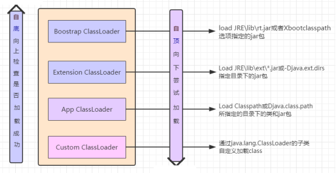
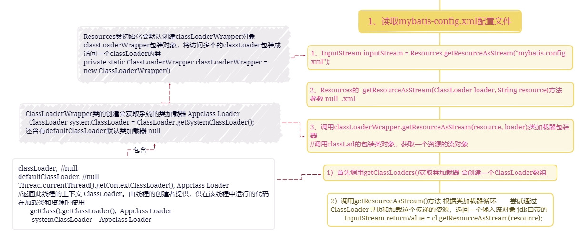
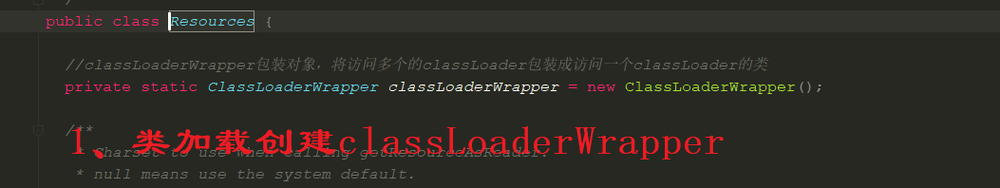
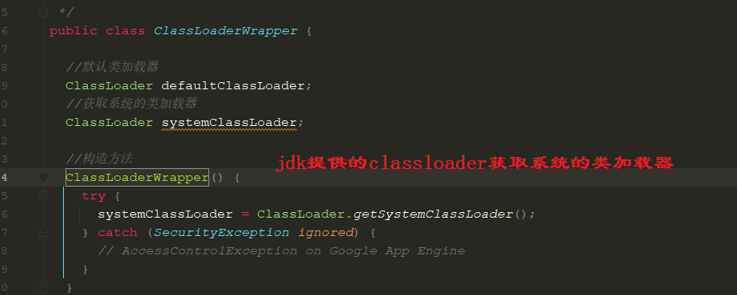

##### 设计模式

https://www.runoob.com/design-pattern/decorator-pattern.html

策略模式：根据不同的类型或者行为选择不同的实现类，用户可以在不 修改原有系统的基础上选择算法或行为，也可以灵活地增加 新的算法或行为。

> ```java
> 抽象策略类-->实现类 用户根据需求实现不同的实现类（不改变原代码）
> 上下文类也叫做上下文类或环境类，起承上启下封装作用-->含有抽象策略类的成员变量，写自己的方法在其中调用抽象策略类的方法
> 用户使用时传入不同的策略，调用上下文类的一个方法就可以实现不同的为策略实现
> ```

装饰模式：装饰类和被装饰类都互不受影响，不会改变原有逻辑，并且使用装饰器模式可以**动态**扩展功能。（与静态代理特别类似）

> - 装饰模式是强调对原有类型自身能力的拓展；代理模式强调对功能的控制；
> - 装饰模式是继承的一种替代方案，与被装饰者是is-a的关系，符合里氏替换法则；代理模式是一种委托模式，将被代理角色的功能委托给另外一个角色去实现和控制；
> - 装饰模式要兼顾原角色的所有方法实现，因为装饰器是原角色的拓展，拥有原角色的所有功能；代理模式只需要控制要代理的功能的调度即可，不必考虑其它功能

外观模式：类似nginx

> 外观模式（Facade Pattern）也称为过程模式，是结构性模式。外观模式为子系统的一组接口提供了一个一致的界面，此模式定义了一个高层接口，这个接口使得这一子系统更加容易使用。外观模式可以理解为转换一群接口，客户只要调用这一个接口而不用调用多个接口才能达到目的，也不需关心这个子系统的内部细节。就是解决多个复杂接口带来的使用困难，起到简化用户操作的作用。

责任链设计模式：filter过滤器，执行顺序 像一个链条一样依次执行

#### 类加载器Classloader

作用：是将class文件加载到jvm虚拟机中，jvm启动时，不会一次加载所有的class文件，而是根据需要动态加载，如果一次性加载那么多jar包那么多class。内存消耗极大；

jvm含有三个类加载器：



- ***\*Bootstrap ClassLoader\**** 最顶层的加载类，主要加载核心类库，%JRE_HOME%\lib下的rt.jar、resources.jar、charsets.jar和class等;

  Bootstrap ClassLoader是C语言实现的；

- ***\*Extention ClassLoader\**** 扩展的类加载器，加载目录%JRE_HOME%\lib\ext目录下的jar包和class文件；

- ***\*Appclass Loader\****也称为SystemAppClass 加载当前应用的classpath下的所有类；

- 那么这3个类加载器的加载顺序是怎么样的，具体哪个先行？顺序是：

  1. Bootstrap CLassloder

  2. Extention ClassLoader

  3. AppClassLoader

- 我们自己写的类是由AppClassLoader加载，jdk api提供的那些类，比如String，Object，Date是由Bootstrap CLassloder加载；

```java
System.out.println(Test.class.getClassLoader());
System.out.println(String.class.getClassLoader());
```

每个类加载器都有一个父加载器，比如加载Test.class是由AppClassLoader完成，那么AppClassLoader也有一个父加载器，通过getParent方法获取；

```java
ClassLoader cl = Test.class.getClassLoader();
System.out.println("ClassLoader is:"+cl.toString());
System.out.println("ClassLoader's parent is:"+cl.getParent());
System.out.println("ClassLoader's parent is:"+cl.getParent().getParent());
```

ExtClassLoader的父加载器是null（因为是C语言实现的，所以打不出名字）；

双亲委派机制 第一次加载往上

先让1加载 找不到2 然后3

如果自己写了string 类不会用自己的 。 

#### 类加载时期

1. 当类加载器将类加载到JVM中的时候就会创建静态变量，这跟对象是否创建无关。静态变量加载的时候就会分配内存空间。静态代码块的代码只会在类第一次初始化的时候执行一次。一个类可以有多个静态代码块，它并不是类的成员，也没有返回值，并且不能直接调用。静态代码块不能包含this或者super,它们通常被用初始化静态变量。
2. 静态代码块->静态成员变量->构造方法

## Mybatis

### 1、读取mybatis-config.xml配置文件

第一步：读取mybatis-config.xml配置文件**
*InputStream inputStream = Resources.*getResourceAsStream*(**"mybatis-config.xml"**);

通过Resources工具类，调用ClassLoader读取classpath下的**mybatis-config.xml**配置文件，得到一个输入流；



- 
- 

- 
- 
- 

### 2、构建SqlSessionFactory 

- xmlConfigBuilder xml配置构建器对象 

  1、创建XPathParser对象  1)创建 XPath解析器对象，2）创建文档对象document

  2、XMLConfigBuilder继承父类，调用时：其构造法方法中创建一个核心配置类Configuration配置类对象(mybatis-config.xml)。

  

  - 构建**SqlSessionFactory**
    SqlSessionFactory sqlSessionFactory = **new** SqlSessionFactoryBuilder().build(inputStream);

  - 1、创建一个SqlSessionFactoryBuilder对象：

    **new** SqlSessionFactoryBuilder()； 什么都没干

  - 2、调用SqlSessionFactoryBuilder对象的build方法：

    build(InputStream inputStream)

    

  - 3、创建XMLConfigBuilder 对象：

    XMLConfigBuilder parser = **new** XMLConfigBuilder(inputStream, environment, properties);

    

  - 4、创建XMLMapperEntityResolver对象：

    **new** XMLMapperEntityResolver()

    

  - 5、创建XPathParser对象：

    **new** XPathParser(inputStream, **true**, props, **new** XMLMapperEntityResolver())

    **第二步：**创建InputSource将文件流变为文档流

    

  - 6、创建XPath对象：

    XPathFactory factory = XPathFactory.*newInstance*();

    **this**.**xpath** = factory.newXPath();

    变量值：true  ,   null   , null

    

  - 7、创建Document对象：（DOM解析）

     **//JDK提供的文档解析工厂对象**
        DocumentBuilderFactory factory = DocumentBuilderFactory.*newInstance*();
    //创建一个**DocumentBuilder**对象***
    DocumentBuilder builder = factory.newDocumentBuilder();

    //**解析输入源的**xml**数据为一个**Document**文件***

    **return** builder.parse(inputSource);

    ```java
    //解析文件流转为Document
    private Document createDocument(InputSource inputSource) {
    // important: this must only be called AFTER common constructor
    try {
      //jdk提供的文档解析工厂对象
      DocumentBuilderFactory factory = DocumentBuilderFactory.newInstance();
      factory.setFeature(XMLConstants.FEATURE_SECURE_PROCESSING, true);
      //设置是否验证
      factory.setValidating(validation);
    
      //是否支持命名空间
      factory.setNamespaceAware(false);
      //设置是否忽略注释
      factory.setIgnoringComments(true);
      // 设置是否忽略元素内容的空白
      factory.setIgnoringElementContentWhitespace(false);
      //是否将CDATA节点转化为文本节点
      factory.setCoalescing(false);
      //设置是否展开实体引用节点，sql片段的引用
      factory.setExpandEntityReferences(true);
    
      //创建一个DocumentBuilder对象
      DocumentBuilder builder = factory.newDocumentBuilder();
      //设置解析mybatis xml文档节点实体解析器  XMLMapperEntityResolver 验证xml文件是否合法
      builder.setEntityResolver(entityResolver);
      //设置解析文档错误的处理
      builder.setErrorHandler(new ErrorHandler() {
        @Override
        public void error(SAXParseException exception) throws SAXException {
          throw exception;
        }
    
        @Override
        public void fatalError(SAXParseException exception) throws SAXException {
          throw exception;
        }
    
        @Override
        public void warning(SAXParseException exception) throws SAXException {
          // NOP
        }
      });
        //解析输入源的xml数据为一个**Document**文件
      return builder.parse(inputSource);
    } catch (Exception e) {
      throw new BuilderException("Error creating document instance.  Cause: " + e, e);
    }
    } 
    ```

  - 8、创建Configuration对象

    1、调用父类的**BaseBuilder** 初始化父类Configuration核心配置对象 

    

    **new** Configuration()注册类型别名初始化Configuration对象的一些成员变量的默认值

  

  

  		无参构造方法中会注册许多别名供使用：registerAlias()  方法将别名存入到typeAliases Map集合中

  					类加载时：

  

  

  

  

  

- 解析xml  利用 XPath解析器对象，文档对象document

  XNode含有当前类对象XPathParser、node。

  解析过后的数据放入到Configuration

  
  
  - 
  
  - parser.parse()
  
    
  
  - 
  
  - 9、通过XPath方法解析mybatis-config.xml文件：
  
    parseConfiguration(**parser**.evalNode(**"/configuration"**));
  
    将解析出来的信息封装到Configuration对象中；
  
    - **parser**.evalNode(**"/configuration"**)
      -  1）Node node = (Node) evaluate(expression, root, XPathConstants.NODE[命名空间]);
  
    
  
    
  
     			 2）return new XNode(this, node, variables);
  
    
  
    - **parseConfiguration(XNode)**        解析xml文件
  
      会返回父类中的核心配置类 **上述8**
  
    
  
    - 如 ：environmentsElement(root.evalNode("**environments**"));
  
    - 
  
    - 继续上述中的**parser**.evalNode(**"/configuration"**)
  
      
  
    - environmentsElement(xnode)解析
  
      
  
  - 10、build()
  
    通过**持有Configuration**对象创建一个DefaultSqlSessionFactory对象：
  
    **new** DefaultSqlSessionFactory(configuration);
  
    
  
    

### 	3、打开SqlSession

```java
//第三步：
SqlSession session = sqlSessionFactory.openSession();
1、从configuration配置对象中获取环境environment信息；
2、根据环境environment信息获取事务工厂TransactionFactory；
3、根据环境信息中创建一个事务对象Transaction；
4、根据configuration和Transaction创建一个执行器Executor对象；
5、根据configuration和Executor创建一个默认的SqlSession对象；
```


openSessionFromDataSource(configuration.getDefaultExecutorType()（默认执行器类型）, null（事务隔离级别）, false（是否自动提交）);


- 默认执行器类型

  

- ```java
   private SqlSession openSessionFromDataSource(ExecutorType execType, TransactionIsolationLevel level, boolean autoCommit) {
  //    事物接口：包装一个数据库连接，处理改连接的生命周期：连接的创建、预处理、提交\回滚、关闭
      Transaction tx = null;
      try {
  //      从configuration配置对象中获取环境environment信息
        final Environment environment = configuration.getEnvironment();
  //      根据环境信息获取事务工厂
        final TransactionFactory transactionFactory = getTransactionFactoryFromEnvironment(environment);
  //      根据环境信息中的数据源，事务隔离级别，是否自动提交三个参数，创建一个事物对象
        tx = transactionFactory.newTransaction(environment.getDataSource(), level, autoCommit);
  //      创建一个执行链executor对象
        final Executor executor = configuration.newExecutor(tx, execType);
  //      创建一个默认SqlSession对象
        return new DefaultSqlSession(configuration, executor, autoCommit);
      } catch (Exception e) {
  //      关闭事务对象
        closeTransaction(tx); // may have fetched a connection so lets call close()
        throw ExceptionFactory.wrapException("Error opening session.  Cause: " + e, e);
      } finally {
  //      重置错误上下文
        ErrorContext.instance().reset();
      }
    }
  ```

-  根据环境信息获取事务工厂
        final TransactionFactory transactionFactory = getTransactionFactoryFromEnvironment(environment);

  

-  根据环境信息中的数据源，事务隔离级别，是否自动提交三个参数，创建一个事物对象
        tx = transactionFactory.newTransaction(environment.getDataSource(), level, autoCommit);

  	jdbc事务对象 获取连接、提交、回滚关闭、超时

  

  

  

- 创建一个执行链executor对象  executorType  ：默认执行器类型
        final Executor executor = configuration.newExecutor(tx, execType);

  ```java
   public Executor newExecutor(Transaction transaction, ExecutorType executorType) {
  //    执行器类型
      executorType = executorType == null ? defaultExecutorType : executorType;
      executorType = executorType == null ? ExecutorType.SIMPLE : executorType;
      
      Executor executor;
  //    批量执行器
      if (ExecutorType.BATCH == executorType) {
        executor = new BatchExecutor(this, transaction);
  //      可复用预编译语句的执行器
      } else if (ExecutorType.REUSE == executorType) {
        executor = new ReuseExecutor(this, transaction);
      } else {
  //      单一语句执行器
        executor = new SimpleExecutor(this, transaction);
      }
  //    如果缓存可用，创建缓存执行器
      if (cacheEnabled) {
        executor = new CachingExecutor(executor);
      }
  //    将执行器加入拦截器链
      executor = (Executor) interceptorChain.pluginAll(executor);
      return executor;
    }
  ```

  

- 创建一个默认SqlSession对象 持有**configuration核心配置类   executor执行器**
        return new DefaultSqlSession(configuration, executor, autoCommit);


### 4、获取Mapper接口对象 (底层是动态代理)

```java
//第四步：
AccountMapper accountMapper = session.getMapper(AccountMapper.class);
//根据类型从解析的configuration中获取mapper.xml
```


1、从configuration中获取Mapper接口对象；

```java
 @Override
  public <T> T getMapper(Class<T> type) {
    return configuration.getMapper(type, this);
  }
//this当前类也就是DefaultSqlSession
```

- ```
  2、mapper接口的注册器 MapperRegistry 在构建SqlSessionFactory时初始化 
  ```

  

- 3、包装接口引用时将mapper（dao）层放入map中

  knownMappers.get(mapper.class)获取到包装的com.xxx.mapper.xxxMapper

  !

- 4、knownMappers.put(type, new MapperProxyFactory<>(type));
  
  ```java
    //给MapperProxyFactory的成员变量赋值
    //type：==> mapper接口class  com.xxx.xxx.mapper.xxxMapper
    private final Class<T> mapperInterface;
      
    public MapperProxyFactory(Class<T> mapperInterface) {
      this.mapperInterface = mapperInterface;
    }
  ```

- 5、创建Mapper接口的代理实例mapperProxyFactory.newInstance(sqlSession);
  
  ```java
  public class MapperProxyFactory<T> {
  
    //mapper接口class  com.xxx.xxx.mapper.xxxMapper
    private final Class<T> mapperInterface;
    //方法缓存  0
    private final Map<Method, MapperMethodInvoker> methodCache = new ConcurrentHashMap<>();
  
  
    public MapperProxyFactory(Class<T> mapperInterface) {
      this.mapperInterface = mapperInterface;
    }
  
    public Class<T> getMapperInterface() {
      return mapperInterface;
    }
  
    public Map<Method, MapperMethodInvoker> getMethodCache() {
      return methodCache;
    }
    //动态代理
    @SuppressWarnings("unchecked")
    protected T newInstance(MapperProxy<T> mapperProxy) {
      return (T) Proxy.newProxyInstance(mapperInterface.getClassLoader(), new Class[] { mapperInterface }, mapperProxy);
    }
    //创建一个泛型的实例对象
    public T newInstance(SqlSession sqlSession) {
      //DefaultSqlSession、mapper成员变量、方法缓存   MapperProxy类使用
      final MapperProxy<T> mapperProxy = new MapperProxy<>(sqlSession, mapperInterface, methodCache);
      return newInstance(mapperProxy);
    }
  
  ```
  
  **MapperProxy**：代理类继承  **InvocationHandler**


- **Proxy.newProxyInstance(mapperInterface.getClassLoader(), new Class[] { mapperInterface }, mapperProxy);**
- 进行动态代理

##### 1、静态代理


##### 2、动态代理


###### 1、JDK动态代理

```
  1)目标对象必须实现业务接口
  2)JDK代理对象不需要实现业务接口
  3)JDK动态代理的对象在程序运行前不存在.在程序运行时动态的在内存中构建
  4)JDK动态代理灵活的进行业务功能的切换
  5)本类中的方法(非接口中的方法)不能被代理
   //1、jvm内存中生成一个class类；
   //2、根据该class类反射创建一个代理对象 $Proxy@564546548
```

- JDK动态代理用到的类和接口   它是使用现在的工具类完成JDK动态实现.

Proxy类    它是java.lang.reflect.Proxy包下的类. 它有一个方法Proxy.newProxyInstance(.....)专门用来生成动态代理对象.

```java
public static Object newProxyInstance(ClassLoader loader,  //类加载器
    Class<?>[] interfaces,//目标对象实现的所有接口
    	InvocationHandler h //它就类似于Agent的功能,代理的功能和目标对象的业务功能调用在这
    )
	throws IllegalArgumentException
{...}
```

Method类   反射用的类,用来进行目标对象的方法的反射调用.

```
 method对象接住我们正在调用的方法sing(),show()
  method==sing(),show()
  method.invoke();==>手工调用目标方法  sing();   show();
```

 InvocationHandler接口  它是实现代理和业务功能的.我们在调用时使用匿名内部实现.

  代码实现:

```java
 public class ProxyFactory {
    //类中的成员变量设计为接口,目标对象
    Service target;
```

```java
//传入目标对象
public ProxyFactory(Service target){
    this.target = target;
}

//返回动态代理对象
public Object getAgent(){
    return Proxy.newProxyInstance(
            //ClassLoader loader, 类加载器,完成目标对象的加载
            target.getClass().getClassLoader(),
            //Class<?>[] interfaces,目标对象实现的所有接口
            target.getClass().getInterfaces(),
            //InvocationHandler h,实现代理功能的接口 ,我们传入的是匿名内部实现
            new InvocationHandler() {
                @Override
                public Object invoke(
                        //创建代理对象
                        Object proxy,
                        //method就是目标方法sing(),show()
                        Method method,
                        //目标方法的参数
                        Object[] args) throws Throwable {

                    //代理功能
                    System.out.println("预订时间........");
                    //代理功能
                    System.out.println("预订场地........");
                    //主业务功能实现
                    //target.sing();还是写死了方法的调用, 不成
                    //sing(),show(),one()
                    Object obj = method.invoke(target,args);
                    //代理功能
                    System.out.println("结算费用........");
                    return obj;  //切记:这个是目标方法的返回值
                }
            }
    );
}
//保存生成的代理类文件
 System.setProperty("sun.misc.ProxyGenerator.saveGeneratedFiles", "true");
```
}

###### 2、CGLib动态代理

```
	又称为子类.通过动态的在内存中构建子类对象,重写父类的方法进行代理功能的增强.
  	如果目标对象没有实现接口,则只能通过CGLib子类代理来进行功能增强.
  	子类代理是对象字节码框架ASM来实现的.
```

  注意:
  			被代理的类不能为final， 否则报错.
  			目标对象的方法如果为final/static, 那么就不会被拦截，即不会执行目标对象额外的业务方法。

```java
  public Object getProxyInstance(){		
		//1.使用工具类
		Enhancer en=new Enhancer();
		//2.设置父类
		en.setSuperclass(target.getClass());
		//3.设置回调函数
		en.setCallback(this);
		//4.创建子类（代理）对象
		return en.create();  ===>返回的是子类代理对象
```

### 5、调用Mapper接口对象的方法操作数据库；

```java
 Account account = accountMapper.selectByPrimaryKey(41);
```

- 会动态调用MapperProxy的invoke方法

```java
public Object invoke(Object proxy, Method method, Object[] args) throws Throwable {
	//得到方法所在的类如果是Object，直接调用，不做拦截处理      
	1、if (Object.class.equals(method.getDeclaringClass())) {        
    	return method.invoke(this, args);        
    	//调用接口的默认方法      
	} else {        
   		2、return cachedInvoker(method).invoke(proxy, method, args, sqlSession);     
}
```

#### 1、如果传进来的是Object对象，则直接执行本对象的自己的方法，并非mapper对象接口中的方法如：toString（）等

```java
if (Object.class.equals(method.getDeclaringClass())) {        
    	return method.invoke(this, args)
```

#### 2、cachedInvoker sql映射

会进行缓存 将数据缓存到methodCache

注意：map的computeIfAbsent

```
如果给定的key不存在（或者key对应的value为null），就去计算mappingFunction的值；
如果mappingFunction的值不为null，就把key=value放进去；
如果mappingFunction的值为null，就不会记录该映射关系，返回值为null；
如果计算mappingFunction的值的过程出现异常，再次抛出异常，不记录映射关系，返回null；
如果存在该key，并且key对应的value部位null，返回null；
```

```java
//在第四部分的第5步：创建Mapper接口的代理实例会传一个 methodCache方法缓存
 private MapperMethodInvoker cachedInvoker(Method method) throws Throwable {
    try {
      //Map<K, V> map, K key, Function<K, V> mappingFunction
      //methodCache是获取在Mapper接口对象(MapperProxyFactory）中赋值的
      //method: public abstract com.bjpowernode.model.Account
      //        com.bjpowernode.mapper.AccountMapper.selectByPrimaryKey(java.lang.Integer)
      //m-> : 映射函数 会将MapperMethod绑定到方法缓存中
      return MapUtil.computeIfAbsent(methodCache, method, m -> {
        if (m.isDefault()) { //false 判断此方法是否是默认实现的
          try {
            if (privateLookupInMethod == null) {
              return new DefaultMethodInvoker(getMethodHandleJava8(method));
            } else {
              return new DefaultMethodInvoker(getMethodHandleJava9(method));
            }
          } catch (IllegalAccessException | InstantiationException | InvocationTargetException
              | NoSuchMethodException e) {
            throw new RuntimeException(e);
          }
        } else {
           //关键构造MapperMethod类 也就是目标对象
          return new PlainMethodInvoker(new MapperMethod(mapperInterface, method, sqlSession.getConfiguration()));
        }
      });
    } catch (RuntimeException re) {
      Throwable cause = re.getCause();
      throw cause == null ? re : cause;
    }
  }    
```

##### 1、获得一个MapperMethod（执行代理增强功能的类）

new MapperMethod(mapperInterface, method, sqlSession.getConfiguration())

在mapperMethod中有两个成员变量 静态内部类：

	**SqlCommand command 执行方法对应mapper.xml的sql语句** 
**	MethodSignature method  对应mapper.java接口的方法(f返回值，类型等)**

```java
public class MapperMethod {
    
  //sql命令  主要含有name = ms.getId();  com.bjpowernode.mapper.AccountMapper.selectByPrimaryKey
  //               type = ms.getSqlCommandType(); selsct 类型 什么语句
  private final SqlCommand command;
  //方法签名
  private final MethodSignature method;
  /**
   * 根据Mapper接口类型、接口方法、核心配置对象 构造MapperMethod对象
   * 
   * @param mapperInterface mapper接口
   * @param method 调用的方法
   * @param config 配置类
   */
  public MapperMethod(Class<?> mapperInterface, Method method, Configuration config) {
    this.command = new SqlCommand(config, mapperInterface, method);
    this.method = new MethodSignature(config, mapperInterface, method);
  }

```

###### 1）this.command = new SqlCommand(config, mapperInterface, method);

MappedStatement含有sql的所有信息

```java
 public SqlCommand(Configuration configuration, Class<?> mapperInterface, Method method) {
      //获取方法名
      final String methodName = method.getName();
      //方法所在的类是那个类
      final Class<?> declaringClass = method.getDeclaringClass();
	  //解析得到mapper语句对象
      MappedStatement ms = resolveMappedStatement(mapperInterface, methodName, declaringClass,
          configuration);
      if (ms == null) {
        if (method.getAnnotation(Flush.class) != null) {
          name = null;
          type = SqlCommandType.FLUSH;
        } else {
          throw new BindingException("Invalid bound statement (not found): "
              + mapperInterface.getName() + "." + methodName);
        }
      } else {
        name = ms.getId();  //com.bjpowernode.mapper.AccountMapper.selectByPrimaryKey
        type = ms.getSqlCommandType(); //selsct 类型 什么语句
        if (type == SqlCommandType.UNKNOWN) {
          throw new BindingException("Unknown execution method for: " + name);
        }
      }
    }
```

- 解析得到mapper语句对象 

    	MappedStatement ms = resolveMappedStatement(mapperInterface, methodName, declaringClass,configuration);

```java
   private MappedStatement resolveMappedStatement(Class<?> mapperInterface, String methodName,
        Class<?> declaringClass, Configuration configuration) {
       //接口的包名+接口的方法名=sql的id
       //statementId == com.bjpowernode.mapper.AccountMapper.selectByPrimaryKey
       String statementId = mapperInterface.getName() + "." + methodName;
      
       if (configuration.hasStatement(statementId)) {
        return configuration.getMappedStatement(statementId);
      } else if (mapperInterface.equals(declaringClass)) {
        return null;
      }
      for (Class<?> superInterface : mapperInterface.getInterfaces()) {
        if (declaringClass.isAssignableFrom(superInterface)) {
          MappedStatement ms = resolveMappedStatement(superInterface, methodName,
              declaringClass, configuration);
          if (ms != null) {
            return ms;
          }
        }
      }
      return null;
    }
  }

```

- configuration.getMappedStatement(statementId); 

  **在核心配置类创建时初始化MappedStatement对象**

```java
//configuration核心配置类
 public MappedStatement getMappedStatement(String id) {
    return this.getMappedStatement(id, true);
  }
 public MappedStatement getMappedStatement(String id, boolean validateIncompleteStatements) {
    if (validateIncompleteStatements) {
      buildAllStatements();
    }
    return mappedStatements.get(id);
  }
```

###### 2）this.method = new MethodSignature(config, mapperInterface, method);

```java
public MethodSignature(Configuration configuration, Class<?> mapperInterface, Method method) {
      //返回类型resolvedReturnType   赋值给这个静态内部类的成员变量
      Type resolvedReturnType = TypeParameterResolver.resolveReturnType(method, mapperInterface);
      if (resolvedReturnType instanceof Class<?>) {
        this.returnType = (Class<?>) resolvedReturnType;
      } else if (resolvedReturnType instanceof ParameterizedType) {
        this.returnType = (Class<?>) ((ParameterizedType) resolvedReturnType).getRawType();
      } else {
        this.returnType = method.getReturnType();
      }
      this.returnsVoid = void.class.equals(this.returnType);
      this.returnsMany = configuration.getObjectFactory().isCollection(this.returnType) || this.returnType.isArray();
      this.returnsCursor = Cursor.class.equals(this.returnType);
      this.returnsOptional = Optional.class.equals(this.returnType);
      this.mapKey = getMapKey(method);
      this.returnsMap = this.mapKey != null;
      this.rowBoundsIndex = getUniqueParamIndex(method, RowBounds.class);
      this.resultHandlerIndex = getUniqueParamIndex(method, ResultHandler.class);
      this.paramNameResolver = new ParamNameResolver(configuration, method);
    }
```

##### 2、new PlainMethodInvoker(MapperMethod)   最终执行MapperMethod执行代理增强功能的类

执行具体的查询语句

```java
//MapperProxy类中的接口以及实现
//将MapperMethod包装到MapperMethodInvoker中
interface MapperMethodInvoker {
    Object invoke(Object proxy, Method method, Object[] args, SqlSession sqlSession) throws Throwable;
  }

  private static class PlainMethodInvoker implements MapperMethodInvoker {
    private final MapperMethod mapperMethod;

    public PlainMethodInvoker(MapperMethod mapperMethod) {
      super();
      this.mapperMethod = mapperMethod;
    }

    @Override
    public Object invoke(Object proxy, Method method, Object[] args, SqlSession sqlSession) throws Throwable {
      return mapperMethod.execute(sqlSession, args);
    }
  }
```

#### 3.invoke(proxy, method, args, sqlSession); 

```java
//首先调用MapperMethodInvoker的invoke
//mapperMethod.execute(sqlSession, args);

public Object execute(SqlSession sqlSession, Object[] args) {
    Object result;
    //判断类型
    switch (command.getType()) {
      case INSERT: {                                                      //添加
        Object param = method.convertArgsToSqlCommandParam(args);
        result = rowCountResult(sqlSession.insert(command.getName(), param));
        break;
      }
      case UPDATE: {                                                    //更新
        Object param = method.convertArgsToSqlCommandParam(args);
        result = rowCountResult(sqlSession.update(command.getName(), param));
        break;
      }
      case DELETE: {                                                    //删除
        Object param = method.convertArgsToSqlCommandParam(args);
        result = rowCountResult(sqlSession.delete(command.getName(), param));
        break;
      }
      case SELECT:                                                     //查询
          //判断是否返回为空
        if (method.returnsVoid() && method.hasResultHandler()) {
          executeWithResultHandler(sqlSession, args);
          result = null;
        } else if (method.returnsMany()) {  //判断是否多条数据
          result = executeForMany(sqlSession, args);
        } else if (method.returnsMap()) {
          result = executeForMap(sqlSession, args);
        } else if (method.returnsCursor()) {  //游标
          result = executeForCursor(sqlSession, args);
        } else {
          //参数转化，转成SqlCommand参数
          Object param = method.convertArgsToSqlCommandParam(args);
          //执行查询，查询单条数据
          result = sqlSession.selectOne(command.getName(), param);
          if (method.returnsOptional()
              && (result == null || !method.getReturnType().equals(result.getClass()))) {
            result = Optional.ofNullable(result);
          }
        }
        break;
      case FLUSH:
        result = sqlSession.flushStatements();
        break;
      default:
        throw new BindingException("Unknown execution method for: " + command.getName());
    }
    if (result == null && method.getReturnType().isPrimitive() && !method.returnsVoid()) {
      throw new BindingException("Mapper method '" + command.getName()
          + " attempted to return null from a method with a primitive return type (" + method.getReturnType() + ").");
    }
    return result;
  }
```

- result = sqlSession.selectOne(command.getName(), param);          DefaultSqlSession

```java
public <T> T selectOne(String statement, Object parameter) {
  // Popular vote was to return null on 0 results and throw exception on too many.
  List<T> list = this.selectList(statement, parameter);
  if (list.size() == 1) {
    return list.get(0);
  } else if (list.size() > 1) {  //查询出的数据大于1抛出异常
    throw new TooManyResultsException("Expected one result (or null) to be returned by selectOne(), but found: " + list.size());
  } else {
    return null;
  }
}

 public <E> List<E> selectList(String statement, Object parameter) {
    return this.selectList(statement, parameter, RowBounds.DEFAULT);
  }
 public <E> List<E> selectList(String statement, Object parameter, RowBounds rowBounds) {
    return selectList(statement, parameter, rowBounds, Executor.NO_RESULT_HANDLER（null）);
  }


//查询数据
  private <E> List<E> selectList(String statement, Object parameter, RowBounds rowBounds, ResultHandler handler) {
    // statement: com.bjpowernode.mapper.AccountMapper.selectByPrimaryKey   === id
  		//方法的参数值 parameter ： 1
      try {
      //configuration.getMappedStatement(statement);根据statement获取到对应的MappedStatement信息 包含sql语句
          //上一步 1-1-1 就是configuration中的
      MappedStatement ms = configuration.getMappedStatement(statement);
          //rowbounds默认情况查多少数据 0-2147483647
          //executor为第3步时候创建的执行连executor对象
      return executor.query(ms, wrapCollection(parameter), rowBounds, handler);
    } catch (Exception e) {
      throw ExceptionFactory.wrapException("Error querying database.  Cause: " + e, e);
    } finally {
      ErrorContext.instance().reset();
    }
  }
```

- executor.query(ms, wrapCollection(parameter), rowBounds, handler);

```java
//CachingExecutor implements Executor {

public <E> List<E> query(MappedStatement ms, Object parameterObject, RowBounds rowBounds, ResultHandler resultHandler) throws SQLException {
   //拿到sql语句
    BoundSql boundSql = ms.getBoundSql(parameterObject);
    //二级缓存
    CacheKey key = createCacheKey(ms, parameterObject, rowBounds, boundSql);
    return query(ms, parameterObject, rowBounds, resultHandler, key, boundSql);
  }

  @Override
  public <E> List<E> query(MappedStatement ms, Object parameterObject, RowBounds rowBounds, ResultHandler resultHandler, CacheKey key, BoundSql boundSql)
      throws SQLException {
	// 缓存
    Cache cache = ms.getCache();
    if (cache != null) {
      flushCacheIfRequired(ms);
      if (ms.isUseCache() && resultHandler == null) {
        ensureNoOutParams(ms, boundSql);
        @SuppressWarnings("unchecked")
        List<E> list = (List<E>) tcm.getObject(cache, key);
        if (list == null) {
          list = delegate.query(ms, parameterObject, rowBounds, resultHandler, key, boundSql);
          tcm.putObject(cache, key, list); // issue #578 and #116
        }
        return list;
      }
    }
	  //BaseExecutor（父类）SimpleExecutor的query :第三部打开SQLSession时候赋值并创建的
      //ms -> xml查询方法信息 parameterObject->参数  rowBounds->行数 resultHandler->null key->缓存 boundSql->sql语句
    return delegate.query(ms, parameterObject, rowBounds, resultHandler, key, boundSql);
  }
```

- return delegate.query(ms, parameterObject, rowBounds, resultHandler, key, boundSql);

```java
//BaseExecutor implements Executor 
//模板模式 抽象类 无具体实现
public <E> List<E> query(MappedStatement ms, Object parameter, RowBounds rowBounds, ResultHandler resultHandler, CacheKey key, BoundSql boundSql) throws SQLException {
    ErrorContext.instance().resource(ms.getResource()).activity("executing a query").object(ms.getId());
    if (closed) {
      throw new ExecutorException("Executor was closed.");
    }
    if (queryStack == 0 && ms.isFlushCacheRequired()) {
      clearLocalCache();
    }
    List<E> list;
    try {
      queryStack++;
      list = resultHandler == null ? (List<E>) localCache.getObject(key) : null;
      if (list != null) { 
          //缓存
        handleLocallyCachedOutputParameters(ms, key, parameter, boundSql);
      } else {
          //从数据库查数据
        list = queryFromDatabase(ms, parameter, rowBounds, resultHandler, key, boundSql);
      }
    } finally {
      queryStack--;
    }
    if (queryStack == 0) {
      for (DeferredLoad deferredLoad : deferredLoads) {
        deferredLoad.load();
      }
      // issue #601
      deferredLoads.clear();
      if (configuration.getLocalCacheScope() == LocalCacheScope.STATEMENT) {
        // issue #482
        clearLocalCache();
      }
    }
    return list;
  }


  //从数据库中查数据
  private <E> List<E> queryFromDatabase(MappedStatement ms, Object parameter, RowBounds rowBounds, ResultHandler resultHandler, CacheKey key, BoundSql boundSql) throws SQLException {
    List<E> list;
      //加入缓存
    localCache.putObject(key, EXECUTION_PLACEHOLDER);
    try {
      //执行查询
      list = doQuery(ms, parameter, rowBounds, resultHandler, boundSql);
    } finally {
      localCache.removeObject(key);
    }
    localCache.putObject(key, list);
    if (ms.getStatementType() == StatementType.CALLABLE) {
      localOutputParameterCache.putObject(key, parameter);
    }
    return list;
  }

//list = doQuery(ms, parameter, rowBounds, resultHandler, boundSql);
//SimpleExecutor extends BaseExecutor
//JDBC
public <E> List<E> doQuery(MappedStatement ms, Object parameter, RowBounds rowBounds, ResultHandler resultHandler, BoundSql boundSql) throws SQLException {
    Statement stmt = null; 
    try {
      Configuration configuration = ms.getConfiguration();
       //创建一个预编译的StatementHandler解析SQL语句
      StatementHandler handler = configuration.newStatementHandler(wrapper, ms, parameter, rowBounds, resultHandler, boundSql);
//      预编译SQL
      stmt = prepareStatement(handler, ms.getStatementLog(/*日志 settings*/));
//      执行查询
      return handler.query(stmt, resultHandler);
    } finally {
      closeStatement(stmt);
    }
  }

```

- StatementHandler handler = configuration.newStatementHandler(wrapper, ms, parameter, rowBounds, resultHandler, boundSql)

##### **创建一个预编译的 StatementHandler**

```java
 /**
   *
   * @param executor   执行器
   * @param mappedStatement  sql封装的类
   * @param parameterObject 参数
   * @param rowBounds  默认情况查多少数据 0-2147483647
   * @param resultHandler  结果
   * @param boundSql sql语句
   * @return 
   */
  public StatementHandler newStatementHandler(Executor executor, MappedStatement mappedStatement, Object parameterObject, RowBounds rowBounds, ResultHandler resultHandler, BoundSql boundSql) {
    StatementHandler statementHandler = new RoutingStatementHandler(executor, mappedStatement, parameterObject, rowBounds, resultHandler, boundSql);
      //责任链模式 按顺序执行 filtle典型的责任链设计模式 xml中的<plugin插件>
      statementHandler = (StatementHandler) interceptorChain.pluginAll(statementHandler);
    return statementHandler;
  }

//StatementHandler statementHandler = new RoutingStatementHandler()
 public RoutingStatementHandler(Executor executor, MappedStatement ms, Object parameter, RowBounds rowBounds, ResultHandler resultHandler, BoundSql boundSql) {
  //策略模式 根据不同语句类型，选用不同的策略实现类 ms.getStatementType()解析xml时赋值
    //初始化一些成员变量  根据 statementType 创建对应的 Statement 对象	
     /**
     	SimpleStatementHandler: 管理 Statement 对象并向数据库中推送不需要预编译的SQL语句
        PreparedStatementHandler: 管理 Statement 对象并向数据中推送需要预编译的SQL语句，
        CallableStatementHandler：管理 Statement 对象并调用数据库中的存储过程
     */
    switch (ms.getStatementType()) {
      case STATEMENT:
        delegate = new SimpleStatementHandler(executor, ms, parameter, rowBounds, resultHandler, boundSql);
        break;
      case PREPARED:
        delegate = new PreparedStatementHandler(executor, ms, parameter, rowBounds, resultHandler, boundSql);
        break;
      case CALLABLE:
        delegate = new CallableStatementHandler(executor, ms, parameter, rowBounds, resultHandler, boundSql);
        break;
      default:
        throw new ExecutorException("Unknown statement type: " + ms.getStatementType());
    }

  }
// new PreparedStatementHandler(executor, ms, parameter, rowBounds, resultHandler, boundSql);
//相当于创建一个预编译的Statement
protected BaseStatementHandler(Executor executor, MappedStatement mappedStatement, Object parameterObject, RowBounds rowBounds, ResultHandler resultHandler, BoundSql boundSql) {
    this.configuration = mappedStatement.getConfiguration();
    this.executor = executor;
    this.mappedStatement = mappedStatement;
    this.rowBounds = rowBounds;

    this.typeHandlerRegistry = configuration.getTypeHandlerRegistry();
    this.objectFactory = configuration.getObjectFactory();

    if (boundSql == null) { // issue #435, get the key before calculating the statement
      generateKeys(parameterObject);
      boundSql = mappedStatement.getBoundSql(parameterObject);
    }

    this.boundSql = boundSql;
	//会加入插件拦截器
    this.parameterHandler = configuration.newParameterHandler(mappedStatement, parameterObject, boundSql);
    this.resultSetHandler = configuration.newResultSetHandler(executor, mappedStatement, rowBounds, parameterHandler, resultHandler, boundSql);
  }

```

```java
//jdbc
String sql="select * from student";//定义查询语句
Class.forName("com.mysql.jdbc.Driver");
//注册驱动程序，用java.lang包下面的class类里面的Class.froName();方法 此处的driver就是1里面定义的driver
Connection con=DriverManager.getConnection(dbUrl,dbUserName,dbPassword);
//获取数据库连接,使用java.sql里面的DriverManager的getConnectin(String url , String username ,String password )来完成
		
//构造一个statement对象来执行sql语句：主要有Statement，PreparedStatement，CallableStatement三种实例来实现
//三种实现方法分别为：Statement stmt = con.createStatement() ;  
// PreparedStatement pstmt = conn.prepareStatement(sql) ;   
//CallableStatement cstmt =  conn.prepareCall("{CALL demoSp(? , ?)}") ;
Statement stmt=con.createStatement();

ResultSet rs=stmt.executeQuery(sql);//执行sql并返还结束 ；ResultSet executeQuery(String sqlString)：用于返还一个结果集（ResultSet）对象。

//遍历结果集
while(rs.next()){
    System.out.println("学生编号："+rs.getInt("stuId")+"，学生姓名："+rs.getString("stuName")+"，学生性别："+rs.getString("stuSex")+"，学生年龄："+rs.getInt("stuAge"));//使用getString()方法获取你表里的资料名
```

##### jdbc底层封装 预编译SQL会进行连接 创建预编译  设置参数   

```java
预编译SQL会进行连接 创建预编译  设置参数    
    stmt = prepareStatement(handler, ms.getStatementLog(/*日志 settings*/));
```

- 创建连接：

- 1）使用在第3步创建的事务对象  （openSessionFromDataSource）获取连接

- 2）事务打开一个连接调用openConnection(); 掉用当前类的openConnection 

- 3）方法中：dataSource.getConnection();会调用PooledDataSource类的getConnection  ：（PooledDataSource是mybatis的连接池）  

   	//数据库的账号密码    getProxyConnection();返回一个代理类
   	popConnection(dataSource.getUsername(), dataSource.getPassword()).getProxyConnection();

- 4）PooledDataSource类的popConnection核心：
         conn = new PooledConnection(dataSource.getConnection(), this);

  1. dataSource.getConnection()    **UnpooledDataSource 类**     dataSource.getConnection()方法中会调用当前类的

     													doGetConnection(String username, String password)
      	是为了将用户名密码放入Properties

     再调用当前类的doGetConnection(props); –>初始化驱动、获取连接、配置配置类

  2. new PooledConnection对dataSource.getConnection()进行包装、成员变量初始化（还包括ProxyConnection代理对象） ， 当前 PooledDataSource类

-   预编译： stmt = handler.prepare(connection, transaction.getTimeout()); 就是sql推送

    ​    return connection.prepareStatement(sql);

-    设置参数：handler.parameterize(stmt); 

```java
  private Statement prepareStatement(StatementHandler handler, Log statementLog) throws SQLException {
    Statement stmt;
    //创建链接
    Connection connection = getConnection(statementLog);
      //预编译 return connection.prepareStatement(sql);
    stmt = handler.prepare(connection, transaction.getTimeout());
      //设置参数
    handler.parameterize(stmt);
    return stmt;
  }
//创建链接   connection是一个代理对象
  protected Connection getConnection(Log statementLog) throws SQLException {
    Connection connection = transaction.getConnection();  //在第3步创建的事务对象  openSessionFromDataSource
    if (statementLog.isDebugEnabled()) {//日志
      return ConnectionLogger.newInstance(connection, statementLog, queryStack); //日志代理也是一个到动态代理， 一个代理对象可以被多次代理
    } else {
      return connection;
    }
  }
  public Connection getConnection() throws SQLException {
      openConnection();
    return connection;
  }
//事务打开一个连接调用openConnection();   事务是在解析xml的环境时放入的
protected void openConnection() throws SQLException {
    connection = dataSource.getConnection();//获取连接
    setDesiredAutoCommit(autoCommit);//是否是自动提交
  }
// PooledDataSource的getConnection()（mybatis的连接池 实现了InvocationHandler）
public Connection getConnection() throws SQLException {
    //数据库的账号密码    getProxyConnection();返回一个代理类
    return popConnection(dataSource.getUsername(), dataSource.getPassword()).getProxyConnection();
}
//PooledDataSource类的popConnection  PooledConnection implements InvocationHandler 
private PooledConnection popConnection(String username, String password) throws SQLException {
     //核心
      conn = new PooledConnection(dataSource.getConnection(), this);
    return conn;
  }

//UnpooledDataSource类dataSource.getConnection()
public Connection getConnection() throws SQLException {
    return doGetConnection(username, password);
}  


private Connection doGetConnection(String username, String password) throws SQLException {
   //将用户名密码放入Properties
    Properties props = new Properties();
    if (driverProperties != null) {
      props.putAll(driverProperties);
    }
    if (username != null) {
      props.setProperty("user", username);
    }
    if (password != null) {
      props.setProperty("password", password);
    }
    return doGetConnection(props);
  }
// doGetConnection(props);
private Connection doGetConnection(Properties properties) throws SQLException {
    initializeDriver();//初始化驱动
    Connection connection = DriverManager.getConnection(url, properties); //获取连接
    configureConnection(connection);//配置中会查看是否是自动提交、默认事务隔离级别、默认网络超时
    return connection;
  }

  private synchronized void initializeDriver() throws SQLException {
    if (!registeredDrivers.containsKey(driver)) {
      Class<?> driverType;
      try {
        if (driverClassLoader != null) {
          
          driverType = Class.forName(driver, true, driverClassLoader);
              
        } else {
          driverType = Resources.classForName(driver);
        }
        // DriverManager requires the driver to be loaded via the system ClassLoader.
        // http://www.kfu.com/~nsayer/Java/dyn-jdbc.html
        Driver driverInstance = (Driver) driverType.getDeclaredConstructor().newInstance();
          //注册驱动 
        DriverManager.registerDriver(new DriverProxy(driverInstance));
        registeredDrivers.put(driver, driverInstance);
      } catch (Exception e) {
        throw new SQLException("Error setting driver on UnpooledDataSource. Cause: " + e);
      }
    }
  }
// configureConnection(connection);//配置中会查看是否是自动提交、默认事务隔离级别、默认网络超时
 private void configureConnection(Connection conn) throws SQLException {
    if (defaultNetworkTimeout != null) {
      conn.setNetworkTimeout(Executors.newSingleThreadExecutor(), defaultNetworkTimeout);
    }
    if (autoCommit != null && autoCommit != conn.getAutoCommit()) {
      conn.setAutoCommit(autoCommit);
    }
    if (defaultTransactionIsolationLevel != null) {
      conn.setTransactionIsolation(defaultTransactionIsolationLevel);
    }
  }
```

```java
//PooledConnection类
//new PooledConnection对dataSource.getConnection()进行包装、成员变量初始化，dataSource：当前 PooledDataSource类
  public PooledConnection(Connection connection, PooledDataSource dataSource) {
    this.hashCode = connection.hashCode();
    this.realConnection = connection;
    this.dataSource = dataSource;
    this.createdTimestamp = System.currentTimeMillis();
    this.lastUsedTimestamp = System.currentTimeMillis();
    this.valid = true;
    this.proxyConnection = (Connection) Proxy.newProxyInstance(Connection.class.getClassLoader(), IFACES, this);
  }
//PooledConnection类的代理方法
  public Object invoke(Object proxy, Method method, Object[] args) throws Throwable {
    String methodName = method.getName();
    //调用close方法会将连接放入连接池
    if (CLOSE.equals(methodName)) {
      dataSource.pushConnection(this);
      return null;
    }
    try {
      if (!Object.class.equals(method.getDeclaringClass())) {
        // issue #579 toString() should never fail
        // throw an SQLException instead of a Runtime
        checkConnection();
      }
      return method.invoke(realConnection, args);
    } catch (Throwable t) {
      throw ExceptionUtil.unwrapThrowable(t);
    }

  }

  private void checkConnection() throws SQLException {
    if (!valid) {
      throw new SQLException("Error accessing PooledConnection. Connection is invalid.");
    }
  }
```

- 执行  stmt = handler.prepare(connection, transaction.getTimeout());

  ```java
  //BaseStatementHandler
  public Statement prepare(Connection connection, Integer transactionTimeout) throws SQLException {
      ErrorContext.instance().sql(boundSql.getSql());
      Statement statement = null;
      try {
        //预编译  模板方法模式
        statement = instantiateStatement(connection);
         //事务超时时间
        setStatementTimeout(statement, transactionTimeout);
          //获取连接数量
        setFetchSize(statement);
        return statement;
      } catch (SQLException e) {
        closeStatement(statement);
        throw e;
      } catch (Exception e) {
        closeStatement(statement);
        throw new ExecutorException("Error preparing statement.  Cause: " + e, e);
      }
    }
  // PreparedStatementHandler extends BaseStatementHandler 
  protected Statement instantiateStatement(Connection connection) throws SQLException {
      String sql = boundSql.getSql();
      if (mappedStatement.getKeyGenerator() instanceof Jdbc3KeyGenerator) {
        String[] keyColumnNames = mappedStatement.getKeyColumns();
        if (keyColumnNames == null) {
          return connection.prepareStatement(sql, PreparedStatement.RETURN_GENERATED_KEYS);
        } else {
          return connection.prepareStatement(sql, keyColumnNames);
        }
      } else if (mappedStatement.getResultSetType() == ResultSetType.DEFAULT) {
        return connection.prepareStatement(sql); //jdbc的预编译
      } else {
        return connection.prepareStatement(sql, mappedStatement.getResultSetType().getValue(), ResultSet.CONCUR_READ_ONLY);
      }
    }
  ```

-  handler.parameterize(stmt);  设置参数

  会判断类型 

  ```java
  
  //PreparedStatementHandler的
  @Override
    public void parameterize(Statement statement) throws SQLException {
      parameterHandler.setParameters((PreparedStatement) statement);
    }
  
    /**
     * 设置参数
     * @param ps PreparedStatement预编译
     */
    @Override
    public void setParameters(PreparedStatement ps) {
      ErrorContext.instance().activity("setting parameters").object(mappedStatement.getParameterMap().getId());
  //    获得参数类型
      List<ParameterMapping> parameterMappings = boundSql.getParameterMappings();
      if (parameterMappings != null) {
        for (int i = 0; i < parameterMappings.size(); i++) {
          ParameterMapping parameterMapping = parameterMappings.get(i);
          if (parameterMapping.getMode() != ParameterMode.OUT) {
            Object value;
            String propertyName = parameterMapping.getProperty();
            if (boundSql.hasAdditionalParameter(propertyName)) { // issue #448 ask first for additional params
              value = boundSql.getAdditionalParameter(propertyName);
            } else if (parameterObject == null) {
              value = null;
            } else if (typeHandlerRegistry.hasTypeHandler(parameterObject.getClass())) {
              value = parameterObject;
            } else {
              MetaObject metaObject = configuration.newMetaObject(parameterObject);
              value = metaObject.getValue(propertyName);
            }
            TypeHandler typeHandler = parameterMapping.getTypeHandler();
            JdbcType jdbcType = parameterMapping.getJdbcType();
            if (value == null && jdbcType == null) {
              jdbcType = configuration.getJdbcTypeForNull();
            }
            try {
              typeHandler.setParameter(ps, i + 1, value, jdbcType);
            } catch (TypeException | SQLException e) {
              throw new TypeException("Could not set parameters for mapping: " + parameterMapping + ". Cause: " + e, e);
            }
          }
        }
      }
    }
  //typeHandler.setParameter(ps, i + 1, value, jdbcType);
   @Override
    public void setParameter(PreparedStatement ps, int i, T parameter, JdbcType jdbcType) throws SQLException {
      if (parameter == null) {
        if (jdbcType == null) {
          throw new TypeException("JDBC requires that the JdbcType must be specified for all nullable parameters.");
        }
        try {
          ps.setNull(i, jdbcType.TYPE_CODE);
        } catch (SQLException e) {
          throw new TypeException("Error setting null for parameter #" + i + " with JdbcType " + jdbcType + " . "
                + "Try setting a different JdbcType for this parameter or a different jdbcTypeForNull configuration property. "
                + "Cause: " + e, e);
        }
      } else {
        try {
          setNonNullParameter(ps, i, parameter, jdbcType);
        } catch (Exception e) {
          throw new TypeException("Error setting non null for parameter #" + i + " with JdbcType " + jdbcType + " . "
                + "Try setting a different JdbcType for this parameter or a different configuration property. "
                + "Cause: " + e, e);
        }
      }
    }
   //setNonNullParameter(ps, i, parameter, jdbcType);
    public void setNonNullParameter(PreparedStatement ps, int i, Integer parameter, JdbcType jdbcType)
        throws SQLException {
      ps.setInt(i, parameter);  //jdbc的传参
    }
  ```

##### 执行查询并得到处理结果

- ​     return handler.query(stmt, resultHandler);

- PreparedStatement ps = (PreparedStatement) statement； ps.execute();                         

    会动态代理进行日志记录，最终调用JDBC的execute方法查询

- 对结果进行处理：resultSetHandler.handleResultSets(ps);

  - 如果查询出多条结果，使用List放置这多条结果数据

  - 初始化查询结果数为0

  - 从预编译对象PreparedStatement中获取结果并包装成ResultSetWrapper对象

    	从预编译PreparedStatement中获取结果集对象ResultSet
    	对结果集进行了包装后返回

  - 得到mapper.xml中配置的ResultMap <resultMap id="" type="">

  - mapper.xml中配置的ResultMap的个数 int resultMapCount = resultMaps.size();

  - 验证ResultMap个数validateResultMapsCount(rsw, resultMapCount);

  - 遍历结果集中的数据while (rsw != null && resultMapCount > resultSetCount) {
        1.首先从ResultMap中取出对应的结果集

    2.然后处理结果集的映射，把rsw中的结果放入multipleResults    handleResultSet(rsw, resultMap, multipleResults, null);

    - 对结果的处理,将数据库中查出来的数据转化为java对象  handleRowValues(rsw, resultMap, defaultResultHandler, rowBounds, null);

      ​    处理结果行：  嵌套结果集与单一的ResultMap结果映射  

      	  循环结构集：从结果集中映射出一个对象会实例化一个对象，类型为resultMap.getType(),最终调用ObjectFactory.create()方法，此时返回的对		  						象所有属性空的

      	              ——实例化一个对象：会构造方法中的参数类型、构造方法中的具体值、根据构造方法生成对象（创建结果对象 根据反射创建返回类型																accont 之后创建一个）

      				  ——-将结果   对象加入到 resultHandler.resultList中

         完成属性映射 映射result节点到返回对象中，比如UserInfo对象

      总结：就是使用反射创建出mapper.xml中的返回类型，然后将之前从数据库查询的值使用反射赋值

    - ​             

    - 将结果加入到multipleResults的List中multipleResults.add(defaultResultHandler.getResultList());

      将 resultHandler.resultList中的结果放入到multipleResults中 

  - 得到下一条结果集rsw = getNextResultSet(stmt);

  - 请理结果集缓存 cleanUpAfterHandlingResultSet();

```java
//public class RoutingStatementHandler implements StatementHandler {
//策略模式
public <E> List<E> query(Statement statement, ResultHandler resultHandler) throws SQLException {
    return delegate.query(statement, resultHandler);//
  }

  public <E> List<E> query(Statement statement, ResultHandler resultHandler) throws SQLException {
    PreparedStatement ps = (PreparedStatement) statement;
    ps.execute();//代理
    //对结果进行处理
    return resultSetHandler.handleResultSets(ps);
  }
//PreparedStatementLogger的invoke 记录一些日志
核心：
    return method.invoke(statement, params);
//动态代理调用MySQL的execute方法查询

//return resultSetHandler.handleResultSets(ps);
public List<Object> handleResultSets(Statement stmt) throws SQLException {
    ErrorContext.instance().activity("handling results").object(mappedStatement.getId());
    //如果查询出多条结果，使用List放置这多条结果数据(会将结果放入)
    final List<Object> multipleResults = new ArrayList<>();
    //初始化查询结果数为0
    int resultSetCount = 0;
    //从预编译对象PreparedStatement中获取结果并包装成ResultSetWrapper对象
    ResultSetWrapper rsw = getFirstResultSet(stmt);
	//得到mapper.xml中配置的ResultMap <resultMap id="" type="">
    List<ResultMap> resultMaps = mappedStatement.getResultMaps();
    //mapper.xml中配置的ResultMap的个数
    int resultMapCount = resultMaps.size();
    //验证ResultMap个数
    validateResultMapsCount(rsw, resultMapCount);
    while (rsw != null && resultMapCount > resultSetCount) {
       //映射 
      ResultMap resultMap = resultMaps.get(resultSetCount);
      // 处理结果集的映射，把rsw中的结果放入multipleResults
      handleResultSet(rsw, resultMap, multipleResults, null);
      //得到下一条结果集
      rsw = getNextResultSet(stmt);
     //请理结果集缓存
      cleanUpAfterHandlingResultSet();
      resultSetCount++;
    }
    String[] resultSets = mappedStatement.getResultSets();
    if (resultSets != null) {
      while (rsw != null && resultSetCount < resultSets.length) {
        ResultMapping parentMapping = nextResultMaps.get(resultSets[resultSetCount]);
        if (parentMapping != null) {
          String nestedResultMapId = parentMapping.getNestedResultMapId();
          ResultMap resultMap = configuration.getResultMap(nestedResultMapId);
          handleResultSet(rsw, resultMap, null, parentMapping);
        }
        rsw = getNextResultSet(stmt);
        cleanUpAfterHandlingResultSet();
        resultSetCount++;
      }
    }
	//结果合并  multipleResults 查询到的结果集
    return collapseSingleResultList(multipleResults);
  }
    
    
 //从预编译对象PreparedStatement中获取结果并包装成ResultSetWrapper对象ResultSetWrapper rsw = getFirstResultSet(stmt);
  private ResultSetWrapper getFirstResultSet(Statement stmt) throws SQLException {
    //从预编译PreparedStatement中获取结果集对象ResultSet
    ResultSet rs = stmt.getResultSet();
    //对结果集进行了包装后返回
    return rs != null ? new ResultSetWrapper(rs, configuration) : null;
  }
    
    
    
    
 // 处理结果集的映射，把rsw中的结果放入multipleResults  handleResultSet(rsw, resultMap, multipleResults, null);   
   private void handleResultSet(ResultSetWrapper rsw, ResultMap resultMap, List<Object> multipleResults, ResultMapping parentMapping) throws SQLException {
    try {
      if (parentMapping != null) {
        handleRowValues(rsw, resultMap, null, RowBounds.DEFAULT, parentMapping);
      } else {
        if (resultHandler == null) {
          DefaultResultHandler defaultResultHandler = new DefaultResultHandler(objectFactory);
            //对结果的处理,将数据库中查出来的数据转化为java对象
          handleRowValues(rsw, resultMap, defaultResultHandler, rowBounds, null);
            //将结果加入到multipleResults的List中
          multipleResults.add(defaultResultHandler.getResultList());
        } else {
          handleRowValues(rsw, resultMap, resultHandler, rowBounds, null);
        }
      }
    } finally {
      // issue #228 (close resultsets)
      closeResultSet(rsw.getResultSet());
    }
//处理结果行    handleRowValues(rsw, resultMap, defaultResultHandler, rowBounds, null);
  public void handleRowValues(ResultSetWrapper rsw, ResultMap resultMap, ResultHandler<?> resultHandler, RowBounds rowBounds, ResultMapping parentMapping) throws SQLException {
    if (resultMap.hasNestedResultMaps()) { //嵌套结果集
      ensureNoRowBounds();
      checkResultHandler();
      handleRowValuesForNestedResultMap(rsw, resultMap, resultHandler, rowBounds, parentMapping);
    } else {
		//单一的ResultMap结果映射，没有嵌套
      handleRowValuesForSimpleResultMap(rsw, resultMap, resultHandler, rowBounds, parentMapping);
    }
  }
 //单一的ResultMap结果映射，没有嵌套      
 private void handleRowValuesForSimpleResultMap(ResultSetWrapper rsw, ResultMap resultMap, ResultHandler<?> resultHandler, RowBounds rowBounds, ResultMapping parentMapping)
      throws SQLException {
    DefaultResultContext<Object> resultContext = new DefaultResultContext<>();
    ResultSet resultSet = rsw.getResultSet();
    //如果结果集不是从0开始的，比如分页，需要跳过一些行
    skipRows(resultSet, rowBounds);
    //循环结构集
    while (shouldProcessMoreRows(resultContext, rowBounds) && !resultSet.isClosed() && resultSet.next()) {
      //鉴别器的处理，可以根据条件选择不同的映射
      ResultMap discriminatedResultMap = resolveDiscriminatedResultMap(resultSet, resultMap, null);
      //TODO 从结果集中映射出一个对象
      Object rowValue = getRowValue(rsw, discriminatedResultMap, null);
       //将对象加入到 resultHandler.resultList中
      storeObject(resultHandler, resultContext, rowValue, parentMapping, resultSet);
    }
  }
       
 private Object getRowValue(ResultSetWrapper rsw, ResultMap resultMap, String columnPrefix) throws SQLException {
    final ResultLoaderMap lazyLoader = new ResultLoaderMap();
    //实例化一个对象，类型为resultMap.getType(),最终调用ObjectFactory.create()方法，此时返回的对象所有属性空的
    Object rowValue = createResultObject(rsw, resultMap, lazyLoader, columnPrefix);
     
    if (rowValue != null && !hasTypeHandlerForResultObject(rsw, resultMap.getType())) {
      //  将rowValue对象封装成元对象MetaObject
      final MetaObject metaObject = configuration.newMetaObject(rowValue);
      boolean foundValues = this.useConstructorMappings;
      if (shouldApplyAutomaticMappings(resultMap, false)) {
       	  //自动映射，如果返回方式配置的是resultType
          foundValues = applyAutomaticMappings(rsw, resultMap, metaObject, columnPrefix) || foundValues;
      }
        //完成属性映射 映射result节点到返回对象中，比如UserInfo对象
      foundValues = applyPropertyMappings(rsw, resultMap, metaObject, lazyLoader, columnPrefix) || foundValues;
      foundValues = lazyLoader.size() > 0 || foundValues;
      rowValue = foundValues || configuration.isReturnInstanceForEmptyRow() ? rowValue : null;
    }
    return rowValue;
  }
       
       
private Object createResultObject(ResultSetWrapper rsw, ResultMap resultMap, ResultLoaderMap lazyLoader, String columnPrefix) throws SQLException {
    this.useConstructorMappings = false; // reset previous mapping result
    //构造方法中的参数类型
    final List<Class<?>> constructorArgTypes = new ArrayList<>();
    /*构造方法中的具体值*/
    final List<Object> constructorArgs = new ArrayList<>();
    /*根据构造方法生成对象*/
    Object resultObject = createResultObject(rsw, resultMap, constructorArgTypes, constructorArgs, columnPrefix);
    if (resultObject != null && !hasTypeHandlerForResultObject(rsw, resultMap.getType())) {
      final List<ResultMapping> propertyMappings = resultMap.getPropertyResultMappings();
      for (ResultMapping propertyMapping : propertyMappings) {
        // issue gcode #109 && issue #149
        if (propertyMapping.getNestedQueryId() != null && propertyMapping.isLazy()) {
          resultObject = configuration.getProxyFactory().createProxy(resultObject, lazyLoader, configuration, objectFactory, constructorArgTypes, constructorArgs);
          break;
        }
      }
    }
    this.useConstructorMappings = resultObject != null && !constructorArgTypes.isEmpty(); // set current mapping result
    return resultObject;
  }
//createResultObject  创建结果对象 根据反射创建返回类型accont 之后创建一个
private Object createResultObject(ResultSetWrapper rsw, ResultMap resultMap, List<Class<?>> constructorArgTypes, List<Object> constructorArgs, String columnPrefix)
    final Class<?> resultType = resultMap.getType();
    final MetaClass metaType = MetaClass.forClass(resultType, reflectorFactory);
    final List<ResultMapping> constructorMappings = resultMap.getConstructorResultMappings();
      return objectFactory.create(resultType);
}
    
    
//将查询出来的数据赋值给对象   
 private boolean applyPropertyMappings(ResultSetWrapper rsw, ResultMap resultMap, MetaObject metaObject, ResultLoaderMap lazyLoader, String columnPrefix)throws SQLException {
    final List<String> mappedColumnNames = rsw.getMappedColumnNames(resultMap, columnPrefix);
    boolean foundValues = false;
    final List<ResultMapping> propertyMappings = resultMap.getPropertyResultMappings();
    for (ResultMapping propertyMapping : propertyMappings) {
      String column = prependPrefix(propertyMapping.getColumn(), columnPrefix);
        
      //获取列名
      if (propertyMapping.getNestedResultMapId() != null) {
        // the user added a column attribute to a nested result map, ignore it
        column = null;
      }
      if (propertyMapping.isCompositeResult()
          || (column != null && mappedColumnNames.contains(column.toUpperCase(Locale.ENGLISH)))
          || propertyMapping.getResultSet() != null) {
         //参数信息
        Object value = getPropertyMappingValue(rsw.getResultSet(), metaObject, propertyMapping, lazyLoader, columnPrefix);
        // issue #541 make property optional
        final String property = propertyMapping.getProperty();
        if (property == null) {
          continue;
        } else if (value == DEFERRED) {
          foundValues = true;
          continue;
        }
        if (value != null) {
          foundValues = true;
        }
        if (value != null || (configuration.isCallSettersOnNulls() && !metaObject.getSetterType(property).isPrimitive())) {
       
          	//反射赋值 使用set赋值
            metaObject.setValue(property, value);
        }
      }
    }
    return foundValues;
  }

  /**  会调用 是要美好set方法赋值
   //复制prop->参数名  object->空对象  value->值
  private void setBeanProperty(PropertyTokenizer prop, Object object, Object value) {
    try { //方法
      Invoker method = metaClass.getSetInvoker(prop.getName());
      Object[] params = {value};
      try { //赋值
        method.invoke(object, params);
      } catch (Throwable t) {
        throw ExceptionUtil.unwrapThrowable(t);
      }
    } catch (Throwable t) {
      throw new ReflectionException("Could not set property '" + prop.getName() + "' of '" + object.getClass() + "' with value '" + value + "' Cause: " + t.toString(), t);
    }
  }
  
  **/  


  //collapseSingleResultList(multipleResults);//multipleResults 查询到的结果集
  private List<Object> collapseSingleResultList(List<Object> multipleResults) {
    return multipleResults.size() == 1 ? (List<Object>) multipleResults.get(0) : multipleResults;
  }
```


### mybatis扩展插件

插件对**ParameterHandler、ResultSetHandler、StatementHandler（在创建预编译的StatementStatementHandler时候加入到拦截插件中）、Executor(在打开sqlSession时会创建执行类含有核心配置类与事务，然后将其放入sqlsession对象)** 这 4 种接口的进行拦截，

自定义插件需要实现Interceptor

实现 Mybatis 的 Interceptor 接口并复写 intercept()方法，然后在给插件编写注解，指定要拦截哪一个接口的哪些方法即可，记住，在配置文件中配置你编写的插件

- 将上述4个类放入过滤器链InterceptorChain.pluginAll

- 会调用Interceptor过滤器的plugin（自己实现的插件的方法，需要实现Interceptor）

  	Plugin.wrap(target, this);  target   == paramterHandler   this==插件类

- wrap会进行解析自定义插件类上的注解及其value

- 进行动态代理，调用plugin的invoke

- > 动态代理最终调用**自定义插件intercepto**r的**intercept**  **return interceptor.intercept(new Invocation(target, method, args));**

-  会对自定义插件的   **Invocation**   赋值 调用它的***invocation.proceed();***   在其中调用method的invoke

```java
//例如
@Intercepts({})
public class ExamplePlugin implements Interceptor {
  private Properties properties;

  @Override
  public Object intercept(Invocation invocation) throws Throwable {
      //在最终Invocation
    return invocation.proceed();
  }

  //target   == paramterHandler
  @Override
  public Object plugin(Object target) {
    return Plugin.wrap(target, this);
  }

  @Override
  public void setProperties(Properties properties) {
    this.properties = properties;
  }

  public Properties getProperties() {
    return properties;
  }

}
```


```java
//拦截上述4个类，  
public Object pluginAll(Object target) {
//    xml配置文件中的
//      <plugins>
//        <plugin interceptor="com.bjpowernode.plugin.xxxx"></plugin>
//    </plugins>
    for (Interceptor interceptor : interceptors) {
        //会调用ExamplePlugin.的plugin
      target = interceptor.plugin(target);
    }
    return target;
  }

 //target   == paramterHandler
 public static Object wrap(Object target, Interceptor interceptor) {
    //获取类上Intercepts.class注解
    Map<Class<?>, Set<Method>> signatureMap = getSignatureMap(interceptor);
    Class<?> type = target.getClass();
    Class<?>[] interfaces = getAllInterfaces(type, signatureMap);
    if (interfaces.length > 0) {
//      动态代理
      return Proxy.newProxyInstance(
          type.getClassLoader(),
          interfaces,
          new Plugin(target, interceptor, signatureMap));
    }
    return target;
  }


private static Map<Class<?>, Set<Method>> getSignatureMap(Interceptor interceptor) {
    
    //获取ExamplePlugin类上的@Intercepts({})
    Intercepts interceptsAnnotation = interceptor.getClass().getAnnotation(Intercepts.class);
    // issue #251
    if (interceptsAnnotation == null) {
      throw new PluginException("No @Intercepts annotation was found in interceptor " + interceptor.getClass().getName());
    }
    /*读取类*/
    Signature[] sigs = interceptsAnnotation.value();
    Map<Class<?>, Set<Method>> signatureMap = new HashMap<>();
    for (Signature sig : sigs) {
      Set<Method> methods = MapUtil.computeIfAbsent(signatureMap, sig.type(), k -> new HashSet<>());
      try {
        Method method = sig.type().getMethod(sig.method(), sig.args());
        methods.add(method);
      } catch (NoSuchMethodException e) {
        throw new PluginException("Could not find method on " + sig.type() + " named " + sig.method() + ". Cause: " + e, e);
      }
    }
    return signatureMap;
  }
//动态代理
public Object invoke(Object proxy, Method method, Object[] args) throws Throwable {
    try {
      Set<Method> methods = signatureMap.get(method.getDeclaringClass());
      if (methods != null && methods.contains(method)) {
         //最终调用自定义插件interceptor的intercept 
          
        return interceptor.intercept(new Invocation(target, method, args));
      }
      return method.invoke(target, args);
    } catch (Exception e) {
      throw ExceptionUtil.unwrapThrowable(e);
    }
  }
//最终调用Invocation的proceed
//具体就是Invocation 的 invoke()方法，当然，只会拦截那些你指定需要拦截的方法。
public class Invocation {

  private final Object target;
  private final Method method;
  private final Object[] args;

  public Invocation(Object target, Method method, Object[] args) {
    this.target = target;
    this.method = method;
    this.args = args;
  }

  public Object getTarget() {
    return target;
  }

  public Method getMethod() {
    return method;
  }

  public Object[] getArgs() {
    return args;
  }

  public Object proceed() throws InvocationTargetException, IllegalAccessException {
    return method.invoke(target, args);
  }

}
```


