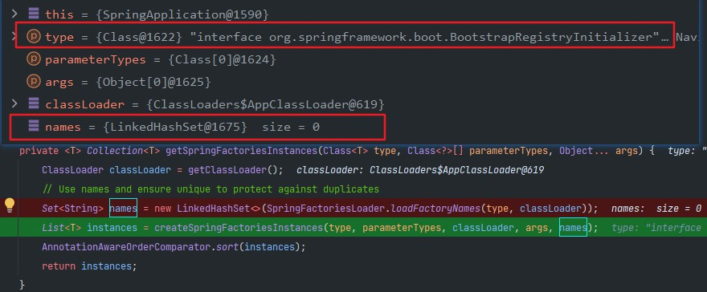
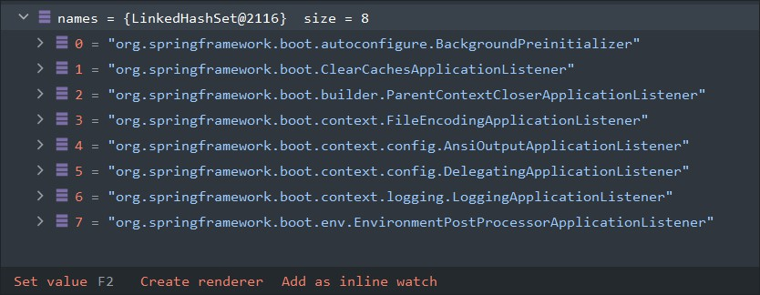
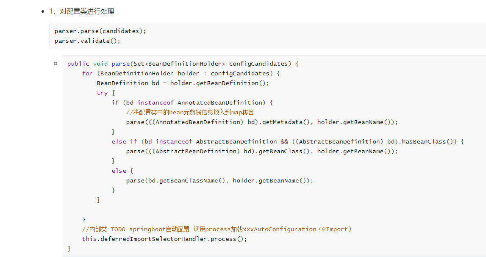

[TOC]


# springboot源码解析

# 一、启动源码

```java

@SpringBootApplication
public class SampleWebUiApplication {
	public static void main(String[] args) {
		SpringApplication.run(SampleWebUiApplication.class, args);
	}
}

public static ConfigurableApplicationContext run(Class<?> primarySource, String... args) {
    //1、创建SpringApplication对象
    //2、调用run方法
    return run(new Class<?>[] { primarySource }, args);
}

public static ConfigurableApplicationContext run(Class<?>[] primarySources, String[] args) {
    return new SpringApplication(primarySources).run(args);
}
```

## - 1、创建SpringApplication

```java
public SpringApplication(Class<?>... primarySources) {
    //primarySources - > main方法所在的类
    this(null, primarySources);
}
```

```java
public SpringApplication(ResourceLoader resourceLoader, Class<?>... primarySources) {
    //null
    this.resourceLoader = resourceLoader;
    Assert.notNull(primarySources, "PrimarySources must not be null");
    //main方法所在的入口类放入到一个set集合中
    this.primarySources = new LinkedHashSet<>(Arrays.asList(primarySources));
    //判断应用类型：java web ..
    this.webApplicationType = WebApplicationType.deduceFromClasspath();
    //bootstrappers：初始启动引导器
    this.bootstrapRegistryInitializers = new ArrayList<>(
        			getSpringFactoriesInstances(BootstrapRegistryInitializer.class));
     //设置spring容器的ApplicationContextInitializer初始化器
    setInitializers((Collection) getSpringFactoriesInstances(ApplicationContextInitializer.class));
    //设置spring容器的监听器ApplicationListener
    setListeners((Collection) getSpringFactoriesInstances(ApplicationListener.class));
    //推断出main方法的类,赋值给成员变量
    this.mainApplicationClass = deduceMainApplicationClass();
}
```

### * 判断应用类型

```java
//ClassUtils.isPresent() 方法是用来判断一个类的存在性的
static WebApplicationType deduceFromClasspath() {
    if (ClassUtils.isPresent(WEBFLUX_INDICATOR_CLASS, null) && !ClassUtils.isPresent(WEBMVC_INDICATOR_CLASS, null)
        && !ClassUtils.isPresent(JERSEY_INDICATOR_CLASS, null)) {
        //响应式编程
        return WebApplicationType.REACTIVE;
    }
    for (String className : SERVLET_INDICATOR_CLASSES) {
        if (!ClassUtils.isPresent(className, null)) {
            //不应作为 web 应
            return WebApplicationType.NONE;
        }
    }
    //web应用
    return WebApplicationType.SERVLET;
}
```

### * getSpringFactoriesInstances

（）从**spring.factories文件中**获取

```java
private <T> Collection<T> getSpringFactoriesInstances(Class<T> type, Class<?>[] parameterTypes, Object... args) {
    ClassLoader classLoader = getClassLoader();
    //SpringFactoriesLoader.loadFactoryNames 从spring.factories文件中获取类型为type的类
    Set<String> names = new LinkedHashSet<>(SpringFactoriesLoader.loadFactoryNames(type, classLoader));
    //实例化对象
    List<T> instances = createSpringFactoriesInstances(type, parameterTypes, classLoader, args, names);
    AnnotationAwareOrderComparator.sort(instances);
    return instances;
}
```

### * SpringFactoriesLoader.loadFactoryNames 从spring.factories文件中获取类型为type的类

```java
public static List<String> loadFactoryNames(Class<?> factoryType, @Nullable ClassLoader classLoader) {
    //类加载器
    ClassLoader classLoaderToUse = classLoader;
    if (classLoaderToUse == null) {
        classLoaderToUse = SpringFactoriesLoader.class.getClassLoader();
    }
    //获取类名称
    String factoryTypeName = factoryType.getName();
    //获取spring.factories中的配置类
    return loadSpringFactories(classLoaderToUse).getOrDefault(factoryTypeName, Collections.emptyList());
}

private static Map<String, List<String>> loadSpringFactories(ClassLoader classLoader) {
    //从缓存中获取
    Map<String, List<String>> result = cache.get(classLoader);
    if (result != null) {
        return result;
    }

    result = new HashMap<>();
    try {
        // 获取所有spring.factories的URL FACTORIES_RESOURCE_LOCATION = "META-INF/spring.factories"
        Enumeration<URL> urls = classLoader.getResources(FACTORIES_RESOURCE_LOCATION);
        // 遍历URL
        while (urls.hasMoreElements()) {
            URL url = urls.nextElement();
            UrlResource resource = new UrlResource(url);
            // 将每个spring.factories 文件中内容包装成 properties 对象
            Properties properties = PropertiesLoaderUtils.loadProperties(resource);
            // 遍历每个配置
            for (Map.Entry<?, ?> entry : properties.entrySet()) {
                 //提取 properties 对象中的 key 值
                String factoryTypeName = ((String) entry.getKey()).trim();
                String[] factoryImplementationNames =
                    StringUtils.commaDelimitedListToStringArray((String) entry.getValue());
                 //遍历配置类数组，并将数组转换为 list 集合
                for (String factoryImplementationName : factoryImplementationNames) {
                    // 逐个添加到接口对应的集合当中
                    result.computeIfAbsent(factoryTypeName, key -> new ArrayList<>())
                        .add(factoryImplementationName.trim());
                }
            }
        }
        // Replace all lists with unmodifiable lists containing unique elements
        //将 propertise 对象的 key 与由配置类组成的 List 集合一一对应存入名为 result 的 Map 中
        result.replaceAll((factoryType, implementations) -> implementations.stream().distinct()
                          .collect(Collectors.collectingAndThen(Collectors.toList(), Collections::unmodifiableList)));
        cache.put(classLoader, result);
    }
   
    return result;
}
```

### * bootstrappers：初始启动引导器



### * ApplicationContextInitializer初始化器


### * 监听器ApplicationListener



### * 推断出main方法的类,赋值给成员变量

```java
private Class<?> deduceMainApplicationClass() {
    try {
        //获取堆栈信息
        StackTraceElement[] stackTrace = new RuntimeException().getStackTrace();
        for (StackTraceElement stackTraceElement : stackTrace) {
            if ("main".equals(stackTraceElement.getMethodName())) {
                return Class.forName(stackTraceElement.getClassName());
            }
        }
    }
    catch (ClassNotFoundException ex) {
        // Swallow and continue
    }
    return null;
}
```

## - 2、run方法

```java
public ConfigurableApplicationContext run(String... args) {
    //启动时间
    long startTime = System.nanoTime();
    //创建引导上下文    获取到所有之前的 bootstrappers 挨个执行 intitialize() 来完成对引导启动器上下文环境设置
    DefaultBootstrapContext bootstrapContext = createBootstrapContext();
    ConfigurableApplicationContext context = null;
    //设置系统属性
    configureHeadlessProperty();
    //获取所有的运行监听器
    SpringApplicationRunListeners listeners = getRunListeners(args);
    listeners.starting(bootstrapContext, this.mainApplicationClass);
    try {// 保存命令行参数；对args再次封装 ApplicationArguments
        ApplicationArguments applicationArguments = new DefaultApplicationArguments(args);
        //环境信息
        ConfigurableEnvironment environment = prepareEnvironment(listeners, bootstrapContext, applicationArguments);
        //配置忽略Bean信息
        configureIgnoreBeanInfo(environment);
        //打印Banner
        Banner printedBanner = printBanner(environment);
        //根据项目类型创建IOC容器
        context = createApplicationContext();
        context.setApplicationStartup(this.applicationStartup);
        //准备IOC上下文环境信息
        prepareContext(bootstrapContext, context, environment, listeners, applicationArguments, printedBanner);
        //刷新IOC容器
        refreshContext(context);
        //容器刷新完成后
        afterRefresh(context, applicationArguments);
        //启动完成后的时间
        Duration timeTakenToStartup = Duration.ofNanos(System.nanoTime() - startTime);
        if (this.logStartupInfo) {
            new StartupInfoLogger(this.mainApplicationClass).logStarted(getApplicationLog(), timeTakenToStartup);
        }
        //执行ApplicationRunListeners中的started()方法
        listeners.started(context, timeTakenToStartup);
        //执行Runner（ApplicationRunner和CommandLineRunner）
        callRunners(context, applicationArguments);
    }
    catch (Throwable ex) {
        handleRunFailure(context, ex, listeners);
        throw new IllegalStateException(ex);
    }
    try {
        Duration timeTakenToReady = Duration.ofNanos(System.nanoTime() - startTime);
        listeners.ready(context, timeTakenToReady);
    }
    catch (Throwable ex) {
        handleRunFailure(context, ex, null);
        throw new IllegalStateException(ex);
    }
    return context;
}
```


### -1- 创建引导上下文（Context环境）

```java
private DefaultBootstrapContext createBootstrapContext() {
    DefaultBootstrapContext bootstrapContext = new DefaultBootstrapContext();
    //创建SpringApplication放入
    this.bootstrapRegistryInitializers.forEach((initializer) -> initializer.initialize(bootstrapContext));
    return bootstrapContext;
}
```

### -2- 进入headless模式

```java
private void configureHeadlessProperty() {
    System.setProperty(SYSTEM_PROPERTY_JAVA_AWT_HEADLESS,
                       System.getProperty(SYSTEM_PROPERTY_JAVA_AWT_HEADLESS, Boolean.toString(this.headless)));
}
```

### -3- 获取所有的运行监听器 调用 starting 方法

通知所有感兴趣系统正在启动过程中的人，项目正在启动Listeners

```java
	private SpringApplicationRunListeners getRunListeners(String[] args) {
		Class<?>[] types = new Class<?>[] { SpringApplication.class, String[].class };
		return new SpringApplicationRunListeners(logger,
                //从spring.factories中获取                      
				getSpringFactoriesInstances(SpringApplicationRunListener.class, types, this, args),
				this.applicationStartup);
	}
```

```java
SpringApplicationRunListeners(Log log, Collection<? extends SpringApplicationRunListener> listeners,
                              ApplicationStartup applicationStartup) {
    this.log = log;
    this.listeners = new ArrayList<>(listeners);
    this.applicationStartup = applicationStartup;
}

void starting(ConfigurableBootstrapContext bootstrapContext, Class<?> mainApplicationClass) {
    doWithListeners("spring.boot.application.starting", (listener) -> listener.starting(bootstrapContext),
                    (step) -> {
                        if (mainApplicationClass != null) {
                            step.tag("mainApplicationClass", mainApplicationClass.getName());
                        }
                    });
}
```

### -4- 保存命令行参数；对args再次封装 

```java
public DefaultApplicationArguments(String... args) {
    Assert.notNull(args, "Args must not be null");
    this.source = new Source(args);
    this.args = args;
}
```

### -5- 准备环境信息

```java
private ConfigurableEnvironment prepareEnvironment(SpringApplicationRunListeners listeners,
         DefaultBootstrapContext bootstrapContext, ApplicationArguments applicationArguments) {
    // Create and configure the environment
    //返回或者创建一个基础环境信息
    ConfigurableEnvironment environment = getOrCreateEnvironment();
    //配置环境信息（读取所有的配置源配置属性值）
    configureEnvironment(environment, applicationArguments.getSourceArgs());
    //绑定
    ConfigurationPropertySources.attach(environment);
    //通知所有监听器当前环江已经准备完成
    listeners.environmentPrepared(bootstrapContext, environment);
    DefaultPropertiesPropertySource.moveToEnd(environment);
    Assert.state(!environment.containsProperty("spring.main.environment-prefix"),
                 "Environment prefix cannot be set via properties.");
    
    bindToSpringApplication(environment);
    if (!this.isCustomEnvironment) {
        EnvironmentConverter environmentConverter = new EnvironmentConverter(getClassLoader());
        environment = environmentConverter.convertEnvironmentIfNecessary(environment, deduceEnvironmentClass());
    }
    ConfigurationPropertySources.attach(environment);
    return environment;
}
```

### -6- 创建spring ioc上下文，根据项目类型创建上下文

```java
private ApplicationContextFactory applicationContextFactory = ApplicationContextFactory.DEFAULT;
ApplicationContextFactory DEFAULT = new DefaultApplicationContextFactory();
```

```java
protected ConfigurableApplicationContext createApplicationContext() {
    //webApplicationType = 当前是什么项目（创建springApplication时判断）
    return this.applicationContextFactory.create(this.webApplicationType);
}
```

```java
/**
 * AnnotationConfigApplicationContext::new ==  () -> new AnnotationConfigApplicationContext()
 * new BiFunction<ApplicationContextFactory, WebApplicationType, ConfigurableApplicationContext>() {
 *						@Override
 *						public ConfigurableApplicationContext apply(ApplicationContextFactory applicationContextFactory, 	
 *													WebApplicationType webApplicationType) {
 *							return  applicationContextFactory.create(webApplicationType);
 *						}
 *					},
 *  (applicationContextFactory,Type) -> applicationContextFactory.create(Type),
 */
public ConfigurableApplicationContext create(WebApplicationType webApplicationType) {
    try {
        return getFromSpringFactories(webApplicationType, ApplicationContextFactory::create,
                                      AnnotationConfigApplicationContext::new);
    }
    catch (Exception ex) {
        throw new IllegalStateException("Unable create a default ApplicationContext instance, "
                                        + "you may need a custom ApplicationContextFactory", ex);
    }
}
```

```java
private <T> T getFromSpringFactories(WebApplicationType webApplicationType,
              BiFunction<ApplicationContextFactory, WebApplicationType, T> action, Supplier<T> defaultResult) {
    //获取所有的类加载器 进行遍历 
    //action.apply 会调用ApplicationContextFactory的create方法根据
    //webApplicationType进行判断当前需要创建的IOC容器类型
    for (ApplicationContextFactory candidate : SpringFactoriesLoader.loadFactories(ApplicationContextFactory.class,
                                                                                   getClass().getClassLoader())) {
        T result = action.apply(candidate, webApplicationType);
        if (result != null) {
            return result;
        }
    }
    return (defaultResult != null) ? defaultResult.get() : null;
}
```

```java
//web ： servlet类型：
@Override
public ConfigurableApplicationContext create(WebApplicationType webApplicationType) {
    return (webApplicationType != WebApplicationType.SERVLET) ? null
        //与spring IOC创建一样 会创建BeanFactory 与 五个bean定义
        : new AnnotationConfigServletWebServerApplicationContext();
}
```

### -7- 插口：准备IOC容器基本信息

```java
private void prepareContext(DefaultBootstrapContext bootstrapContext, ConfigurableApplicationContext context,
                            ConfigurableEnvironment environment, SpringApplicationRunListeners listeners,
                            ApplicationArguments applicationArguments, Banner printedBanner) {
    //给IOC容器设置环境
    context.setEnvironment(environment);
    // IOC容器的后置处理流程。（给IOC入一些组件类型转化器在这里放入ConversionService）
    postProcessApplicationContext(context);
    //应用初始化器
    applyInitializers(context);
    //遍历所有的 listener 调用 contextPrepared。
    listeners.contextPrepared(context);
    bootstrapContext.close(context);
    if (this.logStartupInfo) {
        logStartupInfo(context.getParent() == null);
        logStartupProfileInfo(context);
    }
    // Add boot specific singleton beans
    ConfigurableListableBeanFactory beanFactory = context.getBeanFactory();
    beanFactory.registerSingleton("springApplicationArguments", applicationArguments);
    if (printedBanner != null) {
        beanFactory.registerSingleton("springBootBanner", printedBanner);
    }
    if (beanFactory instanceof AbstractAutowireCapableBeanFactory) {
        ((AbstractAutowireCapableBeanFactory) beanFactory).setAllowCircularReferences(this.allowCircularReferences);
        if (beanFactory instanceof DefaultListableBeanFactory) {
            ((DefaultListableBeanFactory) beanFactory)
            .setAllowBeanDefinitionOverriding(this.allowBeanDefinitionOverriding);
        }
    }
    if (this.lazyInitialization) {
        context.addBeanFactoryPostProcessor(new LazyInitializationBeanFactoryPostProcessor());
    }
    context.addBeanFactoryPostProcessor(new PropertySourceOrderingBeanFactoryPostProcessor(context));
    // Load the sources
    Set<Object> sources = getAllSources();
    Assert.notEmpty(sources, "Sources must not be empty");
    load(context, sources.toArray(new Object[0]));
    //通知所有的监听器 contextLoaded
    listeners.contextLoaded(context);
}
```

```java
//TODO 插口 ： 可以使用此方法给IOC放入一些postProcessor等。。 应用初始化器
protected void applyInitializers(ConfigurableApplicationContext context) {
    //new SpringApplication时候放入的初始化器，
    for (ApplicationContextInitializer initializer : getInitializers()) {
        Class<?> requiredType = GenericTypeResolver.resolveTypeArgument(initializer.getClass(),
                                                                        ApplicationContextInitializer.class);
        Assert.isInstanceOf(requiredType, context, "Unable to call initializer.");
        //调用所有的初始化器的initialize方法
        initializer.initialize(context);
    }
}
```

### -8- 刷新容器（spring 12步骤 ，会调用自动装配）

### -9- 插口： 执行CommandLineRunner/ApplicationRunner Runner

可以用来做定时任务，在项目启动时调用

**（ApplicationRunner**和**CommandLineRunner**）

- **获取容器中的** **ApplicationRunner** 
- **获取容器中的**  **CommandLineRunner**
- **合并所有runner并且按照@Order进行排序**
- **遍历所有的runner。调用 run** **方法**

```java
private void callRunners(ApplicationContext context, ApplicationArguments args) {
    List<Object> runners = new ArrayList<>();
    runners.addAll(context.getBeansOfType(ApplicationRunner.class).values());
    runners.addAll(context.getBeansOfType(CommandLineRunner.class).values());
    AnnotationAwareOrderComparator.sort(runners);
    for (Object runner : new LinkedHashSet<>(runners)) {
        if (runner instanceof ApplicationRunner) {
            callRunner((ApplicationRunner) runner, args);
        }
        if (runner instanceof CommandLineRunner) {
            callRunner((CommandLineRunner) runner, args);
        }
    }
}

private void callRunner(ApplicationRunner runner, ApplicationArguments args) {
    try {
        (runner).run(args);
    }
    catch (Exception ex) {
        throw new IllegalStateException("Failed to execute ApplicationRunner", ex);
    }
}

private void callRunner(CommandLineRunner runner, ApplicationArguments args) {
    try {
        (runner).run(args.getSourceArgs());
    }
    catch (Exception ex) {
        throw new IllegalStateException("Failed to execute CommandLineRunner", ex);
    }
}
```

## -3 、定时任务程序启动调用一次

```java

@Component
@EnableScheduling
@RestController
@Slf4j
@Order
public class Scheduling implements SchedulingConfigurer, CommandLineRunner {

    private final AnalysisService analysisService;
    private final ScoreService scoreService;
    private final AlarmLevelService alarmLevelService;
    @Value("${tasksBool}")
    private boolean tasksBool;

    public Scheduling(AnalysisService analysisService, ScoreService scoreService, AlarmLevelService alarmLevelService) {
        this.analysisService = analysisService;
        this.scoreService = scoreService;
        this.alarmLevelService = alarmLevelService;
    }

    @Override
    public void run(String... args) throws Exception {
        alarmLevelService.initAlarmLevel();
        ScoreConstants.initScoreConstants(scoreService.select(new ScoreDetails()));

    }

    @Override
    public void configureTasks(@Nonnull ScheduledTaskRegistrar taskRegistrar) {
        if (!tasksBool) {
            taskRegistrar.addTriggerTask(analysisService::analysisEntrance, new PeriodicTrigger(30, TimeUnit.MINUTES));
        }

        taskRegistrar.addTriggerTask(scoreService::initScoreByArea, new PeriodicTrigger(30, TimeUnit.SECONDS));
        taskRegistrar.addTriggerTask(scoreService::pushScore, new PeriodicTrigger(30, TimeUnit.SECONDS));
        taskRegistrar.addTriggerTask(analysisService::totalGasAndProduction, new CronTrigger("0 0,20,40 1 * * ? "));
    }

    @RequestMapping("tsdb/test")
    public String test() {
        analysisService.analysisEntrance();
        return "11111";
    }
}

```


------------------------------------------------

# 二、自动配置

**@SpringBootApplication** 注解

```java
//@Configuration
@SpringBootConfiguration 
//自动装配核心注解
@EnableAutoConfiguration
//包扫描
@ComponentScan(excludeFilters = { @Filter(type = FilterType.CUSTOM, classes = TypeExcludeFilter.class),
		@Filter(type = FilterType.CUSTOM, classes = AutoConfigurationExcludeFilter.class) })
```

```java
//自动装配核心注解 @EnableAutoConfiguration

@AutoConfigurationPackage
@Import(AutoConfigurationImportSelector.class)
public @interface EnableAutoConfiguration {

	/**
	 * Environment property that can be used to override when auto-configuration is
	 * enabled.
	 */
	String ENABLED_OVERRIDE_PROPERTY = "spring.boot.enableautoconfiguration";

	/**
	 * Exclude specific auto-configuration classes such that they will never be applied.
	 * @return the classes to exclude
	 */
	Class<?>[] exclude() default {};

	/**
	 * Exclude specific auto-configuration class names such that they will never be
	 * applied.
	 * @return the class names to exclude
	 * @since 1.3.0
	 */
	String[] excludeName() default {};

}
```

## -1、@AutoConfigurationPackage

- 导入一个组件@Import(AutoConfigurationPackages.**Registrar**.class)
  - 自动注册主配置类所在的包
  - 会在springIOC容器刷新**第5部**注册bean定义时候调用（将bean定义放入到容器中时候） loadBeanDefinitionsFromRegistrars(configClass.getImportBeanDefinitionRegistrars());
  - ImportBeanDefinitionRegistrar 实现了这个类

- packageNames传的就是启动类所在的包名，然后这个方法就是判断容器是否注入了BasePackagesBeanDefinition。如果注入了就从容器获取，并将包名赋值给他的basePackages属性，然后执行这块的时候其实是并没有注册的，所以直接执行else。else就是直接创建一个BasePackagesBeanDefinition对象，然后将包名赋值给他的basePackages属性。

- 其实这个就是springboot默认的扫描包。也就是这个包下的只要使用注入容器相关的注解，就会被放入到IOC容器当中。

  

```java
//metadata：注解的元信息 就是这个注解的原始位置在什么类上，main方法所在的类
//registry：beanFactory

static class Registrar implements ImportBeanDefinitionRegistrar, DeterminableImports {

    @Override
    public void registerBeanDefinitions(AnnotationMetadata metadata, BeanDefinitionRegistry registry) {
        register(registry, new PackageImports(metadata).getPackageNames().toArray(new String[0]));
    }

    @Override
    public Set<Object> determineImports(AnnotationMetadata metadata) {
        return Collections.singleton(new PackageImports(metadata));
    }

}

```

```java
	public static void register(BeanDefinitionRegistry registry, String... packageNames) {
        //判断容器中是否包含BeanDefinition（AutoConfigurationPackages）
		if (registry.containsBeanDefinition(BEAN)) {
			BasePackagesBeanDefinition beanDefinition = (BasePackagesBeanDefinition) registry.getBeanDefinition(BEAN);
			beanDefinition.addBasePackages(packageNames);
		}
		else {
            //将main方法所在的类封装为的BasePackagesBeanDefinition 放入ioc容器中
			registry.registerBeanDefinition(BEAN, new BasePackagesBeanDefinition(packageNames));
		}
	}
```

## -2-  @Import(AutoConfigurationImportSelector.class)

- AutoConfigurationImportSelector  实现 **DeferredImportSelector** 其内部类实现接口的内部接口   *Group*

- springIOC调用  实现DeferredImportSelector接口后中的Group接口 的 process 方法进行组件注入

- 在IOC容器刷新第5步骤 对配置类进行处理时候 调用

  


```java
public void processGroupImports() {
    for (DeferredImportSelectorGrouping grouping : this.groupings.values()) {
        Predicate<String> exclusionFilter = grouping.getCandidateFilter();
        // 调用DeferredImportSelectorGrouping的getImports() 方法得到一个Iterable<Entry>集合
        // 遍历集合中的元素
        grouping.getImports().forEach(entry -> {
            ConfigurationClass configurationClass = this.configurationClasses.get(entry.getMetadata());
            try {
                // 调用processImports解析是否是有Import，进行递归调用放入到beanFactory
                processImports(configurationClass, asSourceClass(configurationClass, exclusionFilter),
                               Collections.singleton(asSourceClass(entry.getImportClassName(), exclusionFilter)),
                               exclusionFilter, false);
            }
            catch (BeanDefinitionStoreException ex) {
                throw ex;
            }
            catch (Throwable ex) {
                throw new BeanDefinitionStoreException(
                    "Failed to process import candidates for configuration class [" +
                    configurationClass.getMetadata().getClassName() + "]", ex);
            }
        });
    }
}
```

**spring-ioc**：https://blog.csdn.net/qq_52219290/article/details/129487618

```java
public Iterable<Group.Entry> getImports() {
    for (DeferredImportSelectorHolder deferredImport : this.deferredImports) {
        // 调用process
        this.group.process(deferredImport.getConfigurationClass().getMetadata(),
                           deferredImport.getImportSelector());
    }
    //调用selectImports
    return this.group.selectImports();
}
```

### process()

```java
public void process(AnnotationMetadata annotationMetadata, DeferredImportSelector deferredImportSelector) {
   //获取自动配置类
    AutoConfigurationEntry autoConfigurationEntry = ((AutoConfigurationImportSelector) deferredImportSelector)
        .getAutoConfigurationEntry(annotationMetadata);
    this.autoConfigurationEntries.add(autoConfigurationEntry);
    for (String importClassName : autoConfigurationEntry.getConfigurations()) {
        this.entries.putIfAbsent(importClassName, annotationMetadata);
    }
}
```

```java
protected AutoConfigurationEntry getAutoConfigurationEntry(AnnotationMetadata annotationMetadata) {
    //检查自动配置功能是否开启，默认开启
    if (!isEnabled(annotationMetadata)) {
        return EMPTY_ENTRY;
    }
	//@SpringBootApplication注解的属性  annotationMetadata == main类元数据注释信息
    AnnotationAttributes attributes = getAttributes(annotationMetadata);
    //获取配置类
    List<String> configurations = getCandidateConfigurations(annotationMetadata, attributes);
    //删除重复的(list变为set在变为list)
    configurations = removeDuplicates(configurations);
    //获得@SpringBootApplication注解中被exclude和excludeName排除的类的集合
    Set<String> exclusions = getExclusions(annotationMetadata, attributes);
    //检查被排除类是否可实例化、是否被自动注册配置所使用，不符合条件则抛出异常
    checkExcludedClasses(configurations, exclusions);
    //从候选配置类中去除掉被排除的类
    configurations.removeAll(exclusions);
    //获取配置类过滤器过滤掉不符合要求的类
    configurations = getConfigurationClassFilter().filter(configurations);
    //将配置类和排除类通过事件传入到监听器中
    fireAutoConfigurationImportEvents(configurations, exclusions);
    return new AutoConfigurationEntry(configurations, exclusions);
}
```

```java
//getCandidateConfigurations
protected List<String> getCandidateConfigurations(AnnotationMetadata metadata, AnnotationAttributes attributes) {
    //从spring.factories文件中获取配置类
    //getSpringFactoriesLoaderFactoryClass() == EnableAutoConfiguration.class
    List<String> configurations = new ArrayList<>(
        SpringFactoriesLoader.loadFactoryNames(getSpringFactoriesLoaderFactoryClass(), getBeanClassLoader()));
    ImportCandidates.load(AutoConfiguration.class, getBeanClassLoader()).forEach(configurations::add);
    return configurations;
}
```

### selectImports()

```java
public Iterable<Entry> selectImports() {
    if (this.autoConfigurationEntries.isEmpty()) {
        return Collections.emptyList();
    }
    // 提取所有的排除项(exclusions)，并将它们收集到一个Set集合中，表示所有被排除的配置类。
    Set<String> allExclusions = this.autoConfigurationEntries.stream()
        .map(AutoConfigurationEntry::getExclusions).flatMap(Collection::stream).collect(Collectors.toSet());
    // 提取所有的配置项(configurations)，并将它们收集到一个LinkedHashSet集合中，表示所有的配置类（可能包括被排除的配置类）。
    Set<String> processedConfigurations = this.autoConfigurationEntries.stream()
        .map(AutoConfigurationEntry::getConfigurations).flatMap(Collection::stream)
        .collect(Collectors.toCollection(LinkedHashSet::new));
    // 从所有配置项中移除被排除的配置项，得到一个只包含有效配置类的集合
    processedConfigurations.removeAll(allExclusions);

    // 进行排序，该方法根据配置类之间的依赖关系进行排序，确保配置类的正确顺序。
	// 将排序后的配置类转换为一个包含Entry对象的列表，每个Entry对象表示一个导入项，包含配置类信息和配置类的全限定类名。
    return sortAutoConfigurations(processedConfigurations, getAutoConfigurationMetadata()).stream()
        .map((importClassName) -> new Entry(this.entries.get(importClassName), importClassName))
        .collect(Collectors.toList());
}
```


# 三、spi

spi：当服务的提供者，提供了服务接口的一种实现之后，在jar包的META-INF/services/目录里同时创建一个以服务接口命名的文件。该文件里就是实现该服务接口的具体实现类。而当外部程序装配这个模块的时候，就能通过该jar包META-INF/services/里的配置文件找到具体的实现类名，并装载实例化，完成模块的注入。 基于这样一个约定就能很好的找到服务接口的实现类，而不需要再代码里制定。


