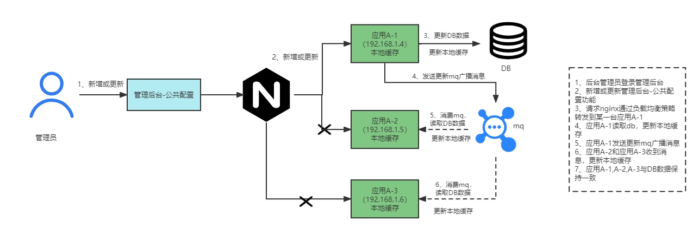
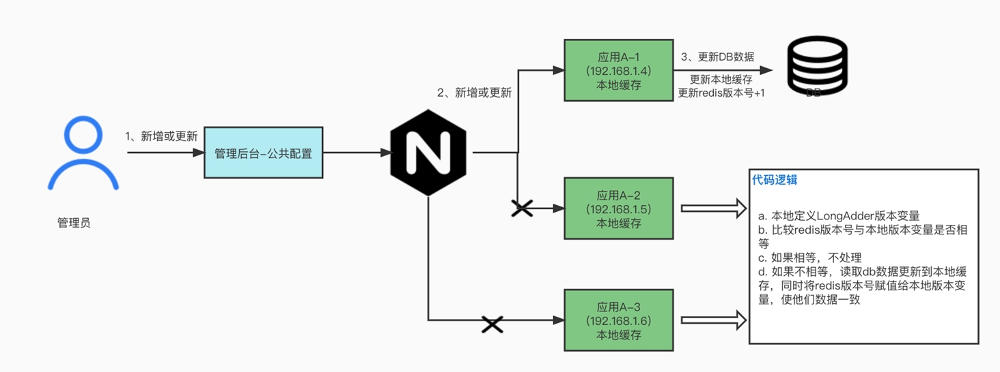
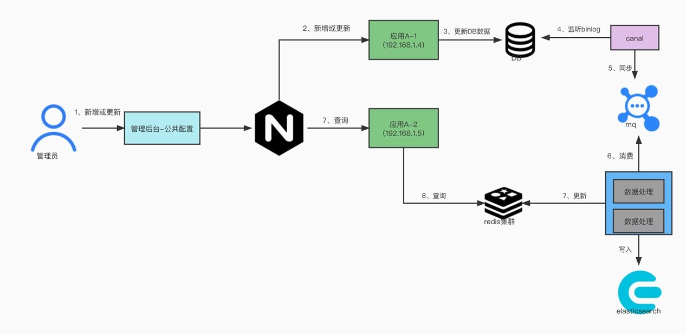
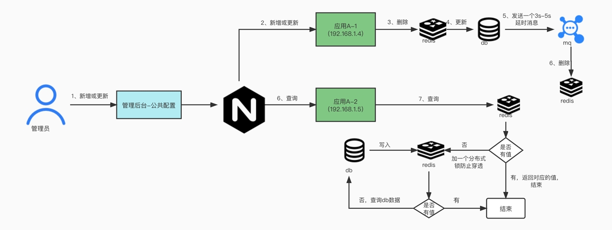
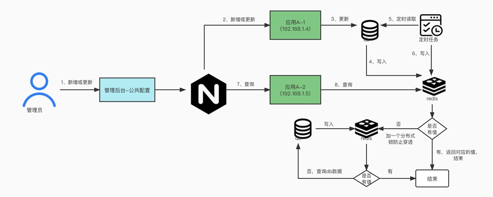
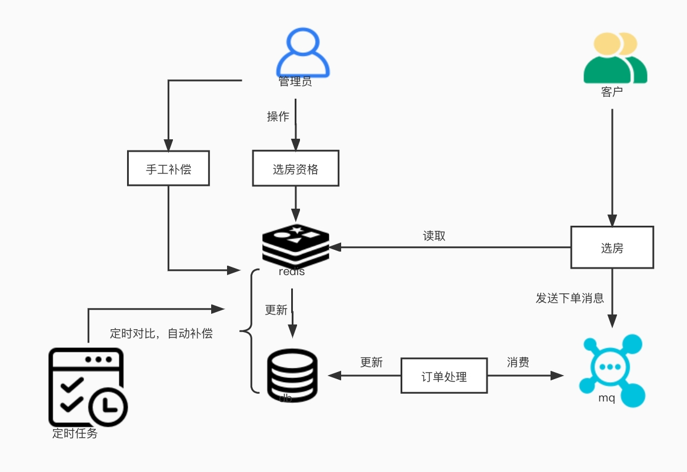

# 高并发下如何保证数据一致性

## 1 、场景分析

#### 面试官：你好，请问你做过的项目中，服务的最高QPS是多少？

候选人：我们的服务高峰访问量非常大，在双十一活动的时候QPS大概 10 w左右 。
面试官：这么大的访问量，服务面临的压力应该非常高，你们是怎么设计的呢？
候选人：我们的服务设计是采用了二级缓存，把一些热点的数据放到本地缓存， 比如活动
的数据，把一些非热点的数据放到redis缓存，比如活动-礼品数据，接口优先
查询一级缓存，如果一级缓存没数据，接着会查询二级缓存，二级缓存不存在，
才访问数据库。这样设计可以减少数据库的访问压力，加快查询效率。
面试官：从你的设计看，你的数据存储到三个地方，如果涉及数据更新，你是怎
么保证他们三者中间的一致性的呢？

## 2 、什么是数据一致性

我们通常说的数据一致性指的是在程序运行过程中本地缓存、分布式缓存、mysql
数据库三者之间的数据一致性。
这里的本地缓存常见的有hashmap、currenthashmap、guava cache、caffeine。
分布式缓存常见的有redis、memcache。
常见数据不一致性的场景有：
1) 本地缓存与mysql不一致
2) redis缓存与mysql数据不一致
   引入本地缓存的目的是增加服务的吞吐量，但同时也让架构变得复杂，所以要谨
   慎使用本地缓存。一般我们习惯把热点数据放到本地缓存中，非热点数据放到分
   布式缓存。

## 3 、本地缓存与DB一致性解决方案

### 1 ）MQ方案（推荐，通用方案）

- 后台管理员登录管理后台.
- 新增或更新管理后台-公共配置功能.
- 请求通过nginx的负载均衡策略转发到某一台应用A-1.
- 应用A-1收到请求，更新db，同时更新应用自己的本地缓存.
- 应用A-1发送更新mq广播消息.
- 应用A-2和应用A-3收到消息，查询db，更新本地缓存.
- 这个时候应用A-1,A-2,A-3与DB数据就保持一致.

## 2 ）比较本地jvm变量的版本号与redis版本号（不太推荐）

假如项目中没有接入MQ，只接入了redis，可以采用此方案：

a. 在应用本地定义一个成员版本变量LongAdder localVersion = new
LongAdder();
b. 比较redis版本号与本地版本变量localVersion 是否相等；
c. 如果两个值相等，不处理；
d. 如果不相等，读取db数据更新到本地缓存，同时将redis版本号赋值给本地
版本变量localVersion，使他们数据一致；
OK，本地缓存与DB一致性解决方案就讲到这，下一节我们讲讲redis缓存与DB
一致性解决方案。

## 4 、redis缓存与DB一致性解决方案

## 1 ）基于binlog方案（推荐, 比较解耦）

a、更新db数据
b、通过canal中间件监听mysql binlog，同时将数据同步到mq
c、启动一个数据处理应用，消费mq数据并进行数据加工
d、将加工后的数据写入redis和es
e、查询redis数据返回
**优点：**
方案比较松耦合，比较适合大公司的高并发业务
**缺点：**
引入了多个中间件，比如canal、kafka，还引入了数据处理程序，比较复杂。

## 2 ）延迟双删方案

先进行缓存清除，再执行update sql，最后（延迟N秒）再执行缓存清除。
上述中（延迟N秒）的时间要大于一次写操作的时间，一般为3-5秒。
原因：如果延迟时间小于写入redis的时间，会导致请求 1 清除了缓存，但是请
求 2 缓存还未写入的尴尬。
注意：一般写入的时间会远小于 5 秒
**优点：**
方案相对比较简单，对于非高并发业务比较适合。
**缺点：**
a、有等待环节，如果系统要求低延时，这种场景就不合适
b、不适合秒杀这种频繁修改数据和要求数据强一致的场景
c、延时时间是一个预估值，不能确保 mysql和redis数据在这个时间段内都实
时同步或持久化成功了

## 3 ）基于定时任务方案

a、更新db数据，同时写入数据到redis
b、启动一个定时任务定时将db数据同步到redis
c、前端发起接口查询请求，先从redis查询数据
d、redis没有数据，加一个分布式锁，再从redis数据查询
e、查询redis数据返回

**优点：**
方案相对比较简单，对于高并发业务比较适合。相对是一个比较高可用的方案，
通过定时任务定时更新db数据到redis，保持数据的一致性。
**缺点：**
暂无

## 4 ）自动或手工补偿方案

#### 优点：

#### 对于适合秒杀类业务，另外通过定时任务自动补偿和手工补偿，这种方案高可用

#### 方面做的比较好。甚至能做到自动修复不一致性的场景。

#### 缺点：

#### 需要开发额外的定时任务

