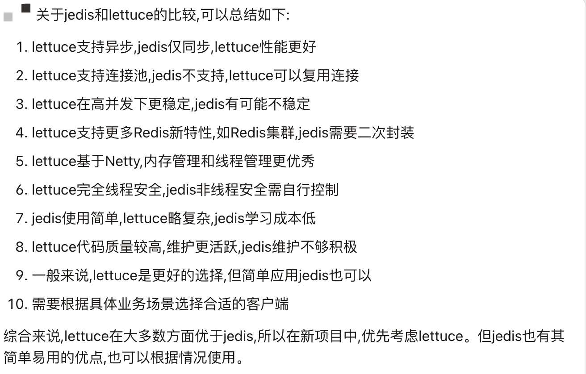

## 欢迎来到nova
* 简介:日常积累代码、读书和学习笔记

### 结构介绍
1.nova-book
* [书籍和学习笔记](nova-book/bookNote.md)
* [数据结构与算法](nova-book/src/main/java/com/nova/book/algorithm/algorithm.md)
* [设计模式](nova-book/src/main/java/com/nova/book/design/design.md)
* [Java并发编程](nova-book/src/main/java/com/nova/book/juc/juc.md)
* [HashMap解读](nova-book/src/main/java/com/nova/book/hashmap/hashmap解读.md)
* [xxl-job源码笔记](https://www.processon.com/preview/6433f533b433fa00159576a8)

2.nova-cache
* nova-cache-redis：Memcached（支持多线程，数据类型只有String）、caffeine（仅本地缓存）、redis（lettuce客户端）
* nova-cache-lock：[封装redisson分布式锁](nova-cache/lockNote.md)
* nova-cache-limit：[接口限流、请求，响应拦截器、原生redisson、redis-jedis](nova-cache/limitNote.md)
* 
* redis与jedis客户端对比，不推荐使用jedis。1.线程不安全需要连接池 2.相比性能较差

3.nova-common
* 框架核心组件、通用工具包（包括常量类，工具类，枚举类，异常类）

4.nova-database
* dynamic，手写动态数据源
* binlog4j，监听binlog

5.nova-excel
* [excel工具类](nova-excel/excelNote.md)

6.nova-log
* [开启异步log](nova-log/logNote.md)
* logback中拦截器的应用
* [sleuth链路追踪]
* [TLog官方文档](https://tlog.yomahub.com/)
* [SpringBoot集成TLog日志](https://blog.csdn.net/qq_33204709/article/details/131871588)

7.nova-login
* [sa-token登录](nova-login/loginNote.md)

8.nova-mq
* active，kafka，rabbit，rocket（待定）

9.nova-msg
* mail-发送邮件
* sms-短信
>（1）多短信通道：阿里云、腾讯云、七牛云、云片  
 （2）Sms4j现成框架，开箱即用

10.nova-orm
* [mybatis学习](nova-orm/nova-orm-mybatis/mybatisNote.md)
* [mybatisplus、pageHelper、动态数据源](nova-orm/nova-orm-mybatisplus/mybatisplus.md)

11.nova-rpc
* [手写rpc框架](nova-rpc/nova-rpc-socket/rpcNote.md)
* [websocket学习]

12.nova-search
* elasticsearch、solr

13.nova-shopping
* 单独项目购物，涵盖了下单和支付、秒杀逻辑
* 依赖也是单独的和common包pom区分开
* 代码也是独立，参考了各个优秀的模块直接拿现成的整合进来

14.nova-spring
* spring-aop、spring-ioc、spring-mvc、spring-mybatis、springboot相关源码

15.nova-starter
* 自定义starter：redis、mongo、xxlJob、自定义脱敏注解
* <optional>true</optional>：防止依赖传递，导致引入后和项目的包冲突

16.nova-tools
* [练习demo，java8，hutool、guava测试类，微信公众号文章](nova-tools/toolsNote.md)
* [互联网Java工程师进阶知识完全扫盲-advanced](summary.md)
* Sql练习
* 使用starter详情见测试类
* 配置文件加解密测试类（JasyptTest）

~~~yml
jasypt:
  encryptor:
    # 加密算法
    algorithm: PBEWITHHMACSHA512ANDAES_256
    # 加密使用的盐
    password: jaspyt_password
~~~
