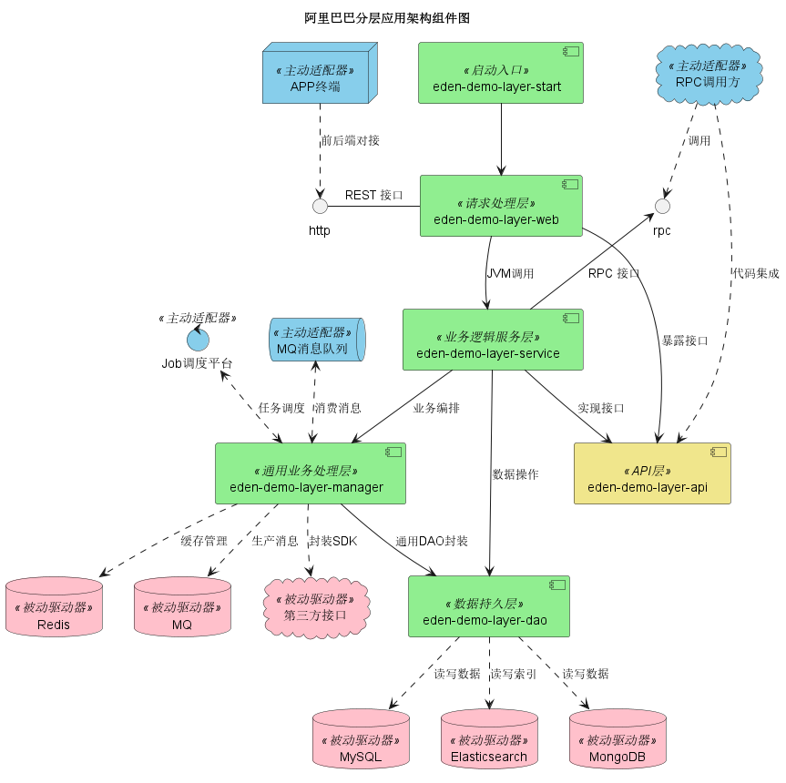
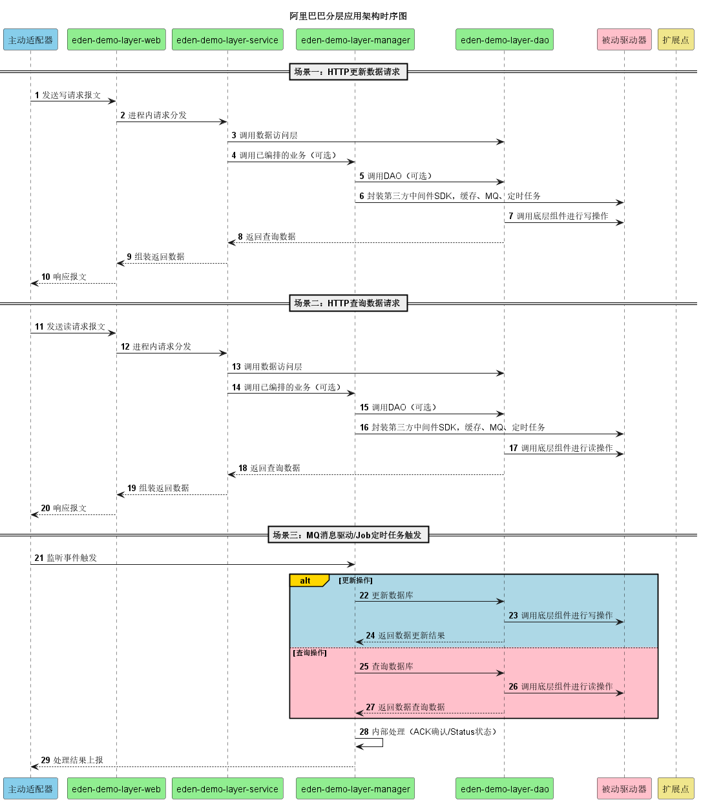

## 传统MVC架构
```
MVC
├─mvc-model                  -- 数据模型层
│  ├─mvc-model-entity        -- 实体类
│  ├─mvc-model-mq            -- MQ
│  ├─mvc-model-mongo         -- mongoDB
│  ├─mvc-model-es            -- ES
│  ├─mvc-model-redis         -- redis
│  └─mvc-model-mapper        -- Mysql-mapper
│    
├─mvc-service                -- 业务逻辑服务层
│  ├─mvc-service             -- 接口
│  └─mvc-service-impl        -- 接口实现类
│  
├─mvc-web                    -- 请求控制层
   └─xxxController           -- xxxController
```

## 阿里巴巴Java开发手册架构规范
```
AliBaba Java规范
├─alibaba-web                    -- 请求控制层，对访问控制进行转发，各类基本参数校验，或者不复用的业务简单处理等
│  ├─VO                          -- 响应VO
│  └─Controller                  -- Controller
│  
├─alibaba-api                    -- API接口层，对外可以jar包的形式提供接口
│  ├─DTO                         -- 请求DTO
│  └─alibaba-service             -- 接口
│
├─alibaba-service                -- 业务逻辑服务层，业务编排manager层，数据操作dao层
│  ├─Convertor                   -- DTO转VO
│  ├─Provider                    -- RPC服务端，继承实现类，实现接口
│  └─alibaba-service-impl        -- 接口实现类
│ 
├─alibaba-manager                -- 通用业务处理层，对第三方平台进行接口封装，对Service层通用能力的下沉，如缓存方案、中间件通用处理，与DAO层交互，对多个DAO的组合复用
│  ├─JOB                         -- 定时任务
│  ├─MQ                          -- 消息队列
│  └─alibaba-service-impl        -- 实现类
│
├─alibaba-dao                    -- 数据持久层，与底层MySQL、Elasticsearch、MongoDB等进行数据交互
│  ├─alibaba-dao-entity          -- 实体类
│  ├─alibaba-dao-mongo           -- mongoDB
│  ├─alibaba-dao-es              -- ES
│  ├─alibaba-dao-redis           -- redis
│  └─alibaba-dao-mapper          -- Mysql-mapper
│  
```




## COLA架构
[COLA架构](https://github.com/shiyindaxiaojie/eden-demo-cola)
[COLA架构参考](https://github.com/alibaba/COLA)
